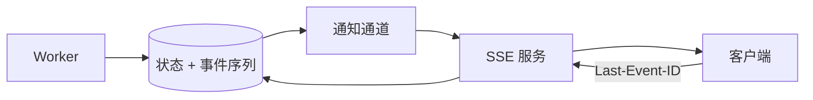

# SSE、WebSocket、背压、测试与服务观测

后台任务需要 40 秒，HTTP 接口先返回任务 ID，页面随后显示进度。最简单的轮询能工作，但会产生延迟和重复请求；实时连接又要处理断线、重复事件、慢客户端和多实例。

本章先选择 SSE 或 WebSocket，再建立“持久事件 + 推送通知”的恢复模型，并用测试和 Trace 验证。

## 三种更新方式怎样选

| 方式 | 方向 | 特点 | 适合 |
| --- | --- | --- | --- |
| 轮询 | 客户端定期请求 | 最简单、易走普通 HTTP | 低频状态、降级方案 |
| SSE | 服务端到客户端 | 文本事件、自动重连、基于 HTTP | 进度、日志、模型输出 |
| WebSocket | 全双工 | 双向帧、需应用协议 | 聊天、协同、低延迟双向交互 |

只需要服务端推进度时，SSE 更简单。WebSocket 不会自动带来可靠性，仍要设计认证、事件 ID、心跳、背压和恢复。

## 持久事件是真相，连接只是传输

Worker 在数据库事务中更新任务状态并追加事件：

```text
event 101: task_started
event 102: progress 30%
event 103: progress 70%
event 104: task_completed
```

推送层读取事件并发送。Redis Pub/Sub 可以提醒“任务有新事件”，但订阅者断开时消息不会补发，因此不能作为唯一真相源。



事件 ID 在任务范围内单调递增，数据库用唯一约束防重复。业务状态只允许一个终态；晚到进度不能覆盖 completed。

## SSE 的事件格式

```text
id: 103
event: task_progress
data: {"taskId":"demo","percent":70}

```

每个事件以空行结束。`id` 让浏览器重连时发送 `Last-Event-ID`；`event` 是稳定类型；`data` 是序列化内容。服务端还可以发送注释行作为心跳，防止中间代理长时间空闲关闭。

SSE 响应使用 `text/event-stream`，关闭代理缓冲并设置合适超时。事件数据仍需 JSON Schema 和权限检查，不能把内部异常原样发送。

## 断线重放

客户端最后处理到 103，重连带上游标。服务器查询 `event_id > 103`，先发送 104 等缺失事件，再订阅新通知。

需要处理竞态：查询历史与开始订阅之间可能产生新事件。稳妥方法是先记录当前高水位、补到高水位，再订阅并检查是否有更高事件，或让通知只作为唤醒，醒来后始终按数据库游标查询。

客户端按事件 ID 去重。页面刷新时先获取任务快照，再从快照游标继续，避免从第一条事件重放全部历史。

## 背压：生产速度大于消费速度

网络慢时，服务端写缓冲会增长。无限缓存每个 Token 会耗尽内存。

处理策略：

- 进度事件合并，只保留最新百分比；
- 关键状态和引用事件不可丢；
- 为每连接设置缓冲上限；
- 超限关闭连接，让客户端从游标恢复；
- 限制每用户连接数；
- WebSocket 使用发送队列和高水位；
- 连接断开向上游传播取消，或按业务决定后台继续。

模型输出 Token 可以按小批次合并成文本 delta，减少事件和数据库压力。合并不能破坏引用与终态顺序。

## 认证和权限

浏览器 EventSource 对自定义 Header 支持有限，常用 HttpOnly Cookie 或短期、单用途连接票据。不要把长期 Access Token 放在 URL，因为 URL 会进入日志和历史。

连接时检查任务可见性，重放每条事件时仍按任务范围读取。权限撤销后关闭连接或停止返回。多租户频道名称不能只靠不可猜 ID 当权限。

## 测试分四层

### 单元测试

事件序列分配、终态转换、游标解析、背压合并和权限函数。

### 数据库集成测试

状态与事件同事务、唯一序号、并发追加、终态后拒绝非法事件。

### 协议测试

启动真实 HTTP 服务，检查 `Content-Type`、事件格式、`Last-Event-ID` 和 Cookie 认证。

### 端到端测试

浏览器创建任务、收到进度、断开、重连、去重并到达终态。E2E 数量少而关键，不用它覆盖所有错误组合。

## 观测需要回答什么

Metric：当前连接数、连接时长、重连率、事件延迟、缓冲超限、任务终态和最老未发事件年龄。

Trace：创建任务、Worker 执行、事件写入、SSE 发送共享 trace/任务关联 ID。长连接不必为每个心跳创建重 Span，关键事件和异常足够。

Log：连接建立/关闭原因、任务 ID 摘要、最后游标、发送数量和错误类别。不记录完整 Token、Cookie 和敏感事件正文。

## 最小验证流程

1. 创建测试任务并得到 ID；
2. 打开 SSE，记录事件 1–3；
3. 主动关闭连接；
4. Worker 写入事件 4–6；
5. 使用 `Last-Event-ID: 3` 重连；
6. 确认只补 4–6，客户端无重复；
7. 限制客户端读取速度，确认缓冲超限按策略断开；
8. 使用轮询读取相同任务终态；
9. 测试无权用户不能订阅。

## 实时服务检查表

- 根据通信方向选择协议；
- 状态和事件有持久真相源；
- 事件 ID 稳定递增；
- 断线按游标补发并去重；
- 代理缓冲和超时配置正确；
- 慢消费者有上限与断开策略；
- 认证不把长期 Token 放 URL；
- 状态、事件和终态有集成测试；
- Trace 能关联 API、Worker 和推送；
- 轮询可作为降级读取同一真相。

接下来进入 Node.js/NestJS 项目线。前八章的 HTTP、权限、数据库、缓存、消息和流式原则会落到具体框架调用链中。

## 参考资料

- [HTML Living Standard: Server-sent events](https://html.spec.whatwg.org/multipage/server-sent-events.html)
- [RFC 6455: The WebSocket Protocol](https://www.rfc-editor.org/rfc/rfc6455)
- [OpenTelemetry Traces](https://opentelemetry.io/docs/concepts/signals/traces/)

