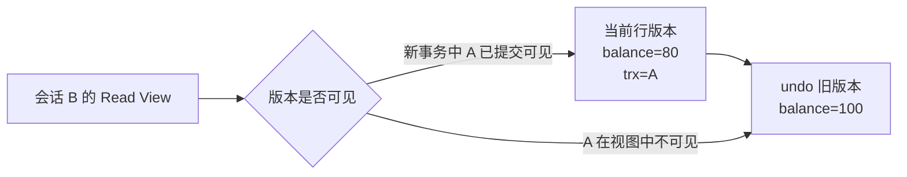

# MySQL 事务、隔离级别与 MVCC：两个请求同时修改时发生了什么

库存表里还有 1 件商品。两个用户几乎同时下单，两个请求都执行“读取库存、判断大于零、把库存改为读取值减一”。两个单独请求都没有语法错误，最终却可能都返回成功，库存仍是 0，相当于卖出了两件。

```text
初始库存：1
请求 A 读取：1             请求 B 读取：1
请求 A 写入：0             请求 B 写入：0
请求 A 成功                请求 B 成功
最终库存：0，成功订单：2
```

两个事务基于同一个旧状态作出了决定。**事务只能保证被正确放进同一边界的操作原子提交，它不会自动理解“库存不能被重复消费”这个业务不变量。**

本篇使用 MySQL 8.4、InnoDB 和两个客户端会话观察提交、回滚、快照读、当前读与并发更新。实验只应运行在隔离数据库。

## 事务边界把哪些状态绑在一起

先建立账户表，并放入一条余额 100 的记录。

```sql
-- InnoDB 提供事务、行级锁、undo/redo 和 MVCC 能力。
CREATE TABLE accounts (
  id BIGINT UNSIGNED NOT NULL,
  balance DECIMAL(12, 2) NOT NULL,
  version INT UNSIGNED NOT NULL DEFAULT 1,
  PRIMARY KEY (id),
  CONSTRAINT chk_accounts_balance CHECK (balance >= 0)
) ENGINE = InnoDB;

INSERT INTO accounts (id, balance) VALUES (1, 100.00);
```

一个转账需要扣减付款方、增加收款方并写入流水。这些修改要么全部成为事实，要么全部不发生。如果扣款提交后服务崩溃、收款没写入，系统就失去守恒关系。

事务从 `START TRANSACTION` 开始，到 `COMMIT` 或 `ROLLBACK` 结束。自动提交模式下，每条独立 SQL 通常各自成为一个事务，因此连续调用三次 Repository 并不会自动组成同一原子操作。

```sql
START TRANSACTION;

-- 两条余额修改和流水应属于同一业务提交边界。
UPDATE accounts SET balance = balance - 20.00 WHERE id = 1;
UPDATE accounts SET balance = balance + 20.00 WHERE id = 2;
INSERT INTO transfer_records (id, from_id, to_id, amount)
VALUES ('transfer-001', 1, 2, 20.00);

COMMIT;
```

三条写入共享同一事务连接。只有 COMMIT 成功后，扣款、收款和流水才一起对其他事务成为已提交事实；任一 SQL 抛错时，调用方应执行 ROLLBACK，并且不能继续使用此前构造的成功结果。

如果第二条 UPDATE 失败，应用必须让整个事务回滚。事务内不要调用无法随数据库回滚的外部支付或邮件 API；否则数据库回滚了，外部副作用仍可能已经发生。跨系统一致性会在 Outbox 与 Saga 章节单独处理。

## ACID 要落到数据库动作上理解

### 原子性依靠 undo 与事务提交决定结果

事务中的部分修改在提交前不能成为最终业务事实。InnoDB 使用 undo 信息支持回滚，也用于构造旧版本读取。应用捕获异常后若没有调用回滚，连接可能继续处于未结束事务中并持有锁。

### 一致性不是数据库替你写业务规则

一致性表示事务把数据库从一个满足约束与业务不变量的状态带到另一个合法状态。数据库能通过主键、唯一键、外键和 CHECK 拒绝部分非法值；“一个订单的金额必须等于明细汇总”“库存扣减和订单创建必须一起发生”仍要由事务代码和数据模型表达。

### 隔离性控制并发事务彼此能看到什么

隔离不是所有事务串行执行。不同隔离级别允许数据库在一致结果与并发能力之间做选择。MySQL InnoDB 默认通常是 `REPEATABLE READ`，但项目必须显式确认实例和连接会话配置，不能靠记忆推断线上行为。

### 持久性让已提交结果能在故障后恢复

InnoDB 使用 redo log 等机制恢复已提交修改。持久性仍受刷盘配置、存储可靠性和复制拓扑影响；收到 COMMIT 成功是应用层的重要边界，但不能替代备份与恢复演练。

**ACID 不是四个定义的背诵题，它描述了事务失败、并发和崩溃时数据库如何维持可接受状态。**

## 第一次双会话：未提交修改为什么看不见

打开两个 MySQL 客户端。先确认两个会话都使用 `REPEATABLE READ`，并关闭自动提交以明确控制事务。

```sql
-- 两个会话分别执行，确认本次实验的真实隔离级别。
SELECT @@transaction_isolation;
SET SESSION TRANSACTION ISOLATION LEVEL REPEATABLE READ;
```

按照时间线执行：

| 时间 | 会话 A | 会话 B |
| --- | --- | --- |
| T1 | `START TRANSACTION` | |
| T2 | `UPDATE accounts SET balance = 80 WHERE id = 1` | |
| T3 | | `START TRANSACTION` |
| T4 | | `SELECT balance FROM accounts WHERE id = 1` → 100 |
| T5 | `COMMIT` | |
| T6 | | 再次普通 SELECT → 100 |
| T7 | | `COMMIT`，新事务 SELECT → 80 |

会话 B 在 A 提交前看不到未提交值，避免脏读。在 `REPEATABLE READ` 下，B 第一次一致性读建立 Read View，同一事务后续普通 SELECT 继续基于该可见性视图读取，所以 A 提交后仍看到 100。B 结束事务并开始新的读取后才看到 80。

如果把隔离级别改成 `READ COMMITTED`，每次一致性读通常建立新的 Read View，T6 可以看到 A 已提交的 80。这就是同一事务中不可重复读是否被允许的差异。

## MVCC 保存的不是整张表快照

MVCC 是 Multi-Version Concurrency Control。InnoDB 的聚簇索引记录包含事务相关隐藏信息，更新会产生用于回滚和旧版本读取的 undo 记录。普通一致性读根据 Read View 判断某个版本对当前事务是否可见；不可见时沿版本链寻找可见旧版本。



这不是为每个事务复制整张表。版本链只记录变化所需信息，Read View 保存判断活跃事务可见性的边界。长时间不结束的事务会让旧版本难以及时清理，增加 undo 压力，因此企业排障会关注长事务，而不只关注慢 SQL。

MVCC 也不表示所有读取都不加锁。普通 SELECT 通常是一致性快照读；`SELECT ... FOR UPDATE`、`UPDATE` 和 `DELETE` 需要读取最新可用记录并参与锁竞争，属于当前读。

## 快照读和当前读会看到不同世界

继续使用两个会话。B 已经通过普通 SELECT 建立旧快照，A 随后提交余额 80。此时 B 执行：

```sql
-- 普通 SELECT 继续读取事务快照。
SELECT balance FROM accounts WHERE id = 1;

-- FOR UPDATE 读取当前版本，并为后续修改获取锁。
SELECT balance FROM accounts WHERE id = 1 FOR UPDATE;
```

在合适的实验顺序下，普通 SELECT 仍可看到旧值 100，而 `FOR UPDATE` 读取当前已提交值 80。后者可能等待其他事务释放目标记录上的冲突锁。

这解释了一个常见误区：应用先普通 SELECT 得到旧快照，再根据它做决定，随后 UPDATE 并不会让此前决定自动正确。需要保护“读后改”的业务时，应使用当前读锁住目标行、使用原子条件更新，或使用版本号检测状态变化。

## 丢失更新怎样发生，又怎样消除

库存表初始 `quantity = 1`。错误实现先读再在应用内计算：

```ts
// 错误模型：两个请求都可能读到 1，再分别把固定结果 0 写回。
const stock = await repository.findByProduct(productId)
if (stock.quantity < requested) throw new Error('out_of_stock')
await repository.setQuantity(productId, stock.quantity - requested)
```

两个请求写回相同的 0，数据库不知道其中一个业务决定已经过期。可以按冲突模式选择三种处理方法。

### 原子条件更新适合简单计数不变量

```sql
-- 判断与扣减在一条写语句内完成，防止数量小于零。
UPDATE stocks
SET quantity = quantity - 1
WHERE product_id = 42
  AND quantity >= 1;
```

只有一个事务能影响 1 行，另一个得到 0 行并返回库存不足。无需先把数量读到应用中做决定，竞争窗口最小。

### 悲观当前读适合短事务内的复杂决策

```sql
START TRANSACTION;

-- 当前读锁定库存行；等待期间不要调用外部服务。
SELECT quantity FROM stocks WHERE product_id = 42 FOR UPDATE;
UPDATE stocks SET quantity = quantity - 1 WHERE product_id = 42;
INSERT INTO reservations (id, product_id, quantity) VALUES ('r-001', 42, 1);

COMMIT;
```

第二个事务会等待第一个释放锁，然后读取最新数量再判断。锁必须按稳定顺序获取，事务要短，避免把网络调用放在持锁期间。

### 乐观版本适合冲突较低且允许用户重试

```sql
-- expectedVersion 来自读取结果；零行表示期间发生了变化。
UPDATE stocks
SET quantity = 0, version = version + 1
WHERE product_id = 42
  AND version = 7;
```

影响 0 行时要在相同租户和资源范围内重新读取，区分记录不存在与版本已经变化，并向客户端返回 404 或 409。乐观锁不是数据库锁类型，而是一种通过条件写入识别陈旧状态的并发控制方案；它不阻塞其他编辑者，但把冲突处理责任交给应用与用户。

## Prisma 事务必须把同一个客户端传到底

NestJS Service 中的 `$transaction` 回调提供事务客户端。回调内若意外调用普通 `this.prisma`，那条查询可能使用另一条连接和独立事务，原子边界就被破坏。

```ts
import { ConflictException, Injectable } from '@nestjs/common'
import { PrismaService } from './prisma.service'

@Injectable()
export class InventoryService {
  constructor(private readonly prisma: PrismaService) {}

  async reserve(productId: string, orderId: string) {
    return this.prisma.$transaction(async (tx) => {
      // updateMany 返回 count，原子条件确保库存不会小于零。
      const changed = await tx.stock.updateMany({
        where: { productId, quantity: { gte: 1 } },
        data: { quantity: { decrement: 1 } },
      })
      if (changed.count !== 1) throw new ConflictException('out_of_stock')

      // 预留记录与库存扣减使用同一 tx；任一步失败都会一起回滚。
      return tx.reservation.create({
        data: { productId, orderId, quantity: 1 },
      })
    })
  }
}
```

输入是产品和订单身份，状态变化是库存减一与预留记录创建，输出是已经提交的 Reservation。抛出异常时 Prisma 回滚回调事务，调用方不能在事务提交前发送成功响应、写缓存或发布无法撤回的消息。

数据库可能选择一个死锁参与者回滚。只有当整个事务输入稳定、外部副作用受幂等保护，并且重试受次数与 Deadline 限制时，应用才可以重放整个事务。

## 事务现象对照表

| 现象 | 发生条件 | MySQL 中的观察方法 | 常用处理 |
| --- | --- | --- | --- |
| 脏读 | 读到其他事务未提交数据 | `READ UNCOMMITTED` 对照实验 | 通常不使用该隔离级别 |
| 不可重复读 | 同一事务两次读到不同已提交版本 | `READ COMMITTED` 双会话 | 需要稳定视图时用 RR 或显式控制 |
| 幻读 | 条件范围内出现新行 | 范围查询与并发插入 | 理解 InnoDB 锁与隔离语义 |
| 丢失更新 | 基于旧值计算后覆盖新结果 | 两请求先读后写 | 原子更新、当前读或版本条件 |
| 锁等待 | 目标记录被冲突锁持有 | `performance_schema`、事务与锁表 | 缩短事务、稳定锁顺序、处理超时 |
| 死锁 | 形成循环等待 | InnoDB deadlock 记录 | 回滚一个事务，修正获取顺序，有限重试 |

## 两个会话留下的深层问题

### `REPEATABLE READ` 是否能自动防止所有丢失更新？

不能把隔离级别当成业务锁。应用先普通 SELECT，再把计算出的固定值写回，仍可能基于旧状态作决定。应根据不变量采用原子条件更新、`FOR UPDATE` 或版本条件，并检查影响行数。隔离级别决定可见性和部分冲突行为，不会理解库存、余额等业务语义。

### MVCC 是否意味着读操作永远不会阻塞？

普通一致性读通常通过版本链避免等待写锁，但当前读、锁定读、DDL、元数据锁和资源压力仍可能造成等待。即使普通读不等待，长事务保留旧 Read View 也会阻碍历史版本清理，间接增加系统成本。

### 为什么事务里不应该调用支付或邮件接口？

数据库锁会在网络等待期间持续占用，放大阻塞和死锁风险；外部调用成功后数据库仍可能回滚，形成无法自动撤回的副作用。常见做法是事务内写业务状态和 Outbox，提交后由 Worker 幂等调用外部系统，并记录可恢复状态。

### 遇到死锁为什么不能只重试最后一条 SQL？

MySQL 回滚的是整个被选中的事务，该事务此前读取的条件和已经执行的写入都不再有效。只重试最后一条 SQL 会跳过业务校验并破坏原子性。重试必须从事务入口重新读取状态，而且要限制次数、使用退避并遵守请求 Deadline。

### 客户端收到 409 后应该自动覆盖吗？

不应该。409 表示当前编辑基于旧版本，服务端拒绝了覆盖。客户端应重新获取最新记录，根据字段类型提示用户刷新、比较或合并。无脑重发只会把乐观并发控制变回最后写入者覆盖。

### COMMIT 响应丢失时，客户端能否直接重试事务？

不能先假设回滚。数据库可能已经提交，只是网络在响应返回前断开。创建订单或付款等操作需要稳定幂等键和业务状态查询；客户端用同一幂等键重试，由服务端返回原结果或继续恢复，而不是再次产生副作用。
