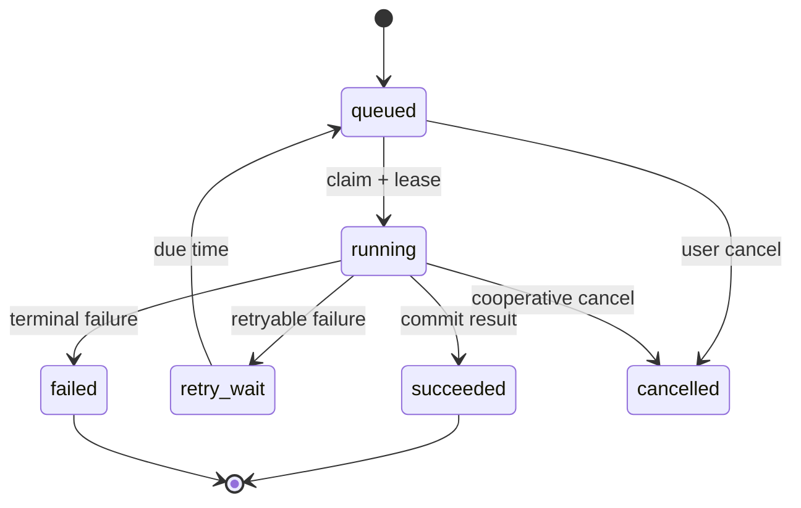

# Worker、定时任务与故障恢复

定时任务每天 02:00 生成账单，部署时两个 Scheduler 同时触发，产生两份账单。随后一个 Worker 执行超时被重投，第三份又开始生成。Scheduler 负责“何时产生任务”，Worker 负责“执行任务”，业务唯一键负责“同一任务只能产生一个结果”。

## 任务记录比进程内 Future 更可靠

API 接受长任务后先在 MySQL 创建 task 行，包含 type、business_key、status、attempt、payload_ref、created_at 和 deadline，再通过 Outbox 发布 task_id。客户端拿 202 与 task_id 查询进度或订阅 SSE。

任务 payload 不放大文件正文，使用对象 key 或数据库资源 ID。Worker 每次执行先按 task_id 读取当前状态与租约，已完成则直接 ACK，取消或过期则进入对应终态。



状态转换使用 `WHERE status=? AND attempt=?` 条件更新，旧 Worker 不能覆盖新 attempt 的终态。

## 领取任务需要租约和 attempt

Worker 原子地把 queued/retry_wait 改为 running，增加 attempt，并设置 lease_expires_at。心跳在任务仍属于自己时续租。进程崩溃后 Recovery Scanner 只回收租约已过期的 running 任务。

租约不是业务幂等。旧 Worker 可能暂停后继续运行，所以写结果时同时匹配 attempt/lease token；外部副作用使用业务幂等键，例如 `invoice:{tenant}:{period}`。

这条条件更新展示领取裁决。事务随后读取任务，只有影响一行的 Worker 成为当前所有者。

```sql
UPDATE tasks
SET status = 'running',
    attempt = attempt + 1,
    lease_owner = :worker_id,
    lease_expires_at = UTC_TIMESTAMP(6) + INTERVAL 60 SECOND,
    started_at = COALESCE(started_at, UTC_TIMESTAMP(6))
WHERE id = :task_id
  AND status IN ('queued', 'retry_wait')
  AND available_at <= UTC_TIMESTAMP(6);
```

完成更新还要 `WHERE id=? AND status=running AND attempt=? AND lease_owner=?`。影响行数为 0 表示所有权已失效，当前进程不能提交终态。

续租更新同样要匹配当前 attempt，并用数据库时间计算新的租约，避免多台 Worker 时钟漂移。租约过期不代表原 Worker 已停止，它只允许新 Worker 接管；attempt 是 fencing token，数据库终态和派生对象 key 都要携带它。外部 API 若不支持 fencing，就必须使用业务幂等键或补偿。

## Scheduler 也要幂等地产生任务

多个 Scheduler 可同时扫描到到期计划。数据库在 `(schedule_id, scheduled_for)` 上设置唯一约束，只有一个实例创建任务；或用数据库锁选取到期计划。

处理漏跑时明确 misfire 策略：服务恢复后补跑每个窗口、只跑最新一次，或标记人工处理。时区与夏令时必须写进 schedule，企业任务通常用 UTC 存储触发时刻，展示时转换。

| 任务类型 | 业务唯一键 | 重试关注 |
| --- | --- | --- |
| 月度账单 | tenant + billing_period | 不能重复生成/扣款 |
| 文档解析 | document_id + content_version | 新版本不能被旧结果覆盖 |
| 邮件通知 | template + recipient + event_id | 供应商未知结果先查询/去重 |
| 缓存预热 | resource + version | 允许重复但限制并发 |

## 恢复顺序从任务事实开始

队列积压先看 oldest age、到达率、成功率与下游容量；running 滞留看租约和心跳；状态 completed 但对象缺失则检查提交顺序；重复结果查业务唯一约束和旧 attempt 写入。

不要直接把所有 running 改 queued。先确认仍在线 Worker、租约、外部副作用和任务幂等；批量恢复设置速率，避免依赖恢复时形成重试洪峰。

Scheduler 的时间也可能重复或跳过：进程停机、多副本竞争和时区变化都会影响触发。`(schedule_id, scheduled_for)` 唯一约束让多副本只有一个创建成功；恢复策略明确补跑、跳过或只保留最新一次，不能靠当前时间猜测。

## 任务状态、取消与重试边界

**为什么任务进度不能只放 Redis？**

Redis 适合高频进度快照，MySQL 保存任务终态、attempt 和所有权事实。Redis 丢失后可从数据库重建基本状态，不能让任务是否成功只依赖易失缓存。

**用户取消任务后 Worker 一定马上停止吗？**

取消是协作信号。Worker 在可中断点检查状态/context；已经发出的不可取消外部操作可能继续，需要等待结果或补偿。响应应区分 cancel_requested 与 cancelled。

**任务失败后为什么不能永远重试？**

永久错误不会因时间变正确，无限重试占用容量并掩盖故障。按错误类型设上限和退避，超过后进入 failed/DLQ 并告警。

**如何避免旧文档解析覆盖新版本？**

任务绑定 content_version，完成条件更新同时匹配文档当前版本和 task attempt。旧版本可保存历史结果，但不能把 active_version 改回旧值。

## 机制复核：Worker、定时任务与故障恢复
这篇文章讨论的机制需要放回一次完整请求中验证。先记录输入约束、状态变化、外部依赖和失败结果，再确认成功路径是否留下可追踪的事实。配置、缓存、队列或数据库只承担各自职责，不能用一层的日志推断另一层已经完成。

迁移到实际项目时，优先补一条正常用例、一条重复或并发用例和一条依赖不可用用例。每条用例写明观察指标、错误分类、回滚动作与数据清理范围，测试替身的通过不能代替真实协议和权限验证。

当性能、可靠性和安全目标冲突时，先明确服务对象和可接受损失，再选择超时、容量、重试和降级策略。没有测量依据的阈值只作为待验证假设，发布后用同一公式复验。
