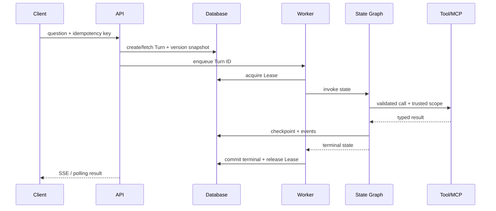

# Agent Runtime：模型决定下一步，系统决定能不能执行

模型输出一个删除工具调用，参数格式完全正确。Runtime 仍然必须拒绝，因为当前用户只有读取权限。结构正确只说明候选能被解析，不说明动作被授权、资源属于当前租户，也不说明副作用可以重试。

Agent Runtime 是长任务的执行内核。它把一次用户请求表示为 Turn，维护状态和事件，通过图或循环选择节点，调用受控模型与工具，保存 Checkpoint，并在完成、拒答、失败、取消或过期时产生唯一终态。

## 一次 Turn 的对象边界

| 对象 | 保存什么 | 不保存什么 |
| --- | --- | --- |
| Conversation | 多个 Turn 的归属与可见范围 | 当前执行锁 |
| Turn | 输入快照、状态、Deadline、终态 | 全部流式事件正文 |
| Message | 用户、模型与工具消息 | Worker 所有权 |
| Event | 单调序号、进度、增量和终态通知 | 可变业务真相 |
| Task | 队列执行、尝试、Lease | 对话语义 |
| Checkpoint | 图状态快照与恢复位置 | 已授权事实之外的新权限 |

HTTP Request ID 用于传输追踪，Turn ID 用于业务幂等和查询，Thread/Checkpoint ID 用于图执行恢复。它们可以关联，但不能混为一个字段。

## Runtime 生命周期

API 在排队前完成身份、幂等、准入和知识/策略版本快照。Worker 获取有期限的所有权后才能推进 Turn。图节点读取明确状态并返回局部更新；工具执行器重新校验名称、参数、权限和 Deadline；每个可恢复边界写 Checkpoint 与事件。

## LangGraph 管理显式状态

LangGraph 一类状态图把 Node、Edge、条件路由、Reducer 与 Checkpoint 显式化。Node 应接收状态并返回更新，不直接依赖隐式全局变量。并行分支通过 Reducer 合并，必须定义冲突与顺序。

状态图不是让执行自动正确。循环仍需最大步数、Token/成本预算、Deadline 和证据停止条件；Checkpoint 只保存状态，不自动让外部副作用幂等；恢复前要确认策略和租户快照是否仍有效。

## Tool Calling 的可信边界

模型看到 Tool Schema 后生成候选名称和参数。Runtime 只从注册表查找允许工具，使用 Schema 校验参数，再由服务端注入 user、tenant、scope、deadline 和审计上下文。模型不能提供这些可信字段。

工具结果也不可信。外部网页、文档或 MCP Server 可能返回恶意指令、错误类型或超大内容。执行器应验证输出 Schema、限制大小、标记来源和信任级别，再把压缩视图送回模型。

## MCP 解决连接，不替代授权

MCP 为 Host/Client/Server 之间的能力发现和调用提供协议。Remote Server 的工具仍要经过 Runtime 白名单、认证、参数验证、超时、返回值验证和审计。协议能描述工具，并不意味着调用当前用户有权执行。

连接故障、协议错误、工具业务错误和空结果要分开。工具失败不应被转换成“没有相关资料”，否则 Agent 会基于错误前提继续推理。

## Checkpoint 与副作用

纯计算和只读查询通常可以重放。发送通知、扣费、创建资源等副作用必须携带幂等键，并在资源端记录结果。Checkpoint 写成功但工具响应丢失，或者工具成功但 Checkpoint 未写入，都可能在恢复时重复调用。

更稳健的方式是把副作用建模为准备、执行、确认状态，保存外部 request ID 和未知结果。恢复先查询已存在结果，再决定继续、补偿或人工处理。

## Lease、取消和 Deadline

队列可能重复投递，只有持有当前 Lease 的 Worker 能写 Turn。Worker 周期续租，失去 Lease 后停止推进；恢复扫描器在租约过期时决定接管。Fencing Token 可以让数据库或资源端拒绝旧 Worker 的迟到写入。

取消是持久业务状态，不只是内存 Flag。API 写入取消请求并发事件，Worker 在节点、模型流和工具边界检查；终态一旦成为 cancelled，后续迟到结果不能覆盖。Deadline 使用绝对时间，恢复后仍保持原边界。

## 并发和预算

可并行的是互不依赖且能独立失败的工作，例如安全检查、上下文装配和多路只读检索。共享可变状态、顺序工具和预算竞争需要显式协调。并行分支数受模型配额、数据库连接、工具速率和总 Token 预算限制。

Runtime 记录每步模型、工具、输入摘要、输出引用、耗时、Token、成本和状态变化。观测用于回答卡在哪个节点、为什么路由、是否越界、如何恢复，而不是把完整敏感 Prompt 发到所有日志。

## 验收 Runtime

测试不只断言最终一句话。应覆盖重复提交只创建一个 Turn、无权限工具被阻断、空证据安全拒答、循环达到上限、并行分支局部失败、模型超时、用户取消、Worker 丢 Lease、Checkpoint 恢复和副作用不重复。

一个可交付 Runtime 的核心不是“Agent 更自主”，而是每次自主选择都在确定性权限、资源、版本和终态边界内执行，并能从状态与事件还原整条路径。
