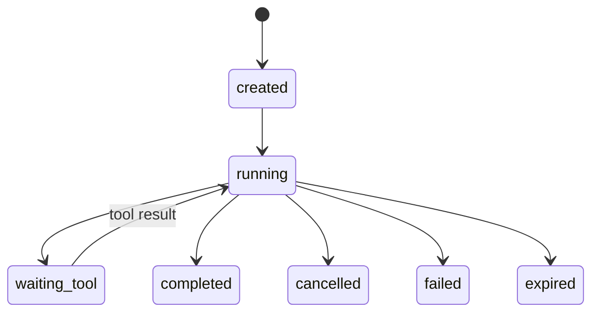

# Agent Runtime 基础设施：LangGraph、MCP、工具与恢复

Agent 生成了删除工单的工具调用，参数完全合法，Runtime 却必须拒绝。随后用户取消任务，Worker 仍然调用了外部系统。Agent Runtime 的工作不是把模型输出变成执行，而是持有 Turn 状态、权限、预算、租约和终态，让每个候选动作回到确定性边界。

## 一次 Turn 里谁拥有状态



Conversation 负责归属，Turn 负责一次执行，Event 记录顺序，Checkpoint 保存可恢复的图状态，Task/Lease 负责 Worker 所有权。模型只产生下一步候选，Runtime 决定是否授权、是否还有预算、是否可以重试。

## 工具调用要经过四道门

| 门 | 检查什么 | 失败时 |
| --- | --- | --- |
| Schema | 参数类型和必填字段 | 拒绝候选，不触发副作用 |
| Policy | 用户、租户、作用域和审批 | 返回 policy_denied |
| Budget | Turn、Token、工具次数、时间 | 终止或降级 |
| Execution | 超时、幂等、出站和结果校验 | 记录 attempt，按规则重试 |

MCP 只描述能力和协议，不自动授予权限。LangGraph 可以表达节点和边，但状态保存、并发锁和最终业务事实仍由 Runtime 或数据库持有。

## 取消和恢复怎样避免“幽灵工具调用”

```python
async def run_turn(turn_id):
    state = await load_checkpoint(turn_id)
    while True:
        await ensure_lease(turn_id)
        if await is_cancelled(turn_id):
            return await finish(turn_id, "cancelled")
        candidate = await model_next(state)
        decision = policy_check(candidate, state.scope)
        if decision.denied:
            state = state.add_event("tool_denied")
            continue
        result = await execute_idempotent(candidate, turn_id)
        state = state.apply(result)
        await save_checkpoint(turn_id, state)
```

输入是可恢复的 checkpoint 和租约，输出是唯一终态。取消要在模型调用前、工具调用前和长工具内部检查；工具执行必须有幂等键，避免 Worker 重试造成重复副作用。代码展示控制边界，不代表任何具体 LangGraph API。

## 并发不是把多个模型请求同时发出去

同一个 Turn 通常需要单写者或版本号，多个独立 Turn 才可以并行。工具有自己的并发上限，外部系统有速率限制，模型上下文也会因为并行结果膨胀。把并发预算、取消传播和 checkpoint 写入放在一起设计，才能在超时后真正释放资源。

## 终态要能解释

::: tip
**判断方法**

completed、failed、cancelled、expired、denied 是不同事实，前端和计费不应靠一段自然语言猜。下一篇把 Agent 需要的文档、Embedding、权限和证据放进 RAG 发布链路。
:::

## Checkpoint 记录的是可恢复边界，不是聊天全文备份

Checkpoint 至少需要版本化的状态、下一个节点、已完成工具的幂等结果、预算、租户范围和事件序号。恢复时先验证 schema 与 policy 是否兼容，再决定继续、失败或要求人工处理。只保存模型消息而不保存工具结果，会在恢复时重复副作用。

LangGraph 等图框架能帮助表达节点，但持久化策略不能交给默认内存实现。生产 Runtime 要能回答某个 Turn 在崩溃前是否已经调用工具、当前 lease 属于谁、取消是否已传播到外部系统。

## 事件序号让恢复不靠猜

每个 Turn 的事件应有单调序号或乐观版本。Worker 保存 checkpoint 时带上预期版本，若另一个 Worker 已经推进状态，当前写入就失败并重新读取。这种单写者约束比“希望只有一个 Worker”可靠。

客户端订阅进度也可以用事件序号去重和断线续接。事件日志用于通知，不应反过来作为唯一业务真相；完成、取消和工具副作用仍需落到可事务化或可对账的状态中。
