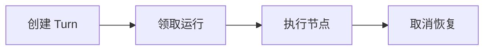

# Agent Runtime 基础设施：LangGraph、MCP、工具与恢复

用户点击取消后，界面显示任务已停止，几分钟后外部系统仍收到一次工具写入。Runtime 只取消了 SSE 连接，没有取消正在执行的 Worker；重试时又从对话开头重新运行。Agent 的“思考”不是可靠状态，Turn、工具调用、租约、Checkpoint 和取消必须由确定性 Runtime 管理。


## 用版本条件更新避免两个 Worker 同时推进 Turn

SQL 为状态并发控制示例。输入 turn_id、旧版本和新 checkpoint；只有持有当前版本的 Worker 能成功写入，返回空行意味着租约或状态已变化。

```sql
UPDATE agent_turns
SET state = $3::jsonb,
    current_node = $4,
    version = version + 1,
    updated_at = now()
WHERE id = $1
  AND version = $2
  AND status = 'running'
RETURNING version;
```

乐观版本阻止旧 Worker 覆盖新状态，但工具副作用还要使用独立 idempotency key，例如 `(turn_id, tool_call_id)`。Checkpoint 不应保存明文 Secret；工具结果可保存受权限控制的引用和摘要。恢复必须从已提交安全点继续，而非重新让模型猜过去做了什么。

## 一个 Agent Turn 需要保存哪些可恢复事实

理解下面这些词时，要同时回答输入、状态和输出分别在哪里。它们不是可以互换的产品标签。

| 概念 | 在这条链路中的含义 |
| --- | --- |
| Turn | 一次用户输入到确定终态的执行边界，可包含多个模型和工具步骤。 |
| State Graph | 节点与边描述允许的控制路径；LangGraph 等框架帮助编排，但权限仍由外部策略决定。 |
| Checkpoint | 在安全步骤后保存输入、状态版本、已完成动作和下一节点，使恢复不必重放副作用。 |
| Tool Call | 模型提出的结构化候选，Runtime 必须校验 schema、权限、预算和幂等性后才能执行。 |
| MCP | 连接工具与资源的协议边界，不自动使远端 Server 可信或让操作可恢复。 |

::: tip 判断原则
遇到新术语，先问它改变了哪份状态；如果没有状态所有者，这个名词暂时不能指导排障。
:::

## 从用户消息到 cancelled 终态



图里每个节点都要产生可观察结果；没有结果时，上一节点是否真正交付就是第一项检查。

### 创建 Turn：API/Database

固定 tenant、thread、input、deadline 和 policy version。

决定下一步前需要看到 turn_id、version、queued。

### 领取运行：Worker Lease

单个 Worker 获得执行租约并载入最近 checkpoint。

这一动作的可观察结果是 worker_id、lease_until、state_version。处理动作应晚于取证，否则重启或重试可能覆盖最早的失败现场。

### 执行节点：Graph Runtime

调用模型得到候选，验证工具后执行并写 checkpoint。

可以从这些位置确认结果：node、tool_call_id、result digest。若完全没有证据，先判断请求是否到达本阶段；若记录冲突，则对齐 request_id、实例和时间窗口。

### 取消恢复：Runtime

观察 cancel_requested，取消上游与工具，在安全点写终态。

这里不靠猜测，优先读取 cancel source、compensation、cancelled。

## Worker 运行中不等于任务可执行

| 表面现象 | 实际可能发生的事 | 下一步证据 |
| --- | --- | --- |
| SSE 断开 | 客户端连接结束，不等于 Turn 被取消 | 写入 cancel intent 并让 Worker 确认终态 |
| 模型说已完成 | 只是文本候选，业务事实可能未提交 | 由工具结果和状态机决定 succeeded |
| Worker 超时 | 任务可能仍在外部系统执行，结果未知 | 查 tool attempt 与幂等键再恢复 |
| Checkpoint 存在 | 如果写在副作用之前或不原子，仍会重放 | 定义步骤提交顺序和补偿 |

::: warning 结论的边界
示例输出用于建立判断路径，不应被当成目标环境的真实结果。版本、硬件和请求形状变化后要重新验证。
:::


## 哪些结论还需要真实环境验证

LangGraph 和 MCP 提供编排/协议能力，不代替租户隔离、审批、沙箱和审计。循环次数、Token、工具调用、wall-clock deadline 都应由 Runtime 预算限制。

Agent 要回答企业知识问题，还需要一个权限可控、版本可发布的 RAG 平面。下一篇从文档准入开始，直到带引用回答。
