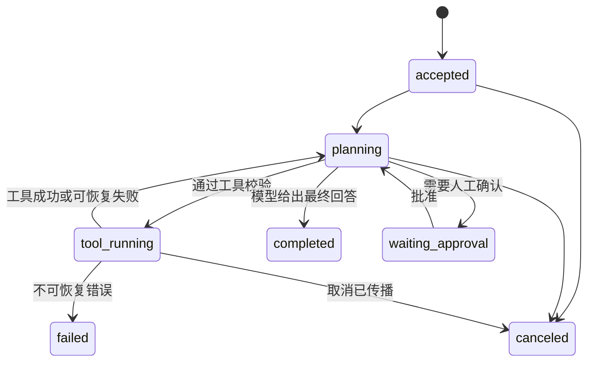

# Agent Runtime 是什么？模型、工具、状态、取消与恢复怎样协作

让模型输出一段计划很容易，真正把计划变成可用服务还要处理很多过程：模型决定调用工具，工具可能超时或返回空结果，用户中途取消，Worker 进程重启，任务需要继续，数据库写入不能重复。把这些逻辑全部放在一段 Prompt 或一个 `while` 循环里，程序能跑通一次，却难以解释失败和恢复。

Agent Runtime 是承载这段执行过程的系统。它接收任务，调用模型，验证模型提出的动作，调用经过授权的工具，保存状态和事件，再决定继续、等待、结束或失败。模型负责提出下一步候选，Runtime 负责把候选变成受约束的执行。本文使用一个只读知识查询场景，工具不会修改真实数据，重点解释状态所有权和恢复边界。

::: info Agent Runtime 的准确含义

Agent Runtime 是执行 Agent 任务的运行时编排层。它管理模型调用、工具注册、上下文、状态机、超时、取消、重试、持久化、事件和恢复。Runtime 可以使用队列、数据库和沙箱，但不应把任意模型文本直接当成已授权命令。

Agent Runtime 不等于模型，也不等于工具集合。模型只返回文本或结构化调用，工具连接外部系统，Runtime 负责验证参数、授予权限、记录结果和推进状态。

:::

## 模型、Runtime、工具和用户各自负责什么

用户提交目标、范围和取消信号。Gateway 验证身份和配额，把任务交给 Runtime。Runtime 为任务创建 ID、状态和执行上下文，调用模型得到下一步意图。模型可以输出最终回答，也可以请求一个已登记工具及其参数。

工具是 Runtime 可调用的受控函数，例如检索、只读数据库查询、文件读取或外部 API。工具声明名称、输入 Schema、权限范围、超时、幂等性和输出 Schema。工具不应接受一个“自由 Shell 字符串”就执行任意命令，除非运行在明确隔离的沙箱中。

Runtime 读取模型的结构化调用，检查工具是否存在、参数是否符合 Schema、任务是否有权访问范围，以及预算和超时是否允许。通过后才创建 ToolCall 事件并执行。工具结果回到上下文，再由模型决定下一步或生成回答。

模型不拥有数据库连接、Secret、余额和任务状态。它的输出可能错误、重复或缺字段，Runtime 仍要把它当成不可信建议。工具不拥有用户会话，也不应自行决定是否重试整个 Agent 任务。清晰的状态所有权比模型能力更影响恢复。

Agent Runtime 是负责驱动一次可持续执行任务的运行系统。它保存当前 Turn 或 Job 的状态，按状态图调用模型和工具，记录每次尝试，处理等待、取消、超时、租约和终态。模型只提出下一步候选，工具只执行被授权的动作，用户提供目标与边界，Runtime 才能把这些候选变成有顺序、有上限的执行。

例如模型返回“查询订单并发送邮件”，Runtime 先校验工具参数和租户范围，再执行只读查询，等结果写入 checkpoint 后才决定是否允许发送。查询超时会留下失败事件，发送工具若不可重试则进入人工批准或补偿路径。普通函数调用通常只对当前栈负责，Agent Runtime 还要面对 Worker 重启和长时间等待，因此需要持久化状态和恢复条件。

它与队列 Worker 的区别是，Worker 可以只领取一条确定任务并执行固定函数，Runtime 还要根据中间结果选择下一步。它与模型本身的区别是，Runtime 负责权限、预算和终态，模型输出即使看起来合理，也不能直接改变这些状态。

一次任务的事实包括用户输入、模型请求和响应、工具参数、工具结果、状态版本、预算和取消事件。原始 Prompt 是否持久化由数据政策决定，必要时只保存 Hash、摘要和受控引用。每一项都要能关联 task ID 和 attempt ID。
## Agent 状态机怎样表示“继续、等待和结束”

状态机把任务从自由文本变成有限的可检查状态。一个简化流程是 `accepted -> planning -> tool_running -> awaiting_model -> completed`，异常路径包括 `rejected`、`waiting_approval`、`canceled`、`failed` 和 `expired`。每次转换都有前置状态和事件，不能由任意 Worker 直接写终态。

`planning` 表示 Runtime 正在等待模型决定下一步，不表示已经执行工具。`tool_running` 表示某个 ToolCall 已提交，结果可能尚未返回。`waiting_approval` 适合高风险动作，需要人确认后才能继续。`completed`、`canceled` 和 `failed` 是终态，迟到事件不能把它们重新变成 running。

状态记录使用版本号或乐观锁。两个 Worker 同时处理同一个 task 时，只有持有当前版本的一方能推进。事件表保存 transition、actor、原因、时间和 attempt ID，状态表保存当前快照。快照便于恢复，事件便于审计和重放。

状态机的边界要写在工具协议中。一个只读检索工具失败可以重试，发送邮件或写订单的工具不能无条件重试。任务取消在 `planning` 可以立即结束，在 `tool_running` 要等待工具确认或标记未知副作用。

下面的状态图只表达顺序与所有权，箭头不是模型保证，而是 Runtime 代码要实现的条件。



读图时要注意 `tool_running -> canceled` 需要一个取消确认，而不是 Runtime 把 HTTP 连接关闭就当工具停止。若工具状态未知，任务可以进入 `cancel_requested` 或 `unknown_side_effect`，等待补偿或人工处理。
## 工具契约怎样防止模型调用越权

工具注册表保存工具 ID、版本、描述、输入 JSON Schema、输出 Schema、权限、超时、速率和数据范围。模型看到的是面向决策的描述，Runtime 使用的是结构化 Schema 和策略。两者不一致时，以 Runtime 校验为准。

参数校验包括类型、必填、枚举、长度、路径和范围。工具查询知识库时，Runtime 从任务上下文注入用户范围，不能让模型自行传一个更宽的 tenant ID。工具访问外部 URL 时限制域名和协议，防止 SSRF。文件工具使用沙箱路径映射，不接受宿主绝对路径。

权限按任务和工具组合判定。只读检索可以自动执行，删除、发送、扣费和修改配置需要人工批准或更强角色。权限决策要写入事件，包含策略版本和拒绝原因。模型改变文字不能绕过已经计算出的授权结果。

超时要分连接、执行和总任务 Deadline。工具执行超过上限，Runtime 标记可重试或失败，不能让 Worker 无限等待。外部系统已接受但响应丢失时，工具需要幂等键或查询状态接口，才能判断是否重复提交。

输出校验也很重要。工具返回大段错误、私密字段或不符合 Schema 的数据时，Runtime 可以截断、脱敏、拒绝或放入隔离上下文。把未验证的 HTML、SQL 或模型文本原样拼进下一次 Prompt，会扩大注入风险。
## 执行循环怎样安排模型调用和工具调用

一次循环通常读取当前状态和上下文，检查总 Deadline，向模型发送系统约束、用户目标、历史工具结果和可用工具 Schema。模型响应被解析成最终消息或一个或多个 ToolCall。Runtime 对每个 ToolCall 做授权和参数校验，再按并行策略执行，收集结果后写事件并回到模型。

并行工具要声明依赖。两个只读检索可以并发，第二个工具依赖第一个结果就必须串行。并发不是把所有调用都 `gather`，还要限制工具数、总预算和取消传播。工具结果顺序写入上下文时保持稳定，避免同一任务重放得到不同消息排列。

上下文窗口有限。Runtime 可以保存完整事件、摘要和外部引用，把真正需要的工具结果重新注入。摘要由确定性策略或受控模型生成，并标记来源。删除历史不能删除审计所需的原始参数和结果，二者存储可以分离。

循环终止条件包括模型给出合法最终回答、达到最大步骤、总 Deadline、预算用尽、用户取消、不可恢复工具错误和需要人工批准。每个终止写明确 reason，前端才能区分成功、拒绝、超时和未知副作用。

模型可能重复发同一个 ToolCall。Runtime 用 task ID、step、工具参数 Hash 生成幂等键，先查询已有结果，再决定重用或重新执行。对于有副作用工具，只有工具端确认幂等才允许自动重试。
## 持久化状态怎样支持 Worker 重启

状态快照保存在数据库或其他可靠存储，事件以追加方式记录。队列消息只携带 task ID 和版本，不把完整上下文当成唯一真相。Worker 取任务时通过租约或锁获得所有权，处理过程中续租，崩溃后租约过期，另一个 Worker 才能恢复。

恢复先读取快照和未完成事件，重建当前状态，再检查上一个 ToolCall 的执行记录。若工具结果已确认，直接继续模型；若只写了“开始执行”没有结果，要根据幂等键查询工具状态或进入人工处理，不能盲目重复写操作。

数据库事务应把状态转换、事件和任务租约的关键更新放在一致边界。外部工具调用不能和数据库事务跨系统原子提交，通常使用 Outbox 记录待发送事件、幂等工具和补偿动作。队列重复投递是正常情况，状态机必须安全处理。

上下文和工具结果可能很大，快照使用版本、压缩和引用。恢复时校验工具版本与模型版本是否仍兼容。规则改变后，旧任务要固定原策略或明确迁移，不能在重放中悄悄采用新工具语义。

状态保留要遵守数据政策。任务完成后可保留元数据和结果 Hash，原始敏感 Prompt 进入受控存储并按期限删除。删除过程也写事件，防止“无法恢复”与“已经遗忘”混淆。
## 取消、超时和人工批准怎样传播

用户取消先进入 Gateway，再写 Runtime 的 `cancel_requested` 事件。Runtime 停止创建新的模型和工具调用，把取消信号传给当前 ToolCall，并等待可观察的终止。只关闭 SSE 连接会让后台循环继续跑，仍然消耗模型和工具资源。

模型调用通常能通过请求上下文或 HTTP Abort 取消，但已经生成的 Token 可能无法撤回。工具取消能力差异更大，数据库查询可以取消，第三方写入可能只能查询结果。Runtime 在状态里区分 `canceled`、`cancel_requested` 和 `unknown_side_effect`。

总 Deadline 由任务创建时计算，子调用使用剩余时间。一个工具重试不能重新获得完整 60 秒。超时后停止排队、释放租约并写失败原因，迟到的模型响应通过 attempt ID 丢弃或记录为迟到事件。

高风险工具进入 `waiting_approval`。批准请求包含工具版本、参数摘要、影响范围和过期时间。审批人批准后 Runtime 重新检查当前状态和权限，不能直接执行旧的未校验参数；拒绝或超时走不同终态。

前端显示取消和批准的实际状态。用户点取消后看到“请求中止”不等于外部写入已经撤回。明确显示未知副作用，才能让运营人员做补偿或查询。
## 安全沙箱和秘密怎样保护工具执行

工具运行环境与 Runtime Worker 分开。Shell、浏览器或代码解释器需要最小文件系统、网络白名单、CPU、内存、时间和进程限制。容器隔离不能自动阻止内核漏洞，高风险代码使用更强沙箱和独立节点。

Secret 不进入模型上下文。工具从受控 Secret Provider 或工作负载身份读取所需凭证，调用时在内存中使用，日志只写指纹。模型无法通过拼接文本要求 Runtime 把凭证回显。

文件和数据库工具按用户范围过滤。SQL 工具使用参数化查询和只读角色，禁止模型传任意表名除非有明确允许列表。路径工具把用户可见 ID 映射到沙箱内路径，检查符号链接和大小。输出再经过脱敏和长度限制。

工具结果是新的不可信输入。外部网页可能包含提示注入，文档可能要求执行危险操作。Runtime 把工具结果标记为数据，系统策略和权限仍由控制面决定。模型提出的调用必须重新走校验，不能因为“工具结果说可以”就升级权限。

审计保留工具版本、策略版本、参数 Hash、调用主体、结果状态和人工批准。原始参数和输出按敏感级别分层。安全告警与任务失败分开，避免一次被拒绝的调用被自动重试成成功。
## 可观测性怎样解释一次 Agent 任务

Trace 以 task ID 为根，包含模型调用、工具调用、队列等待、审批和恢复 Span。Metric 记录任务率、步骤数、模型 Token、工具耗时、重试、取消、超时、失败终态和每租户成本。Log 记录结构化状态转换和错误，不默认记录完整 Prompt。

事件要有单调 step、attempt ID、状态版本和时间。模型同一步的两次尝试不能只用文本相同判断，工具参数 Hash 与策略版本帮助识别重复。队列消息、数据库事件和外部工具日志用 task ID 关联。

指标按工具和模型聚合，避免把完整参数放成高基数标签。工具失败率上升可能是外部系统问题，模型调用成功但工具选择错误属于质量问题，Runtime 状态冲突属于实现问题。三类告警动作不同。

任务结果要返回可解释状态。成功回答、被策略拒绝、等待审批、用户取消、工具失败、超时和未知副作用不能都写成 HTTP 500。前端需要根据终态展示重试、补偿或人工处理入口。

观测数据也有权限。Trace 中的工具参数和结果可能包含业务数据，只有授权人员能查看。脱敏规则在 Runtime 侧执行，不能把原文发到一个所有开发者都能读的日志系统。
## 模型输出怎样变成可执行的结构

Runtime 向模型提供工具 Schema，并要求返回结构化 ToolCall 或最终消息。响应首先经过 JSON 或协议解析，再做字段类型、工具名、参数和互斥关系校验。解析失败可以把错误摘要反馈给模型重试，但重试次数受步骤和 Token 预算限制。

结构化输出仍不可信。模型可能选择存在但不适用的工具，把用户文本放进路径参数，或省略范围。Runtime 从已认证上下文注入 tenant 和资源 ID，模型不能覆盖。参数 Schema 只解决形状，授权策略解决“能不能做”。

并行 ToolCall 需要稳定编号。模型一次返回两个检索调用，Runtime 为每个生成 call ID 和 attempt，分别记录结果，再按原顺序组装消息。一个失败时是否继续另一个由计划策略决定，不能让异步完成顺序改变语义。

模型返回最终回答时，Runtime 仍可检查引用、敏感字段、最大长度和所需格式。需要来源的任务没有引用，状态可以回到 planning 或 failed_validation，不应直接 completed。内容质量检查与安全权限分开，模型语气自然不能弥补越权。

模型供应商或 Revision 改变后，结构化调用行为可能变化。候选测试固定工具集和样本，比较解析成功率、工具选择、步骤数和终态。只测试一句普通问答，无法证明 Runtime 合同仍有效。
## 步骤、Token 和工具成本怎样形成预算

Agent 任务可能循环很多轮，每轮模型调用和工具都消耗时间与费用。Runtime 在接受任务时建立预算，包括最大步骤、模型输入输出 Token、工具调用数、总 Deadline 和可选货币上限。每次调用前检查剩余预算，结束后按实际 usage 更新。

预算与限流不同。限流保护一段时间内的系统，预算限制一个任务能走多远。租户每分钟 Token 未超限，一个任务仍可能因为重复工具用尽自己的步骤。两层都要生效，并返回不同原因。

上下文增长会让后续模型调用越来越贵。Runtime 可以摘要旧事件、只注入必要工具结果或引用外部内容，但原始事件仍用于审计。摘要也占一次模型调用时，要进入预算；使用确定性截断时要保证系统约束和当前任务不被删。

工具成本可能不是 Token。浏览器时间、数据库扫描、付费 API 和沙箱 CPU 都有额度。工具注册表声明估算与实际计量，调用前预留，完成后结算。不可得的精确成本标为估算，不能伪造成小数级账单。

预算用尽是可预期终态。Runtime 停止新调用，返回已完成工作、缺失部分和原因；有副作用工具已执行时仍要保存结果。把预算耗尽当 500 重试，会让客户端重复创建另一个同样昂贵任务。
## 多 Worker 并发怎样保证只有一个执行者

队列可能重复投递，Worker 也可能处理超时后被另一个实例接管。Runtime 使用租约、状态版本和 attempt ID 保证同一时刻只有一个所有者推进任务。租约有过期时间，Worker 定期续租；暂停过久或进程崩溃后，其他 Worker 才能获取。

拿到队列消息不代表拥有执行权。Worker 先读取当前状态，如果已经 completed 或 canceled，确认消息后退出；若消息版本落后，重新加载；只有条件更新成功才进入下一状态。这让至少一次投递不会变成至少一次副作用。

长工具调用超过租约时，Worker 要续租或把工具执行交给独立任务并记录句柄。租约过期但旧 Worker 仍在运行，会出现两个结果竞争。提交结果时检查 attempt 与状态版本，迟到结果写审计但不覆盖新终态。

模型调用也可能迟到。任务取消后，旧 HTTP 响应返回，Runtime 看到 attempt 已无效就丢弃，不再创建工具。丢弃仍记录 Token usage，账务需要按供应商实际消耗结算，不能因为任务终态 canceled 就假定成本为零。

并发测试故意让 Worker 在状态提交前退出、让租约过期并重复投递，断言工具只执行一次或使用同一幂等键。没有这类测试，单进程成功不能证明生产队列安全。
## 补偿和 Saga 怎样处理不可逆工具

跨系统工具无法与 Runtime 数据库放进一个本地事务。发送邮件、创建工单或扣费成功后，Runtime 可能在写结果前崩溃。工具要接受幂等键并提供查询状态；如果业务支持撤销，再提供独立补偿动作。补偿不是数据库回滚，它本身也可能失败。

Runtime 在调用前写 ToolCall pending 事件，通过 Outbox 可靠发送。工具端以幂等键创建结果，重复请求返回同一资源 ID。Runtime 收到结果后提交 succeeded。恢复时先查询幂等键，而不是重新创建。

多个副作用组成一条 Saga 时，每一步保存完成和补偿信息。后一步失败，Runtime 按反向顺序请求补偿；无法补偿的步骤标记人工处理。模型不能自由决定跳过补偿，顺序由确定性状态机实现。

补偿也受权限和审计。创建订单和取消订单可能需要不同角色，自动补偿只在预授权范围内执行。用户取消发生在副作用完成后，系统显示“取消请求已接收，外部动作处理中”，而不是立刻声称一切撤销。

只读知识 Agent 通常没有这类副作用，恢复更简单。文章仍解释 Saga，是为了划清适用边界：一旦加入写工具，原来的“失败就重试”策略必须升级，不能把只读测试结果推广到生产写操作。
## Runtime 评测怎样检查过程而不只看最终答案

最终答案正确可能来自错误工具或越权数据，答案错误也可能因为工具无结果而不是模型不会。评测要同时检查任务终态、模型步骤、工具选择、参数范围、调用次数、引用、取消、成本和恢复。每个样本有允许动作与禁止动作。

确定性测试使用脚本化模型和内存工具验证状态机，明确它们只能证明 Runtime 逻辑。真实模型评测固定 Revision 和温度，观察工具选择的概率与失败分布。真实外部系统使用隔离租户和最小数据，避免测试修改生产。

失败注入包括模型返回坏 JSON、工具超时、队列重复、Worker 崩溃、数据库冲突、用户取消和审批过期。断言状态只终结一次，资源释放，副作用没有重复，日志不泄露 Secret。恢复后再发一个新任务确认 Worker 仍健康。

初学者复读应能说出模型为什么不能直接执行工具，Runtime 重启后从哪里继续，以及工具超时为什么不总能重试。资深审查再检查状态所有权、事务边界、迟到事件和未验证外部行为。

评测结果按 Runtime 版本、模型 Revision、工具版本和样本集保存。任何一项升级都选择相关回归，不用一次总分掩盖取消或权限退化。生产观测中的失败样本脱敏后进入回归集，不能把真实数据原样复制到公开仓库。
## 一个最小 Runtime 配置怎样表达状态和工具

下面的 YAML 是解释性配置，字段需要由实现定义和校验。它把模型、工具、超时、步骤、权限和重试分开，未在真实 Agent 服务执行。

```yaml
runtime:
  max_steps: 8
  total_timeout_ms: 60000
  checkpoint_store: postgres://runtime-state
models:
  planner:
    logical_name: chat-default
    allowed_revision: model-2026-08-18
tools:
  search_knowledge:
    input_schema: schemas/search.json
    permission: knowledge.read
    timeout_ms: 5000
    idempotent: true
    max_retries: 2
  send_message:
    input_schema: schemas/message.json
    permission: message.write
    timeout_ms: 10000
    idempotent: false
    approval: required
```

配置说明检索工具可重试且只读，发送消息需要批准且不能自动重试。最大步骤和总超时防止模型循环，Checkpoint Store 保存快照和事件。实际实现还要配置 Secret、队列、租约和网络沙箱，不能把连接字符串写成真实凭证。

静态验证可以检查 Schema 路径、权限名、重试与幂等组合、最大超时和模型 Revision。候选验证使用只读知识库工具，确认模型调用、工具参数、状态和取消；发送工具用明确的测试替身，不能把假适配器当成真实外部写入证明。
## 一次 Agent 任务怎样执行、取消并恢复

输入是用户问题“查找指定范围内的部署文档并回答”，任务带 tenant 范围和临时凭证。Gateway 创建 task ID，Runtime 写入 accepted 快照，调用模型得到 `search_knowledge` ToolCall。Runtime 校验工具、范围和参数，写 tool_running 事件，执行只读检索。

工具返回三条带来源的结果，Runtime 写入结果 Hash 和内容引用，状态回到 planning。模型根据结果生成草稿并请求一次补充检索，第二次工具执行时用户关闭流式连接。Gateway 写 cancel_requested，Runtime 停止新的模型调用并向检索工具发送取消。

如果检索确认停止，状态变为 canceled，未调用的第二个模型步骤不执行，队列租约释放。若 Worker 在工具返回后、状态提交前崩溃，新的 Worker 读取快照和事件，发现工具幂等键已有成功结果，重用结果并继续 planning，不重复查询或扣费。

假设工具超时且没有确认外部状态，Runtime 标记 failed 或 unknown_side_effect，具体取决于工具是否只读。只读检索可按策略重试两次；不可逆发送工具遇到超时必须查询状态或进入人工处理。失败证据是工具 attempt、超时、状态版本和重试次数，不是模型的一句“工具失败”。

验证包括成功回答的来源、取消后的 running 数、恢复后的重复调用数、最终状态、任务事件和权限拒绝。再发送一个需要 `send_message` 的任务，Runtime 应进入 waiting_approval 而不是直接调用。当前文档是机制推演，真实模型质量、队列延迟和外部工具行为必须在隔离环境验证。
