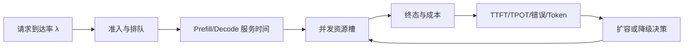

# TTFT、TPOT、吞吐、队列、容量、压测与成本

“一张 GPU 每秒能跑多少 Token？”这个问题没有脱离输入长度、输出长度、模型、精度、批处理、并发和 SLO 的单一答案。容量规划要先定义请求，再测服务时间和队列，最后决定准入、扩容与成本。

本文提供一套不会凭空填数字的容量方法。读者会得到一张容量表、一个压测矩阵和一个成本拆分公式；实际数值必须由目标模型、硬件和真实输入分布实测。

## 从到达到终态画出容量关系



**到达率 λ** 是每秒进入的请求数；**并发**是系统内尚未结束的请求数；**服务时间**是占用推理资源的时间；**队列等待**是资源满时的额外时间。

在稳定系统中，Little’s Law 用 `L = λW` 连接平均在途数、到达率和平均停留时间。它是检查数据是否自洽的工具，不是直接算出 GPU 台数的公式。到达率继续高于完成率，队列就会增长，稳定前提失效。

## 第一步：固定指标定义

| 指标 | 起点 | 终点 | 适合回答 |
| --- | --- | --- | --- |
| TTFT | 入队或开始请求（需声明） | 首个输出 Token 发送 | 首响应体验 |
| TPOT | 首 Token 后 | 后续 Token 间隔平均/分位数 | 持续生成速度 |
| ITL | 某个 Token 发送 | 下一个 Token 发送 | 流式抖动 |
| E2E | 接收请求 | 终态发送/连接关闭 | 用户总等待 |
| queue age | 进入队列 | 开始服务 | 资源不足排队 |
| output tokens/s | 计算窗口 | 生成结束 | 资源吞吐 |

同一个团队如果一个人把排队算进 TTFT、另一个人不算，图表不能比较。仪表盘和报告要同时写定义、模型、硬件、采样参数和 Token 长度分布。

## 第二步：建立容量表而不是抄基准

先按请求类型分桶：短问答、长文分析、工具调用、Embedding、评测。为每类记录输入 Token P50/P95、输出 Token P50/P95、到达率、优先级、Deadline 和质量要求。

| 类型 | 输入分布 | 输出分布 | 目标 | 保护动作 |
| --- | --- | --- | --- | --- |
| 短问答 | 记录实测 | 记录实测 | TTFT/成功率 | 在线槽位、短超时 |
| 长分析 | 记录实测 | 记录实测 | E2E/成本 | 独立队列、长度上限 |
| 工具调用 | 每轮输入 | 可能多次输出 | 终态/取消 | 总 Deadline、幂等 |
| Embedding | 文档分布 | 不适用 | 批吞吐 | 批大小、配额 |

先用小规模压测填入“观测值”，不填想象数字。容量结论必须绑定模型 revision、推理引擎、GPU 型号、精度、最大序列、批处理参数和网络。

## 第三步：设计压测矩阵

不要只发固定短 Prompt。至少有四个维度：输入长度、输出上限、并发/到达率、流式或非流式。测试顺序：

1. 单请求基线，确认正确性和显存。
2. 固定长度逐步增加并发，找到队列和错误变化。
3. 固定并发逐步增加输入长度，观察 Prefill/KV Cache。
4. 混合短长请求，观察公平性和尾延迟。
5. 以接近目标到达率的恒定流量运行一段窗口，观察是否稳定。
6. 加入客户端取消、上游超时、429 和模型错误，验证资源释放。

压测客户端要遵守准入和测试成本上限。不要把真实用户内容、密钥或生产数据复制到压测；使用脱敏、合成但分布相近的样本。

## 第四步：从数据判断扩容还是降级

| 观察 | 可能结论 | 先做什么 |
| --- | --- | --- |
| 队列年龄和 TTFT 同步升高，GPU 满 | 推理资源不足 | 扩容或减少接纳 |
| GPU 低、队列高，CPU/Tokenize 满 | 前处理瓶颈 | 增加 CPU/批处理或优化输入 |
| 显存满、计算不高 | KV Cache/长度受限 | 限长、独立长请求、换精度 |
| TTFT 稳定、TPOT 变慢 | Decode/公平性 | 调度、并发和输出上限 |
| 错误/429 上升但资源有余 | 供应商/准入/配额 | 查依赖和限流策略 |
| 成本涨、业务量未涨 | Token 或模型路由变化 | 查输入输出、重试、缓存 |

扩容前先确认瓶颈。把低利用率的 GPU 简单翻倍，可能只会增加空闲成本；把 GPU 满载服务继续接纳，可能牺牲尾延迟与质量。

## 第五步：拆分一次请求成本

单请求成本可以拆成：

```text
请求成本 = 输入 Token 成本
          + 输出 Token 成本
          + 重试/失败消耗
          + 检索与工具调用成本
          + GPU/CPU/存储/网络分摊
```

托管模型使用供应商价格和实际 usage；自托管使用 GPU 小时、节点、存储、带宽、空闲容量和运维成本。固定成本要按有效请求、有效 Token 或业务结果分摊，说明分母。

成本观测必须关联模型、版本、租户/产品层级和请求类型，但避免把完整用户内容当标签。异常成本先查 Token 数、重试、循环、长上下文、缓存未命中和错误请求，不能直接削弱质量限制。

## 第六步：容量保护和预算

准入策略要同时限制：全局并发、用户并发、模型并发、最大输入/输出 Token、队列年龄和每日预算。拒绝要有稳定错误与重试建议；服务端重试不能和客户端重试叠加成风暴。

降级可以包括切换更小模型、关闭非必要工具、减少上下文、延后离线任务或返回“稍后重试”。降级前后都要有质量边界与评测，不把 200 状态当作成功。

预算触发后的动作要提前写进 Runbook：暂停低优先级队列、降低并发、通知负责人、保留质量关键流量，并在恢复后复查积压和重复任务。

## 第七步：保存原始结果与复现条件

每次压测记录：

- 代码、镜像、模型和 Tokenizer 摘要。
- GPU 型号、驱动、推理引擎和关键参数。
- 输入/输出 Token 分布、请求生成器版本。
- 并发、到达率、窗口、预热策略和采样。
- TTFT、TPOT、E2E、队列、错误、显存、GPU/CPU、成本。
- 是否使用 Prefix Cache、量化、批处理和网关重试。

结果文件要去除敏感内容，保留能复现指标的统计摘要。未在目标硬件运行的数字只能标为示例或官方基准，不能写成当前服务结果。

## 带走一张容量模板

```text
模型/版本：
硬件/驱动：
精度/量化：
推理引擎/参数：
请求类型与 Token 分布：
目标到达率与 SLO：
准入/并发/长度上限：
P50/P95 TTFT、TPOT、E2E：
队列年龄与错误：
显存/GPU/CPU/连接池：
单请求与每有效结果成本：
扩容、降级、停止条件：
回滚和观察窗口：
```

这张表刻意不填数字。练习要求读者用隔离环境实测填写，并把结论连接到前面的请求类型，而不是复制一张网上的“每秒多少 Token”。

## 参考资料

- [Little's Law overview](https://en.wikipedia.org/wiki/Little%27s_law)
- [OpenTelemetry semantic conventions for generative AI](https://opentelemetry.io/docs/specs/semconv/gen-ai/)
- [vLLM metrics](https://docs.vllm.ai/en/latest/usage/metrics.html)
- [Prometheus histogram practices](https://prometheus.io/docs/practices/histograms/)
- [Google SRE: Service Level Objectives](https://sre.google/sre-book/service-level-objectives/)
