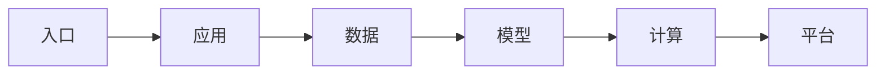

# AI Infra 全景、岗位职责与学习路径

凌晨两点，问答接口的首个 Token 从两秒变成了二十秒。应用团队说请求已经发出，模型团队说 GPU 利用率不高，数据库也没有慢查询。最后的证据落在网关到模型服务之间的等待队列：每个团队看到的都是真的，但没有人对整条请求负责。AI Infra 要解决的正是这种“局部都正常，整体不可用”。


<InfraFigure src="/images/ai-infra/ai-infra-role-map/hero.png" alt="一条 AI 请求穿过应用、数据、模型、计算与平台层的概念插画"
  icon="map" caption="先把 AI Infra 看成一条请求链，而不是一份工具清单。" />


## AI Infra 到底在维护什么

先把术语放回系统位置。只记名字，遇到故障时仍然不知道应该去哪个进程或存储找证据。

| 概念 | 在这条链路中的含义 |
| --- | --- |
| AI Infra | 支撑模型训练、推理和 AI 应用稳定运行的计算、数据、服务与交付体系。它不是 GPU 运维的别名，也不等于把模型塞进容器。 |
| AI Backend | 接收业务请求、管理身份与状态、调用模型或检索系统的应用层。它关心协议和业务语义，通常不直接决定 GPU 上怎样调度 Token。 |
| Serving | 把模型制品变成可被请求调用的在线进程，包括加载权重、调度批次、管理 KV Cache 和输出 Token。 |
| Platform | 把网关、模型、知识、Agent、观测、权限和发布能力做成可重复使用的控制面与数据面。 |

::: tip 判断原则
定义一个组件时，同时说清它不负责什么。能回答输入从哪里来、状态存在哪里、输出交给谁，才算理解。
:::

## 一次回答为什么会跨越六个责任边界



箭头表示状态的先后依赖，不表示所有步骤都在同一进程或同一台机器完成。下面沿链路逐段展开。

### 1. 入口：Gateway 持有当前状态

校验身份、选择模型并给请求分配 request_id。

可以从这些位置确认结果：状态码、限流计数、路由决策。若完全没有证据，先判断请求是否到达本阶段；若记录冲突，则对齐 request_id、实例和时间窗口。

### 应用发生时，先看 AI Backend

组织对话、调用检索或 Agent，并维持用户可见状态。

这里不靠猜测，优先读取 Trace span、任务状态、取消信号。

### 从 数据 留下的证据回到 RAG 与存储

读取文档版本、权限范围和检索证据。

决定下一步前需要看到 知识版本、命中文档、过滤条件。

### 4. Serving 怎样完成模型

排队、Prefill、Decode 并流式返回 Token。

这一动作的可观察结果是 TTFT、TPOT、队列长度、finish_reason。处理动作应晚于取证，否则重启或重试可能覆盖最早的失败现场。

### 5. 计算：GPU Runtime 持有当前状态

执行 Kernel、分配显存并完成设备通信。

可以从这些位置确认结果：显存账本、利用率、CUDA/NCCL 错误。若完全没有证据，先判断请求是否到达本阶段；若记录冲突，则对齐 request_id、实例和时间窗口。

### 平台发生时，先看 交付与观测

把版本、配置、指标和恢复过程连接起来。

这里不靠猜测，优先读取 制品摘要、SLO、发布事件、恢复记录。

## 用一张证据表代替“感觉是模型慢”

下面不是某个产品的监控配置，而是一种排障记录方式。输入是一条 request_id，输出是各层开始、结束和终态；缺失的那一段就是下一次取证的位置。

```text
request_id=req_7f3
gateway.accepted=10:02:01.120 route=qwen-serving
backend.rag_done=10:02:01.184 evidence_count=4
serving.queued=10:02:01.190 queue_ms=8420
serving.first_token=10:02:09.930 ttft_ms=8740
gateway.completed=10:02:10.610 status=200
```

这组教学输出把“慢”拆成了检索 64 ms、Serving 排队 8420 ms 和生成阶段。它没有证明 GPU 为什么排队，但已经排除了 DNS、鉴权和检索。下一步应检查并发、批处理和容量，而不是先改 Prompt。

## 看起来相似，故障边界却不同

| 表面现象 | 实际可能发生的事 | 下一步证据 |
| --- | --- | --- |
| GPU 利用率低 | 请求可能卡在入口、连接池或队列，尚未进入 GPU | 按 request_id 对齐入口、Serving 和 GPU 时间线 |
| HTTP 200 | 只说明协议成功，不说明回答有证据、成本可控或延迟达标 | 同时检查质量、usage、终态和 SLO |
| 多加一个平台组件 | 组件数量不会自动产生责任边界，反而可能增加排障跳数 | 先说明状态所有者和失败后的恢复动作 |

::: warning 容易误判
一条成功命令只能证明它覆盖的那一层。重启后的短暂恢复也不是根因已经消失，改变状态前先保存最早证据。
:::


## 这套判断方法的边界

AI Infra 工程师不需要取代后端、算法或 SRE，但必须能把他们的局部证据连接起来。托管模型场景不管理 GPU，也仍然需要网关、用量、数据权限和可靠交付；自托管模型则额外承担制品、Serving、GPU 和集群责任。

后续章节会沿这条请求链向下拆解。第一站不是 Kubernetes，而是最普通的 Linux 进程：服务能否正确读取文件、占住端口并在收到信号后退出。
