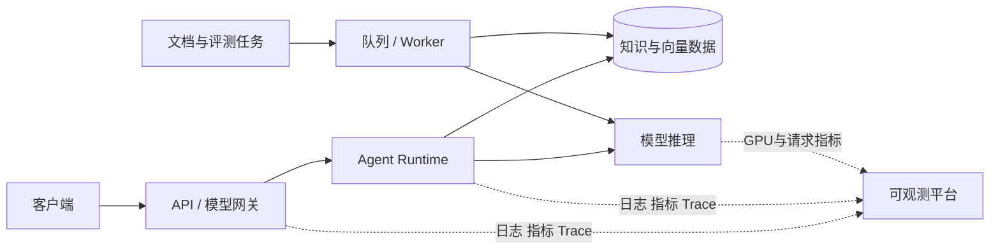

# AI Infra 工程师能力地图：从模型 API 到推理集群

同一个知识问答应用，开发环境调用模型很顺利，上线后却可能遇到另一组问题：文档任务堵住了在线问答，模型供应商超时拖住请求，显存不足导致推理服务退出，客户端断开后 GPU 还在继续生成，或者发布新模型时没有可用回滚点。

这些问题横跨应用、数据、模型和基础设施。AI Infra 的工作，就是让 AI 能力以可交付、可观测、可扩展、可恢复的方式运行。

这篇文章不要求你已经会 Kubernetes 或 CUDA。我们先搭一张完整地图，再判断每项知识学到什么程度才够用。

## 先用一次请求看清职责

用户发出问题后，请求可能经过网关、Agent、检索、模型服务和流式返回。与此同时，文档导入、Embedding、离线评测等后台任务也在消耗数据库、队列和计算资源。

AI Infra 关注的不是某一个框，而是这些框能否一起工作：流量怎样进入，任务怎样隔离，资源怎样分配，版本怎样切换，问题怎样定位，失败怎样恢复。

## AI Infra 到底是什么

可以把它理解成“面向 AI 工作负载的平台与可靠性工程”。传统后端基础设施仍然存在，但 AI 增加了几种特别明显的约束：

- 请求成本与输入、输出 Token 数相关，单次执行时间波动大。
- 在线生成、Embedding、文档解析和评测的资源形态不同。
- 自托管模型还要管理权重、Tokenizer、GPU 显存和批处理。
- 回答成功不等于质量正确，还需要证据、评测和安全观测。
- 流式连接可能持续较久，取消、超时和慢消费者会占用资源。

所以，AI Infra 既不是“只会配 GPU”，也不是给 DevOps 换一个名字。它要求工程师理解 AI 请求的执行过程，再用基础设施手段解决容量、隔离、交付和恢复问题。

## 六层能力地图

先从上到下看一遍。越靠上越接近用户行为，越靠下越接近计算资源；故障往往会跨越多层。

| 层次 | 主要对象 | 要回答的问题 | 常见产物 |
| --- | --- | --- | --- |
| 应用层 | Agent、模型网关、流式 API | 请求怎样执行、取消和降级 | API 契约、超时预算、路由策略 |
| 数据层 | PostgreSQL、向量库、Redis、对象存储、队列 | 数据怎样进入、隔离、恢复 | 数据流图、备份方案、队列设计 |
| 模型层 | 权重、Tokenizer、Embedding、推理引擎 | 模型怎样加载、版本怎样兼容 | 模型清单、校验和、服务配置 |
| 计算层 | CPU、内存、磁盘、网络、GPU | 工作负载需要多少资源 | 容量表、资源限制、压测报告 |
| 平台层 | 容器、Kubernetes、CI/CD、Secret | 服务怎样构建、发布和调度 | 镜像、部署清单、回滚流程 |
| 可靠性层 | 日志、指标、Trace、SLO、演练 | 怎样发现问题并恢复 | 仪表盘、告警、Runbook、恢复记录 |

下面逐层展开。每一层都用“需要懂什么”和“能做出什么”来判断学习结果。

## 第一层：理解 AI 应用的执行语义

基础设施配置最终要服务于应用行为。不了解请求怎样运行，很容易设置出看似合理、实际上会破坏业务的超时和重试。

以流式 Agent 请求为例：入口先鉴权和准入；Runtime 可能检索资料、调用多个工具、生成回答；服务通过 SSE 逐步返回事件；客户端中途断开时，取消信号应继续传递到模型调用和工具调用。

AI Infra 工程师至少要能回答：

- 哪些调用是只读的，可以有限重试？
- 哪些动作产生副作用，重试前要不要幂等键？
- HTTP 超时、Agent Deadline 和模型超时是什么关系？
- 客户端断开后，是继续后台执行还是协作取消？
- 在线问答与离线导入能否竞争同一组连接和模型槽位？

这一层的工作产物不是代码量，而是一张请求生命周期图和一份超时预算。例如总 Deadline 为 60 秒时，需要预留排队、检索、模型生成和返回终态的时间，不能让下游单次超时也配置成 60 秒。

## 第二层：让数据链路可追踪、可重建

AI 应用的数据不止一张业务表。一个知识系统可能同时包含原文件、解析结果、结构化片段、向量投影、知识版本、任务事件和评测结果。

需要掌握的基础设施包括：

- PostgreSQL 保存事务状态、版本和可审计记录。
- pgvector 或独立向量服务保存向量索引与过滤字段。
- Redis 承担缓存、通知或 Broker 时，各自使用不同的持久化和故障假设。
- 对象存储保存原文件和大制品，处理分片上传、校验和与生命周期。
- Worker 队列隔离在线任务、文档导入、向量构建和评测任务。

判断自己是否掌握这一层，可以尝试画一张“删除某个知识版本”的数据清理图：哪些数据库记录先失效，哪些向量可以异步清理，原文件何时删除，失败后如何重放，缓存怎样失效。只会启动数据库，还不等于理解数据生命周期。

## 第三层：管理模型和 Tokenizer 制品

调用托管 API 时，模型制品由供应商管理；进入自托管后，团队要明确加载的究竟是哪一组文件。

典型制品包括模型权重、配置、Tokenizer、Chat Template 和生成配置。模型名称相同也不代表内容永远相同，因此部署记录应包含版本或提交、文件校验和、来源、许可与兼容性信息。

这里容易忽视 Tokenizer。它决定文本怎样变成 Token，也会影响上下文长度、费用估算和 Chat Template。模型权重更新而 Tokenizer 没同步，可能出现加载错误或输出异常。

这一层应形成一份模型清单：

| 字段 | 用途 |
| --- | --- |
| 模型标识与版本 | 确认部署对象，可重复获取 |
| Tokenizer 与模板版本 | 保证输入格式兼容 |
| 精度或量化格式 | 估算存储、显存和兼容性 |
| 文件校验和 | 发现下载损坏或制品漂移 |
| 硬件与运行时要求 | 阻止不兼容节点接收部署 |
| 评测基线 | 判断换模型是否引入退化 |

## 第四层：理解资源，而不是只看机器规格

传统 API 常看 CPU、内存和连接数；自托管推理还要理解 GPU 显存与请求形态。

显存大致被模型权重、运行时工作区、激活和 KV Cache 占用。模型加载成功，只能证明权重等基础占用放得下；长上下文和高并发会扩大 KV Cache，运行时仍可能 OOM。

基础容量关系可以从四个量开始：

- 到达率：每秒进入多少请求。
- 服务时间：一个请求占用资源多久。
- 并发：同一时刻有多少请求在系统内。
- 队列等待：资源满时请求等待多久。

Little's Law 用 `L = λW` 描述稳定系统中平均在途数量、平均到达率与平均停留时间的关系。它不是容量答案，但能帮你检查数据是否自洽。例如到达率上升而服务时间不变，在途请求必然增加；没有空余并发槽时，队列会变长。

资源学习的产物应该是一张容量表，而不是“GPU 利用率越高越好”的结论：

| 请求类型 | 输入长度 | 输出长度 | 并发范围 | 观察指标 | 保护动作 |
| --- | ---: | ---: | ---: | --- | --- |
| 短问答 | 实测分布 | 实测分布 | 压测得到 | TTFT、TPOT、错误率 | 准入、模型路由 |
| 长文分析 | 实测分布 | 实测分布 | 压测得到 | 队列、显存、Deadline | 独立队列、长度上限 |
| Embedding | 批大小 | 不适用 | 压测得到 | 批延迟、失败率 | 批大小与并发上限 |

表里的数值必须来自目标模型、硬件和输入分布的实测，不能照抄别人的吞吐数据。

## 第五层：把服务构建、调度和发布做成系统

容器解决可重复运行，CI/CD 解决可验证制品，Kubernetes 等调度平台解决多节点编排。它们不是越多越好，而是在不同规模下承担不同职责。

一个可交付链路通常包含：

1. 锁定依赖，执行测试和安全检查。
2. 构建一次不可变镜像，记录源码版本和制品摘要。
3. 在候选环境加载相同镜像与模型制品。
4. 完成健康、兼容性和低风险业务验证。
5. 切换流量，观察关键 SLO。
6. 异常时把流量指针恢复到旧版本。

GPU 调度比普通 Pod 多了设备发现、节点标签、驱动与 Runtime 兼容、模型文件分发和显存容量问题。Kubernetes 能把 Pod 放到声明了 GPU 的节点，但不会自动替你决定模型能否放入显存、请求如何批处理、质量是否回归。

## 第六层：同时观察可用性、延迟、质量和成本

只看 HTTP 200，会漏掉“回答成功但没有证据”“首 Token 很慢”“任务一直排队”和“调用成本异常”等问题。

AI 服务的观测可以拆成四类：

| 目标 | 示例信号 | 它帮助回答什么 |
| --- | --- | --- |
| 可用性 | 成功率、终态、取消率、依赖错误 | 服务是否完成请求 |
| 延迟 | 总延迟、TTFT、TPOT、队列年龄 | 时间花在哪一段 |
| 质量 | 引用覆盖、检索命中、评测通过率 | 回答是否满足质量边界 |
| 成本 | 输入/输出 Token、GPU 时间、供应商账单 | 一次结果消耗多少资源 |

Trace 应把 HTTP 请求、Agent 节点、检索、模型调用和终态关联起来。日志保留离散事实，Metric 观察趋势，Trace 还原一次执行；三者不能互相替代。

## 它和其他岗位有什么区别

岗位名称会随团队变化，下面比较的是关注点，不是组织边界。

| 角色 | 主要交付 | 与 AI Infra 的交集 |
| --- | --- | --- |
| AI 全栈工程师 | 从界面到 API、Agent 的完整功能 | 部署、模型接入、观测 |
| Agent 工程师 | 工具、状态、记忆、检索和评测 | Runtime、队列、取消、质量信号 |
| 算法/模型工程师 | 模型训练、微调、评测与算法改进 | 模型制品、训练/推理资源 |
| MLOps 工程师 | 数据、训练、模型注册与发布流程 | 模型版本、流水线、监控 |
| SRE | 服务可靠性、容量、事件响应 | SLO、告警、发布、恢复 |
| AI Infra 工程师 | AI 工作负载的平台、计算与可靠运行 | 连接以上全部层次 |

小团队里，一个人可能同时承担几种角色。区分它们的目的，是发现能力缺口，而不是争论职位名称。

## 从托管 API 到自托管推理：四个学习阶段

### 阶段一：把托管模型 API 用对

先完成统一模型网关、超时、取消、有限重试、密钥保护、用量记录和供应商错误映射。这个阶段不管理 GPU，但已经需要扎实的后端与运维能力。

可验收结果：同一个上层请求可以切换两个兼容适配器；客户端断开能取消下游请求；日志不泄露密钥和完整敏感输入。

### 阶段二：让 Agent 和数据任务稳定运行

加入 PostgreSQL、Redis、对象存储和独立 Worker 队列，区分在线 Agent、文档处理、Embedding 和评测。设置准入、并发上限、任务所有权、停机排空和恢复扫描。

可验收结果：离线导入不会占满在线请求资源；重复任务不会产生两份有效结果；Worker 中断后任务能进入可判断状态。

### 阶段三：在单机 GPU 上运行推理服务

学习 NVIDIA Driver、CUDA 兼容、容器运行时、模型制品、显存组成、vLLM 等推理引擎，以及 TTFT、TPOT 和 Token 吞吐。

可验收结果：在明确的硬件前提下启动一个固定版本模型；完成健康与流式请求；记录真实输入分布下的显存、延迟和并发数据。

### 阶段四：进入多节点调度和容量治理

学习 GPU Device Plugin、节点标签、污点容忍、拓扑、模型卷、自动扩缩、容量保护和故障域。只有单机已经测明白，再进入集群，排障才不会变成猜测。

可验收结果：节点不可用时服务行为明确；扩缩容指标与队列/延迟相关；发布和回滚不依赖临时修改线上容器。

## 哪些内容来自实践，哪些是学习实验

本文关于 API、数据库、Redis、对象存储、任务队列、容器、候选验证、可观测和恢复边界的讨论，来自可在应用源码、部署清单和测试中核对的通用工程行为，公开表达已重新抽象。

GPU、vLLM、分布式训练和 Kubernetes 部分属于基于官方资料设计的独立实验路径。它们不被描述为既有私有项目成果，也不提供没有在指定硬件上测得的吞吐或成本数字。

## 用一份自评表找到下一步

不要用“了解”给自己打勾。每一项都用可交付结果判断：

| 能力 | 入门产物 | 进阶产物 |
| --- | --- | --- |
| Linux/网络 | 一份请求链排障记录 | 可重复的服务 Runbook |
| 容器 | 四服务 Compose 实验 | 资源、健康、排空和制品治理 |
| 数据基础设施 | 备份并恢复一份测试数据 | 容量、锁、队列和故障演练 |
| AI Runtime | 一条可取消的流式请求 | 多模型路由、准入与降级 |
| 模型推理 | 单 GPU 启动与请求记录 | 容量表、批处理与缓存调优 |
| Kubernetes | CPU 服务的安全发布 | GPU 调度、模型卷与扩缩容 |
| 可观测性 | 一条端到端 Trace | 四类 SLO 与告警 Runbook |

如果现在主要做 Agent 应用，建议从前三行开始，再进入单 GPU 推理。直接从 Kubernetes YAML 起步，往往会同时面对容器、网络、存储、调度和模型五类未知问题。

## 一条十二周练习路线

这张安排只表达学习顺序，不承诺固定完成时长。每周以产物通过为准，没完成就不要为了日历赶进度。

1. 第 1–2 周：Linux 进程、端口、文件和 DNS/TLS 排障，输出一份请求链记录。
2. 第 3 周：完成 API、PostgreSQL、Redis、Worker 的 Compose 环境。
3. 第 4 周：为四个服务加入日志、健康检查、资源限制和停止恢复。
4. 第 5 周：实现一条流式模型调用，验证断开和超时传播。
5. 第 6 周：拆分在线、导入、Embedding、评测队列并观察队列年龄。
6. 第 7 周：备份 PostgreSQL 和对象存储，在隔离环境恢复。
7. 第 8 周：建立请求、检索、模型和 Worker 的 Trace 与指标。
8. 第 9 周：在具备兼容 NVIDIA GPU 的环境运行固定模型制品。
9. 第 10 周：测量输入长度、输出长度、并发、TTFT、TPOT 和显存。
10. 第 11 周：设计候选验证、模型预热、切流和回滚清单。
11. 第 12 周：把已理解的单机服务迁到隔离 Kubernetes 实验环境。

## 最后带走三张图

完成本系列时，你应该能独立画出：

1. 请求图：从客户端到 Agent、数据和模型，再到流式结果。
2. 资源图：每类任务使用哪些 CPU、内存、连接、队列和 GPU 资源。
3. 恢复图：服务、数据库、对象、模型制品和配置分别怎样恢复。

这三张图比工具清单更有价值。它们能让你判断应该改应用、调队列、扩 GPU，还是先修发布和恢复流程。
