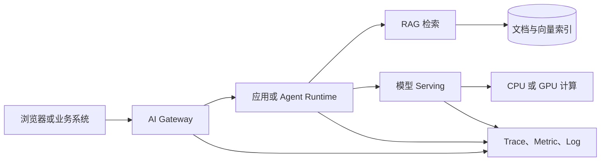
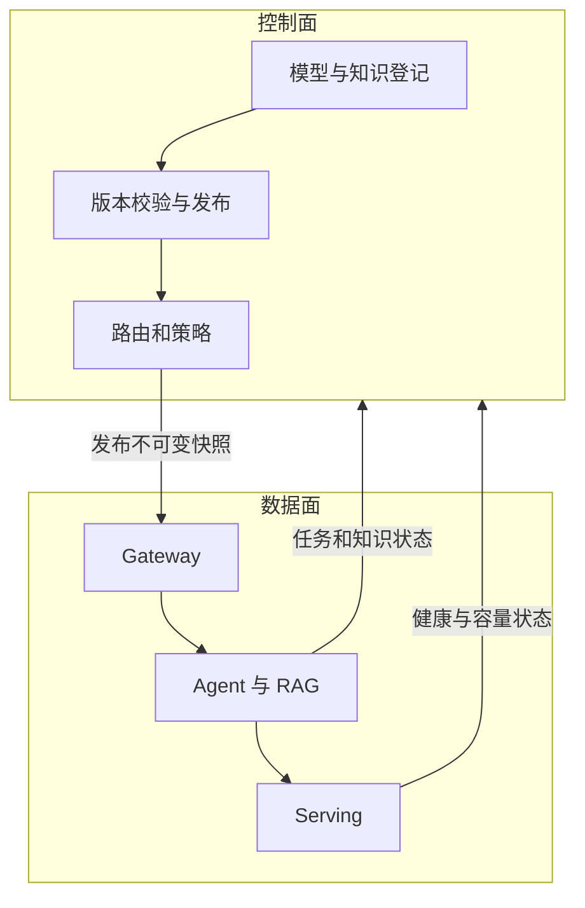
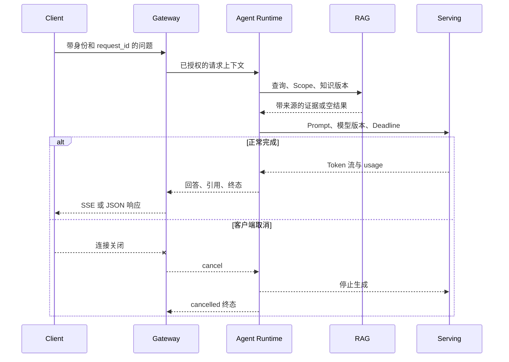

# 什么是 AI Infra？它为什么不只是部署模型

在应用代码里调用一次模型，往往只需要一个 HTTP 请求。请求体里有模型名和消息，返回值里有回答，看上去和调用天气接口没有太大区别。等系统需要同时服务很多用户，问题就变了：模型由谁加载，显存够不够，请求排队多久，流式连接在哪一层中断，知识库能不能返回其他租户的文档，失败后费用怎样核对，更新模型时怎样避免所有请求一起失败。这些问题不会由一条模型调用语句自动解决。

AI Infra 是负责这些运行条件的工程领域。它把模型、计算资源、数据设施和交付流程组织成可以持续运行的系统，让应用能够用稳定接口访问模型能力。这里的 Infra 是 infrastructure 的缩写，中文通常译为基础设施。基础设施不是一组服务器的别名，它还包括资源如何分配、状态存在哪里、请求如何流动、版本如何切换以及故障如何恢复。

::: info 一个够用的定义

**AI Infra 是让模型训练、推理和 AI 应用能够被部署、调用、观测、扩展、治理与恢复的一组基础设施和工程方法。**

它管理的是模型运行所需的计算、网络、存储、调度和平台能力。模型回答什么主要由算法、数据和应用逻辑决定；模型能否在正确版本、正确权限和可接受成本下稳定回答，属于 AI Infra 的责任。

:::

## 先看一次请求为什么会牵涉这么多组件

假设一个企业知识助手收到问题：“公司的远程办公申请流程是什么？”浏览器先把请求发送到网关。网关验证用户身份和额度，Agent 运行时决定是否检索知识库，检索服务根据当前用户的可见范围寻找文档，模型服务再把问题与证据生成回答。请求结束后，系统记录耗时、Token、模型版本、知识版本和错误状态。

下面这张图只画正常路径，没有展开重试和回滚。箭头表示请求或数据的交接关系，方框不是必须独立部署的产品。在小系统里，网关和应用可能是同一个进程；模型也可能来自外部供应商。



图里每一次交接都可能失败。网关可能拒绝过期的 API Key，检索服务可能在允许范围内没有结果，模型服务可能因为显存不足无法接收新请求，浏览器也可能在回答生成一半时断开连接。AI Infra 的工作不是保证永远不失败，而是让失败发生在清楚的边界，留下可判断的证据，并能恢复到一致状态。

一次请求还暴露了两个容易混淆的方向。在线推理关注用户等待的这一条链路，通常在意首个 Token 延迟、持续输出速度和高并发下的队列。训练基础设施处理数据集、梯度、检查点和多机通信，任务可能运行数小时甚至数天。两者都用 GPU、网络和存储，资源形态与失败恢复方式并不相同。

## AI Infra 管理的不是模型参数，而是模型的运行条件

模型参数可以理解为训练后保存在文件里的大量数值。它们决定模型进行计算时采用什么权重，却没有说明这些文件从哪里下载、是否完整、应该放进哪张 GPU、怎样对外提供 HTTP 接口。把权重文件复制到服务器，只完成了制品交付的一部分。

模型要运行，至少需要可执行程序、依赖库、CPU 内存、GPU 显存、磁盘、网络端口和配置。推理引擎读取模型配置与权重，把它们加载到设备内存，再接收分词后的输入完成计算。任何一项不匹配都可能让服务在启动阶段失败：驱动版本无法支持当前 CUDA 运行库，权重格式不被引擎识别，磁盘空间不足，或者进程没有读取模型目录的权限。

服务启动也不等于已经可用。大模型可能需要几分钟加载权重，进程已经存在，端口甚至已经监听，真实推理请求仍会失败。AI Infra 会把“进程活着”“模型加载完成”“可以接收新请求”拆成不同状态，并为它们设计健康检查。这样调度器和入口代理不会把用户请求送进一个只完成了一半初始化的实例。

::: warning 模型能力和运行能力不是一件事

基准测试分数高，只说明模型在特定数据和评测方法下表现较好。它不证明当前服务的并发、延迟、权限、成本和恢复能力合格。反过来，平台运行得很稳定，也不能证明模型回答正确。

:::

## 计算层为什么包含 CPU、GPU、内存和网络

CPU 是通用处理器，擅长操作系统调度、网络协议、控制逻辑和许多分支较多的程序。GPU 有大量适合并行数值计算的执行单元，神经网络中的矩阵运算通常能让这些单元同时工作。AI 系统并不是把所有任务都交给 GPU：HTTP 解析、鉴权、分词、队列管理和日志处理通常仍由 CPU 完成。

GPU 也不是插入服务器后就自动被应用发现。操作系统需要驱动，程序需要兼容的计算运行库，容器需要获得设备访问权限，Kubernetes 集群还需要把 GPU 资源登记到节点并分配给 Pod。调度成功只代表资源已经分配，模型能否装入显存、算子能否执行仍由模型和运行环境决定。

多张 GPU 进一步引入通信问题。一个模型可能按张量维度拆到多卡上，每一步计算都要交换中间结果；分布式训练还要同步梯度。PCIe、NVLink 和跨机网络的带宽、拓扑与错误处理会直接影响任务。此时“GPU 利用率不高”只是一个现象，需要同时看等待通信、数据准备、批大小和调度空洞，不能直接归因于硬件太慢。

计算资源可以用一张简化表先划清边界。表格不列具体型号，因为同一个型号在不同精度、模型结构和请求长度下得到的结果会变化。

| 资源 | 常见职责 | 容易误判的现象 |
| --- | --- | --- |
| CPU | 网络、分词、调度、序列化、控制逻辑 | CPU 高不一定要增加 GPU，可能是分词或 JSON 处理成为瓶颈 |
| 系统内存 | 进程堆、文件缓存、模型加载中转、数据预处理 | 内存足够不代表模型能放进显存 |
| GPU | 大规模并行数值计算 | 利用率低可能在等待输入、通信或调度 |
| GPU 显存 | 权重、激活、工作区、KV Cache | 模型能加载不代表还能容纳并发请求 |
| 网络 | API 传输、模型下载、多机通信、存储访问 | Ping 通不代表 TCP、TLS 和应用协议都可用 |
| 磁盘与对象存储 | 模型、数据集、文档、日志和检查点 | 有文件不代表版本、摘要和权限正确 |

## 数据设施保存哪些状态

AI 应用不会只保存模型文件。用户、会话、权限、任务、知识文档、向量、用量和审计记录都有不同的生命周期。把它们全部放进一个数据库可以让早期开发简单一些，数据量、访问方式和恢复要求变化后，需要按状态性质分工。

关系数据库适合保存需要事务和查询约束的业务事实，比如用户、知识库版本、模型登记和任务终态。Redis 常用于短期缓存、Session、限流计数和租约，速度快，但不能因为读取方便就把它当成所有业务事实的唯一来源。对象存储保存模型权重、原始文档、数据集和检查点等大对象；数据库保存对象键、摘要、版本与发布状态，二者需要能够对账。

向量索引保存文本经过 Embedding 模型转换后的数值表示，用于寻找语义相近的内容。向量相近并不等于用户有权限读取原文，权限过滤仍需依赖可靠的租户、知识库和版本字段。缓存也不能绕过这一层。缓存键如果只包含问题文本，没有包含用户范围和知识版本，同一句问题可能返回另一个租户或旧版本的结果。

消息队列负责把耗时工作从在线请求中移开。文档解析、Embedding、离线评测和模型转换不适合一直占住浏览器连接，API 可以先创建任务，Worker 再领取执行。队列只负责传递和确认消息，业务终态仍要写入持久存储。Worker 收到消息不等于任务成功，ACK、重试、幂等和未知执行结果都需要单独设计。

## 平台层把底层差异收成稳定接口

直接使用一家模型供应商时，应用可以按对方接口编写代码。接入第二家供应商或自托管模型后，模型名称、鉴权方式、流式事件和错误结构可能不同。LLM Gateway 在入口提供统一身份、模型路由、限流、用量和错误语义，应用使用稳定的逻辑模型名，平台再选择实际供应商或部署实例。

统一接口不意味着所有模型能力都一样。有的模型支持图片，有的支持工具调用，有的限制上下文长度。平台需要登记能力和兼容范围，无法支持的参数应在入口明确拒绝，而不是静默忽略。OpenAI 兼容通常指一组相似的请求与响应结构，不表示供应商实现了官方接口的所有行为。

多模型平台还管理版本与流量。一个逻辑模型可以关联多个版本和多个实例，候选版本先旁路验证，再接收少量流量。健康检查失败时，路由器可以停止分配新请求；已经进行中的流式请求是否继续、费用怎样记录、会不会自动重试，要按请求是否产生副作用和客户端能否接受重复结果来决定。

Agent 与 RAG 让平台状态更复杂。Agent 运行时保存一个任务已经调用过哪些工具、当前步骤、取消状态和检查点；RAG 管理文档从上传、解析、切片、向量化到发布的知识版本。模型只生成候选文字，权限、版本、费用和任务终态仍由确定性程序控制。

## 可观测性为什么不能只看接口是否返回 200

HTTP 200 表示服务器按 HTTP 语义返回成功响应，不保证回答有证据，也不保证用户及时看到第一个 Token。AI 请求需要同时观察基础设施信号和业务信号。基础设施信号包括 CPU、GPU、显存、队列、连接池和错误率；模型信号包括输入输出 Token、首 Token 延迟、逐 Token 延迟、停止原因和模型版本；质量信号包括检索证据、引用覆盖和拒答是否符合规则。

Trace 用一个请求标识关联网关、Agent、检索和模型服务的耗时。Metric 汇总一段时间内的请求率、错误率和延迟分布。Log 保存单次事件的结构化细节。三者各有用途，不能互相替代。只有日志时，很难从大量事件中看整体趋势；只有指标时，又无法还原某个请求经过了哪个知识版本和模型实例。

AI 系统还要控制隐私。Prompt、文档和模型回答可能包含敏感内容，不能为了排障把完整正文写入所有日志。更合适的做法是记录脱敏的请求 ID、租户、模型版本、知识版本、Token 数和错误码，原始内容通过受控存储按权限读取。可观测性需要让问题可定位，同时限制谁能看到什么。

下面是一条用于理解字段关系的脱敏事件，不代表任何生产系统的真实日志。输入是一次知识问答，输出字段让运维人员能够关联各阶段，而不保存问题正文。

```json
{
  "request_id": "req_demo_01",
  "tenant_id": "tenant_demo",
  "model": "chat-default",
  "model_revision": "rev-20260818",
  "knowledge_release": "kb-42",
  "input_tokens": 820,
  "output_tokens": 146,
  "finish_reason": "stop",
  "status": "completed"
}
```

如果检索没有在允许范围内找到证据，事件应记录 empty 或 refused 等明确终态，而不是生成一个没有来源的答案后仍写 completed。`request_id` 用于关联链路，不能代替租户授权；知道一个请求 ID 的人不应因此获得原始 Prompt 的读取权限。

## AI Infra 和相邻岗位怎样分工

岗位名称会随公司规模变化，同一名工程师也可能承担多类工作。划分责任时，比职位名称更有用的是看谁拥有哪份状态、谁能改变它、失败时谁负责恢复。

| 方向 | 主要关注 | 与 AI Infra 的交界 |
| --- | --- | --- |
| 算法与模型工程 | 数据、训练方法、模型结构、评测与效果 | 训练需要计算与数据平台，模型产物需要可部署格式 |
| AI 应用工程 | Prompt、业务流程、工具、RAG 与用户体验 | 应用通过网关和运行时使用模型、知识与任务设施 |
| 后端工程 | API、业务状态、事务、权限与服务逻辑 | AI Backend 仍使用数据库、缓存、队列和对象存储 |
| MLOps | 数据、实验、训练流水线、模型登记和发布 | 与训练平台、模型制品和发布治理有较大交集 |
| SRE | 可靠性、容量、变更、观测、事件响应 | AI 服务同样需要 SLO、告警、回滚和恢复 |
| AI Infra | 模型计算、Serving、GPU 调度、AI 平台与运行治理 | 把上述能力组织成模型和 Agent 可依赖的运行环境 |

AI Infra 并不取代后端工程。网关的鉴权、用量账单、任务状态和租户权限仍是后端问题，只是对象换成了模型请求、Token、知识版本和 GPU 资源。它也不取代算法工程。平台能让多个模型稳定运行，选哪个模型、如何评测质量仍需要模型与业务知识。

MLOps 和 AI Infra 的边界最容易重叠。MLOps 常从数据、实验、训练、模型登记到发布构建生命周期；AI Infra 更强调承载这些流程的计算、Serving、调度和平台能力。实际组织可以把两者放在同一团队，不必追求统一行业定义，但接口责任必须写清。

## 托管模型和自托管模型改变了哪些责任

使用托管 API 时，供应商负责模型服务器、GPU、底层调度和部分容量。调用方仍要处理 Key、超时、重试、限流、成本、数据策略和供应商故障。把模型交给供应商运行，减少了计算设施工作，没有消除平台治理。

自托管模型把更多责任移到自己的系统。团队要核对许可证与权重版本，准备驱动和推理引擎，估算显存，设计健康检查、扩容、观测和发布。好处是可以控制模型版本、数据路径和部分成本；代价是需要承担硬件利用率、容量峰值和故障恢复。

两种方式可以同时存在。Gateway 用逻辑模型名隐藏具体来源，普通请求走托管模型，敏感数据或稳定高负载走自托管实例。路由策略必须说明能力、权限、预算和失败处理，不能只按单次价格选择。供应商超时后自动切换模型可能改变回答质量和合规边界，是否允许切换应由业务规则决定。

## 控制面和数据面分别处理什么

平台系统经常把控制面和数据面分开。控制面保存期望配置并决定资源应该怎样组织，比如登记一个模型版本、创建部署、配置路由权重、发布知识版本。数据面真正处理在线请求，它验证请求携带的运行信息，选择已经准备好的实例，执行检索或推理，再把结果送回客户端。

这个区分来自状态变化的频率和风险。模型登记每天可能只修改几次，聊天请求每秒可能进入很多条。如果每个在线请求都临时读取所有部署配置、检查权重文件并重新创建实例，延迟和故障面都会变大。控制面先把配置验证并发布成可消费的快照，数据面读取活动快照处理请求，能够减少运行期间的不确定变化。

控制面成功写入也不代表数据面已经采用新版本。创建 Deployment 后，Kubernetes 还要调度 Pod；容器启动后，Serving 还要加载权重；模型就绪后，Gateway 才能把新请求分配给它。每一步都有自己的状态。平台应区分“配置已接受”“资源创建中”“实例已就绪”“已经接收流量”，不能只返回一个含义模糊的 success。

数据面不应在请求中随意修改控制面事实。比如模型实例发现自己加载失败，可以上报状态和错误，不能把模型登记直接删除；检索请求发现没有结果，也不能自动把尚未审核的知识版本发布为活动版本。状态所有者根据证据作出变更，避免多个实例同时修改全局配置。



图中的上行箭头是状态报告，不是数据面直接改写控制面。控制面可以根据健康和容量决定停止路由、创建新实例或触发人工处理。这个反馈回路需要版本号，否则旧实例迟到的健康结果可能覆盖新版本状态。

## 一次请求怎样形成可以核对的证据

理解架构图之后，还要确认真实请求是否按设计经过各组件。最小验证从一个脱敏测试身份、一条固定问题和一个明确模型版本开始。调用前记录用户可见范围、活动知识版本和余额或配额；调用后核对 HTTP 结果、事件流、Trace、用量日志和业务状态。测试数据要能清理，不能使用真实用户的高成本请求充当验证样本。

假设请求返回了回答，但没有引用。仅看 HTTP 状态无法知道是检索为空、证据在 Prompt 装配时丢失，还是模型没有按输出合同返回引用。Trace 应分别记录检索候选数、权限过滤后的数量、实际装配的 Chunk ID 和最终引用 ID。数字在哪一步从非零变成零，问题就落在哪一层。

另一个常见情况是客户端取消。浏览器关闭连接后，Gateway 收到断开事件，运行时设置取消状态，正在等待的检索和模型调用需要停止或忽略迟到结果。Serving 释放请求占用的 KV Cache，计费系统按已经发生的用量结算或回滚。只记录一个 499 状态码，看不到取消是否传播到 GPU 和业务状态。

下面的时序图把一次正常请求和取消分支放在同一条链路。它没有指定具体框架，目的是说明哪个组件产生哪类证据。



正常完成需要业务终态和交付结果都成立。回答已写入数据库，但客户端断开，任务可以是 completed，交付状态仍是 interrupted；工具已经产生外部副作用，但状态仓储写入失败，系统只能记录 unknown，不能自动重跑整个任务。AI Infra 要保留这些差别，让恢复动作根据事实选择。

验证也要覆盖失败路径。无效 Key 应在模型调用前拒绝；无权限知识库应在检索前或检索过滤阶段停止；不存在的模型名应返回稳定错误；Serving 过载应给出可识别的限流或不可用终态。每个用例都检查下游调用次数，确认拒绝后没有继续消耗 GPU 或访问数据。

## 容量、成本与可靠性为什么要一起看

模型请求的成本和延迟与输入长度、输出长度、批处理和硬件有关。同一个接口每天一千次调用并不能直接说明需要几张 GPU，因为一千条短分类请求和一千条长对话占用的计算量差别很大。容量规划要记录请求到达分布、Token 长度、并发、首 Token 延迟和逐 Token 延迟，再观察队列怎样增长。

| 观察信号 | 它回答的问题 | 不能单独推出的结论 |
| --- | --- | --- |
| 到达率、并发和队列长度 | 当前负载是否超过处理能力 | 需要几张 GPU |
| 输入与输出 Token 分布 | 单次请求大致消耗多少计算与费用 | 用户体验一定更慢 |
| 首 Token 与逐 Token 延迟 | 等待发生在排队、预填充还是生成阶段 | 扩大批次一定有效 |
| GPU 利用率与显存 | 设备是否有空闲、是否接近 OOM | 服务已经满足业务 SLO |
| 错误、取消和重试 | 计算是否被浪费，失败是否放大成本 | 多加副本就能恢复 |

这些信号要放进同一条请求和同一个时间窗口比较。拆开看时，低 GPU 利用率可能被误判为机器过剩，实际瓶颈也许在排队、网络、模型加载或数据准备。

提高批大小通常能增加 GPU 吞吐，却可能让单条请求等待更久。给每个模型保留大量空闲实例可以降低突发延迟，成本也随之增加。平台需要明确服务目标，比如多少请求的首 Token 延迟低于某个阈值、过载时允许排队多久、超过预算后是拒绝还是降级。没有目标，扩容与节省成本会不断互相否定。

可靠性也不能只靠增加副本。多个副本如果共享同一份损坏模型、同一个数据库连接上限或同一条网络路径，会一起失败。发布前要验证制品摘要和依赖，运行中观察队列与资源，故障时保留旧版本和恢复路径。冗余要覆盖真实故障边界，而不是只增加容器数量。

成本记录需要和业务请求关联，但不应把供应商账单原样当成内部用量。内部系统记录模型、Token、路由和请求状态，供应商账单作为外部对账来源。流式请求中途取消、重试和供应商返回未知结果时，两边数字可能不同，平台要保留原始事件并采用明确的对账规则。

AI Infra 的日常工作因此包含设计、交付和运行三个时间尺度。设计时确定模型怎样接入、状态放在哪里、权限在哪一层判断；交付时把代码、模型和配置组成可追溯候选，验证通过后逐步接收流量；运行时观察请求、队列、资源与质量信号，遇到异常按已有回滚点恢复。三者不能互相替代，一份完整架构图无法证明候选版本可上线，一次成功上线也不能代替长期容量与故障检查。

变更是检验责任边界最直接的场景。升级模型时，算法工程师提供评测结果和制品身份，平台创建候选部署，应用团队确认接口与回答行为，运维流程控制流量并观察错误、延迟和成本。任何一方发现失败都需要知道停止条件和回滚对象。只写“升级模型”四个字，会遗漏权重、Tokenizer、推理引擎、路由配置与知识提示是否必须同步变化。

故障处理则从证据反推状态。请求没有进入网关，先看 DNS、TCP 和入口日志；进入网关后没有调用模型，检查鉴权、路由和运行时；模型实例收到请求却没有输出，查看队列、显存和引擎日志；回答已生成但浏览器没有及时显示，再检查应用与代理缓冲。分层不是为了给团队划地盘，它让每一步都有可以证伪的判断。

学习这套内容时也可以沿同一顺序验证理解：先说明一个组件是什么，再画出输入和输出，随后找到它持有的状态，最后给出一个成功样本和一个失败样本。若只能背出产品名称，却无法说明失败会留下什么记录，对这层基础设施的理解还不足以支持实际排查。

## 用一张责任表检查架构是否完整

学习 AI Infra 时容易记住产品名，却说不清产品在请求中负责什么。可以为每个组件写四列：它接收什么输入，保存什么状态，产生什么输出，失败后由谁处理。下面是知识问答链路的缩略版本。

| 组件 | 输入 | 持有的状态 | 输出与失败终态 |
| --- | --- | --- | --- |
| Gateway | 身份、模型名、请求体 | 限流、路由和用量上下文 | 允许的请求，或鉴权、额度、路由错误 |
| Agent Runtime | 目标、消息、工具目录 | Turn、步骤、取消和检查点 | 工具命令、最终回答或明确终态 |
| RAG | 查询、范围、知识版本 | 索引与发布版本 | 带来源的证据、空结果或权限拒绝 |
| Serving | Token、采样参数 | 请求队列、批次、KV Cache | Token 流、模型错误或过载 |
| GPU | 张量和 Kernel | 显存分配与执行状态 | 计算结果、设备错误或 OOM |
| 观测系统 | 各组件事件 | Trace、Metric、Log | 查询、告警和审计证据 |

这张表里如果出现“模型自己判断权限”“缓存保存最终业务事实”“Pod Running 就代表模型就绪”，责任就放错了位置。模型可以建议动作，权限系统决定能否执行；缓存可以加速读取，持久数据库保留业务事实；Kubernetes 可以维持容器数量，模型 readiness 还要由应用探针确认。

从这张责任表继续学习，后面的主题会落到具体字段和命令。Linux 解释服务进程怎样读取配置、绑定端口和响应信号；网络解释请求怎样从域名走到 HTTP；容器和 Compose 解释进程如何隔离并组成服务栈；GPU 与 Kubernetes解释计算资源怎样进入模型实例；Gateway、Agent 和 RAG 再把这些能力组织成企业平台。
