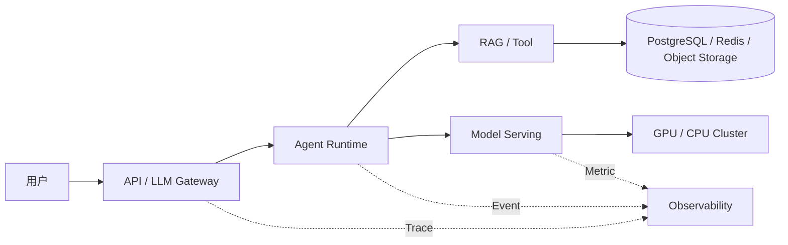

# AI Infra 全景、岗位职责与学习路径

AI Infra 是支撑模型训练、推理、Agent 和知识服务运行的一组基础设施与工程能力。它覆盖入口、应用 Runtime、数据与队列、模型服务、GPU、发布和观测，处在产品功能与计算资源之间。它的作用不是单纯维护 GPU，而是让一次 AI 请求可以被调度、限流、恢复、度量并持续交付。

一个聊天接口在开发机上返回了答案，不代表它已经成为可运营的 AI 服务。上线后，入口可能限流，Agent 可能反复调用工具，检索可能读到错误版本，模型服务可能排队，GPU 可能因为 KV Cache 用尽而拒绝新请求，流式连接也可能在答案结束前断开。

AI Infra 处理的正是这条长链。它把模型能力变成有版本、有资源边界、有证据、能观测、能发布和能恢复的服务。每一层都要明确接收什么、保存什么状态、输出什么，以及故障由谁处理。

## 一次请求穿过哪些层

入口层确认身份、预算和模型能力；Runtime 管理一次任务的状态与停止条件；RAG 和工具提供外部事实；Serving 把统一请求转为推理执行；计算层承担显存、带宽和并行计算；数据层保存业务、知识和短期协调状态。观测不是最后补上的旁路，它要用稳定标识把这些阶段连接起来。

## AI Infra 是什么，又不是什么

AI Infra 是让 AI 工作负载稳定运行的一组平台能力。它关心模型和普通 Web 服务不同的执行特征：输入输出长度不固定，首 Token 与后续 Token 的延迟来源不同，模型文件很大，推理受显存约束，同一接口背后可能是托管供应商或自托管引擎。

它不等于“安装 CUDA”。GPU 只是计算层。一个只调用托管模型的系统仍需要密钥隔离、模型路由、限流、成本、重试边界、流式取消和审计。它也不等于把 DevOps 改名，因为平台必须理解 Token、Prefill、Decode、KV Cache、知识版本和 Agent 状态，才能选择正确的容量与恢复策略。

## 六层能力地图

| 层 | 主要输入 | 处理与状态 | 可验证输出 |
| --- | --- | --- | --- |
| 应用层 | 用户请求、身份、业务范围 | API 契约、鉴权、流式协议 | 状态码、事件序列、审计记录 |
| 数据层 | 用户、文档、向量、任务 | 事务、缓存、对象版本、队列 | 可查询状态、知识版本、校验和 |
| 模型层 | Message、Token、参数 | 路由、推理、采样、用量 | Completion、Usage、Finish Reason |
| 计算层 | Kernel、显存、网络 | 调度、并行、数据搬运 | GPU 指标、吞吐、OOM 证据 |
| 平台层 | 模型与租户配置 | 注册、配额、发布、能力发现 | 稳定模型标识、候选版本、策略 |
| 可靠性层 | Trace、Metric、Log | SLO、告警、容量、恢复 | 故障定位、回滚点、恢复证据 |

六层不是六套互不相关的系统。例如一次超时，可能是入口截止时间过短、Agent 循环过多、检索连接池耗尽、Serving 排队或 GPU Decode 变慢。AI Infra 工程师需要先用 Trace 找到阶段，再读取该阶段的指标和状态，不能只看最终的 504。

## 与相邻岗位怎样分工

| 角色 | 首要交付 | 与 AI Infra 的交点 |
| --- | --- | --- |
| 后端工程师 | 业务规则、API、事务与权限 | 网关、状态模型、数据访问、异步任务 |
| 算法工程师 | 训练数据、模型效果与评测 | 模型制品、精度、训练与推理参数 |
| MLOps 工程师 | 模型生命周期与实验交付 | Registry、流水线、部署与监控 |
| SRE | 服务等级、容量、事件响应 | SLO、告警、发布、恢复和成本 |
| AI Infra 工程师 | AI 工作负载的平台化运行 | 连接模型语义、计算资源与可靠性 |

边界由组织规模决定，但责任不能消失。小团队可以由同一个人承担多种角色，仍要明确谁批准模型版本、谁拥有数据库迁移、谁处理 GPU 容量、谁能改变网关策略。

## 两条实践路径不要混在一起

托管模型路径先解决统一接口、密钥、配额、路由、超时、成本和供应商故障。它不需要管理驱动和显存，却要面对外部配额、网络和能力差异。

自托管路径在这些能力之外，还要管理模型 Revision、Tokenizer、权重格式、GPU Runtime、批处理、KV Cache、模型加载、节点拓扑和扩缩容。两条路径可以共用 Gateway、Agent、RAG 和观测，但容量模型与故障域不同。

## 怎样判断自己真的学会了

不要用“听说过多少组件”衡量进度。为每层留下一个可检查产物：请求时序图、数据模型、模型制品清单、显存账本、部署清单、SLO 表和回滚 Runbook。遇到一个失败场景时，先写出当前证据、候选层、下一条检查和停止条件。

完成这张地图后，后续 36 篇会按依赖顺序填充各层。最终标准不是搭出最多组件，而是能让一条 AI 请求在权限、资源、版本和故障边界内结束，并能说明结果来自哪里。
