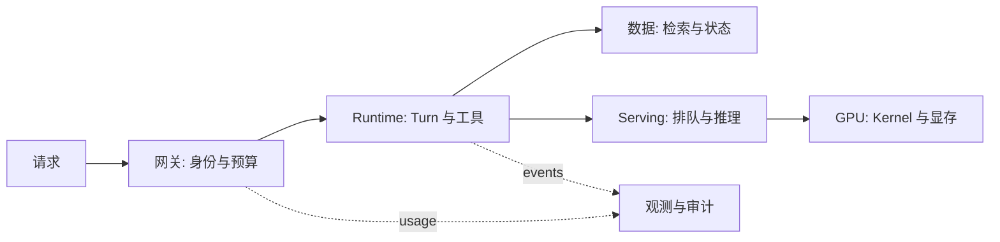

# AI Infra 全景、岗位职责与学习路径

凌晨的模型问答接口突然变慢。应用日志显示请求已经发出，GPU 监控却没有明显异常，知识库也能查到结果。最后发现，真正排队的是网关后面的连接池。这个例子说明，AI Infra 不是“会不会配 GPU”的单一岗位，而是要把一次请求经过的每个状态都交代清楚。

## 先沿一条请求画地图

把用户问题记作输入，系统至少要经过身份校验、上下文装配、检索或工具调用、模型调度、流式输出和用量记录。每一步都可能持有不同状态：网关持有租户和预算，Agent Runtime 持有 Turn，数据库持有业务事实，Serving 持有队列和 KV Cache，GPU 只负责执行已提交的工作。

如果把这些状态都塞进“后端服务”这个词里，排障时就只剩下猜测。更有用的问法是：现在卡住的状态由谁拥有，证据在哪里，谁有权改变它？

## 六层边界决定岗位边界

| 层 | 它回答的问题 | 常见负责人 |
| --- | --- | --- |
| 应用与 Runtime | 这次请求允许做什么，怎样结束？ | 后端、Agent 工程师 |
| 数据与任务 | 状态、文档、事件怎样保存和重试？ | 数据、平台工程师 |
| 模型服务 | 模型何时接纳请求，怎样生成 Token？ | Serving、推理工程师 |
| 计算与调度 | 工作落在哪个 CPU/GPU，资源何时释放？ | Infra、集群工程师 |
| 观测与治理 | 出了问题怎样证明，成本归谁？ | SRE、平台产品 |
| 交付与恢复 | 版本怎样进入生产，失败怎样回到已知状态？ | 交付、可靠性工程师 |

表中的“负责人”不是墙。小团队里一个人可能覆盖多层，但接口仍然要清楚。例如模型输出的工具调用是候选，不是授权事实；数据库里的知识版本是事实，Prompt 不能替它发布；Kubernetes 能把 Pod 放到节点上，却不知道模型答案是否正确。

## 从后端转过来，先补哪一块

已经会写 API 的读者，不必先背 CUDA 指令。先能用 Linux、网络、容器和 Compose 找到一个正在运行的进程，再理解 Redis、PostgreSQL、队列和对象存储各自保存什么。之后再进入 Serving、GPU 和 Kubernetes，最后把这些部件放回 Gateway、Agent、RAG 和发布链路。

每读完一篇，都留下一个可以复核的产物：请求证据链、显存账本、状态机或回滚条件。产物的价值不在形式，而在它迫使你写出“谁持有状态”和“怎样验证”。

## 这条路线怎样使用

遇到新组件时，不要从名词开始。先写一个具体现象，例如“Pod Running 但没有流量”或“第二个请求 OOM”，再用本路线提供的层次去定位。能把现象映射到进程、端口、队列、缓存、模型、GPU 和入口，才算真正掌握了 AI Infra 的边界。

## 把职责放到一次故障里

假设首 Token 变慢：网关工程师先确认认证和并发预算是否把请求挡在入口，Runtime 工程师确认是否有工具或检索占用了 Turn，Serving 工程师查看队列、Prefill 和 KV Cache，集群工程师查看 GPU 可用性与节点事件，数据工程师确认检索和连接池没有拉长链路。这里没有“万能负责人”，只有按状态所有权分工。

成熟的平台会把这条路径写进 Trace 和告警路由。这样值班人员先看到“延迟发生在模型队列之前还是之后”，再把问题交给拥有修改权限的人。学习路线的价值，是让你能参与这种对话，而不是在异常时只能重启服务。

## 能力不是工具清单

会部署一个模型不等于能运营模型服务，会调用 LangGraph 也不等于能恢复 Agent。能力应落在可复核判断上：能否解释一条 429 来自网关还是 Serving，能否判断知识更新为什么没生效，能否在发布前说明哪些状态会被保留。工具会变化，这些判断会留下。

练习时不必搭一套巨大平台。选一个已有 API，补一张请求状态图和一条失败 Trace，就能暴露缺少的边界。随着路线向后推进，再把图接上缓存、队列、模型、GPU 和回滚点。

下一篇从一个服务进程开始，追踪它如何从 execve 走到 listen，也就是把这张地图落到可以观察的 Linux 状态上。
