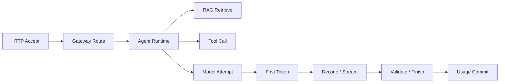

# AI 可观测性：请求成功不代表答案可用

接口返回 200，用户仍认为系统失败：首 Token 等了二十秒，引用指向过期文档，答案还因为长度上限被截断。传统 HTTP 成功率只能覆盖传输终态，AI 服务还要观察推理阶段、证据质量、资源和成本。

可观测性不是收集所有数据。它要让工程师从一个症状定位到请求阶段、模型版本、知识 Release、资源瓶颈和终态，同时控制标签基数与敏感内容。

## Trace、Metric、Log 与事件的分工

| 信号 | 适合回答 | 不适合承担 |
| --- | --- | --- |
| Trace | 单次请求经过哪些阶段、父子关系和耗时 | 长期聚合趋势 |
| Metric | 错误率、分位延迟、队列和资源趋势 | 任意 request ID 或 Prompt |
| Log | 详细错误、状态转换和诊断上下文 | 无结构全文堆积 |
| Business Event | Turn、知识发布、计费和审计事实 | 高频硬件采样 |

OpenTelemetry 提供 Trace、Metric、Log 的语义与传播基础；Prometheus 抓取数值时序；Grafana 展示与告警；Langfuse 等 LLM Observability 工具关注模型调用、Prompt、Trace 与评测。工具可以组合，字段所有权和隐私策略必须统一。

## 一条端到端 Trace

根 Span 使用稳定 request/turn 关联，子 Span 记录路由、检索、工具、模型 Attempt、首 Token 和验证。Span 属性包含低基数模型标识、Deployment、Release、终态和错误类别；Prompt 与文档正文默认不作为属性，应脱敏、采样或只保存受控引用。

异步任务通过 Trace Context 或显式 Link 关联，但业务恢复不能依赖 Trace 系统。Turn、Task 与 Event 仍写业务数据库，观测丢失不能改变执行正确性。

## AI 延迟拆解

总延迟至少拆为入口、准入、排队、检索/工具、Tokenize、Prefill、TTFT、Decode/TPOT、验证和传输。TTFT 是到首个可见 Token，TPOT 描述后续 Token 间隔；两者不能相加成简单总时间而忽略输出数量。

按输入/输出 Token 档位、模型、终态和流式模式看分位数。长上下文请求自然更慢，若不分桶，业务结构变化会被误判为版本回归。Bucket 也要控制数量，防止指标爆炸。

## 资源和队列信号

Serving 观察等待请求、最老年龄、活动序列、Batch Token、KV Cache、抢占、GPU 利用、显存和 OOM；Backend 观察连接池、Redis 内存、队列深度、Worker Lease、对象上传和数据库锁；Gateway 观察限流、配额、路由、供应商错误和用量差异。

资源指标只有与请求阶段关联才可行动。GPU 利用率低可能是没有流量、CPU Tokenize 慢、数据搬运或 Batch 太小；高利用率也可能伴随严重排队，不能单独代表健康。

## 质量 SLI

质量无法完全由在线单一指标表示。可使用结构化输出通过率、工具参数拒绝、检索 Recall、Evidence 覆盖、引用有效、拒答正确、人工反馈和离线 Eval。在线反馈有偏差，离线 Eval 有代表性边界，两者应共同解释。

RAG 回答至少记录知识 Release、候选数、Rerank、采用 Evidence 和 Claim 验证结果。模型版本升级后，质量与运行指标使用同一 Release 标记，才能把变化归因到候选版本。

## SLO 怎样写得可计算

SLO 由服务对象、SLI、阈值、窗口和排除规则组成。例如“在滚动 28 天内，符合输入上限且被准入的流式请求，99% 在目标时间内产生首 Token”。这比“系统要快”可计算，也明确了拒绝与异常流量怎样处理。

可用性 SLO 要定义哪些终态算成功；延迟 SLO 分 TTFT 与完成；质量 SLO 依赖受控 Eval；成本是预算而非可用性。错误预算用于决定是否继续发布，不能通过扩大排除项制造达标。

## 标签与隐私

Prometheus 标签适合模型档位、区域、状态、错误类别等有限集合。用户 ID、请求 ID、文件名、URL、Prompt 和任意错误文本会造成高基数或泄露，应放 Trace/Log 的受控字段或只存哈希与引用。

采样策略保留错误、长尾和关键发布样本，同时对普通成功请求做比例采样。即使不采样完整 Trace，核心计量和终态指标仍需完整。敏感数据要有保留期限、访问审计和删除路径。

## 从告警到行动

告警应映射 Runbook：TTFT 升高先看队列和 Prefill，TPOT 升高看 Decode、Batch 和设备，引用覆盖下降看知识 Release 与检索，成本突增看 Token 分布、路由和重试。只有能指向下一条证据的告警才有价值。

最终观测表要为每个 SLI 写明数据源、单位、标签、采样、负责人、告警阈值和 Runbook。这样仪表盘不只是展示系统很忙，而是支持发布判断、故障定位和容量决策。
