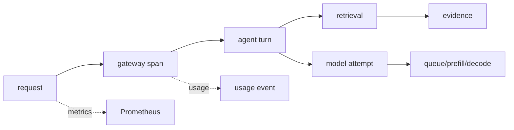

# OpenTelemetry、Prometheus、Grafana、Langfuse 与 AI SLO

接口返回 200，用户仍然认为系统失败：首 Token 等了二十秒，引用指向过期文档，答案还被截断。AI 可观测性要把一次请求的 Trace、Metric、Log、模型事件、证据和成本连起来，同时避免把 Prompt 和租户数据塞进高基数标签。

## 一条 Trace 该包含哪些阶段

Trace 用于解释单次请求的父子关系和耗时，Metric 用于趋势与 SLO，Log 用于详细错误，Business Event 用于 Turn、知识发布、计费和审计事实。OpenTelemetry 可以提供传播和语义，Prometheus 负责数值时序，Grafana 展示，Langfuse 等工具可承载模型调用和评测。

## 指标标签要稳定而克制

| 适合做 label | 不适合做 label |
| --- | --- |
| service、model_revision、route、status_class | 完整 Prompt、文档正文、用户 ID |
| tenant_tier、error_code、region | request_id、任意 Token 序列 |
| stream、cache_hit、retrieval_mode | 高基数的原始 URL 或工具参数 |

request_id 放在 Trace 和结构化 Log 中，用 exemplars 或关联字段从聚合指标跳到单次请求。把原始内容放进指标会造成内存和隐私风险，也会让 Prometheus 失去聚合价值。

## AI SLO 不能只写可用率

在线聊天可以同时约束 HTTP 成功率、TTFT P95、TPOT P95、队列年龄、流式中断率和引用覆盖率。不同模型和请求档位要分开计算，否则短请求会掩盖长上下文的失败。SLO 窗口、排除条件和错误预算要写清楚，才能触发一致的发布或降级动作。

## 采集本身也有成本和边界

Prompt、文档和工具参数可能含敏感信息。采集前做脱敏、采样和访问控制，原始内容与指标分开保存。Langfuse 或类似系统可以记录模型输入输出，但不能代替租户审计和数据库事实。

## 从症状回到责任层

TTFT 上升先看入口、队列、Prefill 和 KV；引用错误看 release、ACL 和 Evidence；成本异常看 usage、价格版本和重试。观测的价值是缩短判断路径，不是把所有日志堆在一个仪表盘。下一篇用这些指标和请求分布推导容量与成本。

## 告警应该指向用户影响和下一步证据

“GPU 利用率高”适合容量看板，不一定适合作为用户告警。更直接的告警可以是某模型路由的 TTFT P95 超过目标且队列年龄上升，或 RAG 引用覆盖率在一个 release 后显著下降。告警正文附 Trace 查询、模型 Revision、时间窗口和 runbook 链接，值班人员才能快速定位。

错误预算消耗时，平台可以冻结模型切换、限制低优先级请求或扩大预热容量。这样 SLO 不是周报里的数字，而是影响发布和过载策略的控制信号。

## 采样不能破坏根因链路

高流量系统不可能保留所有完整 Trace，但错误、慢请求、新 Revision 和安全事件应提高采样率。采样决策尽量在入口确定，并传播到子 span，避免只留下模型 span 却丢掉网关或 RAG 父链。

聚合指标保持全量，详细内容按策略采样并脱敏。这样既能看见总体 SLO，又能在异常时找到代表请求。采样规则本身也要版本化，否则两周前后的趋势可能不可比。
