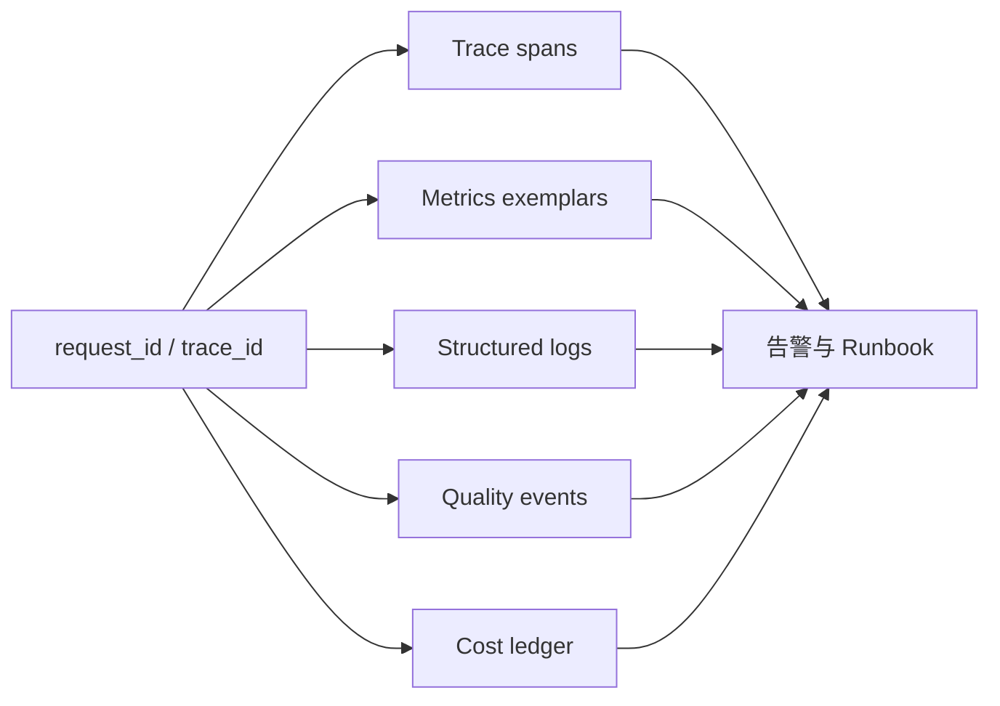
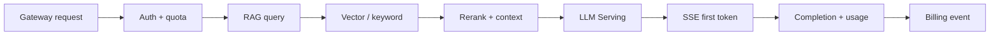

# AI 可观测性是什么？Trace、Metric、Log、质量和成本怎样关联

普通 API 的状态码和总延迟，只能说明请求有没有返回。AI 请求还可能在 Gateway 排队、Tokenizer 处理、模型 Prefill、逐 Token Decode、RAG 检索、Agent 工具、流式代理或账务阶段出问题。HTTP 200 也可能包含空答案、错误引用、被截断的流或异常高成本。只看一张 GPU 利用率图，无法回答用户为什么等了十秒才看到第一个 Token。

AI 可观测性要把运行状态、模型行为、数据证据和成本放在同一个请求身份下。Trace 解释一次请求经过哪些阶段，Metric 观察大量请求的趋势，Log 保存结构化事件和错误，质量评测判断答案是否满足任务，账务事件解释资源怎样变成费用。它们不是同一份数据的四种名称，各自有不同采样、保留和隐私边界。

::: info AI 可观测性的准确含义

AI 可观测性是通过 Trace、Metric、Log、事件、质量评测和成本记录，推断 AI 系统内部状态与用户结果的工程能力。它覆盖 Gateway、RAG、Agent Runtime、模型 Serving、GPU、队列和外部工具，并用稳定标识关联。

可观测性不等于记录全部 Prompt。数据越多不代表越可解释，敏感文本、Secret 和高基数标签会增加泄露与成本。应优先记录结构、状态、版本、计数、时间和受控引用。

:::

## Trace、Metric 和 Log 分别回答什么问题

Trace 描述一次请求的因果路径。根 Span 从外部入口开始，子 Span 表示鉴权、路由、检索、模型调用、工具、流式发送和结算。每个 Span 有开始、结束、状态、属性和关联事件，适合回答“这一条请求卡在哪里”。

Metric 是按时间聚合的数值，例如请求率、p95 TTFT、running 序列、KV Cache 使用、错误率和 Token 成本。它适合告警、容量和趋势，不保留每条请求全部细节。标签维度要受控，模型 Revision、区域和错误类别有价值，完整用户 ID 和 Prompt 不适合。

Log 是离散的结构化记录，包含状态转换、错误上下文和审计。日志可以说明某个模型文件缺失、工具参数校验失败或账务幂等冲突。纯文本堆栈缺少 request ID 和版本，很难和其他层关联。

事件介于状态与日志之间，例如任务 accepted、ToolCall started、Pod Ready、模型 Revision 切流和账单 settled。事件应有 Schema 和唯一 ID，方便状态机恢复与审计。普通日志不适合充当唯一事实表，因为可能丢失、重复或按采样删除。

三者要通过 trace ID、request ID、task ID、attempt ID、Pod UID、model revision 等标识连接。Metric 通常不能直接放 request ID，但可以用 exemplars 或从告警时间窗跳到 Trace。没有关联字段，工具再多也只是分散页面。

AI 可观测性是把一次 AI 请求的运行过程、资源消耗和结果质量变成可以关联、查询和采取行动的证据。它不等于“多接一个监控 SDK”，也不等于把 Prompt 全部写进日志。Trace 负责因果路径，Metric 负责趋势和容量，Log 负责单次细节，质量与成本事件则把技术信号连接到业务结果。

例如首 Token 变慢时，Trace 可以显示请求在 Gateway 排队还是在 Serving Prefill；Metric 可以判断同一时间窗口的 p95 TTFT 是否整体升高；Log 可以定位某个 Pod 的模型加载或网络重试；质量事件可以说明检索引用是否缺失。若只有一个总延迟数字，就无法知道应该扩 GPU、改路由、修索引还是调整采样。

它与健康检查的区别是观察范围。Readiness 只回答“实例能否接新请求”，可观测性还要回答请求经过了哪些阶段、用了多少 Token、消耗了哪类资源、是否产生引用以及失败后有没有释放租约。数据采集也有边界，原始 Prompt 和文档内容需要脱敏或受控留存，稳定 ID 和版本字段才能在隐私与诊断之间取得平衡。

图中稳定 ID 是关联键，不是高基数 Metric 标签。看板可以按模型 revision、区域和错误类别聚合，点进具体 Trace 后再查 request 级细节。这样既能保留趋势，也不会让监控系统因为每个用户和 Prompt 都成为标签而失控。
## 一条 AI 请求需要哪些稳定标识

外部 request ID 在 Gateway 接受请求时创建或校验客户端提供的幂等键。内部每次路由尝试生成 attempt ID，Serving 使用 engine request ID，Agent 使用 task ID 与 step，RAG 使用 query ID，账务使用相同业务 request ID 的终态唯一键。

模型身份至少记录逻辑名、Registry Revision、Serving 实例和引擎版本。Pod 名会重用或变化，Pod UID、镜像 digest、Node 和 GPU UUID 更稳定。RAG 还要有 embedding revision、index version、document version 和 chunk ID。

用户身份不能直接作为公开标签。Trace 中使用受控 tenant ID 或不可逆 pseudonym，日志按权限保存主体，Metric 只按租户级别或套餐聚合。高基数主体放入标签会让时序数据库爆炸，也扩大查询权限。

标识传播要经过 Header、消息队列和工具调用。外部 Header 不可信，Gateway 生成内部 Header 并清理伪造值。队列消息携带 task ID 和 trace context，Worker 恢复后创建 Link 或继续 Trace，不能因为异步就失去因果关系。

重复请求和重试需要同一业务 ID、不同 attempt。否则一次后端连接失败后重试成功，会被统计成两个用户请求和两笔费用。观察系统保存尝试与最终终态，报表按业务请求去重。
## AI 延迟为什么要拆成 TTFT、TPOT 和排队

总延迟从请求进入到最后字节返回，适合用户整体感受，但不能说明生成哪里慢。TTFT 是首 Token 延迟，包含 Gateway、排队、Tokenize、Prefill 和首轮 Decode。TPOT 是后续 Token 之间的平均或分布，更多反映 Decode、Batch 和流式传输。

排队延迟来自 Gateway 队列、Engine waiting、工具队列或 Kubernetes 冷启动。两个请求总延迟相同，一个在队列等十秒后快速生成，另一个立即首 Token 但慢慢输出，用户体验和修复方式不同。

输入和输出 Token 是必要维度。长 Prompt 的 Prefill 自然更慢，长输出总时长更长。比较版本时要在相似 Token 分桶内看 p50、p95、p99，不用平均值掩盖长尾。并发、Batch 和缓存命中也要记录。

SSE 还要记录事件 flush 与代理时间。Serving 生成首 Token 后，Gateway 或 Nginx 缓冲可能让客户端晚很久才看到。Trace 在 Serving emit、Gateway receive、Gateway flush 和客户端观测点分别打事件，才能定位网络层。

取消请求的 Token 不应继续计入成功 TPOT。区分 completed、canceled、timeout、rejected 和 failed，在 SLO 中分别处理。一个超时后继续后台生成的请求会消耗 GPU，却不产生用户可见完成量，应该计入浪费和取消传播指标。
## Serving 和 GPU 指标怎样解释资源阶段

Serving 指标包括 waiting/running 序列、Batch Token、Prefill/Decode 时间、KV Block、抢占、请求完成、取消和 OOM。它们比设备利用率更接近模型调度。一个实例 waiting 上升、running 达上限，说明准入或容量压力。

GPU 指标包括显存容量、内存带宽活动、Kernel 活动、功耗、温度、时钟和错误。GPU utilization 高不代表业务成功，低也不一定有问题。权重常驻使 memory used 长期高，不能把它设成单独 OOM 告警。

设备指标要映射到 Pod 和模型。Exporter 提供 GPU UUID，Kubernetes 提供 Pod UID 与设备分配，Serving 提供实例 ID。多进程、MIG 和时间共享时，一个物理卡可能对应多个工作负载，聚合层级必须明确。

性能调查把时间线对齐：TTFT 上升时 waiting 是否上升，Prefill 是否变长，显存是否接近上限，GPU 带宽或功耗是否变化。只有一张曲线同时变化不能直接证明因果，需要 Trace、负载和版本对照。

硬件错误单独告警。Xid、ECC、设备掉线和驱动重置可能需要隔离 Node，而不是扩容实例。业务 OOM、请求过长和设备错误使用不同错误类别与值班动作。
## RAG 和 Agent 指标为什么不能只看模型调用

RAG 请求要记录解析和索引版本、权限过滤、向量/关键词候选、重排、最终 Chunk 和引用。最终回答错误时，先判断正确证据是否召回，再看模型是否使用。只看模型 Token 与延迟，会把索引陈旧误诊为模型退化。

权限过滤有一票否决指标。任何无权 Chunk 进入候选、缓存或 Prompt 都是安全事件，不能平均进“召回率”。无结果率要按租户、数据集和权限版本分析，突然升高可能来自索引切换或 ACL 同步失败。

Agent Runtime 记录步骤、模型调用、工具调用、参数校验、批准、重试、取消和恢复。最终回答成功但调用了错误工具，仍是过程失败。工具延迟、错误和外部副作用按工具版本聚合。

循环任务要看步骤分布和预算耗尽。平均三步正常，p99 达最大步骤可能表示模型在重复调用。Worker 重启后重复 ToolCall 数、迟到事件和租约冲突是运行时指标，不属于模型质量。

RAG 与 Agent 的成本也不同。Embedding、检索、重排、模型和工具都产生费用或资源。成本事件使用相同 task ID，按阶段拆分，才能判断优化应发生在上下文、模型选择还是外部工具。
## 质量指标怎样与在线运行数据关联

质量不能从用户是否返回 200 推断。离线评测使用固定样本、评分规则和模型 Revision，在线质量可以使用用户反馈、任务完成、引用校验、工具成功和受控采样。不同来源有偏差，不能合成一个没有定义的“准确率”。

每个质量结果记录样本、输入版本、模型、Prompt Template、RAG index、工具版本和输出 Hash。模型未变而 Index 更新，质量变化仍能追踪。没有版本上下文的分数无法复现。

在线抽样需要隐私和权限。默认只保存结构化特征与 Hash，原文采样经过用户同意、脱敏、访问控制和短保留。自动评审模型也有版本和偏差，评分不是事实真相，重要用例保留人工或确定性断言。

质量回归与 SLO 可以分开。服务 p95 正常但引用准确率下降，运行 SLO 没违约，发布质量门槛仍应阻止切流。反过来质量提升但 TTFT 超目标，也不能直接全量。发布同时看运行、质量、安全和成本。

失败样本从生产脱敏后进入回归集，标记发现时间和修复版本。不能把真实用户完整对话复制到公开测试仓库。样本删除和访问遵守原数据政策。
## 成本怎样从 Token、GPU 和工具事件计算

请求成本包含模型输入输出 Token、Embedding、重排、外部工具、GPU 占用和基础设施分摊。云 API 按价格版本和实际 usage 结算，自托管模型常用 GPU 小时、有效 Token 和实例利用估算。两种口径不能直接比较一个单价。

Gateway 在请求接受时固定价格版本，完成或取消后写 usage。Agent 每一步和 RAG 每阶段都带 task ID，账务可以汇总。重试使用 attempt ID，报表按业务 request 去重并保留额外尝试成本。

GPU 成本要区分在线空闲、冷启动、候选和回滚容量。一个模型 Token 单位成本低，若长期保留大量空闲实例，总成本仍高。Goodput 只统计 SLO 内成功完成的 Token 或请求，更接近有效产出。

成本标签不得包含高基数用户和 Prompt。按 tenant、model revision、region、workload class 和 billing source 聚合。财务账单与可观测 Metric 可有不同保留和精度，二者用事件对账，不把 Prometheus 当唯一账本。

异常成本告警检查 Token 突增、步骤循环、工具重试、取消后继续生成和路由到高价后端。只设每月总预算，会在事故发生很久后才发现。告警动作可以限流、停止候选或要求人工确认，不能直接删除用户任务。
## SLI、SLO 和错误预算怎样定义

SLI 是可测量指标，例如有效请求中 TTFT 小于 2 秒的比例、SSE 正常完成比例、工具调用在 Deadline 内结束比例。SLO 是目标窗口和阈值，例如 28 天内 99% 的短输入请求 TTFT 达标。SLA 是外部合同，不应与内部目标混用。

分母必须清楚。用户鉴权失败、超配额拒绝、客户端取消和服务错误是否进入某个 SLI，各有不同意义。可用性 SLI 通常排除无效请求，容量 SLI 可能单独统计过载拒绝。用同一分母会掩盖问题。

AI SLO 要按请求形状分桶。短输入、长输入、非流式、流式、RAG 和 Agent 的目标不同。一个 Agent 工具等待 30 秒可能符合业务流程，普通 Chat 首 Token 30 秒则不可接受。模型和租户等级也可能有不同目标。

错误预算是允许不达标的比例，用于发布与风险决策。预算快速消耗时暂停高风险发布，优先修复；预算充足不代表可以跳过安全与权限门槛。越权、重复扣费和数据泄露通常是硬门槛，不用预算换取。

SLO 报表展示目标、实际、分母、窗口、版本和已知未覆盖范围。平均延迟和单次压测不构成 SLO。目标依据用户体验和容量测量，不从行业数字直接复制。
## 日志、Trace 和 Prompt 数据怎样做隐私控制

默认不记录完整 Prompt、输出、工具 Secret、对象存储 URL 和数据库结果。结构化 Log 保存长度、Token、Hash、模型、状态和错误类别。需要内容调试时，走受控采样、审批、脱敏和短 TTL，并记录查看审计。

Trace Attribute 有大小和基数限制。不要把消息数组塞进每个 Span，也不要在异常时自动附上环境变量。错误正文经过分类与截断，内部堆栈只进入受限系统，客户端得到安全错误码和 request ID。

数据分级决定保留。运行 Metric 可长期聚合，Trace 短期保存，原始内容更短或不保存，财务事件按法规保留最小字段。删除用户数据时，清理内容和可逆标识，聚合指标保留不可识别统计。

多租户查询系统必须按 tenant 过滤。管理员看全局指标不等于能读所有 Prompt。日志平台、Trace 平台和质量样本库分别授权，ServiceAccount 使用最小权限。导出和下载也进入审计。

敏感泄露测试包含 Key、邮箱、文档内容和内部路径，检查应用日志、Proxy、Trace、Metric Label 和错误响应。只扫描代码不够，异常路径最容易把原始请求打印出来。
## 告警和看板怎样对应可执行动作

告警应指出层级和影响。Gateway 429 上升可能需要容量或配额检查，Serving OOM 需要显存账本，RAG 无结果率突增需要索引状态，Agent 工具超时需要外部系统调查，GPU Xid 需要隔离 Node。一个总“AI 服务异常”没有操作价值。

多窗口告警减少噪音。短窗口发现快速故障，长窗口确认持续预算消耗。阈值结合请求量，低流量时一个失败不应直接触发百分比风暴，高流量时平均值又会掩盖长尾。

看板按用户请求链组织，而不是按团队工具。入口展示请求率、成功、TTFT、TPOT、质量和成本，再下钻 Gateway、RAG/Agent、Serving、GPU 和依赖。版本和区域筛选贯穿所有面板。

告警附带 Runbook 链接、当前版本、受影响模型、时间窗和代表 Trace。Runbook 先列只读检查和回滚条件，不让值班人员在不明原因时重启所有节点。自动化动作有边界和审计。

发布看板单独比较候选与基线。流量权重、样本量、SLO、质量、成本和未验证项同时展示。样本太少时不宣告更快或更准，稳定后再扩大权重。
## 一条 Trace 怎样连接请求的所有阶段

下面的图展示一条 RAG Chat 请求。图用于说明 Trace 的父子关系和异步 Link，实际 Span 名称按实现定义。

每个节点记录版本和阶段耗时。检索 Span 不放原文，只放 query Hash、index version、候选数和权限版本；Serving Span 放模型 Revision、input/output Token、queue、TTFT 和 finish reason；账务 Span 放价格版本与终态。
## OpenTelemetry 怎样把多个服务连成一条 Trace

入口服务从 W3C Trace Context 等标准 Header 读取或创建 Trace。外部客户端可伪造 Header，Gateway 需要限制 Baggage 和属性，再把内部上下文传给 RAG、Agent、Serving 和账务。HTTP、gRPC 和消息队列使用各自的 Instrumentation。

同步调用通常形成父子 Span，异步队列可以继续父上下文或用 Link 连接生产与消费。任务等待时间单独记录，不能把消息入队到 Worker 完成全算作工具执行。Worker 重试生成新 attempt Span，业务 task ID 保持不变。

自动 Instrumentation 能捕获 HTTP、数据库和 Redis，但不知道“模型 Revision”“TTFT”或“权限过滤”这些业务阶段。应用在稳定边界创建自定义 Span 和事件，命名按低基数操作，不把具体用户或 URL 路径塞进 Span Name。

Trace Exporter 失败不能阻塞用户请求。SDK 使用有界队列、批量和丢弃指标，Collector 负责采样、脱敏、路由和重试。监控链路自身有队列、错误和延迟告警，否则事故时最先丢证据却没人知道。

接入验证发一个固定 request ID，请求经过所有组件后检查 Trace 树、Span 顺序、版本属性和终态。再让消息队列异步处理账务，确认 Link 存在。只看到入口 Span 不算完成。
## 采样怎样兼顾成本和故障证据

全量 Trace 在高请求率和长 Agent 任务中成本很高。Head Sampling 在请求开始时决定是否采，简单但不知道结局；Tail Sampling 在 Collector 收到完整 Trace 后按错误、慢请求、租户或版本决定，能保留有价值样本但需要更多缓冲和状态。

错误、超时、取消传播失败、安全拒绝和候选版本可以提高采样率。普通成功请求按比例保留，仍需覆盖不同模型、区域和请求长度。低流量关键租户可能全量采样元数据，但内容仍按隐私策略处理。

采样只影响 Trace 细节，不应影响 Metric、账务和审计事实。错误率不能从采样 Trace 直接计算，账单不能因为 Trace 丢失就丢失。Metric 使用完整计数或明确误差，事件存储使用可靠通道。

Tail Sampling 需要给长流式和 Agent 任务足够等待，过早决定会丢掉迟到错误。Collector 内存和队列有上限，过载时记录 dropped spans 与原因。采样规则变更也有版本，比较前后数据时说明覆盖率。

调试临时提高采样要限定模型、实例、时间和数据范围，自动过期。不能打开全站 Prompt 日志后忘记关闭。变更由审批和审计记录，结束后确认 Collector 和存储中的敏感数据按策略清理。
## 错误分类怎样让告警指向正确所有者

错误至少分客户端输入、鉴权授权、配额过载、路由、依赖、模型加载、模型执行、工具、数据、取消、账务和平台。HTTP 500 只是传输表现，内部 error type 才决定是否重试、谁处理和是否计入可用性。

客户端超长输入应在 Gateway 返回 4xx，不计模型服务故障；Serving OOM 可能是容量或配置；GPU Xid 是设备；RAG 无权限是拒绝，越权结果是安全事件；账务幂等冲突是状态一致性。每类有稳定 code、可重试标志和安全 message。

错误传播保留 cause chain，但客户端只看到顶层安全错误和 request ID。Log 记录内部 cause、组件和版本，不打印 Secret 与 Prompt。Trace Span status 表示该 Span 的操作失败，不要求所有父 Span 都写同一个堆栈。

重试后的最终成功仍保留中间 attempt 错误和额外成本。用户 SLI 可以按最终结果计算，后端稳定性指标按尝试计算。若只保存最终 200，会隐藏依赖抖动和重复费用。

错误分类需要合同测试。故意触发无 Key、过长输入、后端超时、模型 OOM、工具拒绝和账务重复，断言 code、终态、Metric、Trace 和重试策略一致。版本升级不能随意改变 code，否则告警与客户端处理会失效。
## Metric 和账务怎样定期对账

Prometheus Counter 可能在进程重启后从零开始，抓取也可能丢样本；账务事件使用可靠存储和幂等键。两者用途不同，但可以按模型、时间窗和终态对账，发现 usage 丢失、重复结算或标签错误。

对账比较 completed request、input/output Token、canceled usage 和失败退款。允许监控采样和时间边界的微小差异，账务差异必须解释。按业务 request ID 抽样追踪 Gateway、Serving 和账单，确认同一 Revision 与价格版本。

自托管 GPU 成本可从实例运行时间和资源价格分摊，Serving usage 计算单位 Token 成本。候选、Warmup、空闲和回滚容量单独记录，避免把全部 GPU 小时只分给成功请求后得出误导单价。

对账任务本身有状态、窗口和重跑。迟到事件在下一窗口修正，历史账单修改产生审计记录。不能直接覆盖旧汇总让财务无法解释变化。Metric 面板注明数据延迟和口径。

发现差异后先冻结自动结算或相关发布，保留原始事件。不要用重新抓取 Metric 修补账单，也不要删除重复事件；通过幂等键、补偿记录和可审计调整恢复一致。
## Runbook 怎样从告警走到验证

Runbook 第一段写影响和入口：哪个模型、区域、版本、SLI 和时间窗。接着列只读检查，获取代表 Trace、队列、实例 Ready、GPU 状态和最近变更。没有证据前不同时重启 Gateway、Serving 和 Node。

每类告警有决策树。TTFT 高先分 Gateway、队列、Prefill 与代理；OOM 先分加载、Warmup、Prefill 和 Decode；RAG 无结果先查权限、索引与版本；Agent 卡住先查状态、租约和工具。检查结果决定下一条命令。

缓解动作有回滚条件和范围。可以降低候选权重、限制长请求、扩容实例、隔离坏 Node 或暂停工具。动作前记录当前配置，动作后用合成请求和 SLI 验证。影响扩大或验证失败时按预设恢复。

事故结束后保存时间线、根因、受影响请求、账务处理、数据风险和未验证边界。把有代表性的失败转成测试和告警，不编造性能收益。临时高采样、调试日志和测试凭证按清单关闭和删除。

Runbook 也需要演练。候选环境注入后端超时、索引不可用、设备错误和 Collector 丢弃，值班人员按文档定位。命令或看板改名后及时更新，过期 Runbook 比没有文档更危险。
## 一次首 Token 变慢怎样完整诊断

输入是一批短 Prompt 请求，用户报告首 Token 从 1 秒变成 8 秒。Gateway Metric 显示总请求率未明显变化，但 p95 TTFT 上升。代表 Trace 显示鉴权和 RAG 正常，Serving queue Span 从几十毫秒增长到 6 秒，Prefill 时间仍稳定。

继续查看实例 Metric，waiting 序列和 Batch Token 上升，running 达上限，GPU memory used 接近固定基线但无 OOM，GPU utilization 约 70%。这组证据说明延迟主要在队列，不要求 GPU utilization 先到 100%。版本记录显示刚有一个长上下文租户切入同一池。

Gateway 临时按 Token 预算隔离长请求并启用有界过载，短请求队列回落，p95 TTFT 恢复。候选扩容增加 Ready 实例后，再逐步恢复长请求。失败证据、修复动作和验证结果都用模型池、时间窗和 Trace 关联。

如果只看总延迟，可能误调 Prefill Kernel；只看 GPU utilization，可能认为设备仍有余量；只重启 Pod，队列会短暂清空但流量回来后复现。完整诊断把请求形状、队列、模型版本、设备和用户 SLI 放在一起。

当前文章没有连接真实 OpenTelemetry、Serving 和 GPU 监控。这里的故障路径属于解释性推演，实际验证要生成合成请求，确认 Trace Context 跨 Gateway、队列和工具传播，Metric 标签受控，日志脱敏，并用一次故障注入检查告警和 Runbook。

验证还要重启一个带请求的 Worker。重启前后的 Trace 使用 Link 或 task ID 连起来，Metric 不重复计算业务请求，账务只结算一次，迟到 Span 不覆盖终态。若监控只在正常进程退出时 flush，崩溃时会丢尾部 Span，需要 Collector、事件存储和日志共同补证据。

数据可信度也要监控。某个 Collector 停止接收、时钟偏差、标签版本缺失和 Sampling 规则错误，都会让看板看似改善。平台为每个组件记录最近上报、丢弃、队列和 Schema 错误，SLO 报表注明缺口。观测系统本身失明时，发布门禁应暂停，而不是把缺失样本当成零错误。
