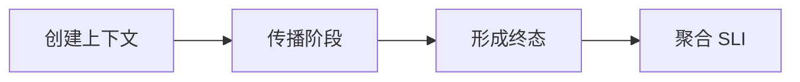

# OpenTelemetry、Prometheus、Grafana、Langfuse 与 AI SLO

Grafana 显示 API p95 低于目标，用户仍抱怨“经常等不到回答”。指标只统计了返回 HTTP 响应的请求，被代理超时和客户端取消的请求没有进入成功直方图；流式接口又把响应头时间当成完成时间。可观测性不是把更多数据送进平台，而是让终态和口径覆盖用户真实经历。


<InfraFigure src="/images/ai-infra/ai-observability-slo/hero.png" alt="一次 AI 请求在网关、检索、模型与 GPU 之间形成 Trace、Metric 和 Log 的插画"
  icon="observability" caption="Trace 解释单次路径，Metric 描述总体趋势，Log 保存离散事件，质量信号补足“答得对不对”。" />


## Trace、Metric、Log 与 SLO 为什么不能互相替代

先把术语放回系统位置。只记名字，遇到故障时仍然不知道应该去哪个进程或存储找证据。

| 概念 | 在这条链路中的含义 |
| --- | --- |
| Trace | 用 trace/span 表示单次请求跨组件的因果和时间，适合回答这一条慢在哪里。 |
| Metric | 对大量事件按低基数维度聚合的数值时间序列，适合趋势、告警和 SLO。 |
| Log | 带时间和上下文的离散事件，适合保留错误细节与状态转换；检索成本和敏感性更高。 |
| SLI/SLO | SLI 是用户相关的测量口径，SLO 是在时间窗口内期望达到的目标；GPU util 不是用户 SLI。 |
| Quality Signal | 引用覆盖、任务成功、人工反馈或评测结果，用来补足协议成功不等于回答正确。 |

::: tip 判断原则
定义一个组件时，同时说清它不负责什么。能回答输入从哪里来、状态存在哪里、输出交给谁，才算理解。
:::

## 一条流式请求怎样留下完整观测事实



箭头表示状态的先后依赖，不表示所有步骤都在同一进程或同一台机器完成。下面沿链路逐段展开。

### 1. 创建上下文：Gateway 持有当前状态

生成/接收 trace_id 与 request_id，记录租户匿名维度和逻辑模型。

可以从这些位置确认结果：root span、route、admission。若完全没有证据，先判断请求是否到达本阶段；若记录冲突，则对齐 request_id、实例和时间窗口。

### 传播阶段发生时，先看 Backend/RAG/Serving

通过标准上下文传播子 span，记录队列、检索、Prefill、Decode 事件。

这里不靠猜测，优先读取 span links、stage duration。

### 从 形成终态 留下的证据回到 Runtime

区分 succeeded、failed、cancelled、timeout 与 unknown，并记录 usage。

决定下一步前需要看到 finish_reason、error code、token counts。

### 4. Telemetry Backend 怎样完成聚合 SLI

从完整终态计算可用率、TTFT、完成率和质量窗口。

这一动作的可观察结果是 histogram、counter、evaluation result。处理动作应晚于取证，否则重启或重试可能覆盖最早的失败现场。

## 指标标签为什么不能放 Prompt 和 request_id

Prometheus 指标示例展示低基数标签。输入是完成事件；输出按逻辑模型、状态和阶段聚合。request_id 留在 Trace/Log exemplar，而不是标签。

```text
ai_requests_total{model="smart-chat",status="succeeded"} 18420
ai_requests_total{model="smart-chat",status="cancelled"} 231
ai_stage_duration_seconds_bucket{stage="queue",le="1"} 17002
ai_ttft_seconds_bucket{model="smart-chat",le="2"} 17620
# 不允许：prompt=..., request_id=..., document_text=...
```

request_id 几乎每次不同，会制造高基数时间序列；Prompt 和文档正文还会泄露敏感数据。正确做法是 Metric 保留有限维度，通过 exemplar 或 trace_id 在需要时跳到单请求证据。Langfuse 等 LLM 观测产品存储 Prompt 时也必须应用租户权限、脱敏和保留策略。

## 看起来相似，故障边界却不同

| 表面现象 | 实际可能发生的事 | 下一步证据 |
| --- | --- | --- |
| HTTP 可用率高 | 流开始后失败、取消和无终态可能未计入 | 以业务终态为分母 |
| 平均 TTFT 正常 | 长尾和不同输入长度被平均掩盖 | 看分位数并按请求形状分桶 |
| Trace 完整 | 采样可能遗漏低频严重错误或敏感内容越界 | 错误优先采样并执行隐私策略 |
| GPU 指标正常 | 请求仍可能在网关、队列或客户端侧失败 | 从用户 SLI 反向定位资源 |

::: warning 容易误判
一条成功命令只能证明它覆盖的那一层。重启后的短暂恢复也不是根因已经消失，改变状态前先保存最早证据。
:::


## 这套判断方法的边界

SLO 不是承诺所有请求都快，而是明确窗口、分母、排除项和错误预算。观测平台本身也要控制采样、存储成本和访问权限。本章示例数字仅为格式说明，不代表实测。

有了统一口径，下一篇才能设计可信压测，把到达率、并发、服务时间、队列和单位成本连接起来。
