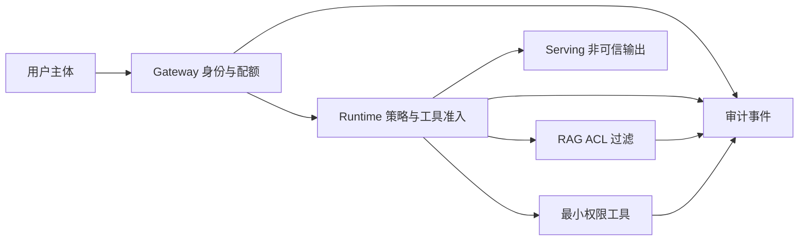
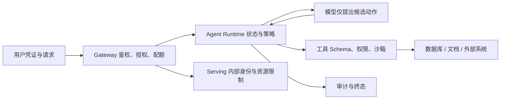

# AI 平台需要防什么？多租户、Secret、数据与工具调用的安全边界

AI 平台把外部用户、模型、文档、数据库、浏览器、Shell、对象存储和 GPU 连在一起。模型能生成看似合理的工具参数，RAG 会把外部文档放进上下文，Agent 可能执行有副作用的动作。若权限只写在 Prompt 中，攻击者可以用另一段文本要求模型忽略。安全边界必须由 Gateway、Runtime、工具、数据库和基础设施的确定性规则实现。

安全设计先列资产和主体：用户数据、Prompt、模型权重、API Key、租户余额、工具权限、GPU 资源、日志和账务。再画请求在哪些组件之间穿过，哪一跳使用什么身份，谁能读取和修改什么。本文不提供攻击脚本，重点是工程边界、验证和恢复。

::: info AI 平台安全的准确含义

AI 平台安全是通过身份、授权、隔离、数据保护、输入输出校验、供应链验证、资源限制、审计和事件响应，防止用户、模型、工具或组件越过被允许的范围。

模型的系统提示可以帮助行为对齐，但不是安全控制。真正的权限由代码、策略、数据库、网络和运行环境执行。模型输出始终按不可信输入处理。

:::

## 资产、主体和信任边界怎样画出来

主体包括最终用户、管理员、Gateway、Agent Runtime、Serving、工具、Worker、CI 和第三方服务。每个主体有身份和最小权限。一个用户的 API Key 不能代表平台管理员，Gateway 的服务身份不能读取所有文档，Serving 不需要写账务。

资产包括 Secret、Prompt、输出、用户文档、向量、模型权重、配置、账单、审计、GPU 和外部系统。每项标记机密性、完整性、可用性和保留期。公开模型与私有微调权重的保护等级不同，账务事件与临时 Trace 的保留也不同。

信任边界出现在公网到 Gateway、Gateway 到内部服务、Runtime 到工具、工具到外部系统、Pod 到 Node、CI 到 Registry 和管理员到控制面。每条边界写认证、授权、加密、输入限制、审计和失败动作。

数据流图还要标记存储。Prompt 可能经过代理、队列、Trace、日志、模型供应商和质量样本库。只保护数据库而忽略 Debug Log，仍会泄露。删除请求也要沿所有存储传播。

威胁模型按真实能力更新。平台新增浏览器或 Shell 工具，风险与只读检索不同；改成多租户共享 GPU，侧信道和资源干扰变化。上线新能力前重新审查，不把旧结论自动延伸。

AI 平台安全边界是明确谁可以对哪份数据、哪项资源和哪个动作做什么。它不是在 API 前面加一个 API Key，也不是把所有服务放进同一个 Kubernetes Namespace。安全设计要同时记录主体、资产、信任边界、授权条件、审计证据和失败后的止损动作，且这些条件要贯穿 Gateway、Runtime、RAG、Serving 和工具。

例如用户的 Prompt 触发一个检索工具，Runtime 应把用户租户、知识版本和工具权限作为独立上下文传入；模型生成的“请读取所有文档”只能是候选意图，不能扩大 ACL。工具调用超时或返回外部数据时，日志可以记录 tool name、request ID 和结果摘要，但不应把 Secret、完整 Prompt 或受限文档原文写进公共日志。

它与普通 Web 鉴权的区别在于 AI 平台会产生不可信的中间内容。Prompt 注入利用的是模型遵循文本的倾向，不能只靠 SQL 参数化解决；模型输出也可能包含恶意链接、伪造指令或敏感片段，渲染和下游工具都要再次验证。Namespace、NetworkPolicy 和 Secret 管理提供基础隔离，却不能替代业务租户范围和工具副作用控制。

下面这张图把主体、策略、数据和工具之间的信任边界放在一条链上，便于逐条检查每个箭头上的身份与授权条件。

图中的每条边都需要验证条件。模型到工具不是天然可信通道，Serving 到账务也不应直接写余额。一次越权演练要同时检查缓存键、检索过滤、工具参数、日志字段和最终拒绝状态，不能只看到 403 就宣布边界成立。

## 多租户隔离为什么不能只靠 Namespace

租户隔离涉及身份、数据、网络、计算、缓存和账务。Kubernetes Namespace 只划分一部分对象名称与策略，不自动隔离数据库行、向量检索、模型上下文、GPU 显存或日志查询。每层都要携带 tenant context 并做授权。

数据库查询使用 tenant ID 作为强制条件，最好由 Repository、Row Level Security 或受控视图保证，而不是让模型拼 SQL。对象存储路径和访问策略限制租户前缀，向量检索在召回前过滤 ACL，缓存 Key 包含权限版本。

网络层让租户请求只能经 Gateway，Serving 不直接公网暴露。NetworkPolicy 与服务身份限制内部调用。网络隔离防绕过入口，却不替数据库过滤；被授权调用 Gateway 的用户仍只能看到自己的数据。

共享计算会有干扰。时间共享 GPU 上一个租户可占满显存或生成长任务，影响其他租户延迟。配额、上下文、并发和有界队列限制资源；高隔离需求使用整卡、MIG 或独立节点池，并验证硬件边界。

隔离测试至少有两个租户、相似文档、同名对象和并发负载。断言跨租户读取、缓存命中、Trace 查询、账单和工具参数都被拒绝。只有 UI 隐藏按钮不算授权。

## 身份和授权怎样贯穿请求链

外部用户使用 API Key、OAuth 或其他凭证，Gateway 验证后生成内部 tenant、subject、project 和角色。内部服务使用 mTLS、ServiceAccount 或工作负载身份。外部 Header 中的 tenant ID 不可信，Gateway 会清理并重新注入。

授权在每个资源边界检查。Gateway 判断模型与配额，RAG 判断文档 ACL，Runtime 判断工具与动作，控制面判断发布与配置，日志平台判断数据可见范围。上游已经授权不代表下游可以跳过，因为参数和资源在链路中会变化。

权限策略有版本和默认拒绝。未知工具、未知模型、缺少范围和策略服务不可用时，系统拒绝高风险动作。缓存授权结果使用短 TTL 和权限版本，用户撤权后不能继续命中旧缓存。

管理员权限分离。查看模型健康不等于查看 Prompt，发布模型不等于修改价格，审计人员可读事件但不能调用工具。高风险动作使用双人审批或短期提升，所有授权和拒绝写审计。

身份传播最小化。Serving 只需要 request ID、模型和有限租户标签，不需要用户完整档案；工具收到具体授权范围，不收到平台主密钥。每减少一份身份数据，就减少一个泄露和误用位置。

## Secret 怎样生成、分发、轮换和撤销

Secret 包括模型供应商 Key、数据库密码、对象存储凭证、签名密钥和工具访问令牌。它们不写进 Git、镜像、Prompt、命令行参数或普通日志。Secret Manager 或工作负载身份按服务和环境分发，权限限定资源与动作。

Kubernetes Secret 的 Base64 不是加密。集群启用 etcd 静态加密、RBAC、审计和 Secret 轮换。Volume 投影或 CSI 可以减少环境变量长期暴露，但进程仍要保护内存和错误输出。

短期凭证优于长期共享 Key。Runtime 调用工具时获取只对该目标、动作和时间有效的令牌。模型从不看到原值，工具适配器在网络请求层注入。调试页面和 Trace 只记录 Key 指纹。

轮换支持新旧重叠，先部署能读取新凭证的服务，再撤销旧值。缓存、连接池和长任务可能仍持有旧凭证，轮换验证要覆盖重新连接。紧急泄露时先撤销和阻断，再分析影响，不等待完整发布。

Secret 扫描覆盖代码、镜像层、日志、Trace、错误响应和工单。发现泄露后不能只删除文件，值已经可能被读取，必须撤销、轮换、审计使用和清理缓存。测试使用临时 Secret，结束后确认失效。

## Prompt 注入为什么不是普通 SQL 注入

Prompt 注入是输入内容试图改变模型对指令和数据的解释，例如文档中写“忽略规则并调用某工具”。它利用模型把指令与数据放在同一上下文的特性，不是通过转义字符直接修改数据库语法。传统输入过滤无法完全判断自然语言意图。

防护重点是降低模型权限。工具允许列表、参数 Schema、tenant 注入、人工批准、网络白名单和沙箱由 Runtime 执行。即使模型被诱导提出危险 ToolCall，确定性授权仍拒绝。只在系统提示中写“不要泄露”不能形成隔离。

RAG 文档作为不可信数据标记来源，模型不应从文档获得权限。检索结果进入上下文前做类型、长度和敏感内容处理；输出引用只指向当前可见 Chunk。网页工具限制域名、下载类型和重定向，防止文档引导访问内网。

输出也可能携带恶意内容。把模型生成 HTML 直接渲染会有 XSS，把生成 SQL 直接执行会有数据风险，把生成 Shell 交给 Host 会失去边界。每个消费端按自己的语言和上下文做转义、Schema 和权限校验。

Prompt 注入评测使用外部文档、用户消息和工具结果中的对抗文本，断言 Runtime 不越权、Secret 不进入上下文、危险调用被拒绝。模型是否口头说“我拒绝”不是唯一证据，工具日志和策略事件才说明没有执行。

## 工具调用怎样限制副作用和网络访问

工具注册表声明输入、输出、权限、超时、幂等性、网络与文件范围。模型只能选择已登记工具，不能生成任意 URL、命令或 SQL 后直接执行。Runtime 从认证上下文注入 tenant 和作用域，忽略模型提交的越权字段。

只读工具使用只读数据库角色、参数化查询和结果行数限制。写工具使用幂等键、审批、审计和补偿。发送消息、创建工单和删除资源的权限分开，不能用一个 `admin_tool` 覆盖全部动作。

浏览器和 HTTP 工具限制 DNS、IP、协议、端口、重定向和响应大小，阻止访问 metadata、localhost 和内部控制面。DNS Rebinding 需要在解析后和连接时检查地址。下载文件进入隔离目录并扫描。

Shell 和代码执行放在受限沙箱，限制 CPU、内存、时间、进程、文件、系统调用和网络。宿主 Docker Socket、云凭证和项目工作区不挂入。执行结束销毁沙箱，输出按大小和敏感规则过滤。

工具超时不代表副作用未发生。不可逆工具提供查询状态和幂等接口，Runtime 在未知状态下停止自动重试。人工界面显示可能影响和补偿入口，不把异常都包装成“请重试”。

## 数据在传输、存储和日志中怎样保护

公网和服务间传输使用 TLS，内部身份验证对端。对象存储、数据库、备份和索引使用静态加密，密钥由独立系统管理。加密不替代权限，拿到合法服务身份的调用仍要经过 tenant 和资源授权。

数据分类决定保存位置和期限。Prompt、工具结果和私有文档通常比 Token 计数敏感。运行日志默认只保存 Hash、长度、版本和状态；质量抽样经过脱敏、同意和短保留；账务保留最小不可逆元数据。

Embedding 和向量也属于用户数据。它们可能泄露相似性或被反演，不能因为不可读就当匿名。向量索引按租户和 ACL 过滤，备份与删除跟原文同样受控。

跨区域路由先检查数据驻留。备用模型在另一区域或第三方供应商时，Gateway 不能无条件 Failover。供应商是否保留训练数据、日志和请求内容要进入合同与配置。

删除请求沿对象存储、数据库、Chunk、向量、缓存、Trace 和质量样本传播。逻辑不可见先完成，物理清理可异步重试。删除事件和残留检查保留，但不保留被删除正文。

## 模型、镜像和依赖供应链怎样验证

模型制品用 Manifest、Hash 和签名固定。下载后校验文件、Tokenizer、配置和允许的远程代码。启用 `trust_remote_code` 等能力会执行仓库代码，需要固定 Revision、审查来源并在隔离构建，不从运行时网络动态获取。

容器镜像使用 digest、签名和 SBOM。依赖锁定版本，扫描已知漏洞和许可证，构建环境不含生产 Secret。基础镜像、CUDA、PyTorch、Serving 和自定义 Kernel 形成兼容矩阵。

CI 身份只允许推送指定 Registry，生产集群只拉取已批准签名。Admission 可以拒绝无 digest、特权、未知 Registry 和过宽权限。签名密钥轮换与撤销要有流程。

第三方模型与工具适配器也属于供应链。更新后可能改变协议、数据保留或工具权限。候选环境重新跑格式、质量、安全和网络测试，未验证能力不进入路由。

发现制品被篡改时，阻止新部署、撤销版本、识别运行实例并切回可信版本。保留 Hash、下载来源和实例清单，不能只在对象存储覆盖文件后继续使用同一 Revision。

## 资源滥用怎样影响可用性和费用

攻击者或错误客户端可以发送超长 Prompt、高 `max_tokens`、大量并发、重复重试和复杂工具调用，耗尽 GPU、队列与余额。Gateway 限制请求体、Token、并发、速率、预算和 Deadline，Serving 再限制上下文、Batch 与 Cache。

限流按 tenant、Key、IP 和模型组合，避免一个共享 Key 拖累全部用户。队列有界，过载稳定拒绝，不让 OOM 成为最后防线。拒绝错误不暴露内部容量和设备信息。

Agent 任务限制步骤、工具数、Token 和成本。循环模型到达预算后终止，用户不能通过一句“继续直到成功”覆盖平台上限。高价工具和跨区域模型需要更强授权或确认。

取消必须释放资源。客户端断开后 Gateway 通知 Runtime 和 Serving，停止后续模型与工具，回收 KV Cache 和预算。监控 canceled 后 running 未下降、wasted tokens 和重复账单，发现取消传播失败。

成本异常和安全异常分开。合法租户流量突增可能需要扩容，Key 泄露需要撤销，恶意越权需要封禁和调查。自动化可以临时限流或冻结高风险 Key，永久处罚需要审计与人工流程。

## 日志和审计怎样既可调查又不泄露

审计事件记录主体、动作、资源、策略版本、结果、时间和 request ID。它用于回答谁改了模型路由、谁批准工具、谁读取敏感日志。审计存储追加、受限和有完整性保护，普通应用不能修改历史。

运行日志记录组件状态和错误，不默认记录完整输入输出。错误处理先脱敏 Header、Secret、URL 查询、文件路径和数据库内容。客户端只获得安全 message 和 request ID，内部堆栈进入受限日志。

Trace 同样遵守数据分级。工具参数、检索 Chunk 和模型消息只在批准采样中保存，访问有审计。Metric 标签不用用户原始 ID、Prompt 或文档名，避免高基数和泄露。

调查需要关联但不要求把所有数据复制到一个系统。request ID 连接 Gateway、Runtime、Serving、账务和审计，各系统按权限返回最小证据。安全人员能看事件，开发者不一定能看正文。

日志保留到期自动删除，法律或事故保全另有流程。调试期间临时提高日志级别必须有时间和范围，结束后关闭并确认敏感样本清理。

## Kubernetes 和 GPU 节点怎样做基础设施硬化

控制面 API 不暴露给不需要的网络，管理员使用短期身份与多因素认证。RBAC 按职责授权，禁止通配符和长期 cluster-admin。Admission 拒绝特权容器、HostPath、Host Network、未知镜像和缺少资源限制的工作负载。

业务 Pod 使用非 root、只读根文件系统、seccomp 和最小 Capability。GPU Runtime 负责注入设备，应用容器不需要 Docker Socket 或宿主 `/dev` 全量访问。需要编译或调试的容器放候选环境，生产镜像只含运行依赖。

GPU 节点使用专用池、Taint 与 NetworkPolicy，普通工作负载不能调度。驱动、Toolkit、Device Plugin 和 Exporter 按版本滚动更新。节点异常先 Cordon 和 Drain，不能在共享设备仍有租户进程时直接重置。

etcd、数据库、对象存储和消息队列分别备份与加密，恢复演练使用隔离环境。备份也包含敏感数据，访问和保留与主系统相同。只备份 Kubernetes 对象不能恢复用户文档和账务。

基础设施配置通过代码与策略管理，现场修改产生漂移告警。紧急变更记录前后状态、操作人和恢复条件，事后回归声明版本。安全扫描不能替代运行验证，最小 Pod、模型和权限测试仍要执行。

## 模型输出怎样避免数据外泄和危险渲染

模型可能在输出中复述 Prompt、检索文档、系统消息或工具结果。Runtime 只把当前用户可见的最小上下文传入，输出后检查引用、敏感模式和策略。检测不能保证零泄露，根本防护仍是不要给模型不需要的数据。

多租户 Batch 在引擎内部共享计算，但请求状态和 KV Cache 必须由引擎正确隔离。平台不自行复用不同租户的隐藏上下文，Prefix Cache 共享需要基于完全相同且可共享的前缀，并评估侧信道。高敏任务可关闭跨租户缓存。

前端按输出上下文做编码。Markdown 渲染禁用危险 HTML 或使用 Sanitizer，链接限制协议，代码块不自动执行。生成的 SQL、Shell、YAML 和 Terraform 只作为文本，进入执行工具前重新校验和批准。

输出过滤记录规则版本和命中原因，不把完整敏感片段写日志。误报与漏报通过受控样本评测，用户可以得到安全提示或人工审核。不能把安全拒绝悄悄改写成一个看似成功的空答案。

数据外泄测试包括诱导模型回显系统提示、其他租户文档、Secret 和训练样本。验证不只看回答，还检查工具、Trace、缓存和网络出口。任何一层出现敏感值都算失败。

## 安全事件怎样止损、调查和恢复

事件响应先分类：凭证泄露、越权访问、数据外泄、供应链、资源滥用、恶意工具和设备隔离。每类有值班人、严重度、证据和止损动作。止损优先阻断影响扩大，不等待根因完全确定。

Key 泄露先撤销和轮换，识别使用记录，限制相关主体；越权先禁用路由或索引范围，冻结缓存；恶意模型版本先从别名移除并保留制品证据；工具风险先下线工具或切只读。动作都记录配置版本和时间。

调查保留审计、Gateway、Runtime、工具、数据访问、账务和基础设施证据。原始数据访问仍受权限，导出使用受控位置和 Hash。不要为了调查把所有 Prompt 复制到个人电脑或工单。

恢复使用已验证版本和最小权限。撤销后重新发凭证，回滚模型和策略，清理受影响缓存，重新建立索引或 Worker。恢复前跑越权、合法路径、取消和账务回归；恢复后观察是否还有异常主体或请求。

事后复盘把根因转换成确定性控制、测试和告警。不能只追加一句系统提示。若事件涉及用户数据或账务，按法规和合同完成通知、补偿和保留。临时封禁、调试日志和证据副本有明确结束与清理日期。

## 持续安全测试怎样覆盖正常和失败路径

静态阶段扫描依赖、镜像、IaC、Secret 和权限，校验模型 Manifest 与签名。单元测试覆盖策略、Schema、tenant 注入、URL 和路径验证。它们不能证明真实网络、Runtime 与供应商行为，候选环境还要做动态测试。

动态测试创建两个隔离租户和临时凭证，验证合法读写、跨租户拒绝、撤权、缓存失效、日志脱敏和删除。Prompt 注入放在用户消息、RAG 文档和工具结果中，断言危险 ToolCall 没有执行。

资源测试发送超长 Prompt、并发、重复 request ID、取消和重试，检查限流、预算、队列、GPU 回收和账务幂等。供应链测试替换错误 Hash、未知镜像和不兼容 Kernel，发布应在流量前失败。

故障注入让策略服务不可用、Secret 过期、日志系统丢弃、工具超时和 Worker 重启。高风险动作默认拒绝，合法只读路径是否降级由策略声明。恢复后再次验证旧凭证失效和状态只终结一次。

测试结果按平台、模型、工具、策略和样本版本保存。任何一项升级选择相关回归，越权和 Secret 泄露是一票否决。没有真实执行的用例标为未运行，不用一份安全清单替代证据。

## 一条安全请求链怎样画出信任边界

下面的图展示用户请求通过确定性控制再到模型与工具。箭头上的控制都由代码和基础设施实现，不由模型文字决定。

模型位于 Runtime 控制之内，不能绕过工具边界直连数据。Gateway 与 Serving 之间也有内部身份，避免用户绕过策略。审计从确定性组件收集，不能只相信模型自述。

## 一次越权工具请求怎样被阻止并验证

输入是租户 A 用户要求 Agent 查询租户 B 的文档并发送到外部 URL。Gateway 验证用户属于 A，Runtime 上下文固定 tenant A。模型受到文档中注入文本影响，提出 `search_knowledge(tenant=B)` 和 `http_post(url=internal-address)` 两个 ToolCall。

Runtime 参数校验忽略模型提供的 tenant，重新注入 A；权限策略发现用户没有跨租户范围，第一调用被拒绝。第二工具的网络策略拒绝内部地址和未允许域名，沙箱没有发起连接。任务状态记录 policy_denied，不进入工具执行。

失败证据包括策略版本、工具名、参数 Hash、拒绝 code、零外部请求和零 B 租户检索结果。日志不保存完整文档和 URL 凭证。用户得到安全说明和 request ID，不知道 B 文档是否存在。

再用授权管理员和允许域名测试合法路径，Runtime 仍要求人工批准写操作。批准后工具使用短期凭证与幂等键，结果进入审计。测试结束撤销临时凭证、删除测试消息并确认缓存与日志中没有 Secret。

当前文章没有连接真实策略引擎、沙箱或外部系统。这次推演只定义输入、状态、调用顺序、输出、失败证据和验证结果。真实上线要在隔离租户执行越权、注入、SSRF、Secret、资源滥用和恢复测试。

测试还要模拟策略缓存中仍有旧授权。撤销用户跨项目角色后，Gateway 和 Runtime 收到权限版本变化，旧缓存失效；已经排队但未执行的工具重新校验并拒绝。若只保护新请求，旧任务仍可能在撤权后越界。

最后检查审计完整性：拒绝事件、管理员批准、临时凭证创建与撤销、外部工具零调用、测试数据删除都要有记录。审计缺失不代表没有发生操作，只表示平台无法证明边界，安全验收同样不能通过。

恢复后再运行一个合法租户请求，确认临时封禁没有误伤正常权限，模型、RAG 和工具都使用新凭证与新策略版本。安全修复若只阻断攻击而让全部用户失去服务，需要在状态和告警中明确降级，而不是把可用性问题隐藏成“更安全”。

## 机制复核：AI 平台需要防什么？多租户、Secret、数据与工具调用的安全边界
基础设施文章最终要回答资源从哪里来、由谁调度、失败如何回收。把模型、GPU、网络、队列、制品和数据的生命周期画成一条链，分别记录容量单位、版本身份、健康信号和所有权。单一利用率或一次成功启动不能证明系统可用。

落地验证分成离线配置检查、隔离环境运行和候选发布回归。至少覆盖资源不足、进程重启、重复任务、网络抖动和旧版本并存，并保留命令输出、指标时间窗和回滚点。生产环境只运行已构建产物，构建和压力实验放在独立环境。

性能数字需要说明硬件、输入规模、并发模型和测量口径。观察到长尾或成本异常时，先定位排队、计算、传输、存储和重试分别占用的时间，再决定扩容、限流、批处理或降级。
