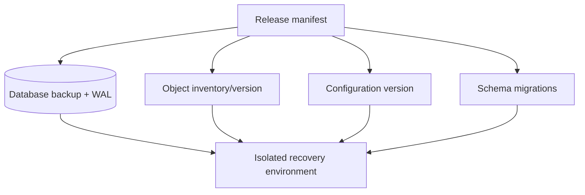

# 备份、数据库迁移与恢复演练

备份成功日志只证明某个命令退出为零，不证明数据能恢复；迁移脚本有 `down` 也不证明业务语义可逆；应用镜像回滚更不能撤销已经删除或错误转换的数据。真正的恢复能力由 RPO、RTO、完整依赖清单和定期隔离演练共同证明。

## RPO 与 RTO 先于工具选择

- **RPO**（Recovery Point Objective）：最多允许丢失多长时间的数据；
- **RTO**（Recovery Time Objective）：事故后允许多久恢复服务。

每日逻辑备份意味着理论 RPO 最高接近一天；若要求分钟级，需要 WAL/binlog/PITR。恢复 2TB 数据与恢复 5GB 完全不同，RTO 必须通过实测。不同数据有不同目标：主数据库、对象、配置、Secret 引用、搜索索引和遥测无需一刀切。

| 数据 | 事实/投影 | 恢复策略 |
| --- | --- | --- |
| PostgreSQL 业务表 | 事实 | 全量 + WAL/PITR + 校验 |
| 对象原件 | 事实 | 版本/复制/清单 |
| Redis 缓存 | 可重建 | 通常清空并受控预热 |
| 向量/搜索索引 | 可重建投影 | 固定 Release 重新构建 |
| 配置与部署 Manifest | 运行事实 | 版本化、加密、审计 |
| 日志/Trace | 诊断 | 按合规和事故窗口保留 |

## 备份范围是依赖图

只备份数据库可能无法恢复：对象存储中的源文件、加密密钥、迁移代码、数据库扩展/版本、用户上传、配置版本和 Release 指针共同决定系统状态。建立数据资产清单、owner、保留期、加密和恢复顺序。



Secret 管理通常备份密钥元数据/恢复程序，不把明文 Secret 打进普通备份。加密备份的密钥必须独立保管并演练取用；密钥与密文同时丢失等于无备份。

## PostgreSQL 备份类型与一致性

逻辑备份（`pg_dump`）可移植、适合对象级恢复和中小库，但大库恢复慢；物理 base backup + WAL 支持 PITR，依赖版本/集群布局；存储快照快，但需数据库一致性与跨卷协调，不能随意复制运行中数据目录。

备份任务记录数据库版本、开始/结束 LSN/时间、大小、对象清单、工具版本、校验摘要和加密信息。完成后验证可读、校验值、预期表/对象数量，并定期真实恢复。

```bash
pg_dump --format=custom --no-owner --file=/backup/example.dump "$DATABASE_URL"
pg_restore --list /backup/example.dump > /tmp/example-restore-list.txt
sha256sum /backup/example.dump
```

命令是说明形式；URL/凭证用安全输入，不写日志。`pg_dump` 对单数据库提供一致快照，但外部对象存储同时变化时仍需应用版本/清单协调。备份不要长期存生产机同一磁盘；使用独立故障域、不可变/版本化存储和访问控制。

## 备份安全与保留

备份通常包含最完整敏感数据，权限应比生产只读更严格。静态/传输加密、短期上传凭证、访问审计、删除保护和勒索防护（不可变窗口/离线副本）。遵循类似 3-2-1 原则，但依据威胁模型调整。

保留分代：频繁短期 PITR、每日、每周/月归档。删除按策略自动化并保留审计；用户删除/合规要求与灾备保留可能冲突，需要明确法律与技术政策，不能无限保存“以防万一”。

备份任务也有限资源：限速 I/O、监控复制/WAL积压、磁盘水位和备份窗口。失败告警必须可行动，连续失败会使实际 RPO 不断扩大。

## 迁移分类与风险

| 迁移 | 常见风险 | 策略 |
| --- | --- | --- |
| 新表/可空列 | 低但有元数据锁 | Expand，验证旧代码 |
| 新索引 | CPU/I/O、锁 | Concurrent/在线方案、监控 |
| 加 NOT NULL/约束 | 全表扫描、旧写失败 | 先校验数据、NOT VALID/分步 |
| 类型转换 | 重写表、语义丢失 | 新列双写/回填/切换 |
| 大回填 | WAL、锁、复制延迟 | 小批、游标、限速、可暂停 |
| 删除列/表 | 回滚失效、数据丢失 | 观察期后 Contract |

迁移文件不可修改已发布历史；新增修复迁移。每个迁移有唯一 ID、幂等/一次性语义、预计耗时、锁级别、空间需求、兼容矩阵和验证查询。启动时应用自动跑所有迁移可能导致多个副本竞争和不可控锁，生产使用单独受控迁移 Job。

## Expand-Migrate-Contract

示例：把 `display_name` 拆为结构化名称。

1. Expand：新增 `given_name/family_name` 可空，代码能读旧或新；
2. 双写：新写同时维护旧/新字段；
3. Migrate：按主键游标批量回填，记录最后位置；
4. Verify：数量、空值、摘要、抽样和业务查询；
5. Switch：新代码只读新字段，仍保持旧写一段观察；
6. Contract：确认无旧实例/查询后删除旧字段。

```sql
UPDATE user_profiles
SET given_name = :given_name,
    family_name = :family_name
WHERE id > :last_id
  AND id <= :batch_end
  AND given_name IS NULL;
```

实际拆分姓名可能语义不可逆，此例说明流程而非推荐数据模型。不可可靠拆分的值保留原字段或人工策略，不能用脚本猜测后删除原数据。

## 回填是可恢复任务

大回填使用稳定主键/时间游标，不用 OFFSET 随数据变化；每批独立事务、幂等更新、限制行数与睡眠，监控锁、WAL、复制延迟和在线 P99。任务可暂停/恢复，状态记录迁移版本、游标、处理/跳过/失败数。

在线写与回填竞争时使用条件更新，避免旧回填覆盖用户新值。必要时双写或按 `updated_at/version` 检查。回填完成不只比较 count，还验证业务不变量、分布、抽样和旧新读结果一致。

## 迁移前的演练证据

在接近生产 Schema 与数据规模的隔离副本运行：

- 迁移总时长与最长锁；
- 表/索引和 WAL/磁盘增长；
- 旧版、新版应用同时读写；
- 取消/失败后能否继续；
- 回滚/前滚计划是否可执行；
- 备份恢复后的迁移重放；
- 复制节点/CDC 消费是否兼容。

小 Fixture 上 50ms 的 `ALTER` 不能外推大表。使用生产统计的匿名/合成近似数据，禁止把真实敏感备份复制到不受控开发机。

## 恢复不是“启动数据库就完成”

恢复 Runbook：

```text
declare incident and freeze writes
-> choose recovery point from business evidence
-> provision isolated compatible infrastructure
-> verify backup checksums and decrypt
-> restore base data + replay logs to target
-> restore/verify objects and configuration
-> run schema and business invariants
-> rebuild derived indexes/caches
-> candidate application smoke
-> controlled traffic restoration
-> reconcile external side effects
```

选择 PITR 时间不能只看系统时钟，要结合错误事件、事务/发布记录确定最后安全点。恢复先在隔离网络，防止旧任务、Webhook、邮件和 Scheduler对外产生副作用。应用以安全模式验证，完成后再切流。

## 数据一致性验证

恢复成功的证据包括：

- Schema/扩展/迁移版本匹配；
- 关键表行数与约束、孤儿引用、唯一当前版本；
- 数据库对象引用在对象存储存在，摘要一致；
- 任务非终态与租约可恢复，Outbox 未重复产生危险副作用；
- 权限关系与租户范围正确；
- 搜索/向量/缓存从固定 Release 重建；
- 最小读写、认证、异步和引用流程通过。

只比较总行数不够，错误转换可能保持数量。为关键数据建立域级不变量和分桶摘要。检查脚本只读或连接隔离恢复库，不能误操作生产。

## 外部副作用和对账

PITR 会让数据库回到过去，但外部通知、支付、对象写入、第三方 API 可能已经发生。恢复后不能自动重放所有 Outbox。根据稳定 idempotency key 与外部账本对账：哪些已发生、哪些需要补发、哪些要补偿。

这也是应用事件保存 eventId、attempt 和外部 reference 的原因。无法查询的外部系统要保守隔离并人工确认，不以“数据库里没有记录”断言副作用没发生。

## 灾备演练和指标

定期在空环境从备份恢复，不使用现成 Volume。计时分解：发现、决策、获取备份、恢复、日志重放、校验、重建投影、切流。实际 RTO 取完整业务恢复，不是 `postgres ready` 时间。

| 指标 | 说明 |
| --- | --- |
| last successful verified backup age | 实际 RPO 风险 |
| restore test success/age | 备份是否最近被证明 |
| backup size/duration | 容量和异常变化 |
| WAL archive lag/failure | PITR 连续性 |
| migration duration/lock wait | 发布风险 |
| backfill rate/error/lag | 迁移进度 |
| measured RTO/RPO | 是否达到目标 |

演练结束删除隔离数据、临时密钥和恢复实例，保留脱敏报告、缺口和 Runbook 修订。不能让恢复副本长期在线成为另一个未维护敏感环境。

## 验证矩阵

| 场景 | 通过条件 |
| --- | --- |
| 备份文件截断/摘要错 | 恢复前立即拒绝 |
| 加密密钥不可用 | 预案能在权限审计下恢复取用 |
| 从上一生产 Schema 升级 | 迁移和新旧代码兼容 |
| 回填中断 | 从稳定游标继续且不覆盖新写 |
| 回填重复运行 | 结果相同、计数可解释 |
| PITR 到指定事件前 | 安全点可由业务证据验证 |
| Redis/向量索引全丢 | 从数据库/Release 可重建 |
| 恢复环境误启动 Scheduler | 安全模式门禁阻止外部副作用 |
| 应用回滚 | contract 尚未执行，旧版能运行 |
| 恢复演练清理 | 临时数据和密钥残留为零 |

```sql
-- 示例不变量：每个资源最多一个已发布当前版本
SELECT tenant_id, resource_id, count(*)
FROM releases
WHERE state = 'published' AND is_current = true
GROUP BY tenant_id, resource_id
HAVING count(*) <> 1;
```

期望返回零行。真实系统为每个关键领域维护类似只读校验，并在备份恢复、迁移和发布后复用。

## 常见误区

- 备份命令成功就认为可恢复，从未做空环境演练。
- 备份只在生产同一主机/磁盘，故障域相同。
- 备份加密密钥与密文一起丢失，或权限过宽。
- 应用启动自动跑大迁移，多个副本竞争锁。
- 大表一次事务回填，无法暂停并造成 WAL/锁压力。
- 旧新字段语义不一致，却按 count 宣称回填正确。
- Contract 与 Expand 同次发布，使旧代码立即失效。
- 认为代码回滚会恢复已经删除/转换的数据。
- PITR 后盲目重放 Outbox，重复外部副作用。
- 恢复只验证数据库启动，不验证对象、权限、任务和业务。

## 参考资料

- [PostgreSQL Backup and Restore](https://www.postgresql.org/docs/current/backup.html)：SQL dump、文件级备份和连续归档的能力边界。
- [PostgreSQL Continuous Archiving and PITR](https://www.postgresql.org/docs/current/continuous-archiving.html)：WAL 归档、Base Backup 与时间点恢复。
- [Google SRE: Data Integrity](https://sre.google/sre-book/data-integrity/)：备份之外的数据完整性、验证与恢复演练。
- [OWASP Cryptographic Storage Cheat Sheet](https://cheatsheetseries.owasp.org/cheatsheets/Cryptographic_Storage_Cheat_Sheet.html)：备份加密、密钥与保留边界。
- [Expand and Contract Pattern](https://www.tim-wellhausen.de/papers/ExpandAndContract/ExpandAndContract.html)：滚动发布下的兼容 Schema 演进。
