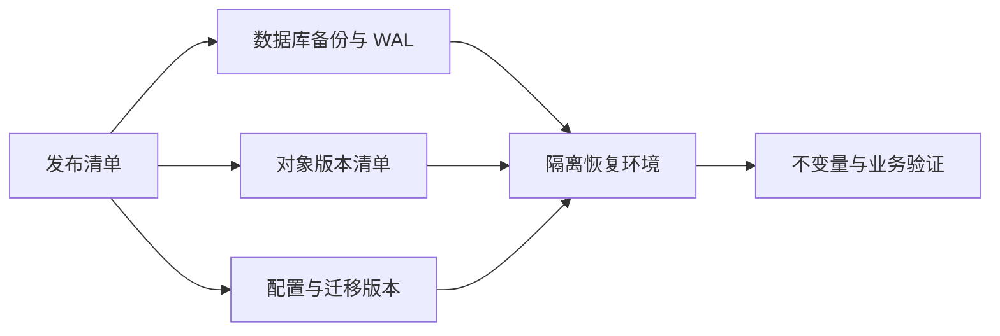

# 备份、数据库迁移与恢复演练

`pg_dump` 命令成功，只能说明产生了一个文件。文件可能损坏、缺少扩展，解密密钥可能拿不到，恢复后对象存储也可能对不上。备份只有在空环境完成恢复并通过业务校验后，才被证明可用。

本篇先定义允许丢多少数据、多久恢复，再完成备份、校验、隔离恢复和最小查询。随后加入一项兼容迁移，并让回填中断后从游标继续。

## RPO 和 RTO 是什么

RPO（恢复点目标）表示最多允许丢失多长时间的数据；RTO（恢复时间目标）表示事故后多久恢复业务。每日备份的理论 RPO 可能接近一天，分钟级目标通常还需要 WAL/PITR。RTO 必须用接近真实规模的恢复演练测量。

不同数据的策略不同：PostgreSQL 与对象原件是事实，Redis 与搜索索引通常可重建，配置与部署 Manifest 决定系统怎样运行，日志和 Trace 用于诊断。备份范围因此是一张依赖图，不只是数据库文件。



## 步骤一：生成可验证备份

逻辑备份适合对象级恢复和中小数据库；物理 Base Backup 加 WAL 支持 PITR；存储快照需要确认数据库与跨卷一致性。备份记录数据库版本、时间、LSN、大小、对象清单、工具版本和摘要。

备份加密且存放在独立故障域，密钥与密文分开保管。权限、访问审计、不可变保留和删除策略应比普通生产只读更严格。备份任务失败会持续扩大实际 RPO，需要可行动告警。

## 步骤二：在空环境恢复

恢复流程是：选择恢复点，创建兼容基础设施，校验并解密，恢复数据与日志，恢复对象和配置，验证 Schema 与领域不变量，重建可派生索引，最后用候选应用冒烟。隔离环境禁止 Scheduler、Webhook 和邮件等外部副作用。

只看数据库进程 ready 不够。检查关键约束、租户权限、对象摘要、任务租约、Outbox、唯一当前 Release 和最小读写。总行数相同也可能隐藏错误转换，关键领域需要只读不变量查询。

## 步骤三：用 Expand-Migrate-Contract 改 Schema

先 Expand：新增可空字段或表，让旧代码继续工作；再部署能双读/双写的新代码；大数据回填作为独立可暂停任务；校验通过并观察旧实例退出后，后续发布才执行 Contract 删除。

大回填使用稳定主键游标，不用随数据变化的 OFFSET。每批独立事务，条件更新避免覆盖用户新写，记录迁移版本、游标、成功和失败数。中断后从已提交游标继续，重复运行得到相同结果。

```text
Expand -> 新旧应用兼容 -> 小批回填 -> 不变量校验
       -> 新代码只读新字段 -> 回滚窗口结束 -> Contract
```

增加索引、收紧非空和类型转换的锁与空间成本不同。上线前在接近真实规模的隔离数据上测最长锁、WAL、磁盘增长和取消恢复，不能用小 Fixture 的毫秒结果外推大表。

## 步骤四：处理时间点恢复后的外部世界

PITR 会把数据库恢复到过去，但已经发送的邮件、支付、对象写入和第三方调用不会自动倒退。恢复后不能盲目重放所有 Outbox。使用稳定幂等键与外部 reference 对账，区分已发生、需要补发和需要补偿。

这也是任务事件保存 eventId、attempt 和外部引用的原因。外部系统无法查询时，先隔离并人工确认，不能因为恢复后的数据库没有记录就认定副作用从未发生。

## 正常结果和失败结果

| 场景 | 预期 |
| --- | --- |
| 备份摘要错误 | 恢复前拒绝 |
| 空环境完整恢复 | Schema、对象与业务查询通过 |
| 回填中断 | 从稳定游标继续 |
| 回填重复运行 | 不覆盖新写，结果一致 |
| Redis/向量索引丢失 | 从事实库与固定 Release 重建 |
| 恢复环境启动 Scheduler | 安全模式门禁阻止 |
| 应用回滚 | Contract 尚未执行，旧版仍兼容 |
| PITR 后发现外部调用已发生 | 对账而非重复发送 |

演练计时包括发现、决策、获取备份、恢复、日志重放、校验、投影重建和切流，完整业务恢复时间才是实际 RTO。结束后删除隔离数据和临时密钥，只保留脱敏报告与 Runbook 修订。

## 参考资料

- [PostgreSQL Backup and Restore](https://www.postgresql.org/docs/current/backup.html)
- [PostgreSQL Continuous Archiving and PITR](https://www.postgresql.org/docs/current/continuous-archiving.html)
- [Google SRE: Data Integrity](https://sre.google/sre-book/data-integrity/)
- [OWASP Cryptographic Storage Cheat Sheet](https://cheatsheetseries.owasp.org/cheatsheets/Cryptographic_Storage_Cheat_Sheet.html)
