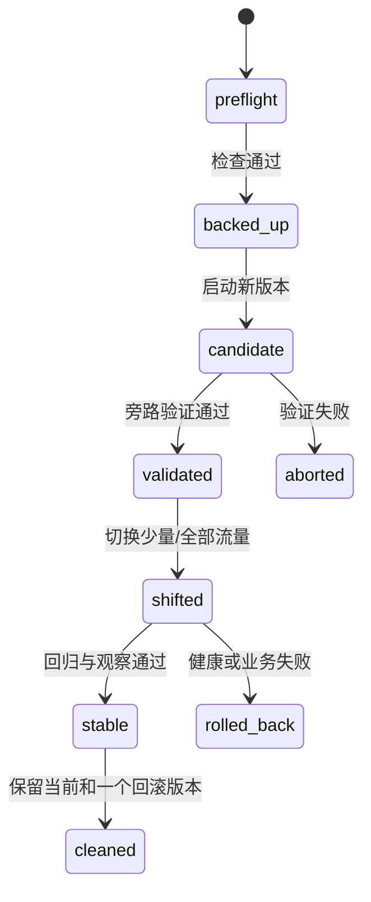

# 发布 AI Platform：先证明候选可用，再让它接真实流量

新镜像启动失败，旧容器已经删除；数据库迁移又写入了旧程序不认识的数据。此时“把镜像 tag 改回去”不再是完整回滚。低风险发布要在变更前建立旧版本、数据和入口三类回退点，并保持生产依赖运行。

应用回滚恢复执行代码，数据回退改变数据库内容，灾难恢复从备份重建服务。三者风险和触发条件不同，不能都叫 rollback。

## 发布状态机

每个转换都有进入条件、执行者、证据和补偿。发布 Runbook 在变更前写完，而不是事故发生后临时组织命令。

## 预检和回滚点

记录当前入口 upstream、运行实例、镜像 Digest、模型 Revision、配置、迁移版本、依赖健康、磁盘与容量。确认新旧版本契约可以短暂共存，并核对候选所需 GPU、端口、网络、Volume 和 Secret。

旧容器或 Deployment 在候选稳定前不删除。代理配置先备份，数据库备份记录时间、范围、校验和、加密与恢复说明。备份成功只证明文件产生，恢复演练才能证明可用。

## 数据库迁移

Expand 阶段添加兼容列、表或索引，新旧应用都能运行；回填使用有界批次、进度和幂等；应用切换后观察旧路径；Contract 只有在所有旧实例退役和数据核对后执行。

大型索引、表重写和锁要在隔离环境估算，设置超时与停止条件。迁移程序必须是版本化制品，使用单一执行锁。失败后优先保持兼容状态，不盲目执行可能丢数据的反向 SQL。

## 候选实例

候选使用正式镜像、模型、网络和只读或隔离测试身份，但不替换当前流量。若候选连接同一数据库与队列，必须关闭重复 Master 任务、定时器和全局消费，避免双实例同时修改状态。

先检查 Liveness/Readiness，再验证首页或模型列表、普通与流式请求、鉴权、权限、用量、取消、队列和观测。GPU/模型升级还要验证显存、输入边界、Eval 和冷启动。测试使用临时最小数据，结束后清理并对账。

## 切流

入口通过权重、Service Selector 或 upstream 把少量请求送到候选。切流前验证配置语法，应用热加载或声明式更新，避免重启整个代理和依赖。流量变化与 Release 标识进入 Trace。

观察错误、TTFT、TPOT、队列、用量、引用、资源和业务终态。不要只看 200。通过门槛后逐步扩大；任何硬失败触发预先定义的停止或回滚。

## 即时回滚

回滚优先只恢复入口到旧实例，保持数据库、Redis、对象存储和代理运行，也保留候选用于日志分析。回滚后立即验证公网、内部健康和关键业务路径。

若新版本已经写入旧版本不兼容的数据，应用回滚可能失败，这正是 Expand-Contract 的价值。真正需要数据恢复时，应停止相关写入、确认恢复点目标和数据损失窗口，再在隔离环境验证过程。

## 备份、恢复与灾难

PostgreSQL 备份要考虑全量、增量/WAL、事务一致性和目标时间；对象存储要考虑版本、生命周期和跨区域；配置与 Secret 需要独立备份与恢复权限；模型制品应可从受控 Registry 重建。

恢复演练在隔离环境创建新实例，校验 Schema、行数/约束、对象引用、应用启动和抽样业务。记录 RPO、RTO 和实际差距。没有演练的备份只是一项假设。

## 稳定后清理

观察期通过后，保留当前版本和一个已验证回滚版本。删除前列出容器、镜像、模型缓存、配置备份和文件引用，确认不涉及运行实例、唯一回滚、数据库、Redis、代理、Volume 或来源不明数据。

按明确名称和 Digest 精确清理，不执行范围不明的全局 prune。记录清理前后空间、保留版本和回滚位置。临时用户、Key、日志、知识与缓存也要按测试 ID 对账为零。

## Runbook 的验收

Runbook 必须回答：当前流量在哪，新旧版本是谁，候选怎样验证，数据怎样兼容，何时切流，哪些指标触发回滚，回滚改哪一处，备份在哪里，恢复是否演练，稳定后保留和删除什么。

安全发布的核心不是避免所有失败，而是让失败发生在旁路或小流量阶段，并能用一个已验证动作恢复服务，而不是在生产主链路上继续试错。
