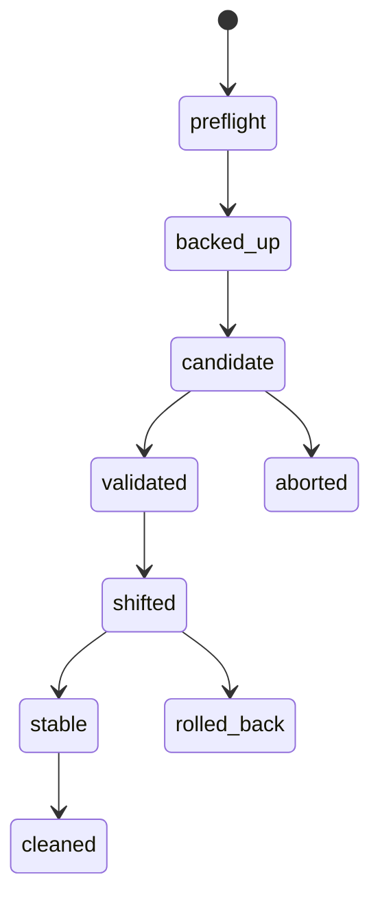

# 候选验证、迁移、切流、回滚、备份与恢复

新镜像启动失败，旧容器已经删掉；数据库迁移又写入了旧程序不认识的字段。此时把镜像 tag 改回去不够。低风险发布要同时准备代码、入口和数据的回退点，并让候选版本在不影响正式流量的情况下证明自己。

## 发布是一台状态机



preflight 检查依赖、迁移兼容和回滚点；candidate 旁路启动并验证；shifted 后观察业务和观测信号；失败时先恢复入口，再分析候选。每个状态都有进入条件、证据和停止条件，不能只靠“感觉稳定”。

## 应用回滚、数据回退和灾难恢复

| 动作 | 恢复什么 | 风险 |
| --- | --- | --- |
| 应用回滚 | 运行代码和镜像 | 新数据格式可能不兼容旧代码 |
| 数据回退 | 数据库内容到某时间点 | 丢失合法新写入，需审批 |
| 灾难恢复 | 从备份重建服务和依赖 | RPO/RTO、备份可读性 |

数据库迁移优先采用向后兼容的 expand/contract：先加可选字段和双写，再切换读路径，最后清理旧字段。这样应用回滚不必立即回退数据。

## 旁路验证看什么

候选容器使用独立端口或网络地址，先验证健康、协议、最小请求、权限、数据读写和关键指标。流式接口要验证取消和连接排空，RAG 要验证租户和 release，模型服务要验证制品、显存和 readiness。旁路容器不能承担正式 master 任务。

## 切流前后的最小证据

```text
before: public status=200, old upstream=healthy, backup=verified
candidate: contract=pass, migration=compatible, trace=visible
after: public status=200, errors within budget, old upstream retained
rollback: restore upstream -> reload -> public status=200
```

这是 Runbook 的证据格式，不是实际线上结果。切流前保留旧容器和入口配置，nginx -t 通过后再热加载；切流后立即检查公网、直连、数据看板和临时验证数据。下一篇把供应链、候选和平台链路串成一个综合设计。

## 备份只有恢复成功后才算能力

备份策略需要明确 RPO 和 RTO：最多允许丢多久的数据、多久恢复到可服务。定期在隔离环境恢复数据库、对象和必要的配置，校验数据量、校验和、关键查询和应用兼容性。只检查备份文件存在，无法证明它可读、权限仍有效或版本可兼容。

恢复演练不能对生产主依赖做破坏性操作。使用隔离网络、临时名称和只读/副本数据，记录每一步耗时和失败点。演练结果再反馈到 Runbook、容量和发布门禁，才能让“灾难恢复”从口号变成已知流程。

## 恢复后的验证比启动成功更严格

数据库恢复完成、容器启动和健康检查 200 只证明基本组件存在。还要验证关键查询、对象引用、权限、队列消费、模型制品和观测链是否与恢复点一致。否则服务看似上线，用户请求才会发现缺索引或错误版本。

恢复完成后记录实际 RPO/RTO、差异数据和后续补偿动作。不要静默把恢复窗口内的丢失写入当作“正常”，它需要业务、审计和用户影响的明确处置。
