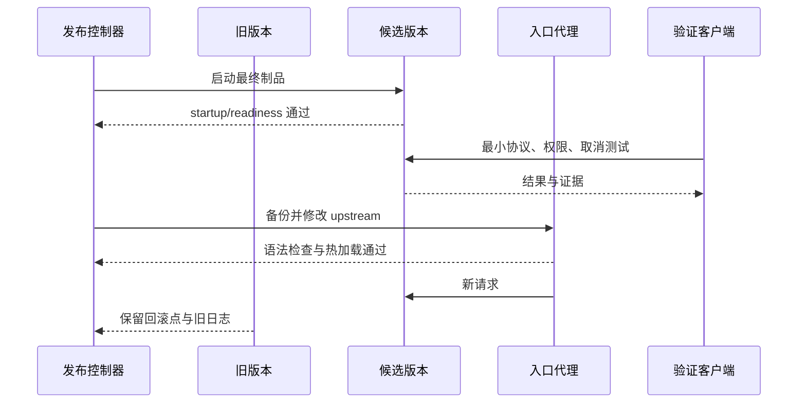

# 发布、迁移、回滚与恢复有什么区别？候选版本怎样安全上线

新版本通过了单元测试，切流后却出现两种现象：一部分请求进入新容器，另一部分仍读取旧字段；数据库迁移已经删除了旧代码需要的列，镜像虽然能切回，旧版本却无法启动。这个例子说明，发布不是“替换一个镜像”，而是同时改变应用、数据结构、路由和运行状态。

发布、迁移、回滚和恢复是四个不同动作。发布把候选制品接入流量，迁移改变数据结构或数据版本，回滚把应用请求恢复到旧候选，恢复则从备份和制品重建一个可以验证的系统。它们可以互相配合，但任何一个动作都不能自动完成其他三个动作。

本文用一个 API、PostgreSQL、Redis 和模型 Serving 组成的 AI 服务来推演。生产环境的命令、端口和备份路径需要由实际部署提供，文中的 YAML、Shell 和摘要均为解释性示例，没有连接真实服务器执行。

## 发布、迁移、回滚和恢复分别改变什么

发布改变的是新请求的路由和候选实例状态。它要求制品已经构建、签名、验证，候选实例可以启动并通过存活和就绪检查。发布成功不代表旧实例已经可以删除，观察窗口和回滚点仍然存在。

迁移改变的是数据库 schema、数据编码或索引。它可能是向前兼容的 expand，也可能是清理旧字段的 contract。迁移一旦提交，已有数据和旧程序都可能受到影响，不能把它当作随镜像一起可逆的文件替换。

回滚通常只改变应用流量指向，把新请求送回上一个已验证制品。它不自动撤销新代码已经写入的数据，也不一定停止已经排入队列的后台任务。若新旧代码无法读同一 schema，回滚可能仍然失败。

恢复是在数据或依赖丢失后，从隔离备份、对象制品和配置重建服务，并验证业务不变量。恢复关注 RPO、RTO、备份完整性和依赖顺序，不能用“备份文件存在”代替一次隔离恢复演练。

四个动作解决的风险不同。发布用于把已经验证的新能力交给用户，迁移让持久化数据满足新旧程序的读取要求，回滚缩短应用缺陷的影响时间，恢复则在数据库损坏、对象丢失或整个环境不可用时重建业务。它们的共同作用是让变化有停止点和退路，但执行顺序取决于本次变更，不能写成一个适用于所有系统的固定按钮。

可以用一次字段改名理解它们的区别。先增加新字段并让新旧代码都能读取，这是迁移；启动新实例并逐步接入请求，这是发布；新实例错误率升高后把流量切回旧实例，这是回滚；若误操作删除了整张表，则需要从备份和日志恢复。回滚只改变应用版本，恢复会重建数据，两者不能互相替代。

这些动作也有适用边界。无状态前端通常能快速回滚，写入数据库、消息队列和外部工具的 AI 服务则要检查副作用；小表迁移可以在维护窗口完成，超大表需要在线扩展和分批回填；有备份但从未验证依赖顺序的系统，仍不能声称满足恢复目标。设计 Runbook 时，应按真实状态和失败证据选择动作，而不是遇到问题统一写“回滚”。

| 动作 | 主要改变 | 典型停止条件 | 不能自动保证 |
| --- | --- | --- | --- |
| 发布 | 候选实例与流量路由 | 探针、契约或观测失败 | 数据结构兼容 |
| 迁移 | 表、索引、数据版本 | 锁等待、校验失败、旧代码不可读 | 应用可回滚 |
| 回滚 | 新请求的 upstream 或 selector | 旧实例不兼容、数据已改变 | 数据回到旧状态 |
| 恢复 | 依赖、数据和运行环境 | 备份损坏、RTO 超时、不变量失败 | 不再发生同类故障 |

表格里的“不能保证”是发布设计的重点。Runbook 要为每一列写一个可执行检查，不能用“必要时回滚”这种没有触发条件的句子。

## 候选实例怎样在正式流量外接受验证

候选实例使用最终镜像 digest、模型 revision 和目标配置启动，但不接收正式用户流量。它可以监听独立端口、加入同一内部网络，或者由 Kubernetes 创建独立 Deployment。旧实例继续运行，数据库、Redis、对象存储和代理也保持不变。

候选验证先检查静态身份，再检查进程状态、依赖连接、模型加载和协议。`/healthz` 通常只说明进程能回应，`/readyz` 应说明模型、配置和必要依赖已经准备好；真正的最小推理还要验证 Tokenizer、输出结构、流结束和取消。健康探针不能只测 200。

下面的 Deployment 片段是静态结构示例，镜像、模型卷、Secret 和资源值必须替换。它通过环境变量声明候选身份，避免把候选和正式版本混在同一个 label 中。

```yaml
apiVersion: apps/v1
kind: Deployment
metadata:
  name: ai-api-candidate
  labels:
    release: candidate-20260818-01
spec:
  replicas: 1
  selector:
    matchLabels:
      app: ai-api
      release: candidate-20260818-01
  template:
    metadata:
      labels:
        app: ai-api
        release: candidate-20260818-01
    spec:
      containers:
        - name: api
          image: registry.example/ai-api@sha256:IMAGE_DIGEST
          env:
            - name: MODEL_REVISION
              value: MODEL_COMMIT
            - name: NODE_ROLE
              value: candidate
          startupProbe:
            httpGet:
              path: /healthz/startup
              port: 8000
            failureThreshold: 60
            periodSeconds: 5
          readinessProbe:
            httpGet:
              path: /readyz
              port: 8000
            periodSeconds: 5
```

看这个配置时要区分三件事。`startupProbe` 给模型加载和运行时初始化时间，`readinessProbe` 决定是否进入 Service Endpoint，label 和 release 值让控制器可以精确观察候选。它没有声明迁移、备份或正式切流，这些动作要由发布流程显式编排。

## 数据迁移怎样让新旧版本共存

最容易回滚的迁移采用 expand、dual-read 或 dual-write、backfill、contract 的顺序。Expand 先增加新列或新表，不删除旧结构；新旧应用都能启动后，再逐步填充数据；读路径在短时间内兼容两种字段；验证新字段完整后，才删除旧路径。每一步都有 schema version 和停止条件。

例如要把 `answer` 字段改成带语言和引用的 JSONB，新版本可以先增加 `answer_v2`，写入时同时保存旧文本和新结构，读取优先使用 v2，缺失时回退旧列。后台 backfill 按主键分批执行，记录进度和错误。旧版本仍读 `answer`，所以切流失败时可以先回到旧代码。

双写会引入一致性窗口。数据库事务可以保证同库字段同时写入，但消息、对象存储和搜索索引仍需要 outbox、重试和对账。若 backfill 期间新请求只更新 v2，旧列保持同步，回滚后旧版本才不会看到空值。每个写路径都要有测试，不能只跑一次迁移命令。

Contract 阶段才删除旧列或收紧约束。删除前先确认旧 Deployment、旧 Worker、报表和一次性脚本都不再读取；保留至少一个观察窗口，记录 schema 使用情况。删除后应用回滚点可能仍存在，但它不再是可运行的回滚点，发布系统应把这个事实写入状态。

迁移失败的停止条件包括锁等待超过预算、行数校验不一致、复制延迟超限和旧版本 probe 失败。停止后先保留现场和迁移日志，不要重复执行带副作用的脚本。幂等迁移可以安全重试，非幂等脚本必须先确认已经提交了哪一部分。

## 备份怎样变成可恢复的证据

备份是把数据或配置复制到可独立读取的位置，恢复是用它重建服务并验证结果。PostgreSQL 逻辑备份、物理备份、WAL、Redis 快照、对象版本和 Kubernetes 配置各自覆盖不同状态，不能把其中一个文件称为“全量备份”。模型制品通常通过不可变对象和 Manifest 保留，不应依赖正在运行容器的可写层。

备份 Manifest 记录时间、数据库版本、对象版本、加密信息、大小、摘要和保留策略。创建成功后先读取并校验摘要，再在隔离数据库和临时 Bucket 中恢复。恢复环境使用与生产兼容的应用制品，跑 schema 检查、关键查询、权限检查和最小 AI 请求，结果才证明备份可用。

RPO 描述最多可以丢失多长时间的数据，RTO 描述从故障到服务恢复需要多长时间。只把文件上传到对象存储不代表达到目标，复制延迟、恢复下载时间、索引重建和模型加载都进入 RTO。恢复演练要记录每个阶段的开始和结束时间，发现超标就调整容量或目标。

恢复后的业务不变量比 HTTP 200 更重要。用户余额不能凭空增加，任务不能从 succeeded 退回 running，知识版本指针不能指向缺失对象，模型路由不能引用未验证 revision。应用日志、数据库查询、对象 HEAD 和端到端请求共同验证这些条件。

## 切流怎样避免把旧版本和新版本混成一条路径

切流前先确认当前 upstream、候选地址、旧容器名、数据库 schema version 和回滚配置已记录。代理或 Service 只修改负责路由的字段，避免同时重启数据库、Redis 或模型节点。热加载前运行配置语法检查，失败就不改变正式 upstream。

切流可以按权重、租户、内部 Header 或小比例实例进行，但每种方法都要明确观察窗口。流式请求在切换瞬间不会自动迁移到新实例，已经建立的连接由原实例完成或被取消；新请求才按新路由进入候选。usage、request ID 和 model revision 要让两条路径可以对账。

候选通过就绪后仍可能在真实流量下暴露连接池、队列和权限问题。先用临时身份和最小请求验证普通 JSON、SSE、错误码、取消、RAG 版本和账务事件，再扩大比例。不要用真实用户大请求来证明一个会扣费的路径。

下面的时序图显示一次低风险切流，旧版本在观察窗口内保持可回退状态。



图中的旧版本没有被删除，代理热加载也不是重启整套依赖。若候选健康检查或业务回归失败，控制器可以只把 upstream 改回旧版本，保留新容器供事后分析。

## 应用回滚为什么不等于数据回退

应用回滚是把流量指向旧制品，适合新代码错误、探针失败或性能恶化。数据回退是把数据库或对象恢复到过去的状态，通常会丢失之后已经确认的业务写入，只有在数据损坏且经过授权时才考虑。两者的风险和批准人不同。

如果新版本已经写入新字段、发送任务或生成模型结果，切回旧版本可能继续看到这些新状态。兼容迁移可以让旧代码安全读取，不能把所有副作用抹掉。对不可逆工具和外部支付，回滚需要补偿动作或人工审核，而不是重放旧请求。

恢复与回滚也不同。回滚通常分钟级恢复入口，依赖当前数据库和队列；恢复可能需要重建数据库、重新生成索引和重新下载模型，目标是数据和运行环境重新可用。Runbook 要写清何时从回滚升级到恢复，谁批准数据回退，如何通知用户。

## 后台任务和缓存怎样跟随发布边界

API 版本切换时，队列里的旧消息不会自动变成新 schema。新 Worker 应先读取 Envelope 版本，兼容旧字段或把不可处理的消息送入明确死信；旧 Worker 仍在运行时，生产者不能立即删除旧字段。队列消费状态、attempt 和幂等键要与 candidate_id 关联，回滚后才能知道哪些任务由候选产生。

Redis 的缓存也不会因应用回滚自动失效。新版本改变序列化格式、权限范围或模型 revision 时，缓存键应带 schema、tenant 和版本，或者先切换前缀再逐步清理。删除缓存可以止损，但不能把缓存当作唯一业务事实；Session、限流计数和账务状态的恢复策略各不相同。

模型 Serving 的预热和后台下载可能继续运行。候选停止接流量后，控制器要取消未完成的预热、释放 GPU 和清理临时文件，旧版本的模型缓存不能被误删。后台任务如果拥有 master 角色，还要确认回滚时不会启动两份订阅重置或凭证刷新任务。

## 数据库锁、索引和长迁移怎样控制风险

迁移前读取表大小、索引状态、活跃连接和复制延迟，估算锁持有时间。增加 nullable 列通常比重写整表安全，创建大索引可以使用并发方式，但会增加 I/O 和后台时间。每一步写开始、结束、影响行数和错误，达到预算就停止，不以“最终会完成”为理由无限等待。

回填按主键或时间窗口分批，批次之间提交事务并让在线请求继续运行。每批检查源字段与目标字段数量、摘要或业务校验，异常行进入隔离表。回填速度应低于数据库和复制的安全余量，队列和模型请求的容量也要同时观察。

索引或约束完成后，再用旧版本和候选版本各跑一组只读查询，比较计划、权限和结果。只看 migration 命令返回 0 不足以证明数据可以被应用使用。若索引构建失败，保留失败对象和锁信息，决定重试、降级或取消候选。

## 连接排空和流式请求怎样处理

切流之前可以把旧实例标记为 draining，停止接收新请求，但保留已经建立的普通请求和 SSE 连接。排空超时后，仍在运行的请求要按取消协议终止，记录 finish reason 和实际 usage。不能直接杀掉进程后把未完成流写成成功。

代理、Gateway 和 Serving 的超时应分层。入口连接超时、上游响应超时、模型 deadline 和工具 timeout 不同，排空窗口要大于正常清理时间。新请求进入候选后，旧版本的队列长度应下降到零或可解释的低位，旧容器才有资格停止。

连接排空也影响数据库和 Redis。旧实例归还连接、停止领取新任务，连接池关闭前完成事务或回滚未提交事务。发布观察期间，比较新旧实例的请求、错误、队列和资源指标，不能只看代理 upstream 已经修改。

## 蓝绿、金丝雀和滚动发布分别改变怎样的流量

蓝绿发布同时保留旧环境和新环境，切换点通常是代理、Service selector 或路由表。它的优势是回切路径直接，旧环境仍保持完整能力；代价是候选期需要两套容量，并且数据库、队列和对象存储往往仍然共享。若新版本写入旧版本不认识的数据，即使蓝环境还活着也未必能安全接回流量。

金丝雀发布把少量、可识别的请求送到候选，再根据错误、延迟、质量和成本扩大权重。流量选择应稳定，例如按租户、请求哈希或明确测试组，而不是让同一会话在两个版本间随机跳动。AI 输出有随机性，比较时要固定模型 revision、采样参数和请求分层，不能把回答文字不同直接判断为候选失败。

滚动发布逐批替换实例，适合应用和数据合同已经兼容的场景。它节省额外容量，但发布期间天然存在新旧实例共存，旧 Worker、SSE 连接和缓存都可能延长混合时间。若所有实例共享一个可变模型目录，滚动更新会失去版本隔离，所以镜像、模型和配置仍要使用不可变身份。

三种方式都只是流量组织方法，不自动提供迁移、回滚和恢复。选择时要看容量余量、会话粘性、数据兼容、模型加载时间和失败检测速度。GPU 模型启动需要几分钟且显存昂贵时，可以保留一个小候选池逐步扩容；涉及不可逆外部副作用时，应先用只读或影子请求验证，不能让金丝雀用户承担无法补偿的写入试验。

验证发布方式时，记录每个请求的 release ID、路由理由和实际实例。权重配置为百分之十，不代表恰好十分之一请求进入候选，低流量或长连接场景偏差会很大。观察窗口同时查看请求数、租户分布、长短上下文、错误与资源，确认比较的两组流量确实可比。

## 数据迁移的每一步怎样保持新旧程序可读

兼容迁移常采用 expand、migrate、contract 三段。expand 只增加新列、新表或新索引，不删除旧结构；migrate 让应用双读、双写或分批回填，把历史数据转换成新格式；contract 在所有旧实例、旧 Worker 和回滚窗口结束后，才移除旧字段和兼容代码。三段可以跨多个发布完成，不应强行塞进一次停机窗口。

双写要定义权威值和失败语义。若旧列写入成功、新列失败，事务可以整体回滚，也可以把记录放入补偿队列，但不能留下两边都自称成功的状态。双读期间先读新字段还是旧字段、值不一致时相信谁、何时统计差异，都要写进迁移版本。Redis 缓存键也要包含 schema 或 release 范围，避免旧序列化对象被新代码直接读取。

分批回填需要游标、批次大小、幂等条件和停止点。每批只处理尚未迁移的记录，提交后保存最后主键或时间范围，失败可以从明确位置继续。监控数据库锁、复制延迟、磁盘和查询延迟，任何指标越过阈值就暂停，而不是为了“今天完成”继续压垮在线请求。

索引创建也属于迁移。大表上阻塞式创建索引可能让写事务排队，在线创建虽然降低锁影响，仍会消耗 I/O、临时空间和复制带宽。候选版本在索引完成前不能假设查询计划已经改变，应用需要兼容较慢路径或由 Feature Flag 延后启用新查询。迁移命令返回成功后，还要查询索引状态和实际执行计划。

contract 是最容易过早执行的一步。需要确认旧应用副本为零、旧队列消息已消费、回滚期限结束、备份可读、审计和离线任务均已升级，再删除旧字段和兼容代码。删除完成后，回滚目标也要更新，不能继续把一个依赖旧 schema 的镜像列为可用回滚版本。

## 恢复演练怎样证明备份真的可用

备份是输入，恢复演练才产生“可以恢复”的证据。演练先创建隔离网络和空数据库，按 manifest 取得数据库备份、对象存储版本、模型制品、配置和 Secret 引用，再按依赖顺序恢复。生产系统保持运行，演练环境不能连接真实写入端点或消费正式队列。

恢复顺序取决于引用关系。数据库记录若引用对象 Key，先确保对象版本存在，再恢复数据库并运行一致性检查；模型 Serving 需要权重和 Tokenizer，二者校验通过后才能接受最小推理；队列恢复前要确认幂等键和消费者版本，避免把历史任务当成新任务重复执行。只恢复 PostgreSQL 而忽略对象和队列，得到的往往是能启动却不能完成业务的空壳。

RPO 表示最多能接受丢失多久的数据，RTO 表示从故障开始到服务恢复需要多久。每天一次全量备份并不能自动给出一天 RPO，持续归档、对象版本和队列状态也要计算；恢复命令用十分钟完成，也不代表 RTO 是十分钟，发现故障、准备环境、校验和切流都要计时。

演练输出包含备份时间、恢复开始和结束、schema 版本、对象缺失数、模型摘要、业务不变量和失败步骤。业务不变量可以是租户数、账务总额、文档引用可达、模型最小请求、权限隔离和队列无重复。结果只写“数据库启动成功”，无法证明用户数据、引用和 AI 请求链已经恢复。

恢复也有边界。外部供应商状态、已经发送的邮件或工具副作用通常不在本地备份中，需要对账和补偿；加密备份必须保证密钥有独立保管和轮换记录；跨区域恢复要验证 DNS、证书、Secret 和数据驻留要求。演练发现任何依赖只能从某个管理员电脑取得，都应把它补进正式制品或受控 Secret 系统。

## 发布窗口怎样设置停止、继续和回切条件

发布前把条件写成可以观察的事实。继续扩流需要候选实例 Ready、最小业务请求通过、数据库锁和复制延迟在阈值内、错误率与 TTFT 没有显著退化、回滚实例仍然健康。停止条件则包括摘要不一致、权限越界、迁移校验失败、OOM、队列无法排空和账务对账不平。

触发停止后先冻结变化。控制器不再增加候选权重，操作者保存路由、日志、数据库活动、Pod 事件和版本 manifest，再判断回切应用、暂停迁移还是进入恢复。事故期间同时修改镜像、配置和 schema，会让证据失去对应关系。每次新尝试都产生新的 attempt ID，不能覆盖上一轮失败记录。

回切条件要比“新版本有问题”更具体。若缺陷只影响一个可关闭的功能，可以关闭 Feature Flag 并继续观察；若新版本写入不兼容数据，应停止相关入口和 Worker，确认旧代码能否读取后再回切；若数据已经损坏，则应用回滚不足，需要从备份恢复或执行经过验证的修复迁移。

继续发布同样需要依据。一次健康请求不能覆盖长上下文、SSE、工具调用和高并发路径，观察窗口要按真实风险选取样本。完成切流后仍保留旧实例和备份到约定期限，确认后台任务、账务、缓存和监控都稳定，再执行 contract 迁移与旧制品清理。

## 一次候选失败怎样完整推演

输入是 API 镜像 digest、模型 revision 42、expand 迁移脚本和旧版本 revision 41。控制器先创建 backup manifest，验证数据库备份和对象版本，再把迁移以兼容模式执行。候选实例加载模型，`/readyz` 通过后，验证客户端用临时租户发送一条非流式和一条 SSE 请求。

状态顺序是 `preflight_passed`、`backup_verified`、`migration_expanded`、`candidate_ready`。切流后，新请求带上 `model_revision=42` 进入候选，旧实例继续处理既有连接。Gateway 和账务记录 request ID、attempt、usage 和 schema version，观察窗口同时检查错误率、TTFT、队列、数据库锁和知识引用。

现在候选在长上下文请求上出现 OOM，readiness 仍然通过，但请求返回 503。最早证据是候选 Pod 的显存峰值和 Serving 日志，旧版本没有同样错误。控制器停止继续加权，把新请求的 upstream 改回 revision 41，保留候选日志和 manifest，不执行数据库回退，因为 expand 结构仍被旧版本兼容读取。

验证结果要包含公网或内部入口的状态、旧版本回归、数据库迁移版本、临时数据清理和候选资源是否释放。若发现 revision 42 已经把某些任务写入新格式，先确认旧 Worker 是否能读取，再决定补偿或暂停队列。一个成功的 curl 只能证明单次入口响应，不能证明回滚和数据边界。

## Runbook 的停止条件和适用边界

Runbook 不是一串命令，而是每一步带输入、所有者、证据和停止条件的执行合同。它要写当前 upstream、旧候选、镜像和模型摘要、备份路径、schema 版本、验证请求、回滚动作和联系人。命令可以自动化，判断条件不能隐含在操作者记忆中。

本文没有在真实集群执行迁移、切流或恢复，YAML、Mermaid 和命令只是静态和解释性验证。实际发布前应在隔离环境完成一次旧新版本共存、迁移失败、切流回退和备份恢复；如果恢复时间、对象引用或业务不变量未通过，不能把“有备份”写成“可恢复”。

当系统仍是单机应用时，可以先保留不可变制品、兼容迁移和可读备份，不必立即引入多集群。随着 GPU Serving、队列和多租户出现，再增加候选容量、独立故障域和自动回滚。演进的判断依据是实际风险和证据，而不是组件数量。
