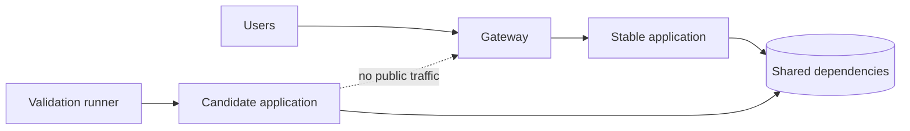
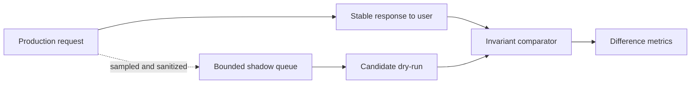
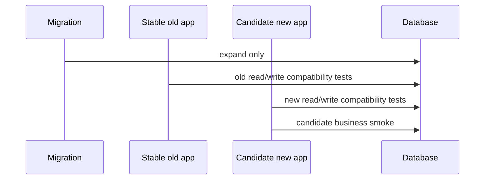
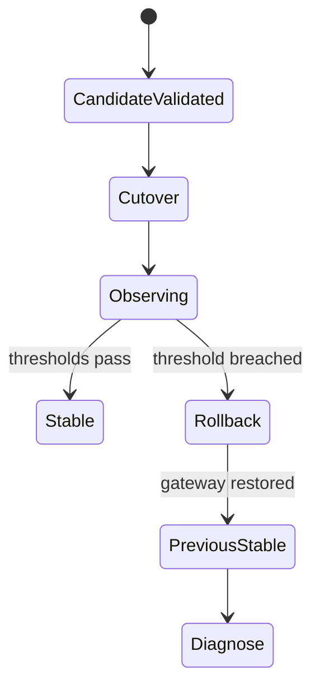

# 候选验证、流量切换与回滚

安全发布的核心顺序是：新版本先证明自己，旧版本保持可用，切流只改变最小必要状态。直接停止旧服务、覆盖镜像再启动，把“新版本不能运行”升级成用户停机；候选与稳定实例并行，则能在不动主链路时发现配置、迁移、依赖和运行时问题。

候选验证不是另一套长期预发环境。它使用本次要发布的精确制品，在尽可能同构的生产网络和依赖边界中短期运行，完成门禁后才获得流量资格。

## 发布前必须知道当前事实

任何修改前记录：

- 当前入口与 upstream 指向；
- 正在运行的容器/实例名、镜像 Digest、配置版本；
- 数据库 Schema/迁移版本与兼容窗口；
- 当前唯一 Scheduler、消费者与后台角色；
- 最近健康、错误率、延迟、队列积压与数据新鲜度；
- 一个已经验证可用的旧制品与回滚配置；
- 备份/恢复证据（数据变化时）。

如果连线上运行什么都无法回答，就不应开始替换。使用只读命令建立发布快照，敏感值只记录是否一致和摘要，不输出完整环境变量。

## 候选必须同构，但不能重复生产副作用

候选使用同一 Artifact Digest、运行时配置 Schema、网络和依赖版本。差异只限于：独立实例身份、内部访问地址、不会冲突的日志/临时目录，以及禁用生产唯一副作用的安全角色。



候选 API 为只接旁路探测的实例；Scheduler、订阅重置、定时批处理、消息主消费者等不能与稳定版同时运行。可选择 slave/validation 模式、独立测试队列或完全禁用。不能靠“测试时间很短，应该不会撞”规避重复任务。

共享生产数据库能发现真实 Schema/连接问题，但写测试必须使用隔离临时主体/资源、最小权限和可精确清理的前缀。无法安全隔离的破坏性流程只在数据副本或专用环境验证。

## 候选启动是可撤销动作

候选使用独立名称/端口/Service，不替换当前稳定实例。启动前验证资源余量，尤其滚动期间连接池总量、内存和文件描述符。低资源主机上同时构建镜像和运行候选可能拖垮稳定服务，因此制品在 CI/构建机生成，生产只拉取/加载运行。

候选启动失败时收集容器状态、健康和有限日志，然后只删除明确属于本次发布的候选；不停止稳定服务、不清理共享 Volume/网络、不执行全局 prune。

启动检查分为 process running、container health 和 application readiness。它们都通过才进入业务探测。

## 配置等价性和漂移审计

同一镜像配上不同配置就是不同系统。候选不能直接复制稳定容器的全部环境变量，因为其中可能包含短期凭证、实例身份和只允许主角色启用的开关；也不能手写一套“差不多”的配置。正确做法是从版本化配置 Schema 和受控 Secret 引用生成两份配置，比较允许差异集合。

```ts
type ConfigurationDiff = Readonly<{
  key: string
  stableDigest: string | null
  candidateDigest: string | null
  classification: 'expected-instance-difference' | 'secret-reference' | 'blocking-drift'
}>

const allowedCandidateDifferences = new Set([
  'INSTANCE_NAME',
  'LISTEN_ADDRESS',
  'LOG_DIRECTORY',
  'RUNTIME_ROLE'
])
```

Secret 不输出值，只比较引用版本、是否存在和受控摘要。模型、数据库、对象存储、功能开关、消息协议、时区、连接池和信任代理配置出现未批准差异时阻断。候选的 `RUNTIME_ROLE=validation` 是预期差异，但切流前要明确正式接流实例应使用什么角色；不能把禁用后台职责的验证容器不经评估直接变成长期主实例。

运行时还会有代码外漂移：挂载文件、证书、DNS、网络别名、CPU 架构、内核限制和代理配置。发布探针记录这些事实的非敏感摘要。配置漂移检测不是把所有环境变得一模一样，而是让每项差异有理由、有 owner、可复现。

## 金丝雀的分群和统计边界

权重 5% 不等于随机且代表性的 5%。负载均衡可能按连接、Cookie、IP 或地域粘滞；长连接会使实际请求/用户比例偏离权重。先定义实验单位（请求、会话、用户/租户），再选择稳定分桶，保证同一业务事务不跨版本乱跳。

```ts
function rolloutBucket(stableSubjectId: string, rolloutId: string): number {
  const digest = sha256(`${rolloutId}:${stableSubjectId}`)
  return Number.parseInt(digest.slice(0, 8), 16) % 10_000
}

function inCandidate(subjectId: string, rolloutId: string, basisPoints: number): boolean {
  return rolloutBucket(subjectId, rolloutId) < basisPoints
}
```

分桶标识不应暴露个人信息，选择服务端稳定内部 ID 并在日志中只记录 bucket/variant。管理员、内部测试和高价值路径可先进入显式 cohort；但最终仍需覆盖真实流量分布。

低流量系统短时间 5% 可能没有足够样本。门禁同时使用绝对安全不变量（越权、数据损坏、关键流程失败立即停止）、相对指标（候选与稳定对照）和最小样本/观察时间。不能在只有三个请求时因为“错误率 0%”宣布稳定，也不能用统计显著性拖延明显安全事故。

候选和稳定的指标必须标记 artifact/config/variant。比较同一时间窗口、相似路由和流量组成，排除全局依赖故障。金丝雀推进是状态机：1% -> 5% -> 25% -> 50% -> 100%，每级有最小观察、门禁和人工/自动策略；比例只是示例，实际由风险与流量确定。

## 影子流量只用于可证明无副作用的路径

将生产请求复制给候选可以提前验证兼容和性能，但影子请求不能写真实数据、发送通知、消费额度或调用有副作用的第三方。仅用于只读请求，或候选通过严格 dry-run/隔离存储执行。认证凭证和正文也不能未经评估复制到另一个日志/环境。

影子响应不返回用户，用脱敏摘要比较状态码、Schema、排序/结果不变量和延迟。动态时间、随机 ID、模型输出不能逐字相等，比较稳定属性。候选超时不能拖慢主请求；复制在异步、有界通道中，积压时丢影子流量并记录，而不是反压生产。



任何写路径要做“dry-run”的话，dry-run 必须由领域服务保证不提交副作用，不能只在代理加一个 Header 后期待所有下游遵守。无法证明时不使用影子流量。

## 缓存、会话和协议共存

新旧版本共享 Redis/缓存时，缓存值带 Schema 与资源版本。新版本写入旧版本无法解析的值，会让回滚立即失败；发布前验证 old reader -> new value 与 new reader -> old value，或使用新命名空间并双读迁移。

Session/JWT、Cookie、CSRF、签名密钥在观察期兼容。更换 Cookie 名、算法或 issuer 时先让新旧验证端接受过渡集合，再切换签发，最后过期旧格式。不能上线新签发后切回一个无法验证新会话的旧版本。

事件、任务和 gRPC/HTTP 契约同样遵循 reader-before-writer。候选发送新消息前确认稳定 Worker 能处理；否则候选只跑读/验证或使用隔离队列。数据库兼容只是共存的一部分。

## 并发发布锁和中断恢复

同一环境不能有两个发布同时修改 upstream、配置和迁移。发布锁有 owner、Release ID、租约与阶段；新发布发现旧锁时停止并展示当前状态，不能强行覆盖。锁超时不代表安全释放，要核对代理和候选外部事实后由恢复流程接管。

```text
release record:
  releaseId, artifactDigest, previousReleaseId
  state, lockOwner, leaseExpiresAt
  candidateIdentity, currentUpstreamSnapshot
  migrationVersion, cleanupManifest
```

每一步幂等：重复启动候选先检查 Digest/配置是否一致；重复配置 reload 验证目标；重复回滚仍指向旧 upstream；重复清理只删除 Manifest 中对象。Runner 在 cutover 后失联时，恢复者从发布记录判断是继续观察还是切回，而不是从头执行。

切流临界区前更新状态并写旧 upstream 快照，切换后再原子记录新事实。若状态记录与代理不在同一事务，恢复时以代理只读事实 + 记录协调，遇到矛盾走安全回滚。不能把脚本最后一行日志当唯一状态。

## DNS/CDN 切换不是即时原子指针

通过 DNS 变更切流受到 TTL、递归缓存和客户端连接影响，无法像同一代理 upstream 那样快速一致回滚。发布前提前降低 TTL 仍不能保证所有缓存遵守；旧入口要在最大实际窗口继续服务。权威 DNS、CDN、TLS 证书和源站健康都纳入验证。

CDN 缓存可能让公网首页来自旧版、API 已到新版。响应加入受控版本头/HTML Manifest，探测带缓存绕过与普通用户缓存两种路径。静态发布先上传哈希资源，再切入口；回滚所需旧资源保留。Purging 是外部异步副作用，不能作为唯一一致性机制。

多地域切流按地域逐步，数据复制/会话/队列是否区域一致要单独验证。全球权重 1% 可能全部落在一个小地域，仍不代表其他区域配置正确。

## Feature Flag 与流量切换的组合风险

部署、接流和启用能力是三个动作。Feature Flag 可以让新代码先接流但保持旧行为，再对 cohort 开启；它也增加组合状态。候选验证至少覆盖 flag off、on 及关键依赖组合，配置版本进入发布证据。

紧急 kill switch 不依赖发布新镜像，但权限严格、变化审计、默认安全。Flag 读取故障时使用明确默认，不让随机网络错误在请求间改变行为。完成 rollout 后删除临时 flag 和双路径，避免回滚逻辑永久累积。

## 健康门禁不能只看 200

liveness 证明进程响应，readiness 证明关键配置/依赖允许接流量。候选还要核对版本端点返回预期 Release/Digest，防止探测误打到稳定实例。

基础门禁：

| 检查 | 证明 | 不能证明 |
| --- | --- | --- |
| 进程/容器 running | 入口进程存活 | 应用可服务 |
| `/health/live` | 事件循环/进程响应 | 业务依赖正确 |
| `/health/ready` | 关键启动条件通过 | 业务结果正确 |
| 版本/Digest | 测到目标候选 | 数据兼容 |
| 首页/API smoke | 协议和静态资源可用 | 异步/权限全路径 |
| 最小业务流程 | 关键链路可完成 | 所有流量分布 |

readiness 不执行昂贵全链路，也不因非关键依赖波动造成重启风暴。完整探测由外部 validation runner 执行并保存证据。

## 分层业务验证

1. **只读路径**：首页、静态资源、状态 API、公开查询；
2. **认证与权限**：无凭证、合法临时主体、跨租户/范围拒绝；
3. **最小写路径**：创建临时记录、幂等重复、读取结果、删除；
4. **异步路径**：任务排队、Worker 处理、唯一终态、事件重放；
5. **流式路径**：SSE/WebSocket 首事件、断线恢复、代理不缓冲；
6. **数据路径**：新旧 Schema 读写、索引/投影新鲜度；
7. **观测路径**：日志、指标、Trace 带候选版本且无敏感数据。

测试数据用明确模拟场景，不用真实用户或高成本请求。每项创建记录加入 release-scoped cleanup manifest；完成后删除并查询残留为零。清理失败是发布门禁，不应把临时数据留给线上。

## 旁路探测的地址和身份

候选不发布公网端口时，从同网络临时验证容器访问；或代理增加受保护的内部 Host/路径，严格限制来源。不要为了方便把数据库/候选 API 临时开放全网。

TLS、Host、转发头和路径重写在直接容器探测中不存在，因此还需要经过真实 Gateway 的受控候选路由验证。两类探测分别证明应用本身和代理集成。

验证脚本固定 timeout、重试分类和响应 Schema。连接拒绝可短暂重试；权限错误、版本不符、业务断言失败立即阻断，不能“多试几次直到绿”。

## 数据库变更先证明双向兼容

观察期保留旧应用意味着新 Schema 必须兼容旧代码。候选前执行 expand migration；同时运行旧版契约和新版契约。回填独立、限速、可暂停，切流前校验不变量。



删除列、收紧非空、改变枚举含义等 contract 操作放在后续独立版本，等旧实例和回滚窗口结束。无法兼容的迁移意味着快速应用回滚不成立，需要维护窗口、双写/适配或明确数据恢复方案，不能继续假装“切回旧容器即可”。

## 切流是最小原子变更

代理 upstream、负载均衡 selector/weight 或 Service 指针是切流控制面。切流前保存精确旧配置，执行语法/配置测试；只改变目标，不重启数据库、缓存、Broker 或整个 Compose。

```text
1. assert stable public health
2. assert candidate health + version + business evidence
3. save current upstream and config checksum
4. validate proposed proxy config
5. atomically switch/reload
6. verify config loaded and current target
7. run immediate public regression
```

蓝绿可一次切换，金丝雀分权重推进。权重金丝雀必须有足够样本、版本维度与自动停止阈值；有状态会话、缓存和数据库仍共享时，10% 流量不等于只有 10% 风险。

## 长连接和后台角色单独切换

HTTP 短请求切流后很快收敛；SSE/WebSocket 可能继续连旧实例。旧实例先 not-ready 停止新连接，保留在途连接排空，客户端收到重连/断开后携带事件游标连接新版本。不能立即删除旧实例导致所有增量丢失。

后台 Worker 按队列/角色逐组升级。消息 Schema 支持新旧消费者共存，任务参数版本化。唯一 Scheduler 最后以租约/明确停旧启新切换，不能候选阶段启动两个 master。Worker 更新后验证队列等待、终态、重试和租约，不只看进程健康。

## 切流后立即回归

验证三条视角：

- 公网域名：真实 TLS、CDN/代理、Cookie 和缓存；
- 代理直连：排除 DNS/CDN，同时带正确 Host；
- 候选内部：定位应用自身。

回归覆盖首页、状态 API、认证、一个关键读写、异步/流式以及版本标识。观测比较切流前后错误率、P95/P99、上游状态、连接池、CPU/内存、队列和数据新鲜度。不能只看到 `/health` 200 就宣布成功。

## 回滚触发提前定义

| 信号 | 示例动作 |
| --- | --- |
| 关键业务失败 | 立即停止扩大/切回 |
| 错误预算快速燃烧 | 自动停止，人工确认回滚 |
| P99/资源显著退化 | 降权或切回 |
| 数据不变量/越权 | 立即切回并停止写入调查 |
| 仅非关键功能异常 | Feature flag 关闭/降级 |
| 观测缺失 | 无法证明安全时暂停发布 |

阈值必须对应基线和用户影响，不能使用文中固定数字照搬。安全和数据一致性通常零容忍；性能有合理波动窗口。

## 回滚只做必要动作

应用回滚流程：将 upstream/selector 恢复旧目标，配置测试，热加载/原子更新，然后验证公网、直连、核心业务。数据库、Redis、Broker、Volume 不重启、不清理；候选保留用于诊断但不接主流量。



切回后先恢复用户服务，再分析候选日志，不在生产流量上连续热修。若新版本已经产生外部副作用或不兼容数据，镜像回滚不能撤销它；执行事先定义的补偿、前滚修复或数据恢复。

## 观察期与清理

观察期长度取决于流量周期、后台任务和数据新鲜度，不是固定十分钟。保留旧实例/镜像和代理备份作为回滚点；新版本通过一个完整风险窗口后，才清理候选、临时包和多余旧版。

清理前建立引用清单：运行容器 -> 镜像 Digest，Volume -> 数据服务，代理 -> upstream，发布包 -> Release。只删除明确不再使用且属于本次/历史发布的对象。最终保留当前版本和一个已验证回滚版本；不使用 `docker system prune -a --volumes` 这类无差别命令。

清理后再次验证服务和回滚资产，记录释放空间。日志/临时探针/测试数据按清单清理，不删除来源不明文件。

## 发布 Runbook 的状态和证据

每次发布记录：

| 内容 | 证据 |
| --- | --- |
| 当前 upstream | 代理配置/查询输出摘要 |
| 新旧实例与 Digest | inspect/编排状态 |
| 候选门禁 | 探测报告与版本 |
| 公网/直连回归 | 状态码、协议断言、时间 |
| 业务验证 | 临时数据前后与终态 |
| 数据清理 | 残留 count 为零 |
| 回滚点 | 旧实例、配置备份、Manifest |
| 观察阈值 | Dashboard/告警状态 |
| 清理结果 | 保留与删除清单 |

证据不保存 Secret 和真实业务正文。失败的发布同样保留原因和恢复证据，转化为自动回归。

## 验证发布机制本身

不能等真实事故才第一次测试回滚。隔离演练：

- 候选健康失败，确认 current upstream 不变；
- 代理配置语法错误，确认 reload 被阻止；
- 切流后注入 5xx/慢响应，确认阈值和恢复；
- Runner 在切流中断，恢复器能读取状态并切回；
- 旧新 Worker 同时消费，消息契约与幂等正确；
- 长连接切流，游标补发无缺口；
- 候选误启 Scheduler 的门禁能检测；
- 测试数据清理失败会阻断收尾；
- 旧应用在 expand 后 Schema 上仍运行。

```bash
nginx -t
curl --fail --silent --show-error --max-time 5 https://candidate.example.invalid/health/ready
curl --fail --silent --show-error --max-time 5 \
  -H 'Host: docs.example.invalid' https://gateway.example.invalid/health/ready
```

这些是中性示例，真实地址、主机和凭证由受控环境注入，不写入文章或脚本。

## 常见误区

- 停旧版后再验证新版，失败直接停机。
- 候选使用不同镜像/配置，验证结果无法代表生产。
- 候选启动唯一 Scheduler/消费者，产生重复副作用。
- 只测容器 running 或 `/health` 200，不核对版本和业务。
- 切流顺带重启数据库、Redis 或整套 Compose。
- 旧 Schema 不兼容，却仍宣称可以快速切回旧镜像。
- 发布后立即删除旧实例和旧哈希静态资源。
- 回滚时先删候选/清理，再恢复用户流量。
- 临时测试数据、凭证和探针没有精确清理。
- 全局 prune 代替引用清单，误删 Volume/回滚镜像。

## 源码与规范

- [Nginx Controlling](https://nginx.org/en/docs/control.html)：配置测试后的平滑 reload 和旧 Worker 排空。
- [Docker Healthcheck](https://docs.docker.com/reference/dockerfile/#healthcheck)：容器健康探针的语义和局限。
- [Kubernetes Deployments](https://kubernetes.io/docs/concepts/workloads/controllers/deployment/)：滚动更新、暂停、回滚和可用性条件。
- [Google SRE: Canarying Releases](https://sre.google/workbook/canarying-releases/)：候选分群、指标与自动停止。
- [PostgreSQL Explicit Locking](https://www.postgresql.org/docs/current/explicit-locking.html)：迁移、切流与并发发布涉及的锁边界。
