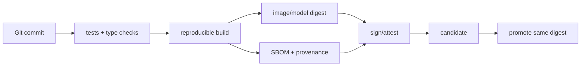

# CI/CD、SBOM、签名、Secret 与不可变制品

测试环境验证了镜像 A，生产却重新下载依赖构建出镜像 B。两者来自同一个 Commit，也可能因为基础镜像、系统包或模型文件变化而不同。不可变制品、SBOM 和签名让“运行的到底是什么”变成可以回答的问题。

## 从提交到运行实例



CI 把源码、锁文件、基础镜像和模型制品转成带摘要的产物；SBOM 说明依赖构成，provenance 说明构建来源，签名和证明让部署系统能验证。CD 的核心是提升同一 digest，而不是在每个环境重新 build。

## AI Release Manifest 应包含什么

| 字段 | 作用 |
| --- | --- |
| code commit / image digest | 代码和运行时身份 |
| model revision / tokenizer digest | 模型行为和输入映射 |
| prompt/policy version | Agent 与安全边界 |
| schema migration version | 数据兼容性 |
| evaluation/approval evidence | 发布门槛和责任人 |

Secret 不属于 manifest 内容，只记录引用名和注入方式。日志、SBOM 和制品标签都不能包含明文凭证。

## 签名解决身份，不解决质量

签名可以证明制品由某个身份发布且内容未被替换，不能证明模型回答质量、显存够用或迁移安全。部署前仍要执行合同测试、启动检查、权限和质量评测，并把结果关联到 digest。

## 环境提升的证据

```text
candidate: sha256:abc...
verified: contract=pass, security=pass, eval=record-17
production: same digest sha256:abc...
rollback: sha256:old...
```

这是预期记录格式，不是当前环境的实际结果。它应能回答候选和生产是否同一制品，以及旧版本在哪里。下一篇把这个制品放进候选验证、迁移、切流和回滚状态机。

## 验证门禁要覆盖模型与数据兼容

代码单测通过不代表 AI Release 可发布。候选环境还需要验证模型/Tokenizer 摘要、数据库迁移兼容、RAG release、工具策略、接口合同和代表性评测。门禁的输入和输出都与 digest 绑定，避免“上一次评测通过”被误用于新制品。

对第三方基础镜像和模型制品，SBOM 只能列出已知组成，不能替代漏洞响应。发现严重风险时要能定位哪些 Release 使用了该摘要、冻结新的提升并准备替代版本。供应链治理的结果应是可执行的影响范围，而非一份静态清单。

## 环境配置也应有可追溯版本

同一镜像在不同环境可能引用不同模型、数据库、限流和 Secret。Secret 值不入库，但配置结构、引用名、策略版本和变更审批应随 Release Manifest 记录。否则生产异常时无法判断是代码、模型还是环境漂移。

候选环境的验证结果只对相同 digest 和相同配置集有效。任何一项关键引用变化，都应重新运行相应合同检查或评测，而不是把“镜像没变”当成无需验证。
