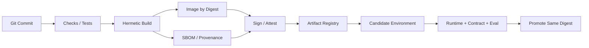

# AI Platform CI/CD：生产环境不应该重新解释同一次提交

测试环境验证的是镜像 A，生产服务器却重新拉依赖、重新构建得到镜像 B。两者来自同一 Git Commit，也可能因为锁文件、基础镜像、系统包或下载源变化而不同。发布若不能证明生产运行的是候选验证过的同一制品，回滚和审计都失去基础。

CI 负责把源码与锁定输入转为可验证制品，CD 负责把同一制品提升到环境并验证。模型、Tokenizer、Prompt/策略和数据库 Schema 也有版本，AI 平台需要把它们共同纳入 Release Manifest。

## 从提交到运行实例

流水线输入包括源码 Commit、依赖锁、基础镜像 Digest、构建脚本和目标平台。输出包括业务镜像、SBOM、来源证明、签名、测试报告与 Release Manifest。环境配置和 Secret 在部署时注入，不参与重新构建。

## 依赖锁定和可复现边界

语言依赖使用锁文件与校验，系统包固定版本或基础镜像 Digest，前端和 Python 不在生产节点临时安装。完全字节级可复现可能受工具链和时间戳影响，但至少要保证所有输入可追溯、构建环境受控、结果以 Digest 标识。

模型制品同样固定仓库 Revision、Tokenizer、模板、权重与校验和。若模型太大不放镜像，Release Manifest 仍要引用不可变对象版本，候选与生产加载同一份内容。

## 测试分层

快速门禁包括格式、类型、单元、依赖与 Secret 扫描；集成测试验证数据库、Redis、对象存储和队列契约；API 契约测试验证普通/流式与错误；模型与 RAG Eval 验证质量、安全和引用；候选运行验证健康、容量、取消和回滚。

测试失败阻止制品进入下一阶段，不在生产环境“先上线再看”。无法在 CI 获得 GPU 时，可以在独立候选环境执行硬件测试，但测试结果仍绑定同一 Digest 与模型 Revision。

## SBOM、签名与来源证明

SBOM 列出软件包、版本与关系，用于漏洞与许可证分析。它不是安全结论，也不会自动包含运行期外挂模型和配置，Release Manifest 要补充这些制品。

签名证明某个身份对 Digest 的认可，Provenance/Attestation 描述由哪个受控流程、输入和 Builder 产生。部署策略验证 Registry、Digest、签名者和证明，再允许工作负载进入环境。保护签名身份比在脚本中保存长期私钥更重要。

## Secret 不进入构建产物

构建只获得下载依赖所需的短期最小权限，使用构建工具的 Secret Mount，不能写入 Layer、环境变量输出或缓存。运行 Secret 由环境 Secret 管理系统注入，应用只读取需要的范围。

扫描源码和镜像能发现部分泄露，但不能替代设计。日志、测试快照、SBOM、Crash Dump 和 Source Map 都可能包含敏感数据，应定义保留与访问策略。

## 数据库迁移与兼容窗口

Schema 不是镜像内部状态。发布采用 Expand-Contract：先添加新旧应用都能接受的结构，发布应用并回填，再在确认没有旧版本后收缩。破坏性迁移不能与应用切流绑成一个不可逆步骤。

迁移制品与应用版本共同记录，执行有单一所有者、锁、超时和审计。失败时区分应用回滚与数据恢复，不能假设所有数据库变化都能自动 down migration。

## 环境提升

开发、测试、候选和生产引用同一业务 Digest，通过环境配置选择连接、规模和策略。提升动作更新 Release 指针，而不是重新构建。候选验证结果绑定 Digest、模型、配置和数据库版本。

生产切流前保留旧 Deployment/容器和代理配置，确认新旧契约兼容。发布失败优先把流量恢复到旧版本，再分析候选，不在线上热改镜像。

## Release Manifest

一份 Manifest 至少包含 Git Commit、镜像 Digest、SBOM/签名、模型与 Tokenizer Revision、Prompt/策略版本、数据库迁移、配置版本、Eval、容量结论、候选证据、批准人和回滚点。

可交付流水线的标准不是按钮数量，而是任意运行实例都能回答“它由什么输入构建、经过哪些门禁、为什么被允许运行、失败回到哪里”。
