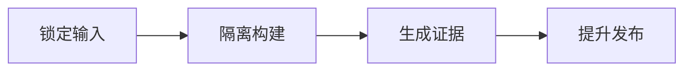

# CI/CD、SBOM、签名、Secret 与不可变制品

测试环境通过后，生产流水线重新执行构建，拉到了更新后的基础镜像；代码 commit 相同，最终 digest 却不同，回滚时也找不到测试过的那份制品。CI/CD 的核心不是自动运行命令，而是让源码、依赖、构建身份、模型和最终摘要形成可验证链。


## 发布记录至少要能回答四个问题

JSON 是制品清单示例，不包含真实仓库和签名。输入是代码、模型和镜像摘要；输出供发布策略验证。

```json
{
  "source_commit": "COMMIT_SHA",
  "image": "registry/ai-platform@sha256:IMAGE_DIGEST",
  "model_revision": "MODEL_COMMIT",
  "sbom": "sha256:SBOM_DIGEST",
  "provenance": "sha256:PROVENANCE_DIGEST",
  "candidate_id": "release_20260817_01"
}
```

记录要回答“什么源码、什么依赖、谁构建、部署什么字节”。SBOM 发现高危依赖后仍需结合可达性和修复策略；签名验证通过也不证明业务正确，所以候选还要运行契约、迁移和容量检查。模型制品应与应用镜像分别有摘要，再在 release manifest 中绑定。

## 不可变制品为什么是发布与回滚的共同起点

理解下面这些词时，要同时回答输入、状态和输出分别在哪里。它们不是可以互换的产品标签。

| 概念 | 在这条链路中的含义 |
| --- | --- |
| Artifact Digest | 由制品内容计算的不可变摘要；tag 可以移动，digest 用于确定具体字节。 |
| SBOM | 记录制品中软件包、版本和关系的清单，帮助漏洞响应；它不是签名，也不包含所有运行风险。 |
| Signature | 由受信身份对制品摘要等内容签名，验证来源与完整性；信任仍取决于密钥和策略。 |
| Provenance | 说明哪个源码、构建器、参数和流程产生制品的证明，SLSA 等规范提供结构。 |
| Environment Promotion | 同一 digest 从开发候选提升到生产批准，环境差异通过受控配置注入。 |

::: tip 判断原则
遇到新术语，先问它改变了哪份状态；如果没有状态所有者，这个名词暂时不能指导排障。
:::

## 一次提交怎样变成可验证候选



图里每个节点都要产生可观察结果；没有结果时，上一节点是否真正交付就是第一项检查。

### 锁定输入：Source/Build

固定 commit、依赖锁、基础镜像 digest 与模型 revision。

决定下一步前需要看到 source digest、lockfiles、input manifest。

### 隔离构建：CI Builder

在受控环境执行测试与构建，不把长期 Secret 写入层。

这一动作的可观察结果是 build identity、test result、artifact digest。处理动作应晚于取证，否则重启或重试可能覆盖最早的失败现场。

### 生成证据：Supply Chain Tools

产生 SBOM、漏洞报告、签名与 provenance 并关联 digest。

可以从这些位置确认结果：attestations、policy result。若完全没有证据，先判断请求是否到达本阶段；若记录冲突，则对齐 request_id、实例和时间窗口。

### 提升发布：Release Controller

验证签名和环境策略，把同一 digest 交给候选验证。

这里不靠猜测，优先读取 approval、deployment record、rollback digest。

## 构建通过不等于制品可发布

| 表面现象 | 实际可能发生的事 | 下一步证据 |
| --- | --- | --- |
| tag 相同 | registry 中 tag 可能已指向新 digest | 部署和回滚记录 digest |
| SBOM 无漏洞 | 扫描库、配置、业务逻辑和模型风险仍可能存在 | 结合测试和运行策略 |
| 签名有效 | 签名身份可能越权或构建输入不受控 | 验证 provenance 与准入策略 |
| 生产重新构建 | 得到未经候选环境验证的新字节 | 只提升已验证制品 |

::: warning 结论的边界
示例输出用于建立判断路径，不应被当成目标环境的真实结果。版本、硬件和请求形状变化后要重新验证。
:::


## 哪些结论还需要真实环境验证

Secret 通过短期身份和运行注入，不进入镜像、SBOM、构建日志或缓存。第三方托管模型无法签署内部权重时，也要固定 API 版本、供应商区域与核对记录。

候选制品可追溯后，还要安全地进入真实依赖与流量。下一篇沿备份、迁移、旁路验证、切流、回滚和隔离恢复完成发布闭环。
