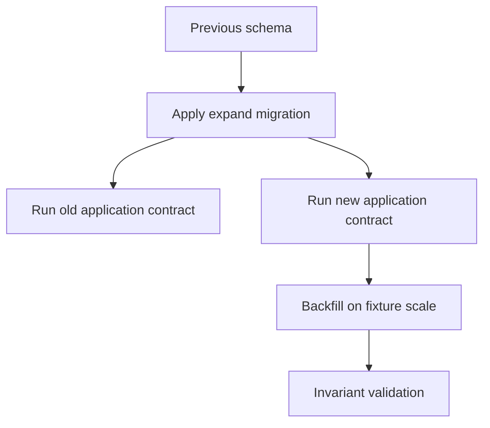
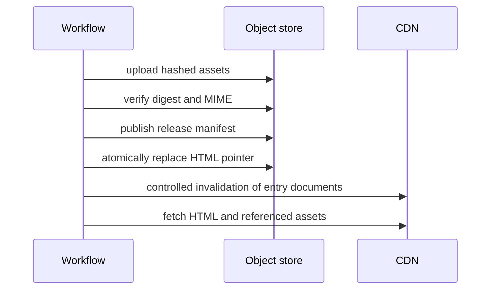
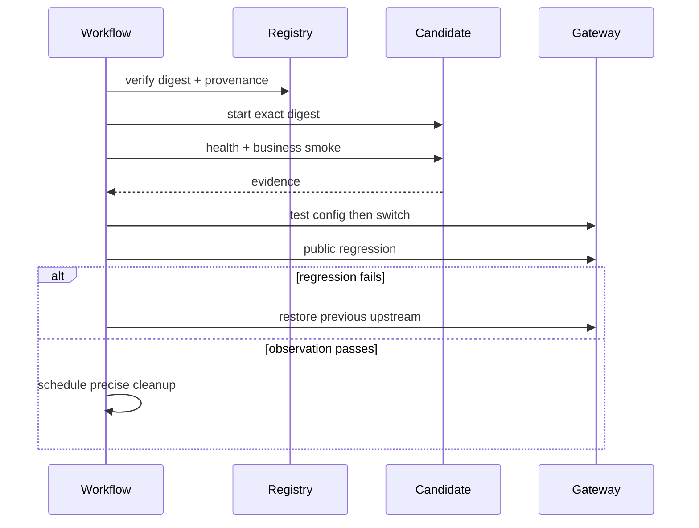

# CI/CD 质量流水线

CI/CD 的价值不是“Push 后自动执行一串命令”，而是把一次变更从源码、依赖、测试、制品、候选验证到生产切流形成可追溯证据。CI 证明这份变更满足进入下一阶段的条件；CD 只把已经验证的同一制品推进环境，并在风险超出阈值时恢复已知版本。

流水线快但不可信，会鼓励绕过；覆盖全面但每次两小时，会让反馈晚到。设计目标是分层反馈：便宜、确定的检查尽早并行；昂贵的集成与运行态验证只对有资格的变更执行；发布阶段不重复构建或临时修改制品。

## 从威胁和失败方式设计阶段

一次交付可能在不同位置失败：

- 源码含类型错误、过时结论或生成文件漂移；
- 依赖锁文件与清单不一致，缓存掩盖缺失依赖；
- 测试只覆盖顺利路径，数据库/队列契约已破坏；
- 构建产物与测试对象不是同一份；
- PR 获得生产 Secret，第三方代码可外传凭证；
- 候选实例启动了唯一 Scheduler，和稳定版重复执行；
- 代码可回滚，但数据库已做破坏性迁移；
- 切流后只看健康 200，关键业务和数据投影已经异常。

流水线门禁要逐项针对风险，不应只以“Job 绿色”作为抽象信仰。

## 一条证据链

```mermaid
flowchart LR
  A[Commit + locked dependencies] --> B[Static and content gates]
  B --> C[Unit / integration / contract]
  C --> D[Build immutable artifact]
  D --> E[SBOM + provenance + signatures]
  E --> F[Candidate runtime]
  F --> G[Smoke and migration checks]
  G --> H[Approved cutover]
  H --> I[Post-cutover verification]
  I --> J[Observe / rollback / cleanup]
```



每个阶段产生机器可读取证据：测试报告、覆盖率趋势、OpenAPI/Proto 差异、镜像 Digest、SBOM、签名、候选探测、迁移记录和发布版本。后续阶段引用前一阶段产物，不重新猜测“当前 latest 是什么”。

## 触发器和权限分层

PR、主分支和手动生产发布的权限不同：

| 触发 | 允许 | 禁止 |
| --- | --- | --- |
| PR（同仓） | 读源码、检查、测试、构建临时候选 | 生产 Secret、写生产、自动部署 |
| Fork PR | 更严格只读 Runner | 仓库写 Token、环境 Secret |
| main push | 完整验证、生成可晋级制品 | 未审批直接生产变更 |
| 手动发布 | 使用已验证 Digest、受控环境凭证 | 重建、任意分支、漂移脚本 |

GitHub Actions 等平台的 `pull_request_target` 在基仓库权限上下文运行，若 checkout 并执行不可信 PR 代码可能泄露 Secret。除非充分理解信任边界，不用它运行来自 PR 的脚本。第三方 Action 固定到审核过的 commit SHA，不只使用可移动 Tag。

Job 设置最小 `permissions`，默认 `contents: read`；只有发布 provenance、包或 PR 报告的 Job 获取对应写权限。生产使用 Environment 审批、分支限制和短期 OIDC 身份，避免长期云密钥。

## 可重复依赖与缓存

锁定语言和包管理器版本，使用冻结锁文件：`npm ci`、`yarn --frozen-lockfile`、`pnpm --frozen-lockfile`、`uv sync --frozen` 等。系统包与容器基础镜像同样固定。

缓存只优化下载，不成为事实来源。缓存键包含 OS/架构、运行时、包管理器和锁文件摘要；恢复缓存后仍执行包管理器完整性检查。定期冷缓存构建证明流水线不依赖某个 Runner 的残留状态。

不要缓存整个可变 `node_modules` 并跨运行时复用，也不要把 Secret/私有 registry token 放入可被不可信分支读取的缓存。构建输出通过 Artifact/Registry 显式传递，不能依赖后续 Job 恰好落到同一工作目录。

## 快反馈门禁

第一层通常包括：格式/Lint、类型、内容清单、Markdown、生成代码一致性、Secret 扫描、许可证/依赖策略、单元测试。只运行受影响包能加速，但变更影响图必须可信；共享配置、锁文件、构建工具变化触发更广验证。

生成文件检查采用“重新生成后 Git diff 必须为空”，防止开发者忘记提交 Schema Client 或索引。内容站还校验 Frontmatter、路由唯一、内部链接、孤立文章、代码围栏和隐私规则。

测试不能只看覆盖率数字。权限、状态机、幂等、事务和错误映射用 mutation/故障用例证明门禁能抓住回归。Flaky Test 不应自动无限 rerun 伪装绿色；隔离并统计波动，确定负责人和修复期限。

## 集成、契约和迁移验证

集成测试用版本固定的隔离数据库、Redis、Broker 和对象存储，测试后精确销毁命名资源。禁止依赖共享生产/开发数据库。测试迁移至少覆盖：空库升级、上一个生产 Schema 升级、迁移重复执行语义、旧应用与扩展后 Schema 共存。

契约门禁包括 OpenAPI/Proto breaking diff、数据库约束、事件 Schema 和前后端生成类型。结构工具发现不了单位/默认值语义变化，因此关键契约再跑 old/new 组合测试。



数据库迁移不是部署脚本附带的 `migrate latest`。每个迁移有锁风险、预计时长、磁盘增长、回退/前滚方式和验证 SQL。大表加约束、回填、索引构建使用数据库支持的低锁方案，并在近似数据规模演练。

## 只构建一次

构建 Job 在干净、隔离环境生成不可变镜像/静态包，运行必要制品级扫描与启动检查，然后推送 Registry。环境只引用 Digest：

```yaml
jobs:
  build:
    permissions:
      contents: read
      packages: write
      id-token: write
    steps:
      - uses: actions/checkout@<audited-commit-sha>
      - name: Build image
        run: |
          docker buildx build \
            --provenance=true \
            --sbom=true \
            --tag "$IMAGE_REF" \
            --push .
      - name: Resolve digest
        run: docker buildx imagetools inspect "$IMAGE_REF" --format '{{json .Manifest.Digest}}'
```

示例中的 Action 版本要替换成团队审核并固定的真实 SHA。生产部署不执行 `docker build`、依赖安装或源码编译；否则测试的是制品 A，运行的却是 B。运行时配置也记录版本/摘要，Secret 不进入镜像。

多架构镜像的 manifest list Digest 与平台子镜像 Digest 都记录。回滚必须能解析出相同平台产物，避免 Tag 后来被覆盖。

## SBOM、签名与来源证明

依赖扫描只是供应链的一层。制品附加 SBOM（CycloneDX/SPDX）、构建 provenance 和签名；部署策略验证制品来自允许仓库、受信 Workflow、目标分支和审核环境。

扫描结果按可利用性、运行路径和修复时限治理，不能遇到任何 CVE 永久阻断，也不能长期全局 ignore。例外有 owner、原因、到期日和补偿措施。Secret 扫描覆盖 Git diff、历史策略和镜像 Layer；发现真实凭证要轮换，删除文本不足以恢复安全。

## 发布清单把多个制品绑定为一个版本

复杂系统通常不止一张镜像：API、Worker、前端静态包、数据库迁移、事件 Schema 和配置需要以经过验证的组合发布。仅给每个镜像打同名 Tag 不能证明它们兼容；生成不可变 Release Manifest，记录精确摘要和门禁证据：

```json
{
  "releaseId": "release-opaque-id",
  "sourceRevision": "commit-sha",
  "artifacts": {
    "api": "registry.example.invalid/api@sha256:digest-a",
    "worker": "registry.example.invalid/worker@sha256:digest-b",
    "admin": "registry.example.invalid/admin@sha256:digest-c"
  },
  "contracts": {
    "database": "schema-expand-42",
    "events": "events-v3",
    "openapiDigest": "sha256:contract-digest"
  },
  "evidence": {
    "workflowRun": "run-id",
    "testReportDigest": "sha256:test-report",
    "provenanceDigest": "sha256:provenance"
  }
}
```

部署器只接受经过签名、来自受信 Workflow 的 Manifest，不允许操作人员在发布中临时混搭版本。回滚记录上一份 Manifest，而不是只记录 API 镜像；否则旧 API 可能配上新 Worker/静态包，得到从未验证的组合。

Release Manifest 不包含 Secret 值，只引用环境配置版本。配置变更同样经过 Schema、候选和审计；“没有代码提交”不意味着风险较低。

## 前端静态制品的原子发布

静态站点/CDN 常见失败是 HTML 已更新，带哈希 JS/CSS 尚未全部可用，或清理脚本过早删除旧 Chunk。发布顺序应先上传所有不可变哈希资源并校验大小/摘要，再发布入口 HTML/Manifest，最后在观察与缓存窗口后清理旧资源。



HTML 短缓存/协商缓存，哈希资源长期 `immutable`。回滚重新指向旧 HTML Manifest；旧资源必须仍在。Source Map 上传到监控系统并与 release 绑定，不默认公开部署。自动冒烟解析 HTML 中的所有关键资源 URL，检查 200、MIME、SRI（若使用）和跨域头，不能只请求首页。

CDN invalidation 是有成本、可能异步的外部副作用。发布状态记录 invalidation request 与完成证据；失败时入口仍应由版本化对象/原子指针恢复，而不是依赖“再清一次缓存”。

## 发布状态机与可恢复执行

部署 Job 可能被取消、Runner 断线或审批超时。将发布记录建模为状态机，而不是脚本输出：

```text
created -> preflight_passed -> candidate_ready -> approved
        -> cutover_in_progress -> observing -> succeeded
        -> rollback_in_progress -> rolled_back
        -> failed_before_cutover
```

每一步保存幂等输出：候选名称、Digest、迁移版本、旧 upstream、备份引用、探测结果。恢复执行先读取当前状态并核对外部事实；不能从头盲跑造成第二个候选、重复迁移或再次切流。

部署锁带租约与 owner，Runner 消失后可由受控恢复流程接管。`cancel-in-progress: false` 只是避免平台主动取消，不足以处理机器故障。Trap/Finally 在“切流前失败”可清理候选；一旦进入切流临界区，优先确认/恢复 upstream，再考虑清理。

## 审批需要可读的差异和风险

生产审批不应只有“Run #123 是否继续”。审批摘要列出源码变更、Manifest/Digest、依赖与安全例外、数据库迁移、Feature flag、候选证据、预计影响、回滚条件和负责人。审批人确认的是具体制品和风险；审批后若 Digest/配置改变，审批失效。

高风险变化（不可逆迁移、权限模型、计费、数据删除）要求更严格双人审批或维护窗口。普通低风险修复可使用预批准策略，但仍有自动门禁和回滚证据。将所有发布都设为同一重审批，会导致机械点击，反而削弱控制。

## 候选环境验证真实运行制品

候选使用同一镜像 Digest、同构网络和配置 Schema，以独立名称/端口启动，不接公网主流量。唯一 Scheduler、批处理和外部写消费者在候选中禁用或从属；否则旁路验证会产生重复副作用。

候选门禁分层：

1. 进程/容器健康、配置 Schema、依赖连接；
2. 首页、API、静态资源、认证和错误协议；
3. 使用隔离临时数据的最小业务流程；
4. 队列、SSE/流式、迁移后读写和遥测；
5. 资源上限、启动时间和关键性能预算。

探测不只 `curl /health`。健康 200 可能来自旧进程、静态代理或未连接关键数据。每次探测记录候选版本并验证响应版本/Digest，避免测错目标。测试数据最小、低权限，结束后按清单删除并验证残留为零。

## 发布与流量切换

发布方式由系统能力决定：蓝绿、逐实例滚动、权重金丝雀或代理 upstream 原子切换。无论方式都遵循：新版本先 ready、旧版本仍可恢复、切流动作最小、触发阈值预定义。

```text
preflight -> backup evidence -> migration expand -> candidate -> smoke
          -> approve -> cutover -> public regression -> observe
          -> rollback OR cleanup after window
```

自动部署到生产不是成熟度唯一标准。小团队可以保留手动 `workflow_dispatch` 与 Environment 审批，只要输入锁定为已验证 Digest、步骤可重复、证据完整。危险的是登录服务器临时敲一串不可审计命令。

切流后检查公网、代理直连、关键读写、异步终态、数据新鲜度、日志/指标/Trace 和版本标签。观察期内旧实例不接新流量但保留快速回滚。长连接排空，客户端用游标重连。

## 数据库的 expand-migrate-contract

代码回滚只在 Schema 向后兼容时成立。安全序列：

1. Expand：增加可空字段、新表、新索引或兼容触发/双读；
2. 部署能读旧/新结构的新代码；
3. Migrate：分批回填，保存游标、校验数量/摘要；
4. 切换新读写并观察；
5. Contract：后续独立发布停止旧写、删除旧字段。

回填不和应用发布绑成一个无界步骤。限速、可暂停、幂等、监控锁/复制延迟。不可逆转换先备份并完成恢复演练；“down migration”存在不代表数据语义可恢复。

## 回滚策略与自动停止条件

发布前定义指标：错误率/延迟错误预算、关键业务成功率、队列终态、数据投影新鲜度、资源耗尽和安全拒绝。达到阈值先停止扩大流量或切回，不在生产主流量上连续热修。

回滚类型：

| 变化 | 快速动作 | 额外条件 |
| --- | --- | --- |
| 仅应用 | 切回旧 Digest | Schema 向后兼容 |
| 配置 | 恢复已知配置版本 | Secret/Feature flag 审计 |
| 数据兼容扩展 | 旧代码继续运行 | 未执行 contract |
| 破坏性数据变化 | 前滚修复/恢复备份 | 需独立 Runbook |
| 外部副作用 | 停止流量并补偿/对账 | 镜像回滚无法撤销 |

Feature flag 可解耦部署和启用，但 flag 也是生产配置：有 owner、默认值、权限、审计、过期清理和组合测试。不能用长期 flag 堆积代替设计。

## Workflow 结构和并发控制

生产发布设置 concurrency，同一环境一次只有一个切流；新的发布不能在旧发布修改到一半时随意取消。使用 `needs` 串接证据，部署 Job 下载指定 Artifact/Digest，不 checkout 后重建。

```yaml
concurrency:
  group: production-release
  cancel-in-progress: false

on:
  workflow_dispatch:
    inputs:
      artifact_digest:
        required: true
        type: string
```

对输入验证允许 Registry/摘要格式，并在部署前查询 provenance 对应 commit。环境锁和部署状态即使 Job 中断也能恢复；Trap/Finally 精确清理候选，但切流中断优先恢复旧 upstream，不能先删回滚点。

## 流水线自身的可观测性

DORA 指标（部署频率、变更前置时间、变更失败率、恢复时间）提供趋势，但不能单独评价个人。还关注：各阶段耗时、排队、缓存命中、flaky 比例、失败原因、回滚演练成功和门禁逃逸。

优化最长关键路径：把独立静态检查并行、按可信影响图切测试、预构建测试服务镜像、复用只读依赖缓存。不要删除关键门禁换速度。流水线失败输出可行动的文件/命令，不让开发者翻几千行日志。

## 验证流水线本身

质量门禁也需要测试：

- 故意提交类型错误、失效内部链接、Secret 模式，确认对应 Job 失败；
- 修改 OpenAPI/Proto 为破坏性变化，确认契约门禁阻断；
- 删除缓存做冷构建，结果一致；
- 尝试 Fork PR，确认拿不到生产 Secret/写权限；
- 替换 Artifact 后校验签名/Digest失败；
- 候选健康失败，确认 current upstream 不变；
- 切流后注入错误率，确认停止/回滚动作；
- 数据库新 Schema 下启动旧版本，证明回滚兼容；
- 中断发布 Job，确认锁、候选和回滚状态可恢复。



## 常见误区

- 用 CI 绿色代替检查门禁是否覆盖实际风险。
- PR/Fork 执行不可信代码时获得生产 Secret 或写 Token。
- 缓存成为隐式依赖，冷构建失败。
- 测试一个包，部署阶段重新构建另一个包。
- 使用 `latest` 发布，无法确定或验证回滚制品。
- 依赖扫描全局忽略，例外没有到期日。
- 候选启动唯一后台任务，与稳定实例重复执行。
- 迁移和回填绑在切流请求中，锁表/超时无法暂停。
- 只验证 `/health`，不测业务、异步和数据新鲜度。
- 回滚代码却忽略破坏性 Schema 和外部副作用。
- 发布成功立即删除旧版本，没有观察和回滚窗口。

## 源码与规范

- [GitHub Actions security hardening](https://docs.github.com/en/actions/security-for-github-actions/security-guides/security-hardening-for-github-actions)：权限、第三方 Action 固定、注入和自托管 Runner 风险。
- [GitHub OIDC](https://docs.github.com/en/actions/security-for-github-actions/security-hardening-your-deployments/about-security-hardening-with-openid-connect)：用短期身份替代长期云凭证。
- [SLSA](https://slsa.dev/spec/v1.1/)：构建来源、级别和供应链证明模型。
- [OCI Image Specification](https://github.com/opencontainers/image-spec)：不可变镜像与 Digest 绑定。
- [semantic-release + GitHub Actions 实践](https://juejin.cn/post/7055958932933574669)：我的早期自动版本实践；文中旧 Action/Node/PAT 配置仅作演进背景，现行方案以当前官方安全文档为准。
