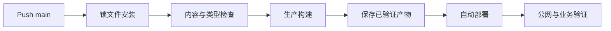

# CI/CD 质量流水线

开发机上构建成功，不代表仓库里的代码能被另一台机器重复构建。CI 在干净环境执行检查并生成证据；CD 把已验证制品交付到目标环境。自动部署并不等于跳过验证，它只是把通过门禁后的交付动作自动触发。

本篇让一次 main 分支推送经过依赖安装、内容检查、类型检查和生产构建，再自动部署同一份产物。任何阶段失败，部署不会开始。

## CI 和 CD 各自负责什么

- **CI**：验证源代码、锁文件、测试和构建是否可重复。
- **Delivery**：生成可部署制品并保留版本、摘要与门禁证据。
- **Deployment**：把已验证制品放入环境，并完成健康和业务验证。

## 步骤一：在干净环境锁定依赖

CI 固定 Node 与包管理器版本，使用锁文件的 frozen 模式。缓存只加速下载，不替代锁文件。缓存键包含平台、运行时和锁文件摘要；缓存损坏时删除缓存仍应完整构建成功。

Secret 只在确实需要的部署 Job 注入，来自 Fork 的不受信代码不能读取生产凭证。日志、构建产物和命令输出都要避免打印 Secret。

## 步骤二：让门禁按风险分层

快速静态检查先运行，失败就不用消耗完整构建时间。博客项目可以依次检查内容目录、重复与教程质量、隐私、TypeScript 和 VitePress Build。代码项目再加入单测、集成测试、依赖与镜像扫描。

并行 Job 可以缩短反馈，但部署 Job 依赖所有必需门禁。允许失败的实验检查应明确标记，不能让红色结果悄悄被忽略。失败日志要指出文件、命令和可复现方式。

## 步骤三：构建一次，提升同一制品

验证 Job 生成静态站或镜像，记录源码版本与摘要。部署 Job 下载这份已验证产物，不在生产服务器重新安装依赖或构建另一份内容。这样测试结果与线上运行对象才能对应。

自动部署保留原有 main 推送触发行为时，也要串在验证之后。部署脚本先放置候选目录或容器，检查版本与健康，再原子切换当前指针。旧版本保留到观察期结束，失败立即恢复。

## 步骤四：部署后验证真实入口

构建通过只说明产物可生成。部署后还要从公网验证首页、一个深层文章、随机不存在页、静态资源与 Sitemap。VitePress 尤其要刷新无扩展文章 URL，确认 Nginx 能解析 `.html`，并保证不存在页仍是 404。

验证失败时，自动流程停止扩大影响并恢复上一版本。数据库迁移与应用制品需要兼容窗口，不能仅切回前端文件就宣称所有状态恢复。

## 正常结果和失败结果

| 场景 | 流水线行为 |
| --- | --- |
| 锁文件与 package 不一致 | 安装失败，不进入构建 |
| 内容出现死链接 | 内容门禁失败 |
| TypeScript 错误 | 不生成部署产物 |
| 构建通过 | 保存带摘要的制品 |
| main 推送且全部门禁通过 | 自动执行部署 |
| 深层文章刷新 404 | 发布验证失败并回滚 |
| 部署 Secret 缺失 | 部署 Job 失败，不回显值 |

本地复现命令与 CI 使用同一脚本，避免一套命令只在 YAML 中存在。定期从空缓存运行完整流程，并演练部署中断与回滚。CI 指标关注反馈时长、失败原因、Flaky 比例和发布恢复时间，而不是单纯追求更多 Job。

## 下一步

流水线知道部署是否成功，还不知道上线后用户请求发生了什么。下一篇建立日志、指标和 Trace，让一次错误可以从公网入口追到数据库或任务终态。

## 参考资料

- [GitHub Actions](https://docs.github.com/actions)
- [GitHub Actions security hardening](https://docs.github.com/actions/security-for-github-actions/security-guides/security-hardening-for-github-actions)
- [SLSA](https://slsa.dev/)
- [VitePress Deploy](https://vitepress.dev/guide/deploy)
