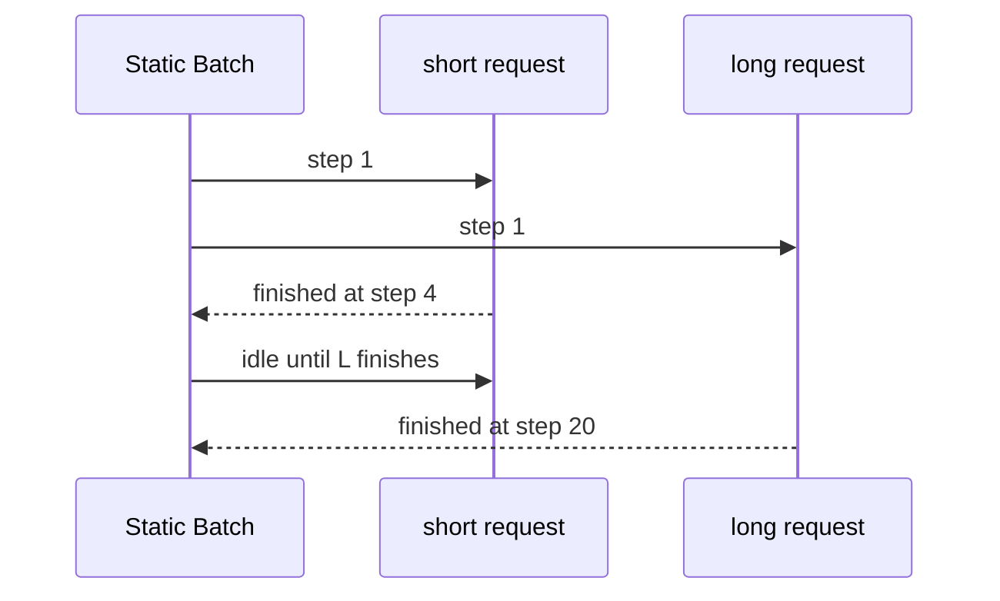

# Continuous Batching、PagedAttention 与 KV Cache

一个长对话占满显存，后面短请求全部排队；静态 Batch 里短请求明明已经生成完，却还要等长请求结束。Continuous Batching 重新组织每个 Decode step 的活跃序列，PagedAttention 则把 KV Cache 从一整块连续内存变成可映射的 Block。它们改善利用率，却不会取消显存上限和公平性问题。

## 静态 Batch 为什么让槽位空等

静态 Batch 把请求集合绑定在一起，最慢的序列决定释放时间。Continuous Batching 在每个调度步重新查看完成、取消、等待和新到达的序列，让短请求离开后尽快补入新请求。调度器仍然要在 Prefill 和 Decode 之间分配预算。

## KV Cache 为什么需要分页

自回归生成需要保存每层注意力的 Key/Value。若每条序列都申请一段连续显存，长度差异会产生碎片，扩容和释放也不灵活。PagedAttention 把 KV 切成固定大小 Block，由逻辑序列到物理 Block 建立映射，序列增长时按需追加。

| 对象 | 保存什么 | 释放时机 |
| --- | --- | --- |
| 逻辑序列 | Token 顺序、长度和租户边界 | 完成、取消或过期 |
| KV Block | 某段 Token 的 K/V 张量 | 不再被序列引用 |
| Prefix Cache | 可复用前缀的 Block 引用 | 版本、权限或模型变更 |
| 调度队列 | 等待原因和 deadline | 接纳、拒绝或超时 |

## 一次调度推演

| step | A | B | C | 调度动作 |
| --- | --- | --- | --- | --- |
| 1 | Prefill 2k | Prefill 512 | 等待 | 为 A/B 分配 Block |
| 2 | Decode | Decode | 等待 | 输出 A1/B1 |
| 3 | 完成 | Decode | Prefill 256 | 释放 A，接纳 C |
| 4 | 空闲 | Decode | Decode | C 复用可用槽位 |

表格是机制推演，不是某个引擎的实测轨迹。真实调度还要考虑最大批次、Block 数、优先级、抢占、prefix cache 命中和租户公平性。

## 缓存复用不能越过安全边界

只有模型 Revision、Tokenizer、系统前缀和权限范围都一致时，Prefix Cache 才可能复用。把不同租户的系统提示或受限文档放进全局缓存，会造成跨租户泄露。缓存 key 应包含能影响语义和权限的版本，而不是只包含文本前缀。

## 吞吐和延迟的取舍

::: warning
**容易误判**

Continuous Batching 提高的是设备工作密度，不保证单个请求 TTFT 或 TPOT 一定下降。长请求过多时仍需准入、分队列或最大序列长度。下一篇把这些调度概念落到 vLLM 的接口、启动参数和故障定位。
:::

## 公平性需要显式策略

只追求总吞吐的调度器会偏爱短请求或热门前缀，长请求可能长期得不到 Prefill 机会。可以按租户、请求年龄、预计长度和优先级分队列，限制单个租户的活跃序列与最大上下文，并让超时请求在进入 GPU 前就失败。

策略的效果要看分位数而不是平均数：短请求是否抢占了长请求，低优先级队列是否无限老化，取消是否及时释放 Block。缓存命中也应记录在同一维度，否则容易把某个租户的前缀优势误读成引擎整体变快。

## Prefill 与 Decode 的争用需要被看见

长 Prompt 的 Prefill 会占用较多计算和 KV 分配，短 Decode 请求则希望及时得到下一个 Token。若调度器总是优先新 Prefill，已有流会出现 TPOT 尖峰；若只照顾 Decode，新请求 TTFT 会持续增加。

因此看板应分别展示 Prefill 排队、Decode 活跃序列、Block 使用、取消率和两类延迟。调度策略的改变不是“更快”或“更慢”，而是在两种用户体验之间重新分配预算。
