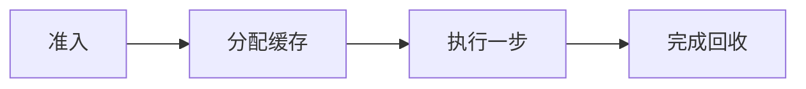

# Continuous Batching、PagedAttention 与 KV Cache

一个长请求进入批次后，后来的短请求全部等它生成完，GPU 明明每轮仍有空位。静态批处理把一组请求从头到尾绑在一起；连续批处理则在每次迭代重新选择活跃序列，让完成的请求退出、新请求进入。代价是调度、公平性和 KV Cache 管理变得更复杂。


<InfraFigure src="/images/ai-infra/continuous-batching-kv-cache/hero.png" alt="长短请求在连续批处理中共享 GPU 轮次和分页 KV Cache 的插画"
  icon="blocks" caption="连续批处理按迭代加入和移除请求，PagedAttention 用块管理不等长 KV Cache。" />


## 为什么生成批次不能照搬训练批次

| 概念 | 在这条链路中的含义 |
| --- | --- |
| Static Batching | 一批请求一起开始并等待最慢者结束，形状稳定但容易产生尾部空闲。 |
| Continuous Batching | 在 Prefill/Decode 迭代边界动态准入和移除请求，提高设备利用，但需要调度策略。 |
| KV Cache | 每层为已处理 Token 保存注意力 Key/Value，使 Decode 不必重复计算全部历史。 |
| PagedAttention | 把逻辑连续的 KV 序列映射到固定大小物理块，减少外部碎片并支持灵活分配。 |
| Prefix Cache | 复用完全一致且策略允许的前缀计算结果；命中依赖 token IDs、模型和相关配置一致。 |

## 排障时最容易走错的岔路

| 表面现象 | 实际可能发生的事 | 下一步证据 |
| --- | --- | --- |
| 吞吐提高 | 尾延迟和排队公平性可能同时恶化 | 按输入/输出长度分桶看分位数 |
| KV 利用率高 | 可能接近 OOM，并不等于有效吞吐高 | 关联 free blocks、抢占与完成率 |
| 前缀相同文本 | 模板、空格或 tokenizer revision 可产生不同 token IDs | 比较规范化后的 token 序列和 cache key |
| 跨租户复用缓存 | 可能形成时序侧信道或错误共享策略 | 把模型、适配器和安全域纳入 key |

::: warning 不要用重启代替诊断
恢复服务和解释故障是两个目标。紧急止损后仍要回到原始日志、指标与状态转换，避免同类问题重复出现。
:::

## 调度器每一轮在决定什么



### 1. Scheduler 怎样完成准入

按 token budget、KV 空闲块和优先级选择新请求。

这一动作的可观察结果是 waiting、admitted、rejected reason。处理动作应晚于取证，否则重启或重试可能覆盖最早的失败现场。

### 2. 分配缓存：KV Block Manager 持有当前状态

给输入与增长中的序列映射物理 block。

可以从这些位置确认结果：free blocks、allocated blocks、preemption。若完全没有证据，先判断请求是否到达本阶段；若记录冲突，则对齐 request_id、实例和时间窗口。

### 执行一步发生时，先看 Model Executor

组合 Prefill chunk 或 Decode token 形成一次执行。

这里不靠猜测，优先读取 batch tokens、kernel duration。

### 从 完成回收 留下的证据回到 Scheduler

结束、取消或抢占请求，回收 block 并选择下一轮。

决定下一步前需要看到 finish_reason、freed blocks、queue age。

## 用调度表推演长短请求交错

表格是机制推演，不是 vLLM 固定日志。A 为长请求，B/C 为短请求；每轮容量仅为示意。关注请求何时进入和退出，而不是虚构吞吐数字。

```text
round 1: prefill A       active=[A]      free_blocks=18
round 2: decode A + prefill B            free_blocks=12
round 3: decode A,B + prefill C           free_blocks=7
round 4: decode A,B,C; B finishes         free_blocks=10
round 5: decode A,C;   C cancels          free_blocks=16
round 6: decode A                           free_blocks=15
```

B 完成后下一轮即可释放其 KV block，不必等待 A；C 取消也必须及时回收。若 block 不足，调度器可能拒绝准入、抢占或重算，不同引擎和版本策略不同。Prefix Cache 命中只减少可复用前缀计算，不会免除新生成部分的 Decode。


## 最后回到适用范围

PagedAttention 解决缓存分配，不让显存无限，也不会消除模型权重和工作区。调度参数必须用真实请求分布验证；本章只做机制推演，不提供特定 GPU 上的 batch 或吞吐推荐值。

机制已经具备，下一篇把它落到 vLLM 服务进程：怎样启动、检查兼容接口、切换模型并分层定位加载、显存和请求错误。
