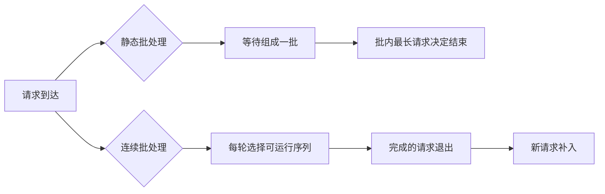

# Continuous Batching、KV Cache 与 Prefix Cache

静态批处理等一批请求全部结束后再接下一批。只要其中有一条长回答，其他短请求也要等待。在线推理更常见的做法是让已完成的请求退出、空出的调度位置立即加入新请求，这就是 Continuous Batching（连续批处理）。

它提高资源利用率，却引入新的取舍：长请求是否饿死短请求？KV Cache 是否耗尽显存？Prefix Cache 的共享前缀是否有跨用户数据风险？本章用一张手工调度表回答这些问题。

## 两种批处理的差异



静态批处理容易实现、行为稳定，但尾部延迟受最长请求影响。连续批处理更适合请求长度差异大的在线服务，但调度器必须为每轮 Token 计算、显存块和公平性做决定。

## 第一步：理解 KV Cache 的形状

对于自回归生成，每层会为历史 Token 保存 Key 和 Value。粗略占用与以下因素正相关：层数、KV 头数、每头维度、数据类型、序列 Token 数和并发序列数。

```text
KV Cache 总量 ≈ 每个 Token 的 KV 字节数 × 所有在途 Token 数
```

具体模型是否使用 Multi-Query/Grouped-Query Attention 会改变 KV 头数，不能只用隐藏维度套公式。实际推理引擎还会使用块管理、对齐和元数据。

长输入先占一部分 Cache，长输出继续增长。即使权重加载只占显存的一半，高并发长上下文仍可能 OOM。

观察时记录 `prompt_tokens`、`generated_tokens`、活跃序列数、KV Cache 使用/保留和请求被抢占次数。只看 GPU 总显存无法说明是哪个请求形状造成压力。

## 第二步：手工推演连续调度

假设每轮最多计算 8 个新 Token，系统里有三条请求：

| 请求 | 输入 Token | 输出上限 | 到达轮次 |
| --- | ---: | ---: | ---: |
| A | 100 | 4 | 0 |
| B | 2000 | 100 | 0 |
| C | 80 | 8 | 1 |

静态批处理会等待 A/B 都完成，C 只能等下一批。连续批处理在 A 完成后释放槽位，C 可以进入下一轮，但 B 仍持续占用 KV Cache。

把每一轮写成表格：运行哪些序列、每个序列新增几个 Token、结束哪些、剩余 Cache 多少。这个练习能看见两个事实：

1. “批次大小”不再是固定请求数量，而是本轮可计算 Token 预算。
2. 输出很长的 B 会持续占用资源，公平性策略需要限制其每轮份额或设置最大序列长度。

调度器可能优先短请求降低 TTFT，也可能优先已有请求提高 GPU 利用率。没有唯一正确策略，必须用业务 SLO 和容量实验决定。

## 第三步：Prefix Cache 在复用什么

如果许多请求共享完全相同的系统提示或长文档前缀，Prefix Cache 可以复用已计算的 KV 块，减少重复 Prefill。命中后，新增用户问题仍需单独计算。

可复用条件通常包含 Token 序列完全一致、模型与 Tokenizer 版本一致、采样输入边界兼容和缓存策略允许。只比较字符串片段不够，最终要比较 Token ID 和模板结果。

安全边界更重要：跨用户、租户或权限范围的前缀不能因为文本相同就共享。缓存 Key 应包含模型 revision、Tokenizer/template、租户/数据范围与策略版本，或只缓存不含敏感内容的公开前缀。

Prefix Cache 是性能优化，不应成为事实源。命中错误或版本失效时，应能回到完整 Prefill。

## 第四步：显存压力下的取舍

当 KV Cache 接近上限，推理引擎可能：拒绝新请求、降低最大上下文、抢占/重算部分请求、把缓存换出 CPU，或让请求排队。每种动作对延迟和成本不同。

| 保护动作 | 好处 | 代价 |
| --- | --- | --- |
| 限制最大输入/输出 | 可预测显存 | 长任务被拒绝或截断 |
| 限制活跃序列 | 保护 GPU | 队列变长 |
| 请求排队 | 不立即失败 | TTFT 上升，需要年龄告警 |
| 抢占并重算 | 提高接纳率 | 计算重复，ITL 抖动 |
| CPU Offload | 扩大容量 | PCIe/内存带宽慢 |

先根据线上输入分布设置预算，不能照搬引擎默认值。预算变化要用固定模型和硬件做容量回归。

## 第五步：公平性与优先级

如果每轮总是选择短请求，长请求可能饿死；如果一直服务长请求，短请求 TTFT 变差。可组合：

- 每请求最大连续 Decode Token 数。
- 按等待年龄提高优先级。
- 对在线与批处理使用独立队列或配额。
- 对大上下文请求设置单独准入和更低优先级。
- 取消或 Deadline 到期时及时释放 KV 块。

优先级不是越多越好。高优先级请求若持续满载，低优先级要有保底资源或明确拒绝语义。监控最老请求年龄和不同类别的 P95，而不只看总体平均。

## 第六步：用实验比较策略

固定模型、硬件、Tokenizer、输入/输出分布和并发到达模式，分别跑静态批处理和连续批处理（若引擎支持可控参数）。记录：

1. TTFT 与 TPOT/ITL 的分位数。
2. 吞吐（输入/输出 Token 每秒），注明计算窗口。
3. GPU 利用率、显存、KV Cache 使用。
4. 拒绝率、抢占/重算次数、队列年龄。
5. 短请求与长请求分别的尾延迟。

至少重复多轮，保留原始日志和版本清单。不要只跑一条长 Prompt 就宣称连续批处理提升了吞吐，也不要把异构硬件结果互相比较。

## 故障排查

| 现象 | 证据 | 可能方向 |
| --- | --- | --- |
| 显存稳定但 TTFT 变长 | queue age、活跃序列数 | 准入或公平性 |
| 短请求偶尔很慢 | 长请求占槽、调度日志 | 大请求隔离/优先级 |
| Prefix 命中后输出异常 | Tokenizer/template/revision | 缓存 Key 不完整 |
| OOM 只在高并发长输入 | KV Cache、序列长度 | 上限与并发预算 |
| GPU 利用率下降 | 重算、CPU offload、输入不足 | 调度和数据路径 |

## 迁移到生产前的清单

1. 记录 KV Cache 估算和真实监控字段。
2. 明确最大输入、输出、活跃序列与批 Token 上限。
3. 设计短/长请求、公平性和取消策略。
4. Prefix Cache Key 包含模型、Tokenizer、策略和权限边界。
5. 线上缓存不可用或失效时，完整 Prefill 仍可工作。
6. 压测按真实长度分布，分别报告短请求与长请求。
7. 记录抢占、重算、拒绝和最老队列年龄。

下一章会把这些概念落到官方资料指导的 vLLM 启动操作，硬件前提和未实测部分会明确标注。
