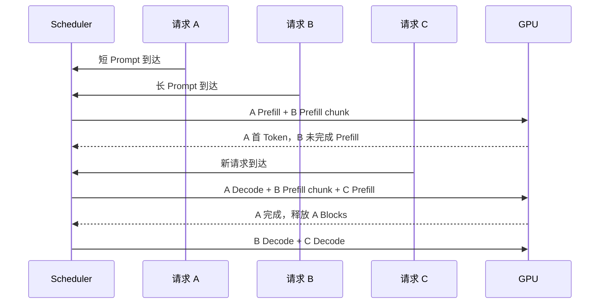

# Continuous Batching 和 KV Cache 是什么？推理服务怎样同时处理多个请求

三个用户几乎同时请求同一个模型：A 输入很短，想生成 20 个 Token；B 输入 4,000 个 Token；C 在 A 已经生成一半时才到达。若服务把三者固定成一个 Batch，可能要等 C，或者让 A 完成后继续占一个空位置。在线请求到达和结束都不整齐，静态批处理很难长期保持设备忙碌。

Continuous Batching 允许调度器在每次推理迭代之间重组 Batch。已完成或取消的序列退出，新请求进入；KV Cache 则保存每条序列已处理历史的注意力 Key 与 Value。缓存很大且长度不断增长，引擎通常按 Block 管理，PagedAttention 让逻辑连续的序列使用物理上分散的块。

::: info Continuous Batching 的准确含义

Continuous Batching 是在线推理调度方式。引擎在 Token 生成迭代边界动态选择活跃序列，把不同到达时间和不同长度的请求组合成下一次模型执行，而不是固定等待整个 Batch 一起结束。

它提高设备利用率与吞吐，但不会让单条自回归序列跳过逐 Token 依赖。调度器仍要在首 Token、每 Token 延迟和公平之间取舍。

:::

## Batch 是什么，它与请求数为什么不是同一个量

Batch 是一次模型执行共同处理的一组输入单元。训练时常用固定数量样本，Prefill 时可以把多条序列的多个 Token 打包，Decode 时一次迭代通常为每条活跃序列处理一个新 Token。Batch size 的含义因此要带阶段。

请求是 API 生命周期，一次请求可能包含 `n>1` 或 beam search，产生多个 Sequence。一个 Batch 也可能同时包含某请求的 Prefill chunk 与其他请求的 Decode token。只说“Batch=32”无法推断并发 32 个用户。

Token Budget 表示某次执行最多安排多少输入位置。Prefill 一个 2,000 Token 请求就能占很大预算，Decode 32 条序列只需约 32 个新位置。调度器常同时限制最大序列数与最大 Batched Token 数，防止长 Prompt 把一次迭代撑得过大。

Padding Batch 把短序列补到最长序列长度，会做无效计算。现代引擎可把有效 Token 打包，仍需保存每个位置属于哪条序列、位置编号和 Cache 映射。输出再按 request_id 拆回各客户端。

Batch 越大通常能提高吞吐，到一定程度后受显存、计算、Kernel 和调度限制。更大的单轮执行也让其他请求等待更久，尾延迟可能升高。性能测试要同时报告 Batch 语义、长度分布和延迟。
## 静态 Batching 是什么，在线服务为什么容易浪费空位

静态 Batching 先收集固定数量或等待一个时间窗，再把这组输入一起执行。分类和 Embedding 这类一次前向任务很适合，因为每个样本完成时间接近，Padding 可按长度分桶。离线生成也能按相近长度组成批次。

自回归生成的输出长度不可预知。A 在 20 步结束，B 可能生成 500 步。若 Batch 固定到所有序列结束，A 退出后的槽位长期空着，设备继续只为 B 运行。若强行等待下一整组请求，又增加队列等待。

静态 Batch 的另一个问题是到达时间。在线流量不会恰好每毫秒凑满 16 条。等待窗口大，TTFT 上升；窗口小，低峰时 Batch 很小。Continuous Batching 用迭代边界吸收新请求，不要求它们同一时刻到达。

静态方式并非错误。吞吐优先的离线任务、固定长度 Benchmark 和模型不支持动态调度时仍然合理。选择依据是工作负载，不是名称新旧。在线 Serving 常同时支持交互 Continuous Batch 与独立离线 Batch 队列。

静态与动态结果也可能因浮点和采样顺序略有不同。确定性要求高时固定 Batch、Kernel 与 seed 做回归，不能用吞吐配置改变后仍期待字节完全一致。
## Continuous Batching 怎样在每个迭代重组请求

调度器维护 waiting、running、swapped 或 preempted 等集合。每轮开始前回收已完成序列的 Cache Block，处理取消，再看剩余 Token Budget 与空闲 Block。它选择一部分 waiting 做 Prefill，并让 running Sequence 继续 Decode。

假设时刻 0，A 与 B 到达。调度器先安排两者 Prefill，A 输入短先产生首 Token，B 长 Prompt 可能被 Chunked Prefill 拆分。时刻 1，A Decode，B 继续 Prefill。C 到达后进入 waiting，下一轮预算允许时加入，而不必等 A、B 全部完成。

A 命中 EOS 后立刻退出，Block 归还池，C 可以使用释放资源。B 的 Decode 与 C 的 Prefill 可能同轮或交错，取决于策略。对单条序列而言，Token 顺序仍严格，动态发生在不同序列之间。

调度决策必须很快。每轮 Decode 可能只有几十毫秒，CPU Scheduler 如果花大量时间扫描和排序，会让 GPU 等待。引擎用高效队列、批量元数据和异步输出降低开销。CPU 利用率低不一定好，也可能调度线程被锁或 Python 阻塞。

下面的时间线是解释性推演，每一列代表一次可重组的迭代，不表示真实 Kernel 持续时间相同。



图中 C 不需要等 A、B 结束，A 释放的缓存也能立刻复用。若 B 的 Prefill 每次占满 Token Budget，C 和 A Decode 都会受影响，所以调度还要有 Chunk 大小和优先级。

Continuous Batching 的核心是每轮重新选择“这次计算包含哪些序列”，而不是把一组请求从头绑到尾。它解决的是请求完成时间不同造成的空位浪费，代价是调度器每轮都要维护序列状态、Token 预算和 Cache Block。它和普通并发的区别在于，普通并发只说明任务可以交错，Continuous Batching 还改变了 GPU Kernel 的批量输入。

当请求 A 已经 Decode 了 40 个 Token、请求 B 还在长 Prompt 的 Prefill 时，调度器可以把 A 的一个 Decode 位置和 B 的一段 Prefill 一起提交。这个例子不代表所有引擎都采用同一混合策略，具体上限取决于引擎的调度算法和 Kernel。若调度器为了追求吞吐长期饿住短请求，用户的首 Token 延迟仍会恶化，所以准入与公平策略必须一同评估。
## KV Cache 的生命周期怎样影响回收与复用

每层注意力把历史隐藏状态投影成 Key 和 Value。Decode 新位置需要用当前 Query 与所有历史 Key 计算权重，再汇总历史 Value。历史 K/V 不随未来 Token 改变，保存后就不必每步重算。

KV Cache 通常按层、序列、KV Head、Token 位置和 Head Dimension 组织，元素使用 FP16、BF16、FP8 或其他支持格式。Query 只服务当前计算，不需要像历史 K/V 一样长期保存。Cache 不包含整个隐藏状态与所有训练激活。

每生成一个 Token，每层追加一组 K 与 V。请求长度从 1,000 增到 1,100，Cache 也增加约 100 个 Token 的份额。多个并发序列的总 Cache 与它们当前已处理 Token 总和相关，不只与 max_tokens 配置相关。

缓存属于 Model Revision、Adapter、位置和序列。普通请求结束后释放；Prefix Cache 可以把公共前缀保留，供完全兼容请求引用。跨模型或改 Chat Template 后复用会得到错误状态。

Cache 存在 GPU 显存时 Decode 快，但容量有限。部分引擎支持把被抢占序列交换到 CPU，之后再搬回，或者丢弃后重算。交换受 PCIe/NVLink 带宽限制，重算消耗 GPU，哪种更好取决于上下文长度与负载。

KV Cache 可以理解为“已经处理过的前缀在每层注意力里的中间结果”，它解决的是 Decode 阶段重复计算历史 Token 的问题。它不是权重、不是完整激活，也不是把整段对话永久保存的数据库。请求结束、租户切换或模型 revision 改变时，缓存必须按所有权释放或隔离。

比如两个请求都以同一段系统提示开头，Prefix Cache 可以复用兼容的公共前缀；如果其中一个请求加入了不同的工具定义、Adapter 或位置编码设置，表面文本相同也不能直接共享。缓存命中只说明计算状态可复用，不说明用户有权看到另一个请求的内容。容量计算还要带上层数、KV head、head dimension、dtype 和当前 Token 数。

KV Cache 的边界可以从失败现象看出来：权重加载成功但长请求 OOM，通常是 Cache 或工作区；短请求正常而并发提升后 TPOT 变慢，可能是 Cache Block 不足导致抢占和重算。只看模型参数大小无法解释这些运行时变化。
## 怎样计算一条序列大约需要多少 KV Cache

对常见解码器模型，一条序列 KV Cache 的理想元素数可粗算为：`2 × 层数 × KV 头数 × 每头维度 × Token 数`。前面的 2 表示 Key 与 Value。再乘每元素字节和并发序列数，得到总字节下限。

假设 32 层、8 个 KV Head、每头 128 维，Cache 使用 2 字节，序列当前 4,096 Token。一条序列约为：

```text
2 × 32 × 8 × 128 × 4096 × 2 bytes
= 1,073,741,824 bytes
= 1 GiB
```

四条同长度序列理想 Cache 约 4 GiB，尚未包括 Block 内部未使用位置、分配元数据、对齐、工作区和引擎预留。若模型有 32 个 KV Head，大小会是示例四倍。Grouped Query Attention 减少 KV Head，正是长上下文显存更可控的重要原因。

最大上下文不是每条请求都会立刻占满。Paged 分配按实际增长提供 Block，调度器可用当前 Token 估算。然而准入要为允许输出保留可执行空间，否则请求生成到一半才无 Block。Reservation 策略保守会降低并发，过于乐观会频繁抢占。

KV 量化到 1 字节理论上约减半，实际还要 scale 和对齐，并验证模型质量与 Kernel 支持。计算公式必须读取目标 Config 的层数、KV Head 和 Head Dim，不能用 Query Head 数替代。
## 连续显存分配为什么会产生碎片与预留浪费

如果为每个请求一开始预留 `max_model_length` 的连续 Cache，短请求也占满最大空间。一个只生成 20 Token 的请求若配置 32K 上下文，大部分预留永远未用，能并发的请求数量被严重低估。

若只按当前长度增长连续区域，后面追加可能发现相邻显存已被其他请求占用，需要搬迁或找更大区域。不同长度请求反复进入退出，会留下许多小空洞，总空闲足够却没有一块连续区域满足大请求，这就是外部碎片的一种表现。

内部碎片发生在已分配单位内部。按 16 Token 一块，序列长度 17 需要两个 Block，第二块只用一个位置，剩余 15 暂时浪费。Block 越小内部浪费少，映射表和调度开销增加；越大元数据少，短序列浪费更多。

通用 GPU Allocator 也有 allocated 与 reserved 区别。引擎可能预先取得大段显存构成 Cache Pool，再在内部按 Block 分配。`nvidia-smi` 看到已占用不表示每个 Block 都有请求使用，要看引擎 free blocks 与 used blocks。

碎片和预留都需要实际指标。只按理论公式把显存用到 100%，没有 Runtime 与突发余量，首次长请求就可能 OOM。安全边界来自高水位测试和失败恢复。
## Block 是什么，为什么按固定 Token 数管理缓存

Block 是引擎管理 KV Cache 的固定容量单元，可以容纳某个模型若干 Token 在全部层的 K/V，或按引擎布局分块。Sequence 有一张逻辑 Block Table，记录它的第 0、1、2 个逻辑块对应哪些物理块。

新序列进入时先分配一个或若干空闲物理块，长度增长到块边界再申请。请求结束，所有引用块归还 Free List。物理块不必连续，避免为增长序列搬动整个缓存。

Block Table 类似虚拟内存页表的映射思想，但实现于推理引擎与 Attention Kernel，不是操作系统真的把 GPU KV 交给 CPU 页表。这个类比只解释逻辑连续与物理分散，不能推导自动磁盘换页或硬件缺页行为。

Beam Search 或并行候选可以共享相同前缀 Block，分叉后对最后块使用 Copy-on-Write。Prefix Cache 也可以让多个请求引用同一只读前缀块。引擎需要引用计数，任何写入都不能修改仍被其他序列共享的历史。

Block 释放与取消必须幂等。重复取消不能把已重新分配给别人用的块再次放回 Free List。Scheduler、Cache Manager 和 Engine 使用序列 generation 或句柄确认所有权，内存错误往往比普通 500 更严重。
## PagedAttention 是什么，它解决的是哪一层问题

PagedAttention 是让 Attention Kernel 通过 Block Table 读取物理不连续 KV Cache 的方法与实现体系。逻辑序列仍按 Token 0 到 N 连续，Kernel 在计算时把逻辑位置映射到对应 Block 和 Offset，取得正确 K/V。

它减少为最大长度预留和连续增长带来的浪费，使不同长度请求更灵活共享 Cache Pool。它不压缩模型权重，也不减少每个实际 Token 必需的 K/V 元素。有效 Token 总量相同时，理论数据量仍由模型结构决定。

PagedAttention 与操作系统虚拟内存有相似命名，GPU 上的块大小、映射和 Kernel 是引擎自己管理。Block 不会自动被硬件透明换到磁盘。支持 CPU swap 时，是引擎显式调度数据搬运。

分页会增加 Block Table 读取和不连续访问处理，专用 Kernel 需要保证效率。Block 大小、内存布局和数据类型都影响性能。某个版本的默认值不应被当通用最佳配置。

它也不自动解决调度公平。一个请求可以占用大量 Block，若准入与抢占没有租户策略，其他请求仍然饥饿。Cache Manager 提供灵活资源，Scheduler 决定谁得到资源。
## Prefix Cache 怎样复用公共输入，又有哪些隔离边界

许多请求共享相同系统 Prompt、工具定义或文档前缀。它们 Tokenize 后前缀完全一致，Prefill 产生的 KV 也一致。Prefix Cache 用 Token 序列摘要查找已计算 Block，新请求命中后只 Prefill 后续差异部分。

Cache Key 至少包含模型 Revision、Tokenizer、Adapter、位置配置和精确 Token ID。字符串看起来一样但模板特殊 Token 不同不能复用。采样参数不影响输入 Prefill，模型或 LoRA 变化则影响所有层 K/V。

跨租户公共系统 Prompt 可以由平台标记为可共享，用户私有上下文默认不跨租户复用。即使不直接读取 Cache 内容，命中时间差也可能暴露某前缀是否存在。高敏环境按租户分区或关闭共享，并评估侧信道。

Prefix Cache 占 Block，需要淘汰策略。保留热门前缀能降低 TTFT，过多冷前缀会挤压在线序列。指标要分 cache hit tokens、miss tokens、eviction 和占用，不只看请求命中率。

模型发布或模板更新时，旧 Key 命名空间自然失效。不要遍历删除正在使用块；引用计数归零后按版本清理。候选与当前实例各自 Cache，不能用未验证共享内存跨进程复用。
## 抢占是什么，交换与重算怎样影响用户延迟

当没有足够 Block 接收新请求或继续增长时，Scheduler 可以拒绝新请求、等待现有完成，或抢占某些运行序列。抢占把序列从 running 移出，腾出 Cache 给更高优先级工作。被抢占请求之后恢复或失败。

Swap 把 KV Cache 复制到 CPU 内存，恢复时再传回 GPU。长序列重算昂贵时可能有利，代价是 CPU 内存和设备互联带宽。大量 Swap 会让 TPOT 抖动，并与模型加载、网络争带宽。

Recompute 丢弃 KV，恢复时重新 Prefill 历史。短序列或高速 GPU 可能比交换更划算，长 Prompt 则会重复大量计算。重算 Token 要不要计费需定义，用户不应为平台抢占错误无限付费。

直接 abort 最简单，用过载或资源错误结束。已经流式返回部分文本时，客户端得到不完整响应，Gateway 需要正确结算和重试提示。对幂等要求不明的自动重试要谨慎。

抢占策略需要日志记录 victim request、原因、Cache blocks 和恢复方式。吞吐高但 preemption 持续增长，说明容量或调度不稳。只看 GPU 利用率会漏掉同一工作重复计算。
## 调度公平性是什么，长 Prompt 与短请求怎样互相影响

公平不是每个请求获得相同 Token。长 Prompt 本身需要更多计算与 Cache，严格先来先服务可能让后面的短请求长时间等待。优先短任务改善平均延迟，又可能让持续到来的短任务饿死长任务。

Prefill 优先能让新请求尽快开始，却会打断已有 Decode，用户看到输出停顿。Decode 优先保护流畅性，新长 Prompt 的 TTFT 上升。Chunked Prefill 给每轮设上限，在两者之间交错，是常见折中。

租户公平还要考虑并发、Token 预算和 Block。一个租户开 100 条 32K 流，即使每秒请求数不高，也能占满 Cache。Gateway 准入与 Serving Scheduler 要共享受控限制，至少按租户记录 running tokens 与 queued tokens。

优先级来自受信身份和产品规则，不能由客户端随意传最高值。系统任务、付费交互与离线 Batch 可以分队列和资源配额。保留一部分容量防止离线任务占满全部设备。

Ageing 随等待时间提高优先级，避免低优先任务永久饥饿。Deadline-aware 调度考虑剩余时间，已经不可能在 Deadline 前完成的请求应早拒绝，不继续占资源。策略复杂后需要离线重放与故障测试。
## 准入控制怎样在请求执行前预留可完成空间

请求进入 waiting 前，Serving 已知道输入 Token、最大输出、序列数和模型部署。它可以估算最坏 KV Block，检查单请求上下文与租户并发。明显超过模型长度或单请求 Cache 上限时立即返回参数错误，不让它占队列后才失败。

最保守策略为每条请求一次预留输入加 max output 的全部 Block。它保证运行中不会因自身增长缺块，却让用户把 max_tokens 写很大时严重降低并发。按实际增长动态分配更高效，需要保留全局余量、抢占或在 Cache 紧张时停止准入。

准入是接受工作，调度是分配下一轮计算。请求可以通过准入后在 waiting 等待，不能因此向客户端宣称已开始生成。排队 Deadline 到期时从 waiting 删除，尚未分配的 Block 不应残留。Gateway 与 Serving 都记录拒绝原因，避免 Gateway 把永久上下文错误重试到其他实例。

租户预算可以用最大并发序列、running tokens、queued tokens 和每分钟 Token 组合。请求数限制对长上下文不公平，单看 Token 也会让大量小连接占满 HTTP 资源。平台先在 Gateway 做全局额度，实例再按本地 Cache 做最后准入。

Admission overbooking 类似按实际长度分布超售，能提高利用率，却在流量同时生成到最大时触发抢占。是否允许取决于 SLO。交互关键业务可保守，低优先 Batch 允许被抢占。配置报告要说明假设，不只写最大并发数字。
## 调度和 Cache 配置中的每个上限控制什么

`max_num_seqs` 一类参数限制同时运行的序列，不等于 HTTP 并发；`max_num_batched_tokens` 限制某次迭代安排的 Token；`block_size` 决定缓存分配粒度；`gpu_memory_utilization` 或等价值决定引擎可用于权重与 Cache Pool 的设备内存比例。名字按引擎版本变化。

最大模型长度是单序列边界，不能直接乘 max sequences 当实际 Cache 一定够。引擎根据模型和可用显存计算 Block 数，若参数组合不成立，启动或准入会失败。设置更高上下文常降低并发，因为每条请求潜在增长空间扩大。

Swap 空间位于 CPU 内存，配置过大可能让容器主存 OOM，过小则抢占只能重算或拒绝。CPU 与 GPU 指标要同时看。节点还有其他进程时，内存预算不能使用宿主机总量减一个静态权重数。

Scheduler policy 控制先来先服务、优先级或其他策略，Chunked Prefill 开关与 chunk size 影响长输入怎样穿插 Decode。Prefix Cache 开关会占持久 Block Pool，并改变 Prefill 命中。一次改多个参数后无法知道结果由谁造成，基线和变更要版本化。

下面是解释性配置，不对应所有引擎。它出现是为了让参数与上文概念逐一对齐，实际运行必须映射到目标 vLLM 或其他引擎版本。

```yaml
scheduler:
  max_running_sequences: 64
  max_batched_tokens_per_iteration: 8192
  queue_limit: 256
  policy: fair-share
  chunked_prefill_tokens: 1024
kv_cache:
  block_size_tokens: 16
  dtype: bf16
  prefix_cache: true
  cpu_swap_gib: 8
admission:
  max_model_length: 16384
  reserve_free_blocks_percent: 10
```

配置的 64 条序列只有在 Cache 和 Token Budget 同时允许时才能运行。10% 空闲 Block 是教学余量，不是通用最佳值。目标硬件上要用长度分布压测，并验证队列满、Cache 满和取消时错误稳定。
## 怎样用指标判断 Cache 与调度是否健康

Cache Manager 至少暴露 total blocks、free blocks、used blocks、prefix cached blocks 和分配失败。Scheduler 暴露 waiting、running、preempted、swapped、每轮 Batched Tokens 与调度耗时。API 层记录 TTFT、TPOT、结束原因和取消传播。

free blocks 低不一定故障，稳定高利用可以是正常；同时出现分配失败、抢占和尾延迟上升才说明容量压力。free blocks 很多而 GPU 利用低，可能 Token Budget 太小、队列为空、CPU 调度慢或模型 Kernel 没效率。一个指标不能单独下结论。

Prefix Cache 命中要按命中 Token 数看。十个短前缀命中可能不如一个长系统 Prompt，命中率高却反复淘汰也会浪费。记录 key namespace 版本而不记录原 Prompt，防止指标泄露内容。

压测分为稳定负载、突发、长上下文、混合长度和取消。稳定阶段到达率低于容量，队列应有界；突发验证准入和恢复；长上下文检查 Cache；混合负载检查公平；取消验证 Block 释放。每种都报告分位数和 Goodput。

一次性能改动只有在 SLO 内完成 Token 增加、拒绝与取消没有恶化、抢占可解释时才算有效。总 Token/s 上升而 p99 TTFT 翻数倍，交互业务可能不接受。基准工具、请求集、引擎、驱动和 GPU 都写进结果，避免跨条件比较。
## Cache 故障与调度故障分别留下什么证据

显存 OOM 发生前 free blocks 已为零并持续分配失败，说明调度准入没有守住 Cache；free blocks 仍充足却在 Kernel 工作区 OOM，则 Cache 不是主要来源。设备 allocated、引擎 Pool 与 OOM 时间要对齐。

请求一直 waiting，GPU 仍有空闲 Block，可能 Token Budget、优先级或 Scheduler 线程卡住。查看每轮选中数和调度耗时。盲目增加显存不会修复队列逻辑。只有某租户等待，检查公平配额与身份标签。

输出中断伴随 preemption，恢复后 Prompt 被重新 Prefill，TTFT/TPOT 出现尖峰，说明重算策略生效。若用户 Deadline 已过仍恢复，调度器缺少 Deadline 清理。重复计算的 Token 在成本和指标中要单独记录。

取消后 Sequence 计数下降但 Block 不释放，检查 Prefix 引用、Beam 分支和引用计数。Prefix 合法持有时不是泄漏，普通私有块持续增长才是。实例 drain 后 running 为零，非前缀 used blocks 应回到基线。

引擎进程崩溃会丢失内存队列和 Cache，客户端或 Gateway 决定是否重试。KV Cache 不是持久状态，不尝试从故障显存恢复业务会话。重试重新 Prefill，并以幂等 request 记录避免重复结算。
## 吞吐变高时为什么 TTFT 与 TPOT 可能变差

增大每轮 Batched Tokens，GPU 做更大的矩阵，单位 Token 吞吐可能上升。一轮执行时间也变长，其他 waiting 请求要等更久，TTFT 上升。Decode 序列两次迭代间隔变长，TPOT 也可能上升。

较高 GPU 利用率不一定代表最佳用户体验。交互 SLO 可能要求 p95 TTFT 低于某值，离线任务只关心总完成时间。两类流量混在同一无配额队列，平均吞吐掩盖交互退化。

长度分布影响曲线。短输入短输出可以容纳很多 Sequence，长上下文先耗 Cache，活跃 Batch 反而下降。压测只用固定 128/128 会高估真实混合负载。

客户端取消率也是信号。TTFT 太长时用户取消，Scheduler 若不能及时清理，吞吐指标仍计算这些无用 Token。Goodput 应只统计在 SLO 内完成且被用户需要的结果，不能只看 Engine 总 Token/s。

调优一次只改变少量参数，固定模型、硬件与负载回放。记录 max sequences、batched tokens、block size、Cache dtype 和调度策略，输出 TTFT、TPOT、throughput、reject、cancel、preemption 与显存。
## 三个请求怎样完成一次缓存与调度推演

A 输入 100、最多输出 20；B 输入 4,000、最多输出 100；C 在第二轮到达，输入 300、最多输出 30。Block 容纳 16 Token，调度器每轮 Prefill Token Budget 为 1,024。B 不能一轮完成 Prefill，会被拆成四个左右 chunk。

第一轮安排 A 的 100 与 B 的 924，A 得到首 Token 并占约 7 个输入块，B 尚未产生输出。第二轮 A Decode 一步，B 再处理一段，C 到达 waiting。公平策略给 C 300 个 Prefill，同时限制 B chunk，C 较早得到首 Token。

A 第 12 个输出命中 EOS，实际长度 112，需要 7 个整块；它释放后，空闲 Block 可给 B 和 C 增长。C 客户端取消，Scheduler 在下一迭代前移除它，释放约 19 个输入块。B 最终完成 Prefill 并进入 Decode。

失败证据假设 C 取消后 free blocks 没增加。检查 Block Table 与引用计数，发现取消只关闭 HTTP，Sequence 仍 running。修复取消传播后，同一推演中 C 状态变 canceled、Cache 释放、GPU 不再为 C 生成。

| 时刻 | A | B | C | 资源变化 |
| --- | --- | --- | --- | --- |
| 轮 1 | Prefill 完成 | Prefill chunk | 未到达 | 为 A、B 分配 Block |
| 轮 2 | Decode | Prefill chunk | waiting -> Prefill | 新增 C Block |
| 后续 | EOS 完成 | 继续 Prefill/Decode | 客户端取消 | 回收 A、C Block |
| 结束 | finished | finished | canceled | Active Block 归零 |

验证不仅看三条响应。还要确认 Block 分配高水位、Prefix 命中、队列时间、TTFT、TPOT、抢占与释放，输入加输出 Token 与 Cache 使用量量级一致。Continuous Batching 提高的是多请求共同使用设备的效率，KV Cache 管理决定这种并发能否在有限显存中持续运行。

同一组请求还要用静态 Batch 做一次对照，记录 A 完成后是否留下空槽、C 要等待多久，以及 B 的长 Prefill 怎样影响其余序列。对照结果不要求 Continuous Batching 的每项数值都更低，它应在目标 SLO 下提高有效吞吐，并让延迟代价可解释。随后把服务 drain 到零，确认普通请求 Block 全部回收、只剩允许保留的公共前缀缓存；

重启实例后内存队列消失，客户端能收到明确失败或由 Gateway 按幂等规则重试。这样才完整覆盖调度、缓存、取消和进程故障四个边界。
评测报告还要保存请求到达时间线和每轮调度摘要，确认短请求没有长期插队、长请求也没有永久饥饿。更换模型结构或 KV dtype 后重新计算 Block 字节，旧并发结论不能直接沿用。
