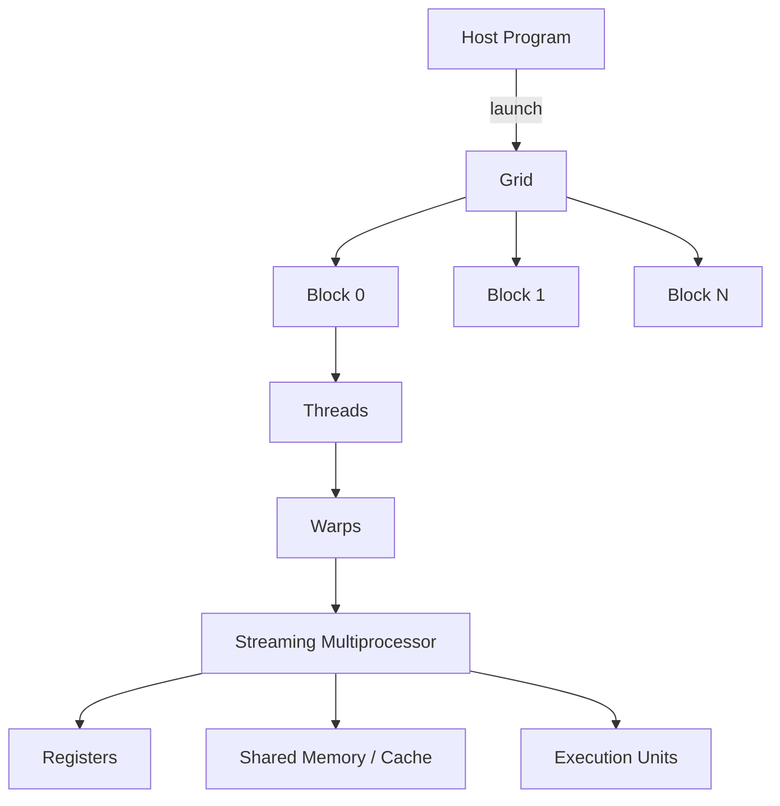

# CUDA 执行模型：一个 Kernel 怎样落到 GPU 上

配置了很多 CUDA Thread，GPU 利用率仍然不高。线程数量只说明暴露了多少并行工作，不说明每个 Block 消耗多少寄存器和共享内存、Warp 是否发生分支、访存是否合并，也不说明 Host 是否在等待同步。

CUDA 提供 Host/Device 编程模型。CPU 上的 Host 代码分配内存、准备数据并发起 Kernel；GPU 上的 Device 代码由许多线程执行。Grid、Block 和 Thread 是软件组织层级，Warp 与 SM 是理解硬件调度的关键层级。

## 一次 Kernel Launch 的层级

一次 Launch 创建 Grid，Grid 由多个 Block 组成，Block 包含多个 Thread。Block 被调度到某个 SM，并在该 SM 上完成；多个 Block 可以驻留同一 SM，前提是寄存器、共享内存、线程和 Warp 资源允许。

## Thread、Block 与 Grid

Thread 使用自己的索引处理一个或多个数据元素。Block 提供局部协作边界，同一 Block 的线程可以使用共享内存并在指定同步点等待。Grid 组织整个问题规模，不同 Block 通常不能在普通 Kernel 内做全局同步。

Block 维度应匹配数据形状和硬件限制。Thread 数过少难以形成足够 Warp，过多可能让单个 Block 占用太多资源，降低同时驻留 Block 数。选择不是背固定数值，而是结合 Kernel 的寄存器、共享内存和访存模式。

## Warp 是实际调度单元

硬件把相邻线程组成 Warp，并以共同指令流执行。Warp 内线程遇到数据相关分支时，可能先执行一条路径、屏蔽另一部分线程，再执行另一条路径，这叫分支发散。结果仍正确，但有效吞吐降低。

Warp 还能在等待内存时切换到其他可运行 Warp，以隐藏延迟。只有足够的活动 Warp 且资源允许，调度器才有选择。Occupancy 表示理论活动 Warp 比例，不等于性能；更高 Occupancy 也可能因为额外工作或缓存行为变慢。

## SM 拥有什么资源

SM 包含 Warp Scheduler、寄存器文件、共享内存/缓存和各种执行单元。Block 的资源在驻留期间占用 SM。若每线程寄存器过多或每 Block 共享内存过大，能同时驻留的 Block 会减少。

Tensor Core 等专用单元加速受支持形状和数据类型的矩阵运算。框架选择的 Kernel 必须匹配 GPU 架构、精度和布局；“安装了 CUDA”不意味着任意操作都会走最优单元。

## 内存层级与访问

寄存器最靠近线程，速度快但数量有限；共享内存由 Block 内线程显式协作；L1/L2 Cache 缓解重复访问；Global Memory 容量大但延迟高；Constant 等空间适合特定只读模式。HBM/VRAM 是设备主存，和片上存储不是同一层。

相邻线程访问连续、对齐地址时，硬件更容易合并内存事务。散乱访问会增加请求数。Tile 技术把 Global Memory 数据加载到共享内存反复使用，以计算换取更高数据复用。

## 同步与异步

Kernel Launch 对 Host 通常是异步的：Host 可以继续安排复制或其他 Kernel，直到显式同步、读取结果或依赖关系要求等待。设备内同步范围有限，Block 内 Barrier 只协调同一 Block 线程。

错误也可能在后续同步点才被观察到。排障需要记录哪个 Launch、Stream 与同步调用暴露错误，不能只看最后一条 API。跨 Stream 并发还要用 Event 或依赖保证数据在使用前完成。

## 映射一个问题时问什么

先确定每个 Thread 处理什么索引，Block 内是否需要共享数据，Block 之间是否独立；再估算每 Block 线程、寄存器和共享内存；最后观察分支、访存与同步。输入到输出的索引映射必须可手算，小规模边界和非整除长度要有保护。

当前环境没有 CUDA 设备，本篇不编译或运行 Kernel。验证方式是机制推演：给出 Grid 与 Block 大小，手工映射几个 Thread 到数据，说明它们组成哪些 Warp、占用哪些 SM 资源、哪里同步、哪里可能发散或产生非合并访问。
