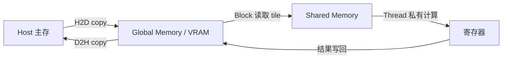

# CUDA 是什么？Kernel、Thread、Block、Warp 和 SM 如何协作

上一章把 GPU 解释成一类适合规则并行计算的设备。接下来要回答一个更具体的问题：程序员写下的一个函数，怎样变成 GPU 上成千上万个轻量工作项？如果只记住“CUDA 有很多线程”，遇到越界、死锁、显存访问慢或利用率低时仍然无法定位。CUDA 的价值在于它把 CPU 和 GPU 的职责、线程组织方式、存储位置和同步边界都写成了可观察的程序模型。

本文中的代码和命令按 CUDA C 的公开语义解释。当前环境没有以目标 GPU 编译和运行这些 Kernel，涉及设备数量、寄存器占用、实际耗时和编译器生成指令的地方只做静态检查。能从代码和文档确认的机制，与必须在设备上测量的结果会分开写。

::: info CUDA 的准确含义

CUDA 是 NVIDIA 提供的 GPU 通用计算平台和编程模型。它包括编译器、Runtime API、驱动接口、库以及描述 GPU 线程、内存和同步的执行模型。CUDA 程序通常由 CPU 端代码准备数据并启动 GPU Kernel，GPU 端代码再由大量线程并行执行。

CUDA 不是 GPU 芯片本身，也不是只负责矩阵乘的库。一个 CUDA 程序可以写向量加法、图像处理、归约和自定义模型算子。是否有效取决于任务规模、访存方式、线程分支、设备架构与数据传输成本。

:::

## CUDA 为什么要把 Host 和 Device 分开

Host 指执行 CPU 代码的主机一侧，Device 指执行 GPU Kernel 的设备一侧。Host 负责读取请求、分配或准备输入、选择 Kernel 参数、申请 GPU 内存、提交工作和处理结果。Device 负责运行 Kernel 中的线程，访问自己的全局内存、共享内存和寄存器。两边有不同的地址空间和执行队列，不能把普通 CPU 指针直接当成 GPU 指针使用。

这层分工解决的是两个问题。第一，CPU 适合处理复杂控制流，能够调用操作系统、文件系统和网络。第二，GPU 需要一次收到足够大的规则工作，才有机会让很多执行单元同时工作。Host 把许多相似的小任务整理成一个 Kernel Launch，Device 再按索引处理它们。

Host 与 Device 之间的数据复制通常经过 PCIe、NVLink 或平台上的其他互联。复制动作本身也排在 Stream 中，可能与 Kernel 重叠，也可能因为同步而阻塞。模型服务把权重长期放在 Device，是为了避免每个请求重复搬运大张量；请求 Token 和短结果才在两侧传递。

CPU 程序里写一个函数调用，通常会等函数返回后继续。CUDA Kernel Launch 默认可以异步返回，Host 先得到“工作已提交”的状态，Device 之后才执行。只有显式同步、读取 Device 结果或访问某些需要同步的 API 时，Host 才确认 Kernel 已完成。计时和错误处理必须尊重这个边界。

CUDA 的“运行”因此包含两段状态：Host 把输入和启动参数交给 Runtime，Device 在自己的 Stream 中排队并执行 Kernel。比如向量加法的函数返回，只能说明 launch 请求已提交；在 `cudaDeviceSynchronize()` 或复制结果回 Host 时才会暴露 Kernel 的非法访问。它与 CPU 函数的同步返回不同，也与 CUDA Driver 负责加载模块、Runtime 负责便捷 API 的分工不同。

如果 Kernel 失败，后续 API 可能才报告错误。代码要在关键阶段检查返回值，记录设备、Grid、Block、输入大小和同步点。没有真实 GPU 时可以静态审查这些状态关系，但不能把编译通过或命令格式正确写成吞吐已经验证。

## Kernel 是什么，为什么一次启动会产生很多 Thread

Kernel 是由 GPU 执行的函数。它的函数体写一次，却会由许多 Thread 以不同索引执行。向量加法可以让第 `i` 个 Thread 读取 `a[i]` 和 `b[i]`，写入 `c[i]`；矩阵乘则让每个 Thread 或一组 Thread 负责一个输出 tile。Kernel 描述的是一个并行工作模板，不是已经运行完的一次结果。

启动 Kernel 时，Host 指定 Grid 的维度和每个 Block 的维度。总 Thread 数通常由输入元素数量和 Block 大小决定。多出的 Thread 必须用边界条件退出，否则它会访问不存在的元素。少开的 Thread 会让一部分数据没有处理，程序可能不报错却得到不完整结果。

下面的代码用一个最小 Kernel 表示这个关系。它只作为静态示例，展示索引、边界和 Launch 形状，当前环境没有执行编译。

```cuda
__global__ void add_vectors(const float* a, const float* b, float* c, int n) {
    int i = blockIdx.x * blockDim.x + threadIdx.x;
    if (i < n) {
        c[i] = a[i] + b[i];
    }
}

// 静态示例：每个 Block 256 个 Thread，覆盖 n 个元素
int blocks = (n + 255) / 256;
add_vectors<<<blocks, 256>>>(device_a, device_b, device_c, n);
cudaError_t status = cudaGetLastError();
```

`blockIdx.x` 表示当前 Block 在 Grid 中的编号，`blockDim.x` 是每个 Block 的 Thread 数，`threadIdx.x` 是 Thread 在 Block 内的编号。三者相乘相加得到全局索引。`cudaGetLastError` 只能检查 Launch 参数或较早的异步错误，若要确认 Kernel 已完成并捕获执行错误，还需要 `cudaDeviceSynchronize` 或事件同步。代码块后的这一点很重要，异常出现的位置可能晚于真正出错的 Kernel。

## Thread、Block 和 Grid 如何表达工作范围

Thread 是 CUDA 程序中的最小逻辑执行单元。每个 Thread 有自己的索引、寄存器和局部变量，但它不是一颗独立 CPU 核心，也不能随意调用操作系统。Thread 的数量可以远大于芯片上的物理执行单元，硬件会分批调度它们。

Block 是一组可以被安排到同一个 SM 上执行的 Thread。Block 内的 Thread 可以使用 Shared Memory 交换数据，也可以在 `__syncthreads()` 处同步。Block 之间没有默认的实时同步关系，不能让一个 Block 等另一个 Block 写完一个普通全局变量再继续。需要跨 Block 协作时，通常拆成多个 Kernel 或使用专门的协作机制。

Grid 是一次 Kernel Launch 创建的全部 Block。它描述整个输入范围，可以是一维、二维或三维。向量常用一维 Grid，图像用二维 Grid，体数据或三维网格用三维 Grid。Grid 的维度只表达工作组织，不保证所有 Block 同时驻留在设备上。

这三个概念的边界可以用一张小表固定下来。表格前的解释已经说明了所有权，表格只帮助复查名称，不替代后文的执行过程。

| 层级 | 拥有的索引 | 可以共享什么 | 同步范围 |
| --- | --- | --- | --- |
| Thread | `threadIdx` 和计算出的全局索引 | 自己的寄存器与局部变量 | 没有通用 Thread 间同步 |
| Block | `blockIdx` 和 Block 维度 | Shared Memory | Block 内可同步 |
| Grid | 全部 Block | Global Memory 中的结果 | 默认不能跨 Block 同步 |

读者看到表格后应能回答一个实际问题：如果两个 Thread 属于不同 Block，它们不能直接依赖 `__syncthreads()` 互相等待。把这一点写错，会产生偶发的旧数据、竞态或死锁，而不是单纯的“GPU 不够快”。

## Warp 是什么，SIMT 为什么会受到分支影响

GPU 通常把 Thread 按固定宽度组成 Warp，NVIDIA 常见架构中一个 Warp 包含 32 个 Thread。Warp 是硬件调度和执行的粒度，Block 是程序员组织共享数据与同步的粒度，两者不能混为同一个概念。一个 Block 可以包含多个 Warp，也可能有一个 Warp 中一部分 Thread 因边界条件提前退出。

SIMT 可以理解为“单条指令，多条线程”。一个 Warp 往往同时取同一条指令，让不同 Thread 使用自己的寄存器和地址处理不同数据。当同一 Warp 内所有 Thread 都走同一个分支时，执行比较紧凑；当一半 Thread 走 `if`，另一半走 `else` 时，硬件可能先执行一条路径，再执行另一条路径，未选择路径的 Thread 暂时屏蔽。

分支发散不一定是错误。边界检查、不同 Token 的结束状态和稀疏数据都可能需要分支。问题在于分支是否频繁、是否让大量 Warp 长时间只执行少数活跃 Thread。优化时先查看真实数据分布和 Kernel 时间，不能看到一个 `if` 就武断删除它。

Warp 内的内存访问也会影响效率。相邻 Thread 访问相邻地址时，硬件更容易合并内存事务；Thread 以随机索引读巨大表时，带宽利用会变差。改变张量布局、stride 或数据类型，可能比增加 Thread 数更能影响结果。

## SM 怎样接收 Block 和管理片上资源

SM 是 NVIDIA GPU 中可以驻留并执行 Thread Block 的多功能处理器单元。一个 SM 通常包含 Warp 调度器、寄存器文件、Shared Memory、整数和浮点执行单元，以及可能的 Tensor Core。不同 GPU 架构名称和数量会变化，本文只使用公开模型，不把某一代硬件的数字当成通用规律。

当 Kernel Launch 到达设备，硬件把 Block 分配到有空闲资源的 SM。一个 Block 从开始到结束通常留在同一个 SM 上，Block 内的 Thread 不会被拆到多个 SM。若一个 Block 使用很多寄存器或 Shared Memory，同一个 SM 能同时驻留的 Block 数会减少，其他 Block 需要等待。

驻留数量常被称为 Occupancy 的一部分，但 Occupancy 不是性能分数。更高的驻留 Thread 可能帮助隐藏内存延迟，也可能因为资源变少而让每个 Thread 做更多重用。矩阵 Kernel 还要考虑 Tensor Core 使用、Shared Memory tile 和内存带宽。最终要用编译器资源报告与 Profiler 验证。

SM 资源还有明确的所有权边界。寄存器属于 Thread，Shared Memory 属于 Block，Global Memory 属于整个 Grid 和其他 Kernel 可见的设备地址空间。一个 Thread 把临时数组放进寄存器，不能让同 Block 另一 Thread 直接读取；需要交流就写入 Shared Memory，并在正确的同步点等待。

## Global Memory、Shared Memory 和寄存器怎样配合

Global Memory 通常指 GPU 设备可访问的大容量显存。它容量大但访问延迟高，适合保存模型权重、输入、输出和跨 Kernel 的中间结果。每个 Thread 直接从 Global Memory 读同一个值，可能产生重复事务；Block 内先把 tile 搬到 Shared Memory，再重复使用，常能减少访问。

Shared Memory 位于 SM 附近，容量小、速度快，生命周期通常与 Block 相同。它适合放需要被一组 Thread 复用的块状数据。Shared Memory 不是自动缓存，程序员或库 Kernel 必须明确加载和同步。两个 Thread 同时写同一地址，如果没有设计归约或同步，仍然会有竞态。

寄存器是 Thread 私有的片上存储，保存索引、累加器和临时值，访问快但数量有限。局部变量太多可能发生寄存器溢出，编译器把部分内容放到 Local Memory，实际又回到较慢的设备内存。编译器输出的寄存器数、Shared Memory 数和 Block 大小一起决定驻留能力。

下面的关系图用于解释数据从 Host 进入设备后怎样经过不同存储层级。图前已经说明图的目的，图后的文字会把箭头对应到可观察证据。



箭头不是固定的每条指令路径。简单逐元素 Kernel 可能直接读写 Global Memory，矩阵库会使用多级 Cache、Shared Memory 和 Tensor Core。验证时可从拷贝计数、Kernel 参数、编译器资源报告和 Profiler 看到哪些箭头真的发生；不能仅凭源代码中的变量名断言某个值一定在寄存器里。

## 同步、错误和资源释放分别由谁负责

`__syncthreads()` 只同步同一个 Block 中到达该点的 Thread。若一个 Block 内部分支让部分 Thread 永远不执行同步，其他 Thread 会等待，Kernel 可能卡住。跨 Block 的生产者消费者关系要用新的 Kernel Launch、原子操作或经过验证的协作机制表达。

错误可以分为参数错误、内存错误、同步错误和设备级错误。Block 维度超过设备限制可能在 Launch 时被拒绝；索引越界可能等到同步时报告；两个 Thread 写同一位置可能没有立即错误，却让结果不稳定；设备掉线或重置则需要进程重新建立 Context。日志应保存 Kernel 名、Grid/Block 形状、输入 shape、dtype 和同步点。

资源释放也有顺序。Host 先等待或确认相关 Stream 已完成，再释放 Device Pointer；否则仍在执行的 Kernel 可能访问已经归还的地址。服务取消请求时，框架要把取消传到对应 Stream 或引擎任务，不能只关闭 HTTP 连接而让 GPU 继续无限工作。

没有真实 GPU 时可以运行 `nvcc --version`、检查编译参数、静态阅读边界条件和用 CPU 版本对照结果，但不能声称某个 Block 实际落在某个 SM，也不能填写 Occupancy 或吞吐。那些结论需要目标架构上的编译和 Profiler。

## CUDA 代码怎样经过编译器、Runtime 和驱动

CUDA 源文件里可以同时出现 Host 函数和 Device Kernel。`nvcc` 驱动编译流程，把 Host 部分交给系统 C/C++ 编译器，把 Device 部分编译为面向某些 GPU 架构的机器代码或中间表示。最终程序还要链接 CUDA Runtime。编译通过只说明语法、类型和目标架构配置可以生成制品，不说明当前机器有可用 GPU。

Runtime API 是应用常用的较高层接口，例如 `cudaMalloc`、`cudaMemcpy` 和 Kernel Launch。它在进程中管理默认设备、Context、Stream 和错误状态，再调用更低层的 CUDA Driver API。驱动负责和内核驱动及硬件通信，加载 Device 代码、管理地址空间并提交命令。Runtime 版本与宿主驱动要满足兼容关系，不能只比较两个版本字符串是否完全相等。

Device 代码还要匹配目标 Compute Capability。只编译某一架构的二进制，放到不支持的 GPU 上可能得到 `no kernel image is available`。保留 PTX 可以让驱动在支持范围内即时编译，但首次加载会有编译开销，未来架构兼容也受工具链规则限制。生产镜像应记录编译目标、CUDA Toolkit、驱动最低要求和实际 GPU 型号。

框架用户虽然不直接运行 `nvcc`，仍会遇到同一条链。PyTorch Wheel 自带或依赖特定 CUDA 用户态库，自定义扩展在安装时编译，vLLM 和量化库还可能加载预编译 Kernel。Python 能导入包，只证明动态库初步可见；执行一个实际张量算子，才会经过 Context、Device 代码和 Kernel。

下面的命令适合做环境证据收集。它们不会证明模型性能，但能区分编译器、驱动和框架看到的版本。输出中主机名、GPU UUID 和内部路径在公开记录前需要脱敏。

```bash
nvcc --version
nvidia-smi --query-gpu=name,compute_cap,driver_version --format=csv
python -c 'import torch; print(torch.__version__, torch.version.cuda)'
python -c 'import torch; print(torch.cuda.is_available(), torch.cuda.device_count())'
```

`nvcc` 不存在时，已经构建好的应用仍可能运行，因为运行端不一定需要编译器；`nvidia-smi` 正常而 `torch.cuda.is_available()` 为 false，则要继续检查容器设备、用户态库和框架构建。四条命令回答的问题不同，不能拿其中一条替代其余状态。

## Stream 和 Event 怎样表达异步顺序

Stream 是 Device 工作的有序队列。同一个 Stream 中的操作按提交顺序满足依赖，先复制输入、再启动 Kernel、再复制结果，后一步不会越过前一步。不同 Stream 可能并发或交错执行，是否真能重叠取决于设备能力、资源占用和数据依赖。Stream 不是一条固定的物理执行单元。

异步复制需要满足内存和 API 条件。Host 页可被换出时，Runtime 可能无法直接做真正的异步 DMA；Pinned Memory 能支持更可靠的异步传输，但占用过多会压缩操作系统可分页内存。两个 Stream 使用同一块可写 Device Buffer，还需要 Event 或其他同步表达先后，否则结果会有数据竞争。

Event 可以记录 Stream 到达某个位置的时刻。另一个 Stream 可以等待 Event，Host 也可以查询或同步 Event。性能计时常在目标 Stream 前后各记录一个 Event，这比只用 CPU 时钟包住异步 Launch 更接近设备执行时间。Event 仍包含排队影响，是否包含数据复制要看记录位置。

默认 Stream 的语义会受到编译选项与 Runtime 模式影响，旧代码可能依赖它与其他 Stream 的隐式同步。把这类代码迁到每线程默认 Stream 后，原来偶然成立的顺序可能失效。库和应用共同使用 Stream 时，应通过 API 传递当前 Stream，而不是在内部随意切换并假设全局同步。

请求取消也要沿 Stream 所属的工作追踪。CUDA 通常不能安全地从任意指令中间强行停止一个普通 Kernel，框架会避免继续提交后续步骤，或让支持检查取消标记的长 Kernel 在边界退出。HTTP 断开只发生在 CPU；若 Engine 不传播取消，Device Queue 仍会执行已经提交的工作。

## Grid 和 Block 尺寸怎样从输入算出来

一维向量常选择 128、256 或其他设备允许的 Block 大小，再用向上取整计算 Block 数。这个选择需要让总 Thread 覆盖输入，还要兼顾 Warp 对齐、寄存器和 Shared Memory。256 不是固定最优值，只是许多简单 Kernel 的合理起点。设备限制可以从属性 API 读取，库 Kernel 则由自动调优或启发式选择。

二维图像宽 1920、高 1080 时，可以使用 `dim3 block(16, 16)`，Grid 分别对宽高向上取整。每个 Thread 用 `x`、`y` 计算像素位置，并对两个维度做边界检查。若只检查线性索引，小心行尾填充和 pitch；若数据布局是通道优先，索引公式还要加入 channel 维。

下面的计算表展示三种输入如何映射。它不声称这些参数性能最佳，只证明覆盖范围和尾部 Thread 数。

| 输入 | Block | Grid | 需要边界退出的 Thread |
| --- | --- | --- | --- |
| 1000 个元素 | 256 | 4 | 24 |
| 4096 个元素 | 256 | 16 | 0 |
| 1920×1080 图像 | 16×16 | 120×68 | 最后一行 Block 的部分 Thread |

表中 1000 个元素的 Grid 用 `(1000 + 255) / 256` 得到 4。若写成浮点 `ceil`，结果同样，但整数公式避免类型转换。对于二维输入，宽恰好被 16 整除，高度 1080 需要 68 个 Block，最后一个 Block 只有前 8 行有效。

Block 太小会让调度和指令开销占比增加，太大可能超过 Thread 上限或消耗过多资源。矩阵乘还会让一个 Thread 计算多个输出，逻辑工作量不再等于 Thread 数。参数选择要结合 Kernel 结构，不存在只看数据量就能套用的统一公式。

## 合并访存和分块为什么会改变同一公式的速度

向量加法的相邻 Thread 访问相邻 `float`，一组请求能较好地合并成较少的显存事务。若每个 Thread 访问 `a[i * stride]` 且 stride 很大，同一 Warp 的地址散开，控制器需要更多事务，读到的 Cache Line 中又有大量字节未使用。数学上仍然做相同次数的加法，等待内存的时间却不同。

矩阵按行连续存储时，逐行读取通常比逐列跨步读取友好。朴素矩阵乘会反复从 Global Memory 读取同一行或列，优化 Kernel 把 A 和 B 的小块装入 Shared Memory，让 Block 内多个 Thread 重用。Thread 先协作加载 tile，同步后计算，再加载下一块；同步位置和边界处理都要正确。

Shared Memory 还存在 Bank 组织。多个 Thread 在同一时刻访问形成冲突的地址模式，访问会被拆分。为了避免冲突，Kernel 有时会为二维数组增加一列 Padding。这个优化依赖具体访问模式和架构，源代码看到 Shared Memory 不等于已经高效。

模型中的转置、切片和 View 会改变 stride。一个逻辑上连续的张量切片可能不是物理连续，Kernel 要么支持该 stride，要么先产生 contiguous 副本。副本会占显存并增加带宽。性能调查应记录 shape 和 stride，不能只记录算子名称。

判断访存问题需要 Profiler 的 DRAM Throughput、Cache 命中、内存事务和 Kernel 时间。`nvidia-smi` 的显存占用只表示容量，无法判断访问是否合并。没有目标 GPU 时能检查索引是否相邻、是否重复加载和是否有明显转置，不能填写带宽利用率。

## Occupancy 为什么不是越高越好

Occupancy 通常描述一个 SM 上活跃 Warp 数相对于硬件上限的比例。一个 Block 的 Thread 数、每个 Thread 使用的寄存器、每个 Block 使用的 Shared Memory，以及设备每个 SM 的资源上限，共同决定能同时驻留多少 Block。任何一项先耗尽，后续 Block 都要等待。

较高 Occupancy 能在某个 Warp 等待显存时调度另一个 Warp，帮助隐藏延迟。可它不直接代表执行单元利用率。一个计算密集 Kernel 可能用很多寄存器保存 tile，Occupancy 较低却减少了 Global Memory 访问；强行减少寄存器可能导致溢出，反而更慢。

可以做一个解释性计算。假设某 SM 最多驻留 2048 个 Thread，Block 有 256 个 Thread，只按 Thread 上限最多是 8 个 Block。如果 Shared Memory 上限只能容纳 4 个这样的 Block，实际 Thread 驻留上限就是 1024；若寄存器再限制到 3 个 Block，就只剩 768。真实上限要读取目标架构属性与编译器资源报告。

编译器可以输出每个 Kernel 的寄存器数和静态 Shared Memory，动态 Shared Memory 则在 Launch 时传入。Occupancy Calculator 能给理论驻留数量，但无法知道分支、内存或指令依赖。正确流程是用计算排除明显不合理参数，再在相同输入上比较 Kernel 时间和业务结果。

Serving 场景还要把 Kernel Occupancy 与请求层指标分开。一个 Kernel 高效，不保证 API 延迟低；请求可能在队列等待、Tokenizer 或通信阶段耗时。调度器也可能为了 Batch 吞吐延迟单个请求。设备指标和 TTFT、TPOT 必须按同一 request ID 或时间窗关联。

## 怎样让 CUDA 失败留下可定位的证据

最基本的检查是在每次关键 Runtime 调用后读取返回码，并在 Kernel Launch 后检查错误。异步执行意味着还要在测试边界同步，否则越界可能拖到下一次 API 才暴露。调试构建可以临时设置同步启动，让异常靠近根因，但它改变并发和性能，只用于诊断。

输入证据包括 shape、dtype、stride、Device 编号和 Buffer 大小。执行证据包括 Kernel 名、Grid、Block、动态 Shared Memory、Stream 和前后 Event。输出证据包括数值误差、未写区域和非法值。把这些字段与代码版本、CUDA Runtime、驱动和 GPU 架构放在一起，另一位开发者才有机会复现。

内存检查工具能检测越界、未初始化读取和部分竞态，Profiler 能解释时间和访存，编译器报告说明资源使用。三者回答不同问题。一次内存检查通过，不能证明性能；Profiler 显示 Kernel 快，也不能证明结果正确。CPU 参考实现或已知小样本仍然需要保留。

长时间服务还要记录设备级错误后的恢复。某些错误只影响一次请求，某些错误会让 CUDA Context 进入不可继续使用的状态，需要工作进程退出并由编排系统重建。健康检查若只测 HTTP 线程，会让已经失去 GPU 的进程继续接流量。最小 Device 运算或引擎状态更接近真实就绪。

静态阶段能运行编译、Lint、边界推导和 CPU 对照；目标 GPU 阶段再执行内存检查、数值断言、取消、压力与资源回收。验证记录要写明执行层级，不能把“代码已编译”改写成“CUDA 路径已通过”。

## 一个向量加法怎样完整经过 CUDA

输入是长度为 1000 的两个 `float32` 数组，Host 分配并填充 `a`、`b`，把它们复制到 Device，按每 Block 256 个 Thread 启动四个 Block。多出的 24 个 Thread 通过 `i < n` 退出，前 1000 个 Thread 分别写入 `c[i]`。Kernel 完成后，Host 同步并把 `c` 复制回来。

状态变化依次是 Host 数据就绪、Device Pointer 分配、H2D 拷贝排队、Kernel 进入等待队列、Block 被分配到 SM、Thread 读取并计算、D2H 拷贝完成。一个请求的输出是 1000 个相加结果，验证可以用 CPU `a[i] + b[i]` 对照，并检查最大误差和越界区域没有写入。

如果把 Block 数写成 `n / 256` 的整数除法，1000 只会启动三个 Block，最后 232 个元素没有被处理。这是输出缺失，不一定触发 CUDA 错误。如果去掉边界检查，四个 Block 会让最后 24 个 Thread 读取和写入数组外地址，可能得到非法访问错误，也可能破坏相邻内存。失败证据分别是输出长度不足、同步时的 `illegal memory access` 和设备错误状态。

验证完成后才释放 Device Pointer。若只调用 `cudaGetLastError` 而没有同步，可能在 Kernel 仍未执行完时就打印“成功”；若只比较一个元素，无法发现尾部数据损坏。这个过程把输入、状态、调用顺序、输出、失败证据和验证结果放在同一条链上。

在真实验证中还应分别记录冷启动和热启动。第一次运行包含 Context 建立、模块加载和可能的 JIT 编译，第二次运行更接近服务已经就绪后的 Kernel 时间。两种时间不能混成一个平均值。若把 Block 从 256 改成 128，先确认输出仍与 CPU 参考一致，再比较同步后的 Event 时间和内存错误报告。这样才能把“结果正确”和“参数更快”分成两个独立结论。

最后再检查资源释放后的状态。Device Pointer 全部归还，进程仍可能保留 Context 和模块代码，因此设备占用不会回到零；进程退出后占用才应消失。若第二次运行结果变化，除了数值误差，还要排查未初始化内存、错误的 Stream 依赖和上一次 Kernel 留下的设备错误。完整验证必须重复运行，而不是只接受第一次成功。

测试记录还要保存输入随机种子与 CPU 参考实现版本，保证下一次比较面对的是同一组数据和同一种容差。
