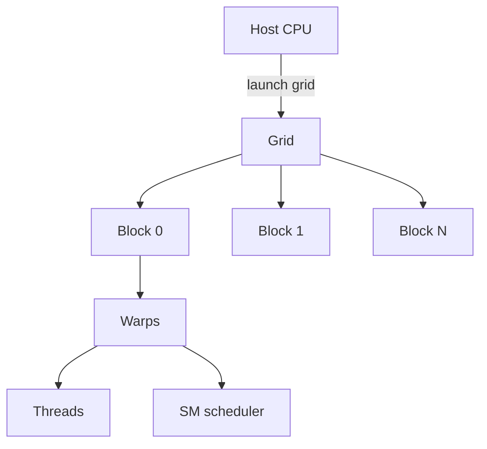

# CUDA 执行模型：Thread、Block、Grid、Warp 与 SM

CUDA 代码把线程数写得很大，GPU 却没有按预期加速。线程数量只是工作声明，真正影响执行的是 Block 如何分配到 SM、Warp 是否分支、寄存器和共享内存是否足够，以及全局内存访问是否合并。

## 一次 Kernel Launch 的层级



Grid 是一次 Kernel 的全部工作，Block 是可以独立调度的协作单元，Thread 执行同一 Kernel 的不同数据索引。硬件通常以 Warp 为执行和分支的基本组，Block 会被放到某个 SM 上驻留，直到其中线程完成。

## 索引映射和边界检查

```cpp
__global__ void add(const float* a, const float* b, float* c, int n) {
  int i = blockIdx.x * blockDim.x + threadIdx.x;
  if (i < n) c[i] = a[i] + b[i];
}

// 解释性 launch：block=256，grid 覆盖 n 个元素
add<<<(n + 255) / 256, 256>>>(a, b, c, n);
```

输入是长度为 n 的数组，执行过程是每个 Thread 计算一个索引，输出写入 c[i]。if (i < n) 防止最后一个 Block 越界。示例展示索引和层级，不声称在本机 GPU 上运行，也没有包含错误检查、内存分配和同步。

## Warp 分支和资源驻留

同一 Warp 内的线程走不同分支时，硬件可能分段执行，吞吐下降。Block 使用的寄存器和共享内存越多，单个 SM 能同时驻留的 Block 越少。增加线程数可能提高并行度，也可能因为资源占用降低 occupancy。occupancy 只是线索，访存和算术瓶颈仍需单独分析。

## 同步的所有者

| 同步范围 | 能保证什么 | 不能保证什么 |
| --- | --- | --- |
| 同一 Block 的 __syncthreads | Block 内共享内存访问顺序 | 不同 Block 之间的即时顺序 |
| Kernel 结束 | 前一个 Kernel 的全局结果可见 | Host 端异步调用已完成 |
| Host/Device 同步 | CPU 得到设备完成结果 | 下一个 Kernel 一定高效 |

## 机制推演的边界

::: warning
**未实测**

Warp 大小、寄存器分配、缓存和编译器行为要以目标 GPU、CUDA 版本和编译结果为准。下一篇从 Driver、Runtime 和 nvidia-smi 进入显存账本，解释模型为什么在第二个请求时 OOM。
:::

## 内存访问决定线程是否真的协作

相邻线程若访问相邻地址，硬件通常能合并为较少的内存事务；若每个线程跨很大步长访问，带宽会被浪费。共享内存可以复用一个 Block 内反复使用的数据，但也会占用 SM 资源并可能产生 bank conflict。

这类优化必须从正确性开始：先确保索引边界、数据类型、同步范围正确，再用 profiler 判断瓶颈是算术、全局内存、分支还是占用。只凭肉眼调整 block size 很容易得到偶然更快、换形状就变慢的 Kernel。

## Host 的异步提交也会造成误判

Kernel launch 常常对 Host 异步返回，CPU 继续执行不代表 GPU 已完成。若在错误位置调用同步，可能把前一个 Kernel 的失败误归给后一个调用；若完全不检查错误，又会让非法访问延后暴露。

调试阶段通常在关键边界检查 launch 错误并同步定位，性能阶段再减少不必要的同步。两种模式不能混为一谈：为了测速去掉同步，不能变成忽略正确性和错误传播。
