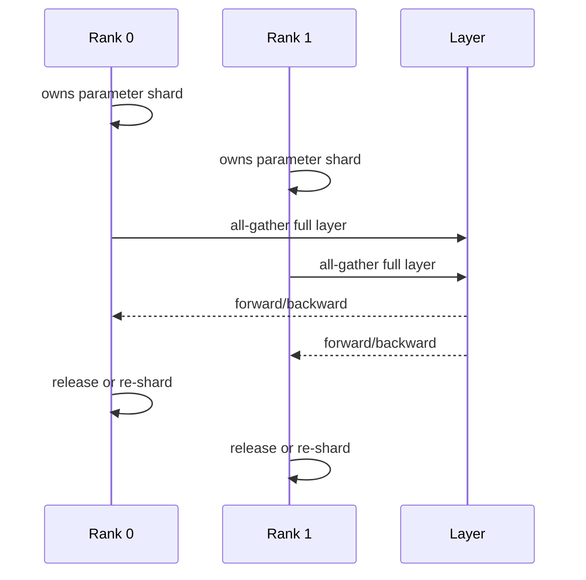

# DeepSpeed ZeRO：状态分片、Offload 与显存边界

训练模型的参数本身能放进显存，Optimizer State 和梯度却让任务 OOM。ZeRO 的核心不是魔法压缩，而是改变这些状态由哪个 Rank 持有，并在需要计算时付出通信或 Offload 的代价。

## 训练显存里到底有什么

| 状态 | 用途 | 常见占用来源 |
| --- | --- | --- |
| Parameters | 前向/反向计算 | 模型权重和混合精度副本 |
| Gradients | 反向传播结果 | 每参数的梯度张量 |
| Optimizer State | 动量、二阶矩等 | Adam 类优化器可能多份状态 |
| Activations | 反向所需中间结果 | batch、序列长度和检查点策略 |
| Workspace/通讯缓冲 | Kernel 和 collective | 临时峰值与分片重组 |

只看参数大小会低估训练峰值。ZeRO-1 主要分片 Optimizer State，ZeRO-2 进一步分片 Gradients，ZeRO-3 连 Parameters 也分片。每一级都在显存收益和通信复杂度之间交换。

## ZeRO-3 的一次参数访问

参数在层计算时短暂重组，完成后重新分片。通信峰值、预取和重叠策略会影响性能。Checkpoint 也要说明是每 rank 分片还是可直接加载的 consolidated 形式，否则恢复时可能出现版本和内存问题。

## CPU/NVMe Offload 的代价

把 Optimizer State 或参数放到 CPU/NVMe 可以降低 GPU 常驻显存，却引入 PCIe、内存带宽、IO 延迟和容量约束。Offload 适合容量优先的任务，不代表训练会更快。要记录数据搬运、预取、缓存和失败恢复的边界。

## 配置阅读要问四个问题

| 问题 | 对应证据 |
| --- | --- |
| 分片级别是什么？ | zero_stage、参数/梯度/优化器所有权 |
| 谁持有完整权重？ | 前向/保存/评估时的 gather 行为 |
| 峰值在哪里？ | 重组、激活、通信和 checkpoint |
| 恢复需要什么？ | 分片文件、元数据、随机状态和版本 |

::: warning
**未实测**

DeepSpeed 配置字段和版本行为要以目标版本文档与实验为准，本文只解释状态流动。下一篇继续多卡通信，说明 NCCL Collective 为什么会让一个 rank 的问题扩散成全局挂起。
:::

## 分片 Checkpoint 的可移植性需要设计

按 rank 保存的 ZeRO checkpoint 体积和恢复速度较好，但可能依赖相同或兼容的 world size、分片规则和 DeepSpeed 版本。用于发布或跨环境验证时，常需额外导出可加载的权重格式，并记录转换过程和哈希。

恢复脚本应先验证所有 shard、元数据和优化器状态是否齐全，再启动 collective。少一个 shard 时不能“尽量加载”，因为参数和状态的所有权已经不完整。这里的保守性是在保护训练正确性。

## 激活检查点与 ZeRO 解决的是不同账本项

ZeRO 主要减少参数、梯度和优化器状态的复制，activation checkpointing 则以重新计算换取中间激活显存。两者可以组合，但会同时改变计算、通信和训练时间。只开一个开关却期待解决所有 OOM，常会误判峰值来源。

制定方案时先画出每个阶段的峰值：前向、反向、参数 gather、optimizer step 和 checkpoint 保存。针对最大的那一项选择分片、重算、Offload 或减小 batch，效果才可解释。
