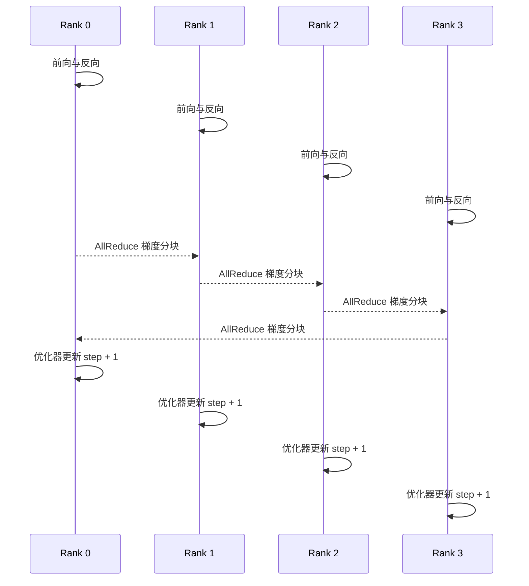

# 分布式训练是什么？为什么一张 GPU 不够时需要并行策略

训练模型需要保存权重、梯度、优化器状态和前向激活，还要运行前向、反向与参数更新。模型变大或序列变长后，一张 GPU 可能先在容量上装不下，也可能装得下但训练时间太长。增加 GPU 只有在明确拆分什么状态、怎样同步和失败后怎样恢复时，才会形成有效训练系统。

分布式训练不是把单卡脚本复制到多台机器就自动加速。数据、模型层、张量、序列和流水线都可以拆，每种策略改变显存、通信、Batch 语义和检查点。本文解释策略与基础设施边界，不给未经目标 GPU、网络和模型实测的吞吐数字。

::: info 分布式训练的准确含义

分布式训练是让多个进程、GPU 或节点协作完成同一个模型优化任务。它通过数据并行、模型并行和状态分片等策略划分计算与存储，再通过通信保持所需的一致性。

分布式训练不等于多任务并行。八张 GPU 分别训练八个独立模型属于任务并行；八张 GPU 共同完成同一次参数更新，才是本文讨论的分布式训练。

:::

## 单卡训练的显存和时间花在哪里

训练状态至少包括参数、梯度和优化器状态。Adam 常为每个参数保存一阶、二阶矩以及可能的高精度主权重，字节数可显著高于模型权重本身。前向激活随 Batch、Sequence、Hidden Size 和层数增长，反向需要保留或重算它们。

临时工作区、通信 Buffer、CUDA Context 和分配器也占显存。权重理想公式显示能装下，不表示训练峰值能装下。混合精度减少部分张量，梯度缩放和主权重仍有额外状态。Activation Checkpointing 用额外计算换激活显存。

时间由前向、反向、优化器、数据加载、通信和保存组成。GPU 利用率低可能是数据管道、同步或小 Batch，不能只通过增加 GPU 解决。单卡基线先测每步时间、显存峰值、吞吐和数据等待。

Batch 语义要固定。Global Batch 等于每设备 Micro Batch 乘数据并行数乘梯度累积步数。增加 GPU 后若 Global Batch 改变，优化过程和学习率可能变化，不能把收敛差异只归为并行实现。

单卡边界决定并行目标：状态装不下需要分片，激活太大需要序列或流水线与检查点，时间太长可用数据并行提高样本吞吐。目标不同，策略不同。

分布式训练是把一次训练的计算、模型状态或数据放到多个进程和设备上协同完成。它解决两类问题：单卡的显存放不下完整状态，或者单卡计算时间无法满足训练周期。分布式并不等于“多插几张卡就会线性加速”，因为每个策略都引入通信、同步、数据切分和恢复责任。

例如 4 个 Rank 做数据并行时，每个 Rank 通常拥有完整模型，读取不同样本，反向后用 AllReduce 合并梯度；做张量并行时，一层矩阵按列或行拆分，前向中间结果要在 Rank 间交换；流水线并行则把层分到不同阶段，激活和梯度沿阶段传递。三者的状态所有权、通信时机和空闲气泡都不同。

它与普通多进程程序的区别在于，训练步必须满足数值和版本一致性。一个 Rank 提前跳过通信、读取不同数据或保存不同步的参数，其他 Rank 可能继续等待，或者训练悄悄分叉。Checkpoint 至少要记录并行拓扑、Global Step、模型和优化器状态、数据游标以及可恢复的分片布局。

下面的表格用于把“放不下”和“跑得慢”对应到策略，不代替目标模型上的基准测试。

| 现象 | 可能策略 | 新增代价 | 先收集的证据 |
| --- | --- | --- | --- |
| 权重、梯度或优化器装不下 | FSDP、ZeRO、参数分片 | AllGather、Reduce-Scatter、Checkpoint 重分片 | 各阶段显存峰值与通信时间 |
| 单卡计算太慢但状态能装下 | 数据并行 | 梯度同步、输入切分、网络带宽 | 每步计算与 AllReduce 时间 |
| 单层参数或激活超过单卡 | 张量或流水线并行 | 跨卡激活、流水线气泡、拓扑约束 | 层布局、通信路径与空闲比例 |

表中的“可能”很重要。先通过单卡或小规模作业确认模型和数据正确，再逐项打开并行策略；一次同时改变 Batch、精度、并行和 Checkpoint，很难知道 Loss 变化来自哪里。

分布式训练的容量表还要把通信组大小写出来。总 World Size 可能同时包含数据、张量和流水线坐标，ZeRO 或 FSDP 的分片度只对数据并行组生效。四节点各八卡并不自动给每个参数四十份或三十二份通信，组拓扑和 Rank 映射决定实际内存与网络压力。配置变更后打印 global rank、local rank、DP/TP/PP 坐标，才能把日志还原到设备。

保存与恢复是并行策略的一部分。每个 Rank 只写自己的 shard 时，Manifest 要记录 shard 数、offset、World Size、模型 revision 和 global step；保存完成标记要等所有 Rank 的摘要通过。改变并行度恢复训练时，框架可能需要重分片，未支持的布局要先转换成统一权重。缺一个 shard 时应明确失败，不从其他 Rank 猜状态。
## 数据并行怎样复制模型并同步梯度

数据并行让每个 Rank 保存一份完整模型，处理不同的 Micro Batch。前向和反向后，每个 Rank 得到本地梯度，再通过 AllReduce 求和或平均，使所有 Rank 使用一致梯度更新参数。下一步每份模型仍相同。

它适合模型和训练状态能放进单卡，但需要更高样本吞吐的情况。模型状态被复制，显存不会随 GPU 数下降；通信量主要来自梯度。网络慢或参数大时，AllReduce 会占据明显时间。

DistributedDataSampler 把样本划给不同 Rank，并在每个 epoch 使用共同种子打乱。样本重复或遗漏会改变训练数据。最后一个 Batch、Drop Last 与断点恢复的位置都要记录，不能只保证代码启动。

梯度累积让每个 Rank 连续处理多个 Micro Batch 后再同步，增加 Global Batch 并减少同步频率。使用 `no_sync` 等机制时，最后一次必须同步。损失缩放和梯度平均要与 Global Batch 一致，避免多除或少除世界大小。

一个 Rank 失败时，传统同步数据并行的所有 Rank 都无法继续这一轮。训练作业通常整体重启并从最近 Checkpoint 恢复。Elastic Training 能改变成员，但模型、优化器、数据进度和 Batch 语义需要专门设计。
## 张量并行怎样拆一层矩阵

张量并行把一个层的权重矩阵和计算沿某个维度切到多个 Rank。例如线性层按输出列切分，每个 Rank 计算部分输出，再按下一层需求 AllGather 或 Reduce-Scatter；按输入行切分则需要对部分结果做求和。

它能让单层权重和部分激活分散到多卡，适合模型层本身单卡装不下。每层频繁通信，对 GPU 互联要求高，通常优先放在同一节点的 NVLink 或 NVSwitch 域。跨慢网络做细粒度张量并行，通信可能淹没计算。

分片维度必须与注意力 Head、Hidden Size 和 Kernel 对齐。Tensor Parallel Size 不是任意数字，模型维度无法整除时可能不支持或需要 Padding。Embedding 和输出头也有各自分片方式。

每个 Rank 只保存本分片权重，Checkpoint 需要记录分片布局。改变并行大小时，不能直接让两个 Rank 读取四 Rank 分片，需重分片或加载统一格式。发布制品要区分训练分片和可移植模型权重。

张量并行不增加独立样本数，本质上共同完成一个样本或 Batch 的层计算。它可以与数据并行组合，形成二维并行组。每个 Rank 属于哪个组必须固定并进入日志。
## 流水线并行怎样按层分阶段

流水线并行把连续模型层分给不同 Stage。输入 Micro Batch 先经过 Stage 0，再传激活到 Stage 1；反向按相反方向传梯度。不同 Micro Batch 在不同 Stage 重叠，像流水线一样提高设备利用。

如果一次只发送一个 Batch，后续 Stage 等待前面，前面又等待反向，会产生 Bubble。把 Global Batch 切成多个 Micro Batch 能填充流水线。调度算法如 1F1B 决定前向和反向交错，影响激活存储和 Bubble。

Stage 划分要平衡计算、参数和激活。按层数平均不一定按时间平均，Embedding、Attention 和输出头成本不同。某个 Stage 慢会让其他 Stage 等待。Profiler 和显存快照用于调整边界。

跨 Stage 通信传激活与梯度，消息大小随 Micro Batch、Sequence 和 Hidden 变化。节点间网络较慢时，Stage 边界和压缩影响性能。每个通信要有顺序，错位会死锁或把 Micro Batch 结果配错。

流水线 Checkpoint 按 Stage 保存权重和优化器状态，恢复时所有 Stage 使用同一个训练 step。缺失任一 Stage 不能宣告完整恢复。改变 Stage 数同样需要重分片。
## 序列并行和上下文并行解决什么问题

长序列让激活和注意力状态增长。序列并行把某些算子的 Sequence 维切到多个 Rank，减少每卡激活；上下文并行更广泛地让多个 Rank 共同处理长上下文，并交换注意力所需的 Key、Value 或局部结果。

它与数据并行不同。数据并行让 Rank 处理不同样本，序列并行让 Rank 共同处理同一样本的不同位置。通信模式也不同，可能需要 AllGather、Reduce-Scatter、Ring 或点对点传输。

并非所有层都能按 Sequence 独立计算。LayerNorm、Attention 和位置编码有不同依赖，框架会在特定边界切分。实现支持的模型架构、Mask 和可变长度要验证，不能把参数打开就视为正确。

长序列训练还受数据加载、Padding 和 FlashAttention 等 Kernel 影响。序列并行减少部分激活，不自动减少权重和优化器。若主要问题是模型状态，ZeRO 或张量并行更直接。

正确性测试使用短序列对比单卡损失和梯度，再逐步增加长度。浮点并行顺序会产生小差异，容差要有依据；系统性偏差、Mask 错位和 NaN 不能用“分布式误差”解释。
## 多种并行策略怎样组成拓扑

大模型训练常把数据并行、张量并行和流水线并行组合。World Size 可以写成 `DP × TP × PP`，再叠加序列或专家并行。每个 Rank 有全局编号，也属于不同通信组。组创建顺序在所有 Rank 必须一致。

例如 16 张 GPU 使用 DP=2、TP=4、PP=2。每个数据并行副本包含 8 Rank，内部四卡张量组和两段流水线共同处理模型；两个数据并行副本处理不同样本并同步相应梯度。这个布局只是机制示例，不代表最佳配置。

拓扑映射尽量让频繁通信留在高速域。TP 通常放同节点高速互联，PP 可跨节点传较少但较大激活，DP 梯度通信可跨更多节点。实际取决于网络、模型和框架，必须通过 NCCL 测试与训练 Profiler 验证。

进程启动器给每个 Rank 设置 world size、rank、local rank、master address 和端口。环境不一致会让进程等待或加入错误组。作业日志必须打印组布局与 Node/GPU 映射，不能只看总 Rank 数。

组合并行会增加 Checkpoint 与恢复复杂度。模型、优化器、随机数、数据进度和调度器都要按组保存，恢复时验证所有分片属于同一个 global step。
## 同步训练怎样保证一步参数更新一致

一次同步训练步骤从所有 Rank 读取各自数据开始。前向产生损失，反向产生局部梯度，并行组执行通信得到所需完整或分片梯度。所有 Rank 完成通信后，优化器更新当前参数，step 计数加一。

随机数也要管理。Dropout、数据打乱和数据增强需要按全局或 Rank 种子设计，保证可复现但不让所有 Rank 拿到完全相同样本。Checkpoint 保存 CPU、CUDA 和数据加载器随机状态。

梯度缩放在混合精度中检测 Overflow。一个 Rank 出现 Overflow 时，所有相关 Rank 要一致跳过更新，否则参数分叉。通信异常、NaN 和梯度裁剪也需要全局一致决策。

异步训练允许不同 Worker 使用陈旧参数，吞吐和容错不同，优化语义也改变。本文默认同步训练，不能把参数服务器异步方法的结论直接套入 AllReduce 训练。

一致性验证比较相同种子和小数据上的单卡与多卡损失、梯度范数和若干参数。完全逐位相同不总是可行，但差异范围、趋势和最终评测要解释。
## 数据管道怎样避免 GPU 等待和样本重复

数据存储、Shard、Shuffle、Tokenize、Batch 和预取组成输入链。每个 Rank 读取自己的分片，DataLoader Worker 并发预处理，Pinned Memory 与异步复制把 Batch 送入 GPU。任何一层慢都会让训练迭代等待。

数据集版本和样本顺序进入训练身份。在线追加数据会让同一 Checkpoint 无法复现，发布训练集 Manifest 和 Hash 更可靠。敏感数据按租户与许可控制，不因为训练作业在内部就自动获得全库权限。

样本分片要处理 World Size 与最后一批。恢复后从 epoch 和 offset 继续，不能从头重新训练而计数不变。Elastic 成员变化时，数据划分更复杂，需要框架支持和去重策略。

数据缓存能降低对象存储压力，Node 本地缓存按数据版本隔离。多个 Rank 同时下载使用锁与原子文件，避免读到部分 Shard。缓存清理保留正在使用和回滚训练版本。

监控记录 DataLoader 等待、每 Rank 样本数、重复/丢失检查、Token 吞吐和 I/O。GPU utilization 低时，先判断是否 data time 上升，再修改 Batch 或并行。
## Checkpoint 需要保存哪些状态

Checkpoint 不仅是模型权重。继续训练需要参数、优化器状态、学习率调度器、全局 step、随机数、梯度缩放、数据进度和并行布局。只保存权重可以用于推理或重新开始优化，不能无损续训。

分布式 Checkpoint 可以每 Rank 写分片，或汇总后保存。汇总占主存和网络，分片需要 Manifest 保证完整。先写临时目录，每个 Rank 完成并写 Hash，Coordinator 确认全部分片后原子发布 ready 标记。

保存过程可能与训练异步重叠，但内存快照要一致。某些框架复制状态到 CPU 再后台写，对主存和 I/O 有峰值。Checkpoint 频率在恢复损失和性能之间取舍，不能只看磁盘价格。

恢复先读取 Manifest、验证所有 Shard 和 global step，再按并行布局加载。缺一个分片或 Hash 不符，整份 Checkpoint 不可用。定期在隔离作业做恢复演练，文件存在不等于可恢复。

保留策略通常保留最近、里程碑和最佳评测版本。删除前确认没有运行作业、评测或发布引用，至少有一个已验证恢复点。对象存储生命周期规则要和训练控制面引用协调。
## 作业调度和集群资源怎样配合

分布式作业需要一组 GPU 同时可用。普通 Pod 逐个调度可能出现部分 Rank 启动、其余 Pending，已占 GPU 一直等待。Gang Scheduling 或队列系统在资源满足一组时共同启动，减少死锁式占用。

训练 Job 声明 GPU、CPU、主存、共享内存、网络和存储。节点选择与拓扑约束让 TP 组落在高速互联域。高优先级在线 Serving 与训练任务要有不同队列、Taint 和抢占策略。

抢占训练前先保存 Checkpoint 或使用可恢复边界。直接 SIGKILL 会丢失最近步骤，所有 Rank 都要结束，不能让残留进程占 NCCL 端口和 GPU。作业控制器识别终态并决定从哪个 Checkpoint 重启。

启动 Rendezvous 负责 Rank 发现和组建。Master 地址、端口、World Size 和作业 ID 必须一致。Node 故障、DNS 和防火墙会让所有 Rank 卡在初始化，超时与日志要给出哪个 Rank 未加入。

队列公平按项目、优先级和 GPU 小时预算，不让一个实验占满集群。等待时间与可用资源进入用户界面，避免开发者反复提交重复 Job。
## 一次训练步骤怎样画成计算与通信

下面的图用四个数据并行 Rank 说明一次同步步骤。每个 Rank 处理不同 Batch，梯度通过 AllReduce 一致后才更新。

图中的 AllReduce 由多轮通信实现，不只是四条消息。任何 Rank 未参与，其他 Rank 通常等待或超时。更新前所有 Rank 的梯度语义要一致，更新后参数继续一致。
## 梯度为什么需要求和或平均

假设四个 Rank 各处理一份 Micro Batch，得到本地梯度 `g0` 到 `g3`。若目标损失定义为整个 Global Batch 的平均，通信后每个 Rank 应使用 `(g0 + g1 + g2 + g3) / 4`，或者框架用求和后在损失/优化器其他位置完成等价缩放。

代码里常见损失已经按每卡样本平均，DDP 又对 Rank 梯度平均。改变 World Size 后若学习率和 Global Batch 不变，更新量应保持可比。若错误地再次除以 World Size，梯度会过小；完全不平均则随 GPU 数增大。

梯度累积进一步改变分母。四次 Micro Batch 累积后再同步，损失可以每次除以累积步数，或最终梯度统一缩放。最后不足完整累积的 Batch 如何处理要明确，不能让 epoch 末更新量随机变化。

混合精度的梯度缩放先放大损失，反向后检查 Overflow，再反缩放、裁剪和通信，具体顺序由框架实现。所有 Rank 对 Overflow 要一致，否则有的更新、有的跳过，参数立即分叉。

验证用小模型和固定数据计算单卡 Global Batch 梯度，再与多卡结果比较。记录损失 reduction、World Size、累积和学习率。只看训练能收敛，可能很晚才发现更新尺度错误。
## 并行效率怎样计算，为什么 GPU 增多不线性加速

Strong Scaling 固定总问题规模，增加 GPU 后看单步时间下降；Weak Scaling 让每 GPU 工作量大致固定，看总吞吐。两种实验回答不同问题。训练团队说“八卡效率 80%”前要说明相对哪种基线和 Batch。

加速比是单卡时间除以多卡时间，并行效率再除以 GPU 数。单卡每步 8 秒、四卡 2.5 秒，加速约 3.2，效率约 80%。这个示例没有计入模型必须缩小才能单卡运行的情况，不能用于超大模型。

效率损失来自通信、同步等待、数据输入、Pipeline Bubble、负载不均、Kernel 形状变小和额外内存操作。GPU 越多，单 Rank 计算可能变少，通信比例上升。网络拓扑和 Collective 算法也会改变曲线。

扩大 Global Batch 可以提高每 GPU 工作量与吞吐，却改变优化语义。吞吐高不代表相同样本数下更快达到目标质量。报告同时给 samples/s、tokens/s、time-to-quality 和最终评测，避免只优化硬件利用。

扩展测试逐级增加 1、2、4、8 卡，每级固定版本和数据。记录计算、通信、DataLoader、Checkpoint 和 Bubble。找到效率明显下降点后，再决定增加 GPU、改变并行维度或优化网络。
## 混合精度和梯度检查怎样影响稳定性

FP16、BF16 和 FP32 在范围与精度上不同。训练常用低精度矩阵计算和更高精度累加或主权重，减少显存并提高吞吐。硬件、框架和模型决定支持，不能只把 dtype 改成字符串。

FP16 范围较小，Loss Scaling 用于减少梯度下溢；出现 Inf/NaN 时动态缩放器降低 Scale 并跳过更新。BF16 范围接近 FP32，通常不需同样缩放，但精度位较少，仍可能有数值不稳定。

分布式环境要汇总 Overflow 和非有限梯度。一个 Rank 检测到异常，所有 Rank 统一跳过 step 并更新 Scale。仅在本地处理会让 step、参数和优化器状态不一致，下一次 Collective 可能继续传播 NaN。

梯度裁剪可按全局范数，需要跨分片求和平方再开根。ZeRO 或张量并行状态不完整时，不能用本地范数当全局。框架实现要经过小模型对照，监控记录 global grad norm 与 clipped 比例。

稳定性验证检查损失、Scale、Overflow、NaN、梯度范数和评测。低精度带来的小差异允许在容差内，持续发散或某 Rank 异常要停止。性能改善必须在质量通过后才成立。
## Elastic Training 与普通重启有什么区别

普通同步作业的 World Size 固定，任一 Rank 失败后全部退出，从 Checkpoint 以相同布局重启。流程简单，适合固定资源。Elastic Training 允许成员在边界重新加入或改变 World Size，需要 Rendezvous、数据重分片和 Batch 语义支持。

World Size 改变后，Global Batch 若保持需要调整 Micro Batch 或累积；若不保持，学习率和优化路径变化。数据 Sampler 也要重新分配，避免已经处理样本重复。模型和优化器分片可能需要重新构造。

Elastic 并不让任意 Kernel 中断后无损继续。通常在步骤边界、Worker 集合重新形成后从最近一致状态恢复。节点反复抖动会让作业不断重组，重启成本可能高于等待资源稳定。

Rendezvous 服务保存作业 ID、成员和世代。旧 Rank 迟到不能加入新世代，网络分区不能形成两个同时更新的组。超时和最小/最大成员数必须配置，日志要显示每次世代变化。

选择 Elastic 前先明确业务价值：可抢占集群、长时间训练和动态资源可能受益；严格复现、复杂并行分片和短作业可能更适合固定重启。支持声明要通过成员增减和数据一致性测试。
## 分布式训练怎样做可观测和故障注入

每个 Rank 记录 global/local rank、Node、GPU UUID、并行组、step、Micro Batch、Loss、显存和每阶段时间。聚合指标既看全局也看最大/最小 Rank，平均值会掩盖一个 Straggler。通信和 DataLoader 时间单独量。

Trace 可对少量步骤采样，标记前向、反向、Collective、优化器和 Checkpoint。全量每 Kernel Trace 开销太高，Profiler 在候选短窗口使用。训练日志不打印原始敏感样本，使用 dataset ID 和 batch Hash。

故障注入可以终止一个 Rank、断开一条网络、让对象存储变慢、损坏一个 Checkpoint 分片或制造 NaN。断言其他 Rank 超时并退出、控制器不无限重试坏分片、恢复从最后完整 step 开始。

性能告警包括 Straggler、通信占比、DataLoader 等待、显存接近峰值和 Checkpoint 变慢。正确性告警包括 Loss 非有限、参数分叉、样本计数不一致和恢复 step 回退。两类告警动作不同。

运行报告保存模型、代码、数据、容器、驱动、NCCL、并行配置和环境。没有这些身份，重复实验无法解释差异。训练完成后验证最终 Checkpoint 可加载并转换为推理制品，不能只看 Job Succeeded。
## 一次四卡训练失败后怎样完整恢复

输入是固定模型 Revision、数据 Manifest、四张同型号 GPU、DP=4、Global Batch 128，每卡 Micro Batch 8，梯度累积 4 步。四个 Rank 初始化进程组，Sampler 按 Rank 分配样本，前向和反向完成后 AllReduce 梯度，优化器更新 global step 101。

状态包含模型、优化器、学习率、随机数、Sampler offset 和并行布局。训练在 step 120 创建 Checkpoint，四个 Rank 分别写 Shard 和 Hash，Coordinator 确认完整后发布 Manifest。随后 Rank 2 所在 Node 故障，AllReduce 超时，所有 Rank 停止，不再推进 step。

作业控制器释放残留资源，重新获得四张 GPU，从 step 120 Checkpoint 恢复。加载前验证所有 Shard、布局和数据版本，Sampler 从保存位置继续。第一个恢复步骤的损失、学习率和梯度范数与故障前范围一致。

失败证据包括 Rank 2 失联、Collective 超时、其他 Rank 等待、最后完整 Checkpoint 和未提交 step。验证结果包括 global step 连续、样本没有明显重复/遗漏、四 Rank 参数一致和新 Checkpoint 可再次恢复。

当前文章没有在真实四卡集群运行，通信时间、显存和吞吐不能填写。实际执行还要记录 GPU 拓扑、NCCL 版本、网络、框架、每步时间、恢复时长和数值容差，并在隔离数据上完成故障注入。

恢复后还要对比一次完整评测与最终权重 Hash。训练步数连续并不证明数据顺序、学习率和随机状态都恢复正确；短期 Loss 相近也可能在后续发散。至少在固定窗口比较样本 ID、学习率、Scale、Loss 和若干参数摘要，再继续长跑。

若更换并行布局恢复，例如从四卡数据并行改成八卡，必须显式迁移 Optimizer、Sampler 和 Global Batch。不能只让框架成功加载权重就声称“续训成功”。布局迁移属于新的候选实验，保留原四卡恢复路径作为回滚。
