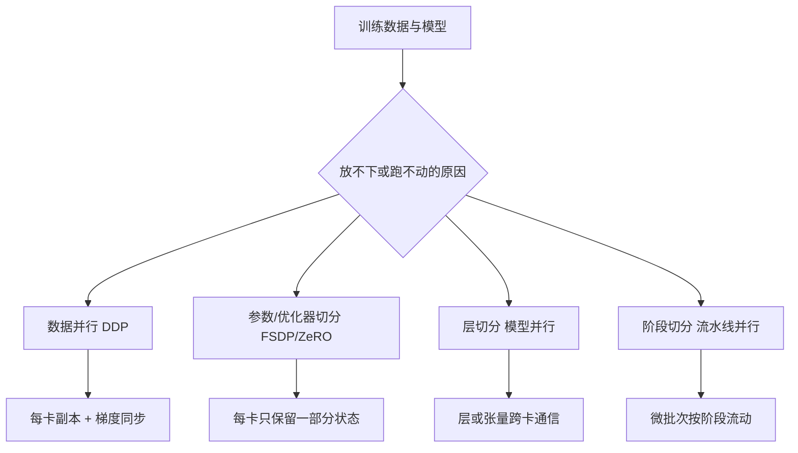

# DDP、FSDP、DeepSpeed、NCCL 与分布式训练基础设施

一张 GPU 放不下模型，不代表“再加一张卡”就能解决。数据怎样切、参数放在哪里、梯度怎样同步、节点之间用什么网络、检查点怎样写，都会影响训练是否能启动和是否值得扩展。

本文只讲 AI Infra 工程师需要掌握的基础设施认知和最小实验设计，不展开训练算法和 CUDA Kernel 开发。没有多卡或多节点环境时，内容只能做拓扑设计和官方配置核对，不能写成训练吞吐成果。

## 四种并行先分清



| 策略 | 每卡放什么 | 主要通信 | 适合解决 |
| --- | --- | --- | --- |
| DDP | 完整模型副本 | 梯度 AllReduce | 模型能放一张卡，想提高数据吞吐 |
| FSDP/ZeRO | 参数、梯度、优化器分片 | 分片收集与归约 | 单卡放不下完整训练状态 |
| Tensor/模型并行 | 不同卡承担层内计算 | 高频张量通信 | 单层或模型本身过大 |
| Pipeline 并行 | 不同卡承担不同层 | 激活在阶段间传递 | 深层模型与多卡流水线 |

实际系统可组合策略，但复杂度和通信要求也相乘。

## 第一步：DDP 的最小执行链

DDP 通常让每个进程绑定一张 GPU，拥有模型副本和不同数据分片；反向传播时通过 NCCL 等集合通信同步梯度，随后各副本更新为一致参数。

运行前要准备：

1. 每个进程的 `LOCAL_RANK` 与 GPU 映射。
2. 进程组初始化地址、端口、World Size 和 Rank。
3. Dataset Sampler 按 epoch 正确分片，避免不同 rank 重复读同一批数据。
4. 所有 rank 以相同顺序进入集合通信。
5. 每个 rank 的 checkpoint 保存策略明确，通常由 rank 0 写或使用分布式写。

任何一个 rank 在集合通信前异常退出，其他 rank 可能长时间等待。训练系统需要超时、错误传播和作业级清理，不要只观察 rank 0 日志。

## 第二步：NCCL 和网络是基础设施问题

NCCL 为 NVIDIA GPU 提供集合通信实现。单机多卡可能通过 NVLink/PCIe 通信，多节点还要经过网卡、交换机和 RDMA/TCP 配置。

官方诊断通常包括：确认 GPU 可见性、驱动与 CUDA、网卡接口、容器设备、NCCL 版本、拓扑和进程映射。调试时可以提高 NCCL 日志级别，但不要在长期生产日志中无上限打开详细调试。

用 `nvidia-smi topo -m` 查看 GPU 与 CPU/网卡拓扑线索。结果需要结合目标节点硬件说明；NUMA 距离、PCIe 交换机和网卡路径会影响通信，不要跨机器套用。

网络防火墙要允许进程间的初始化和通信端口；只测试 SSH 通不代表 NCCL 端口可达。两节点实验应保存：节点名、GPU 列表、驱动/CUDA/NCCL 版本、网卡、接口、容器镜像和启动参数。

## 第三步：FSDP/ZeRO 为什么能节省显存

DDP 每卡保存完整参数、梯度和优化器状态。FSDP 或 ZeRO 将这些状态分片：需要计算某层时临时 all-gather，计算后再释放或重新分片，降低单卡峰值显存。

节省显存的代价是通信和调度复杂度：

- 参数收集与释放增加网络/互联通信。
- Checkpoint 不再是简单每卡一个完整模型，需要合并或分片保存策略。
- Layer wrapping 影响峰值显存和通信频率。
- CPU/NVMe offload 可以继续节省显存，但带宽与延迟会变成瓶颈。

容量设计要同时列出模型参数、梯度、优化器、激活、通信 buffer、checkpoint 和数据加载内存。只计算权重大小无法判断训练能否运行。

## 第四步：流水线并行的“气泡”

流水线并行把模型层切成多个 stage，微批次依次流过。不同 stage 之间会传递激活；流水线刚启动和快结束时，有些 stage 空闲，称为气泡。

增加微批次可以减少气泡占比，却增加激活缓存和调度复杂度。stage 划分不均时，最慢 stage 决定吞吐。模型输入长度、激活大小和跨节点带宽要一起评估。

故障恢复也更复杂：一个 stage 失败会影响同一微批次链路，检查点必须保存足够状态以从明确边界重启。

## 第五步：数据、Checkpoint 与对象存储

分布式训练的输入数据不只在 GPU。数据集分片、预取、CPU 内存、缓存、对象存储吞吐和 checkpoint 写入都会成为瓶颈。

Checkpoint 要记录：代码提交、配置、模型/Tokenizer 版本、数据集版本、随机种子、optimizer/scheduler 状态、全局 step、并行拓扑和精度。只保存模型权重无法精确恢复训练进度。

多 rank 同时写对象存储可能产生大量小对象和热点。可使用 rank 0 协调、分片文件清单、临时目录 + 原子 manifest；写完后校验大小与 checksum，再把版本标记为可恢复。

训练中断恢复实验应故意终止作业，确认：旧 checkpoint 不被覆盖；新作业读取了正确 step；数据 sampler 没有静默跳过或重复异常；恢复后的日志和指标能与前一段对齐。

## 第六步：最小两节点拓扑设计

先不运行，画清对象：

```text
节点 A: GPU x 4, rank 0-3, 数据读取, Checkpoint 协调
节点 B: GPU x 4, rank 4-7
控制面: 作业提交、日志、指标、失败清理
网络: GPU 间高速互联（若没有，明确使用 TCP 的性能边界）
存储: 只读数据集 + 可写 checkpoint Bucket
```

拓扑图还要标注：GPU 到网卡路径、节点间端口、容器设备、共享数据是否同版本、作业失败时谁负责释放资源。

## 故障定位顺序

| 现象 | 先核对 | 证据 |
| --- | --- | --- |
| 某 rank 看不到 GPU | 设备映射、驱动、容器 | 每 rank 的 `nvidia-smi` |
| 初始化卡住 | 地址、端口、网卡、Rank/World Size | NCCL/launcher 日志 |
| 通信很慢 | GPU/网卡拓扑、带宽、NUMA | NCCL benchmark 与系统指标 |
| OOM | 参数/梯度/激活/通信 buffer | 峰值显存与配置 |
| 只有某 rank 失败 | 数据分片、文件、异常栈 | rank-specific logs |
| 恢复后指标跳变 | checkpoint 与 sampler | step、seed、数据版本 |

先确认是否所有 rank 都进入同一阶段，再调整 NCCL 环境变量。环境变量能改变行为，却不能修复错误的分片或资源模型。

## 官方资料指导的独立操作

在有明确硬件和许可的隔离集群中，可以用官方 PyTorch Distributed、FSDP 或 DeepSpeed 示例完成小规模启动。记录完整环境，不提供没有在该硬件上测得的 Token/s、加速倍数或成本数字。

没有多卡环境时，完成这些产物也有价值：并行策略决策表、两节点拓扑、端口与资源清单、checkpoint 恢复 Runbook 和故障诊断树。它们是进入集群操作前的前置能力。

## 参考资料

- [PyTorch Distributed Overview](https://pytorch.org/docs/stable/distributed.html)
- [PyTorch FSDP](https://pytorch.org/docs/stable/fsdp.html)
- [NVIDIA NCCL documentation](https://docs.nvidia.com/deeplearning/nccl/user-guide/docs/overview.html)
- [DeepSpeed documentation](https://www.deepspeed.ai/docs/config-json/)
- [PyTorch Elastic](https://pytorch.org/docs/stable/elastic/run.html)

