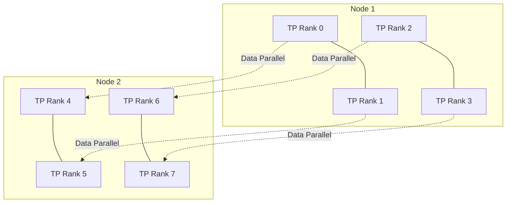

# 分布式训练：Data、Tensor、Pipeline Parallel、DDP 与 FSDP

分布式训练把模型计算、参数或数据批次分配到多张 GPU 或多台机器。Data Parallel、Tensor Parallel、Pipeline Parallel、DDP 和 FSDP 分别切分不同对象。它们位于训练框架与 GPU/网络资源之间，用来突破单卡容量或提高吞吐，同时引入同步、通信和调度成本。

训练任务扩到八张 GPU，吞吐只提升一点。可能是每张卡的 Batch 太小、梯度 AllReduce 占满网络、数据加载跟不上，也可能是 Pipeline 出现大量空泡。增加 GPU 只增加可用资源，不自动改变瓶颈。

分布式训练把数据、参数、激活、梯度和 Optimizer State 分布到多个 Rank。选择策略前先判断目标：模型是否放不下、单步计算是否太慢、数据量是否需要更大吞吐，还是训练时间受检查点与输入管线影响。

## 分布式训练的定义与目标

分布式训练是让多个进程（通常每个进程绑定一个 GPU）共同完成同一个训练作业。每个进程有自己的 `Rank`，进程总数是 `World Size`；它们通过进程组交换梯度、参数、激活或检查点。它解决的是单个设备的容量、计算或输入吞吐不够，不会把任意 Python 循环自动变快。

一轮训练至少涉及模型参数、梯度、Optimizer State 和当前 Batch。后面的 DP、TP、PP 与 FSDP 都在回答同一个问题：每个 Rank 在什么阶段拥有哪一份状态，以及为了得到下一份状态要付出哪种通信。

## 训练状态占用什么

训练通常同时保存参数、梯度、Optimizer State、激活和临时 Buffer。混合精度还可能保留 FP32 Master Weight。推理显存账本不能直接套到训练。

状态的所有权决定通信。若每个 Rank 都有完整参数，梯度需要同步；若参数也分片，前向和反向前要按需收集；若不同层在不同设备，激活要跨阶段传输。

## Data Parallel 与 DDP

Data Parallel 让每个 Rank 持有完整模型，处理不同 Mini-batch，再同步梯度。PyTorch DistributedDataParallel 通常为每个进程绑定一张 GPU，并在反向传播中按 Bucket 执行 AllReduce，使通信与计算部分重叠。

它适合模型能放入单卡、希望扩大数据吞吐的场景。参数、梯度和 Optimizer State 仍在每张卡重复，因此不能解决大模型单卡容量。Global Batch 等于每 Rank Batch 乘数据并行数再乘梯度累积步数，改变后可能需要调整学习率和训练策略。

## FSDP 与参数分片

Fully Sharded Data Parallel 把参数、梯度和 Optimizer State 按 Rank 分片，并在计算前后按策略 AllGather 与 ReduceScatter。它降低每卡常驻状态，却增加通信和执行编排。

Wrap 粒度过细会产生大量小通信，过粗又提高峰值内存。参数初始化、混合精度、CPU Offload 和状态字典方式都影响容量与检查点。FSDP 不是“打开一个开关就能训练任意模型”。

## Tensor Parallel

Tensor Parallel 把单层矩阵沿维度切到多张 GPU。每个 Rank 计算部分结果，再通过 AllReduce、AllGather 或 ReduceScatter 组合。它能让单层和权重跨卡，但通信发生在大量层内边界，对 NVLink/NVSwitch 等高带宽互联敏感。

切分维度必须与 Head、隐藏维度和 GPU 数兼容。TP 数越大，单卡计算减少，通信比例可能上升；跨慢网络做细粒度 TP 往往代价高。

## Pipeline Parallel

Pipeline Parallel 把连续层分为 Stage，Micro-batch 像流水线一样通过。它减少单设备持有层数，Stage 间只传激活和梯度，但存在 Pipeline Bubble、负载不均、调度与错误恢复复杂度。

层计算量不均时，最慢 Stage 决定吞吐。增加 Micro-batch 可减少空泡，却提高调度和激活状态。跨节点边界应考虑网络，尽量把高频细粒度通信留在节点内。

## 组合并行

大规模训练常把 DP、TP、PP 和分片组合成多维 Mesh。例如节点内用 TP，节点间用 DP；模型更深时再加入 PP。组合后 Rank 到设备的映射、Process Group、随机数、数据分片和 Checkpoint 都更复杂。

图只演示关系，不指定唯一策略。真实拓扑要写清 World Size、Global/Local Rank、节点、GPU UUID、Process Group 与每种并行维度。

假设两台机器各有四张卡，`World Size=8`，节点内使用 Tensor Parallel、节点间使用 Data Parallel：`global_rank=0..3` 属于 DP 副本 0，`global_rank=4..7` 属于 DP 副本 1；`local_rank` 是进程在本机的 GPU 序号。

| 阶段 | 每个 Rank 需要的状态 | 典型通信 | 要记录的字段 |
| --- | --- | --- | --- |
| 前向 | 本地 Batch、当前层参数或参数分片 | AllGather 或层内 TP 通信 | `step`、`layer`、`global_rank` |
| 反向 | 激活、梯度分片 | ReduceScatter、TP Reduce | `backward_start/end`、`collective` |
| 更新 | Optimizer State 分片 | 参数同步或分片更新 | `optimizer_step`、`shard_id` |
| 检查点 | 参数、优化器和训练进度分片 | 分片写入、Manifest 汇总 | `checkpoint_id`、`rank`、校验和 |

这张表也说明了为什么“八张卡”不是完整配置。只要 Batch、参数布局、进程组或检查点格式没有写出来，就无法判断增加设备是在扩大数据并行，还是改变了单层计算的所有权。

## 数据与检查点

分布式采样要避免不同 Rank 重复或遗漏数据，并在恢复时保持 Epoch/Step、随机数和数据位置。数据读取、预处理和网络存储若跟不上，GPU 会等待。

检查点包含模型、Optimizer、Scheduler、Scaler、随机数和训练进度。Sharded Checkpoint 能减少单 Rank 内存与 I/O，但恢复到不同 World Size 需要格式支持。写入使用临时版本、校验和与完成标记，不能让半写文件成为可恢复点。

## 故障与观测

Collective 要求参与 Rank 以一致顺序进入；某个 Rank OOM、数据异常或进程退出，其他 Rank 可能表现为通信超时。日志必须带 job、node、global/local rank、step 和 collective。先找到最早失败 Rank，而不是只看最后超时者。

指标包括 step time 分解、计算/通信重叠、每 Rank 显存、网络、数据等待、Gradient Norm、Checkpoint 时间和失败恢复。当前环境没有训练集群，因此不提供扩展效率数字；验证时保留一张能解释状态分布、通信边和恢复方式的拓扑。
