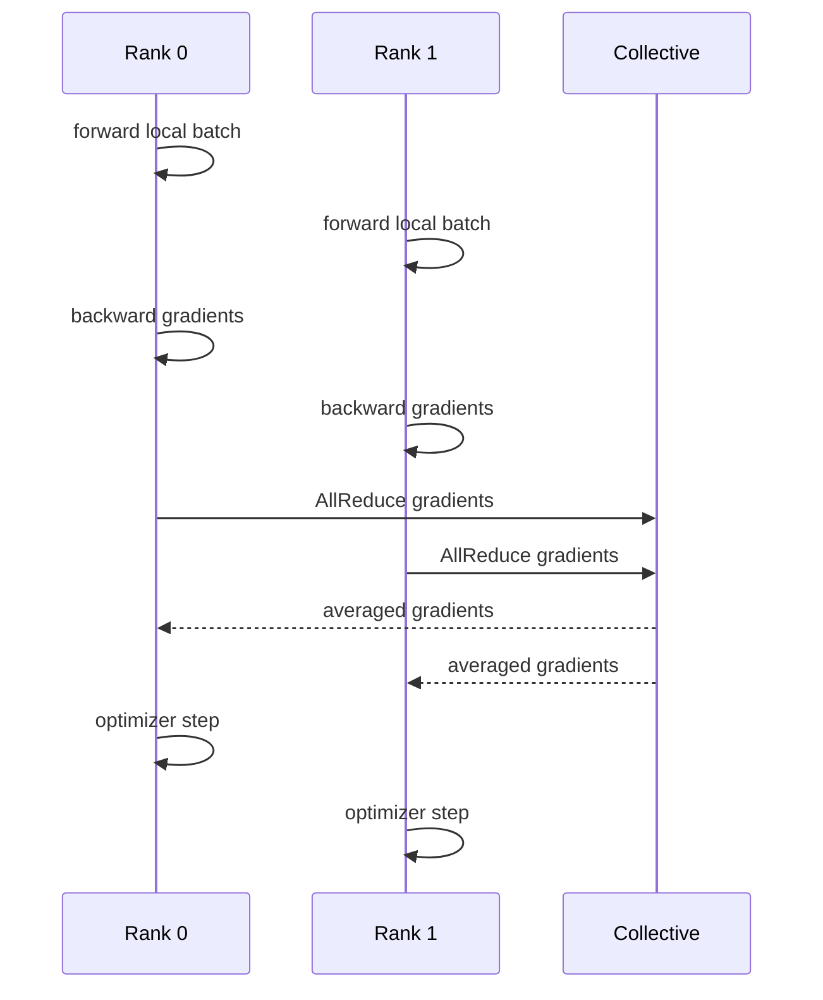

# 分布式训练：Data、Tensor、Pipeline Parallel、DDP 与 FSDP

训练任务把 batch size 调大后，单卡显存不够；切到多卡后，GPU 利用率忽高忽低。分布式训练不是“把进程复制到更多 GPU”，而是决定数据、参数、激活和通信分别由谁持有，以及同步点怎样影响吞吐。

## 四种并行思路在分什么

| 方式 | 切分对象 | 主要代价 |
| --- | --- | --- |
| Data Parallel/DDP | 不同进程处理不同数据，参数复制 | 梯度 AllReduce 和模型复制 |
| FSDP | 参数、梯度、优化器状态分片 | 前向/反向时通信与重组 |
| Tensor Parallel | 单层矩阵或注意力张量 | 层内高频通信、拓扑敏感 |
| Pipeline Parallel | 模型层分到不同 stage | 流水线气泡与调度复杂度 |

选择依据是显存、通信带宽、模型结构、批次和容错要求。组合并行时，要明确每个 rank 持有什么，checkpoint 如何保存，失败后能否从一致边界恢复。

## 一次 DDP 迭代

每个 Rank 必须以一致顺序进入 collective，否则一个进程等待另一个永远不会到来的通信。数据采样、随机种子、梯度累积和 checkpoint 步数都要与 rank 语义对齐。

## FSDP 的显存交换

FSDP 不让每个 Rank 永久持有完整参数，而是在需要某层时 all-gather，计算后释放或重新分片。这样减少常驻显存，却增加通信和调度开销。混合精度、预取和 CPU offload 会进一步改变峰值，不能只按参数量除以卡数估算。

## 训练故障先分同步和数据

| 症状 | 优先核对 |
| --- | --- |
| 某 rank 先退出，其他 rank 卡住 | 退出日志、collective 顺序、网络连接 |
| Loss 突然 NaN | 数据批次、精度、梯度裁剪和溢出 |
| 恢复后指标跳变 | checkpoint 是否包含 optimizer、scheduler、随机状态 |
| 扩卡没有加速 | 通信占比、输入管线、global batch 和气泡 |

## 未实测边界

::: warning
**机制推演**

具体扩展比、吞吐和显存要在目标模型、GPU、网络和软件版本上测量。下一篇把训练状态拆开，解释 DeepSpeed ZeRO 如何分片参数、梯度和优化器状态。
:::

## Checkpoint 是训练恢复协议的一部分

一个可恢复 checkpoint 通常包含模型参数、优化器状态、学习率调度、当前步数、随机数状态和数据读取位置。分布式情况下还要记录 world size、分片格式、库版本和并行策略。只保存 model weights 可以用于推理，却往往不能无偏继续训练。

保存频率在恢复点损失与 I/O 开销之间取舍。遇到节点故障时，先确认最近 checkpoint 是否完成且所有 rank 一致，再决定重启策略。把不完整 checkpoint 当作可用版本，常会把一次硬件故障扩散成数据污染。

## 数据输入也会限制扩展效率

GPU 等待数据时，再增加 rank 只会让更多设备一起空转。数据读取、解压、tokenize、shuffle 和网络存储需要独立观测，分布式 sampler 要保证各 rank 在同一 epoch 覆盖正确样本且可恢复。

训练吞吐下降时先拆为数据准备、前向反向、collective 和 optimizer 四段。这样能区分是通信瓶颈、输入管线瓶颈还是 global batch 选择不当，避免一遇到慢就盲目增加 GPU。
