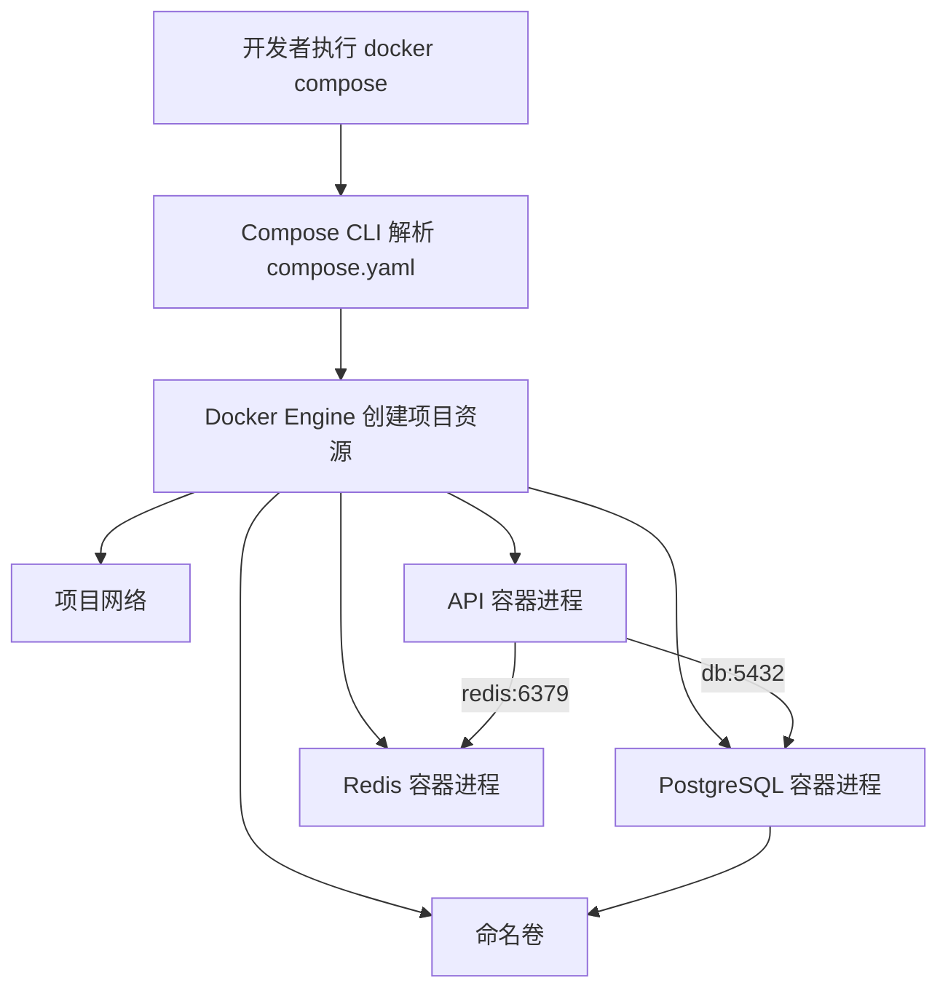

# Docker Compose 是什么？怎样写出一个可运行的多服务环境

一个 AI 应用很少只有一个进程。最小的知识问答项目也可能包括 HTTP API、PostgreSQL、Redis、后台 Worker 和对象存储。逐个执行五条 `docker run` 当然能启动它们，但端口、环境变量、网络和数据目录都散落在命令历史里。换一台电脑，没人能确定该按什么顺序重建相同环境。

Docker Compose 用一份 YAML 文件描述这些容器怎样协作。它不会替应用完成数据库迁移，也不会理解模型何时加载完毕。它负责把服务的镜像、命令、网络、卷、资源与健康检查交给 Docker Engine，再提供一组命令创建、查看和停止整套环境。学会 Compose 的重点是读懂这份运行合同，而不是记住 `up` 和 `down` 两个命令。

::: info Docker Compose 的准确含义

Docker Compose 是声明和运行多容器应用的工具。Compose 文件描述期望创建的服务、网络、卷、配置和 Secret，Compose CLI 读取文件后调用容器引擎完成实际创建。

Compose 管理的是一台 Docker 主机上的项目资源。它适合本地开发、集成测试和单机部署，不提供 Kubernetes 那样的跨节点调度与持续调谐能力。

:::

## Docker、容器和 Compose 分别处在哪一层

Docker 常被当成一个单独程序，其实日常使用至少涉及客户端、引擎、镜像和容器。`docker` 命令是客户端，Docker Engine 接收请求并管理本机对象。镜像提供静态文件层和默认启动配置，容器则是 Engine 根据镜像与运行参数创建的进程环境。上一章讲过，最终执行代码的仍是 Linux 进程。

Compose 位于客户端编排这一层。执行 `docker compose up` 时，Compose 先读取 `compose.yaml`，解析变量与引用，再判断项目需要哪些网络、卷和容器。真正建立 Namespace、cgroup 和进程的是 Engine 及其下层运行时。Compose 命令退出后，已经启动的容器可以继续运行，因为容器生命周期由 Engine 保存。

单条 `docker run` 描述一个容器，Compose 文件描述一组有关系的服务模板。前者适合临时启动一个工具，后者适合需要反复重建的应用环境。Compose 也没有把多个进程塞进一个容器，每个 Service 通常仍创建独立容器，彼此通过网络协议协作。

Dockerfile 和 Compose 文件也处理不同问题。Dockerfile 说明怎样从基础镜像构建应用镜像，比如复制源码、安装依赖、设置默认命令；Compose 文件说明运行这些镜像时接什么网络、挂什么卷、注入哪些配置。把数据库密码写进 Dockerfile 会固化到镜像历史，把 Python 依赖安装命令写进 Compose 启动命令又会让每次启动重复安装，两者都混淆了构建与运行。

下面这张图用于定位各组件的责任。箭头表示调用与创建关系，不表示 Compose 进程一直代理容器流量。



图中 Compose CLI 只把声明变成 Engine 请求。API 请求数据库时直接走项目网络，不会经过 Compose CLI；数据库写数据时进入挂载卷，不会写回镜像。以后看到 `docker compose` 命令报错，可以先区分问题发生在 YAML 解析、Engine 创建资源，还是容器内应用运行。

因此 Compose 的使用顺序可以从一个最小问题开始：先准备已有镜像，再在 YAML 中声明服务、网络和卷，执行 `docker compose config` 检查展开后的配置，最后用 `docker compose up` 创建资源。它保存的是本地环境的编排意图，不是生产集群的全套发布控制器。读者先掌握这个边界，才不会把 Compose 的 `depends_on` 当成数据库迁移或高可用方案。

## Compose 项目是什么，资源名称为什么会带前缀

Compose Project 是一组由同一次 Compose 配置管理的资源。它包含 Service 创建的容器，也包含文件声明的网络、卷、配置和 Secret。Project 让同一台主机能够同时运行多套名字相似的环境，比如开发环境和一套隔离测试环境，不至于把两边容器混在一起。

项目名默认可从 Compose 文件所在目录推导，也可以用顶层 `name`、环境变量 `COMPOSE_PROJECT_NAME` 或命令参数 `-p` 指定。项目名会参与生成资源名。目录叫 `knowledge-lab`，Service 叫 `api`，容器可能显示为 `knowledge-lab-api-1`；默认网络可能叫 `knowledge-lab_default`。确切格式受 Compose 版本和显式 `container_name` 影响。

不建议为了名字短而给所有 Service 设置 `container_name`。固定容器名会占用整台主机的全局名称，还会妨碍同一 Service 创建多个实例。应用间连接应该使用 Service 名，运维查看资源则用 project 与 service 标签过滤。项目名才是整套环境的隔离边界。

Project 不是权限租户，也不是安全沙箱。两套 Compose 项目如果都发布宿主机的 8000 端口，第二套仍会因为端口冲突启动失败；如果显式加入同一个外部网络，它们也可能互相访问。项目边界能整理资源，却不能替代宿主机防火墙、文件权限和 Secret 管理。

查看项目时，`docker compose ls` 列出 Compose 项目，`docker compose ps` 只看当前项目服务，普通 `docker ps` 则看整台 Engine。故障记录要保留项目名和实际使用的 Compose 文件，否则在错误目录执行 `down` 可能操作另一套环境。

## Service 是什么，YAML 中的一段服务声明会产生什么

Service 是容器运行模板。它可以声明镜像或构建上下文、启动命令、环境变量、挂载、网络、端口、健康检查和重启策略。Service 本身不是正在运行的容器，也不占用 PID。Compose 根据模板创建一个或多个容器实例，每个实例才有独立进程、IP、可写层与退出状态。

Service 名同时是默认网络中的 DNS 名。`api` Service 可以把数据库地址写成 `db:5432`，因为项目网络会把 `db` 解析到数据库容器地址。扩展多个实例时，一个 Service 名可能对应多个地址，调用方不应把某个容器 IP 永久写进配置。容器重建后 IP 会变化，Service 名保持稳定。

`image` 指定要运行的镜像，`build` 指定怎样从本地上下文构建镜像。两者可以同时存在，此时构建结果会使用 `image` 给出的名字；是否自动构建取决于命令和拉取策略。生产或可复现测试更适合引用带版本或 digest 的镜像，本地开发可以使用 `build`，但仍要知道当前容器到底运行了哪一个镜像 ID。

`command` 通常覆盖镜像的默认 Cmd，`entrypoint` 覆盖 Entrypoint。覆盖后如果遗漏原镜像所需的初始化逻辑，容器会以另一条进程链启动。修改这两个字段前先用 `docker image inspect` 看镜像默认值，再用 `docker inspect` 看最终容器配置。Compose 合并完成后的结果才是当前运行事实。

环境变量适合传递端点、运行模式和非敏感开关。密码不要直接提交到 Compose 文件，`.env` 也不是加密存储，它只是变量来源。开发环境可以用未纳入版本控制的本地 Secret 文件，正式环境应接入权限受控的 Secret 系统。无论来源是什么，应用都要对缺失配置给出明确错误，不能悄悄使用危险默认值。

::: warning Service 声明的边界

Service 描述怎样创建容器，不保证容器内应用已经完成初始化。`docker compose ps` 显示 Running，只能证明主进程没有退出。模型权重可能仍在加载，数据库也可能仍在执行恢复。

:::

## Compose 文件怎样从顶层对象读起

现代 Compose Specification 不要求顶层 `version` 字段。文件最常用的顶层对象是 `services`、`networks`、`volumes`、`configs` 和 `secrets`。`services` 是核心，其余对象先声明可复用资源，再由某个 Service 引用。YAML 缩进决定层级，多一个或少一个空格都可能改变字段归属。

读文件时可以从资源关系开始，不必逐行背字段。先列出有哪些 Service，再看每个 Service 用哪个镜像、监听哪个容器端口、依赖哪些名字。接着核对哪些路径要持久化，哪些值来自外部配置，最后检查健康与停止行为。这个顺序能较快发现把数据库写进临时层、把内部端口全部暴露到公网等问题。

变量插值发生在 Compose 解析阶段。`${API_PORT:-18000}` 表示变量不存在时用 18000，`${DB_PASSWORD:?missing}` 表示缺失时直接报错。插值后的结果可以用 `docker compose config` 查看。容器里的 Shell 是否再次展开 `$` 是另一个阶段，需要字面量美元符号时可能要写 `$$`。

多个 `-f` 文件会按 Compose 合并规则生成最终模型。基础文件加开发覆盖文件很常见，但数组、映射和空值的合并行为并不总符合直觉。不要只审查其中一份文件，要让 `docker compose -f compose.yaml -f compose.dev.yaml config` 输出最终配置，再检查端口、挂载与命令是否符合预期。

下面的表把几个常见字段放回它们解决的问题中。字段并非越多越好，只有能说明运行边界的声明才该出现。

| 字段 | 它控制什么 | 常见误解 |
| --- | --- | --- |
| `image` | 容器使用的镜像引用 | 同名 tag 永远指向同一内容 |
| `build` | 本地构建上下文与参数 | `up` 每次都会自动重建最新镜像 |
| `ports` | 宿主机地址到容器端口的发布 | 服务间访问必须经过宿主机端口 |
| `expose` | 记录容器端口，供网络内协作理解 | 它会创建宿主机监听 |
| `environment` | 运行时环境变量 | 写在这里的 Secret 不会泄露 |
| `volumes` | 挂载命名卷或宿主机路径 | 删除容器必然删除持久数据 |
| `depends_on` | 声明启动与可选健康依赖 | 它能修复运行中的断线 |

表中最容易误用的是 `ports`。数据库只供同一项目内 API 访问时，不需要发布到宿主机；API 用 `db:5432` 连接即可。确需从宿主机运行数据库客户端，可以绑定 `127.0.0.1:15432:5432`，限制为本机入口，而不是把 5432 暴露到所有网卡。

## Network 是什么，为什么另一个容器不在 localhost

Compose Network 是 Engine 管理的容器网络。没有显式配置时，Compose 会为项目创建默认网络，并把各 Service 接入其中。每个容器有自己的 Network Namespace 和回环接口，所以容器内的 `localhost` 只指当前容器。API 连接 `localhost:5432`，寻找的是 API 容器里的 PostgreSQL，不是名为 `db` 的容器。

同一网络内，Docker 的内置 DNS 根据 Service 名返回容器地址。API 使用 `postgresql://app@db:5432/app`，Worker 使用 `redis://redis:6379/0`。重建 `db` 后地址可能变，但新 DNS 查询会得到当前地址。客户端需要处理已有连接断开并重新解析，DNS 名稳定不等于长连接永不失效。

可以创建多个网络划分可达范围。入口代理同时连接 `edge` 与 `backend`，数据库只连接 `backend`，这样数据库不会直接出现在入口网络。网络隔离控制谁能建立网络连接，不等于应用鉴权；连接到 backend 的任何受控服务仍要使用最小权限数据库账号。

`ports` 把宿主机地址发布到容器端口，处理的是容器外访问。`expose` 只是端口元数据，不负责发布。服务间调用通常使用容器端口，不用宿主机映射端口。比如配置 `127.0.0.1:18000:8000` 后，浏览器访问 18000，Nginx 容器访问 API 仍应使用 `api:8000`。

外部网络由 `external: true` 引用，Compose 不负责创建或删除它。它适合让多个项目共享一个受控入口网络，也会扩大项目间可达面。若启动时报 `network ... declared as external, but could not be found`，说明声明与 Engine 当前资源不一致，应该创建经过确认的网络或修正名称，不能把 `external` 随意删掉来掩盖拓扑设计。

## Volume 是什么，哪些数据不能留在容器可写层

Volume 是独立于容器可写层的数据存储。Compose 顶层 `volumes` 声明命名卷，Service 再把它挂到容器路径。数据库重建容器时，新容器重新挂载同一个卷，因此数据目录仍在。镜像层保持只读，容器可写层则随着容器删除而失去引用。

命名卷由 Engine 选择宿主机实际路径，适合数据库数据和需要跨容器生命周期保留的状态。Bind mount 把明确的宿主机路径挂进容器，适合本地源码热更新或读取已有模型目录。两者都会遮住镜像中目标路径原有内容。把空目录挂到 `/app` 后看不到镜像内程序，并不代表镜像少复制了文件。

Volume 不等于备份。误执行 `docker compose down -v` 会删除项目命名卷，宿主机磁盘损坏也会让卷丢失。数据库仍要使用一致性备份并实际验证恢复。对象存储的数据、上传文件和模型制品要根据恢复时间目标决定备份与异地副本，不能因为它们位于命名卷就认定安全。

权限来自容器进程 UID/GID、卷内文件所有者、挂载读写模式和宿主机安全策略。镜像声明 `USER 10001` 后，已有卷中的文件可能仍属于另一个 UID。把服务改成 root 能暂时绕过部分 mode 检查，却扩大了容器权限。正确做法是确认镜像运行身份，初始化卷的属主，并让只读模型卷明确使用 `read_only`。

匿名卷没有稳定的人类名称，重复重建可能留下难以辨认的数据副本。重要状态使用显式命名卷，并在备份记录中保存项目名、卷名、挂载目标和数据版本。清理前用 `docker volume inspect` 与容器 Mounts 建立引用清单，不执行来源不明的批量删除。

## Healthcheck 是什么，它与进程运行有什么区别

Healthcheck 是在容器上下文中周期执行的检查命令。命令退出码为 0 表示本次成功，非 0 表示失败。Engine 根据 `interval`、`timeout`、`retries` 和可选 `start_period` 形成 starting、healthy 或 unhealthy 状态。这个状态附属于容器，主进程不会因为 unhealthy 自动退出。

检查内容应该对应调用方真正依赖的最小能力。PostgreSQL 可以用 `pg_isready` 判断是否接受连接，HTTP API 可以请求只检查本实例的 `/ready`。只执行 `ps` 或检查端口存在太浅，因为进程和监听 socket 都可能存在，模型却未加载或数据库迁移尚未完成。反过来，把所有外部依赖都塞进一个健康接口又会放大故障，某个非核心服务短暂抖动可能让健康实例被全部摘除。

Liveness、readiness 和 startup 在 Kubernetes 中有独立语义，Compose 只有容器 Healthcheck 这一类状态。应用仍可以暴露不同端点，再选择其中一个作为 Compose 健康命令。不要把 Compose 的 healthy 直接解释成所有业务功能都通过，它只证明检查命令在当前时刻满足预设条件。

检查命令在容器内执行，因此镜像必须包含所用工具。极简镜像没有 `curl` 时，Healthcheck 会持续失败；可以用应用自身运行时发 HTTP 请求，或在镜像构建阶段加入合适的轻量客户端。命令字符串还要注意 exec form 与 Shell form 的差别，以及变量在哪个解析阶段展开。

健康检查会产生真实负载。间隔一秒执行复杂向量查询，可能给数据库造成持续压力。检查应快速、有超时、无副作用，并且不会写入业务数据。模型服务启动很慢时用 `start_period` 给初始化留时间，正常运行后的连续失败仍要能及时暴露。

## depends_on 能等待什么，不能替应用解决什么

短格式 `depends_on: [db]` 只表达启动顺序，Compose 创建 `db` 后再创建 `api`，不等待数据库可以接受查询。长格式配合 `condition: service_healthy` 可以等待依赖的 Healthcheck 变成 healthy。等待效果取决于当前 Compose 实现是否支持相应规范字段，运行前要用本机版本核对。

即使首次启动等待成功，数据库在运行十分钟后重启，Compose 也不会替 API 修复连接池。应用需要设置连接超时、有限重试和重新建连。消息消费者还要处理重复投递，Worker 重启后不能因为同一任务再次到达就写出两份结果。`depends_on` 处理创建阶段的依赖关系，运行期韧性属于应用协议。

迁移任务也不能简单塞进每个 API 副本的入口命令。两个副本同时执行非并发安全迁移会争锁，失败的迁移还可能让部分服务继续启动。可以定义一次性 `migrate` Service，让 API 等待它成功完成；正式环境则由发布流程单独执行并记录迁移版本。Compose 的 `service_completed_successfully` 能表达一次性任务完成关系，但仍要核对工具版本与失败处理。

重启策略只根据容器退出采取动作，不理解健康检查。`restart: unless-stopped` 能在进程异常退出后重启容器，却不会自动重启一个仍在运行但 unhealthy 的进程。无限重启还会覆盖最早日志并持续冲击依赖。排查重启循环时先看退出码、OOM 状态和第一次错误，再决定修配置还是重启。

## 写一份能读懂的本地 AI 服务栈

下面的配置包含 PostgreSQL、Redis、对象存储、API 和 Worker。它用于展示一份完整 Compose 文件怎样表达构建、服务名、健康、卷和停止边界。`./api` 中需要有匹配的 Dockerfile 与应用代码，密码文件需要由本地创建且不提交仓库；因此配置可以做静态解析，实际运行还依赖这些明确列出的输入。

```yaml
name: ai-knowledge-lab

services:
  db:
    image: postgres:17-alpine
    environment:
      POSTGRES_DB: knowledge
      POSTGRES_USER: app
      POSTGRES_PASSWORD_FILE: /run/secrets/db_password
    secrets:
      - db_password
    volumes:
      - pgdata:/var/lib/postgresql/data
    healthcheck:
      test: ["CMD-SHELL", "pg_isready -U app -d knowledge"]
      interval: 5s
      timeout: 3s
      retries: 12
      start_period: 10s
    stop_grace_period: 60s
    networks:
      - backend

  redis:
    image: redis:7-alpine
    command: ["redis-server", "--appendonly", "yes"]
    volumes:
      - redisdata:/data
    healthcheck:
      test: ["CMD", "redis-cli", "ping"]
      interval: 5s
      timeout: 2s
      retries: 12
    networks:
      - backend

  object_store:
    image: minio/minio:RELEASE.2025-04-22T22-12-26Z
    command: ["server", "/data", "--console-address", ":9001"]
    environment:
      MINIO_ROOT_USER: localadmin
      MINIO_ROOT_PASSWORD_FILE: /run/secrets/minio_password
    secrets:
      - minio_password
    volumes:
      - objectdata:/data
    healthcheck:
      test: ["CMD", "mc", "ready", "local"]
      interval: 10s
      timeout: 3s
      retries: 12
    networks:
      - backend

  api:
    build:
      context: ./api
    image: local/knowledge-api:dev
    environment:
      DATABASE_URL: postgresql://app@db:5432/knowledge
      REDIS_URL: redis://redis:6379/0
      OBJECT_STORE_ENDPOINT: http://object_store:9000
    secrets:
      - db_password
      - minio_password
    depends_on:
      db:
        condition: service_healthy
      redis:
        condition: service_healthy
      object_store:
        condition: service_healthy
    ports:
      - "127.0.0.1:18000:8000"
    healthcheck:
      test: ["CMD", "python", "-c", "import urllib.request; urllib.request.urlopen('http://127.0.0.1:8000/ready', timeout=2)"]
      interval: 10s
      timeout: 3s
      retries: 6
      start_period: 30s
    stop_grace_period: 90s
    networks:
      - backend

  worker:
    image: local/knowledge-api:dev
    command: ["python", "-m", "app.worker"]
    environment:
      DATABASE_URL: postgresql://app@db:5432/knowledge
      REDIS_URL: redis://redis:6379/0
    secrets:
      - db_password
    depends_on:
      db:
        condition: service_healthy
      redis:
        condition: service_healthy
    stop_grace_period: 120s
    networks:
      - backend

networks:
  backend:
    internal: true

volumes:
  pgdata:
  redisdata:
  objectdata:

secrets:
  db_password:
    file: ./secrets/db_password
  minio_password:
    file: ./secrets/minio_password
```

API 的 `ports` 只绑定宿主机回环地址，外部网络无法直接访问 18000；`backend` 标为 internal，容器只在内部网络协作。数据库、Redis 与对象存储都把数据写入命名卷。API 和 Worker 共用同一应用镜像，却运行不同命令，说明 Service 是运行模板，不要求每个角色都构建一份镜像。

配置也留下了边界。示例 URL 没有把密码直接放进环境变量，真实应用需要读取 Secret 文件或在启动时安全组装连接信息。MinIO 镜像中的 `mc ready local` 是否适用于所选版本要实际核对；固定 Release 标签也应在可重复环境中进一步记录 digest。这里没有模型 Serving，因为它通常需要 GPU、模型卷和更长启动过程，可以作为另一个 Service 加入同一后端网络。

## 从 config 到 up，一次启动会发生哪些状态变化

执行前先准备 Secret 文件并限制权限，再让 Compose 解析最终模型。`config` 不创建容器，它只把变量、合并文件和短格式展开。输出中可能包含敏感值，不能把完整结果贴进公开日志。下面命令假设当前目录只有目标项目配置。

```bash
mkdir -p secrets
umask 077
printf '%s\n' 'local-db-password' > secrets/db_password
printf '%s\n' 'local-minio-password' > secrets/minio_password

docker compose config --quiet
docker compose up -d --build
docker compose ps
```

正常情况下，`config --quiet` 没有输出并返回 0。`up` 先创建网络和卷，需要时构建 API 镜像，然后创建依赖容器。数据库、Redis 和对象存储通过健康检查后，API 与 Worker 才开始。`ps` 应显示每个容器的运行状态，设置 Healthcheck 的容器还会显示 starting、healthy 或 unhealthy。

一次请求随后从宿主机进入 `127.0.0.1:18000`，端口发布把连接送到 API 容器的 8000。API 根据 `db` 解析数据库地址，根据 `redis` 解析缓存地址，并通过 `object_store:9000` 访问对象存储。数据库提交的数据进入 `pgdata`，请求日志写到标准输出，由 Engine 的日志驱动保存。

验证不能只看 Started。下面这组命令分别检查最终配置、容器状态、服务名解析、应用入口和日志。`getent` 是否存在取决于 API 镜像，极简镜像可以改用应用运行时的 DNS 函数。

```bash
docker compose images
docker compose ps --all
docker compose exec api getent hosts db redis object_store
curl -fsS http://127.0.0.1:18000/ready
docker compose logs --since=5m api worker
```

预期结果不是固定容器 IP，而是三个 Service 名都能解析，`curl` 返回成功状态，日志中没有反复连接失败。`docker compose images` 用来确认实际镜像，`ps --all` 会把已经退出的一次性或失败容器也列出来。如果 API 没有达到 healthy，继续读取 Healthcheck 的具体输出，而不是反复执行 `up`。

## 用数据库未就绪故障完成一次推演

假设输入仍是一条健康请求，但 API 返回 503。当前状态显示所有容器 Running，API 健康状态为 unhealthy。先读取 `docker compose ps --all`，再查看 API 健康记录和数据库日志。若 API 日志出现 `connection refused db:5432`，需要确认名字解析、数据库监听和健康状态，不能直接认定密码错误。

```bash
docker inspect "$(docker compose ps -q api)" \
  --format '{{json .State.Health}}'
docker compose logs --since=10m db api
docker compose exec api getent hosts db
docker compose exec db pg_isready -U app -d knowledge
```

如果 `db` 能解析但 `pg_isready` 失败，调用已经走到数据库容器，失败位于数据库初始化或监听。数据库日志若显示卷中的旧数据版本不兼容，删除卷会丢数据，应该先备份并按 PostgreSQL 升级流程处理。若 `pg_isready` 成功而 API 仍使用旧连接失败，则检查应用连接池是否会重连，并确认容器里的最终 `DATABASE_URL` 没有把主机写成 localhost。

修复后重新创建受影响 Service，再重复同一组验证。状态变化应从 db starting 到 healthy，随后 API 从 starting 到 healthy；入口 `curl` 返回 200，日志不再出现新连接拒绝。失败证据、改动和验证结果要使用同一个时间窗口，旧日志仍然存在不能说明修复无效。

停止时先执行 `docker compose stop`，它会发送停止信号并保留容器、网络与卷；`docker compose down` 会删除项目容器和默认网络，默认保留命名卷；`down -v` 会进一步删除声明与匿名卷。看到 `-v` 前要知道每个卷能否恢复。只想暂停开发环境时，保留卷通常更合适。

## 日志、重建与退出怎样构成可恢复的本地环境

Compose 默认把容器主进程的标准输出和标准错误交给 Docker 日志驱动。`docker compose logs -f api worker` 可以按 Service 聚合查看，行首通常带服务实例名称。应用如果只写容器内 `/app/logs/server.log`，这条命令不会显示文件内容；文件没有挂载时，容器重建后还会消失。开发环境也要明确日志去向和轮转，否则长期运行的 json-file 日志能占满宿主机磁盘。

日志里的时间、实例和请求标识需要能对齐。API 报 503，数据库五分钟前的一条启动警告不一定是同一故障。先限制 `--since` 时间窗口，再把 API 请求 ID、Worker 任务 ID 与依赖日志放在一起。Compose 负责给日志加 Service 身份，但不会自动生成跨服务 Trace，也不会替应用隐藏密码和用户输入。调试输出仍须遵守数据边界。

配置改变后要判断 restart 与 recreate 的差别。`docker compose restart api` 只停止并启动已有容器，不应用新的环境、挂载和镜像配置；`docker compose up -d api` 会比较期望配置，必要时重建容器。镜像 tag 指向了新内容时，可以先明确执行 pull 或 build，再用 `images` 和 `inspect` 确认新容器实际引用。只看容器名称相同，很容易误以为代码已经更新。

重建 API 不应该删除数据库卷，也不该无条件重建所有依赖。`docker compose up -d --no-deps api` 可以只处理 API，但只有在确认它与现有依赖兼容时使用。数据库 schema 改动、消息格式变化和共享模型目录更新都可能要求协调步骤。Compose 能按声明创建对象，数据协议是否向前兼容仍由发布设计决定。

退出过程从主进程收到 SIGTERM 开始。HTTP API 应停止接收新请求并等待在途请求，Worker 应停止领取新任务并把当前任务完成或保存为可重试状态，数据库则要刷写必要日志。`stop_grace_period` 给这些动作一个上限，到期后 Engine 会强制结束进程。入口脚本没有 `exec` 或应用忽略 SIGTERM 时，延长时间只会让强制结束更晚。

可以用一条受控的停止演练确认行为。先发送一个能观察到但不会写真实数据的测试请求，执行 `docker compose stop api worker`，再检查退出码、最后日志和残留连接。随后 `docker compose start`，验证 API 重新健康、Worker 能继续处理尚未确认的任务、三个命名卷仍指向原数据。这个过程给出的是本机恢复证据，不能替代数据库备份恢复与跨主机灾难恢复测试。

| 操作 | 会改变的对象 | 默认保留的对象 | 使用前要确认什么 |
| --- | --- | --- | --- |
| `stop` | 容器进程停止 | 容器配置、网络、卷 | 应用能否在宽限内退出 |
| `restart` | 原容器进程重启 | 原容器配置与可写层 | 是否误以为新配置已应用 |
| `up -d` | 按差异创建或重建 | 未被替换的项目资源与卷 | 最终配置和镜像身份 |
| `down` | 项目容器和默认网络删除 | 命名卷与镜像 | 是否有其他入口引用该网络 |
| `down -v` | 进一步删除项目卷 | 镜像通常仍保留 | 数据是否已备份且可恢复 |

表里最危险的动作是 `down -v`，但普通 `restart` 也可能造成业务中断。选择命令要从期望状态倒推：只暂停进程、应用新配置、替换镜像，还是彻底清理测试数据。命令短不代表影响小，执行前先用 `ps`、`config` 和 `volume inspect` 确认目标。

Compose 适用到单机边界为止。它能把本地 AI 服务栈写成可复现声明，也能支撑集成测试与小型单机服务。需要跨节点放置 GPU、故障后自动重建到另一台机器、滚动发布和集群级资源治理时，应使用 Kubernetes 或其他集群编排系统。Compose 文件仍然有价值，因为它把应用依赖和本地开发入口保留下来，但不能把单机健康误当成集群高可用。

每次重建都能得到相同的服务关系，并且每个失败都有对应证据，这才算一套可用的 Compose 环境。
