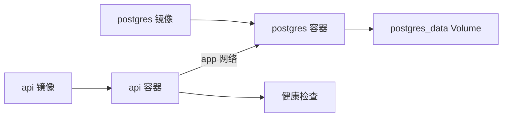

# Docker Compose：从两个容器跑通一个服务

第一次接触 Docker，很多人会把它理解成“换一种方式运行命令”。真正需要掌握的是：一个服务由哪些进程组成，它们如何发现彼此，数据放在哪里，服务不健康时谁负责报告，以及容器被替换后什么必须留下。

本篇用一个匿名 API 和 PostgreSQL 组成最小系统。你不需要先学习 Kubernetes；只要会打开终端、知道端口是什么，并能阅读 YAML，就可以跟着完成。最后你应该能够解释一次 `docker compose up` 到底启动了什么，并能判断“容器在运行”和“应用已经可以接收请求”为什么不是一回事。

## 先建立五个概念

- **镜像**：构建出来的只读文件系统和启动配置，类似“安装好的运行包”。镜像本身不会处理请求。
- **容器**：镜像的一次运行实例。容器可以被删除和重建，因此不要把唯一数据只写在容器可写层。
- **网络**：容器之间通信的隔离空间。在 Compose 网络里，服务名可以作为 DNS 名称使用。
- **Volume**：由 Docker 管理的持久化存储。数据库文件应该放在 Volume 或外部存储，而不是依赖容器 ID。
- **健康检查**：由容器运行时定期执行的探针。它描述探针能观察到的状态，不会自动修复业务问题。

这五个概念的关系可以先画成一张小图：



## 第一步：准备一个最小目录

先建一个不会和现有项目混淆的目录。这里的 API 只是为了产生一个可观察的 HTTP 响应，重点是观察容器关系，不是实现业务。

```text
compose-demo/
  compose.yaml
  api/
    Dockerfile
    server.py
```

`server.py` 的职责只有一件事：监听 `8000` 端口，并返回一个健康结果。数据库容器不需要知道宿主机目录，API 通过服务名 `postgres` 访问它；这个名字由 Compose 网络提供。

## 第二步：先单独理解 API 镜像

镜像构建文件描述“如何得到运行环境”，它不是 Compose 配置。下面的最小 Dockerfile 使用官方 Python 基础镜像、复制脚本，并把容器启动命令固定为 `python server.py`。

```dockerfile
FROM python:3.13-slim
WORKDIR /app
COPY server.py .
EXPOSE 8000
CMD ["python", "server.py"]
```

逐行看它做了什么：`FROM` 选择已有的运行时；`WORKDIR` 让后续路径都相对于 `/app`；`COPY` 只把当前示例需要的文件放进镜像；`EXPOSE` 是文档提示，不会自动把端口发布到宿主机；`CMD` 是容器默认启动命令。

如果把 `server.py` 改了，旧镜像不会自动变化。必须重新构建镜像，或者在开发环境使用源码挂载。生产环境应使用明确版本的构建产物，不要依赖宿主机目录“碰巧存在”。

## 第三步：声明 API、数据库和网络

现在把两个镜像放进 `compose.yaml`。先读配置，再运行命令，这样出问题时你知道每一项属于哪一层。

```yaml
services:
  api:
    build: ./api
    ports:
      - "8000:8000"
    environment:
      DATABASE_HOST: postgres
    depends_on:
      postgres:
        condition: service_healthy
    networks: [app]
    healthcheck:
      test: ["CMD", "python", "-c", "import urllib.request; urllib.request.urlopen('http://api:8000/health')"]
      interval: 5s
      timeout: 2s
      retries: 5

  postgres:
    image: postgres:17
    environment:
      POSTGRES_USER: demo
      POSTGRES_PASSWORD: demo-only
      POSTGRES_DB: demo
    volumes:
      - postgres_data:/var/lib/postgresql/data
    networks: [app]
    healthcheck:
      test: ["CMD-SHELL", "pg_isready -U demo -d demo"]
      interval: 5s
      timeout: 3s
      retries: 5

networks:
  app:

volumes:
  postgres_data:
```

`build: ./api` 表示 API 镜像由本地 Dockerfile 构建；`8000:8000` 只发布 API，数据库没有暴露宿主机端口；`DATABASE_HOST: postgres` 说明容器内访问数据库时使用服务名，而不是 `localhost`。在 API 容器里，`localhost` 指向 API 自己，不是 PostgreSQL。

`depends_on` 的健康条件只解决启动顺序：Compose 会等待数据库探针通过后再启动 API。它不保证数据库永远可用，所以 API 仍然需要连接失败处理。两个 `healthcheck` 也有不同含义：`pg_isready` 检查数据库是否接受连接，API 探针检查 HTTP 进程是否响应。

## 第四步：验证配置，再启动

不要一上来就反复重启。先让 Compose 展开变量并检查配置是否能被解析：

```bash
docker compose config
docker compose up -d --build
docker compose ps
docker compose port api 8000
docker compose exec api python -c \
  "import urllib.request; print(urllib.request.urlopen('http://api:8000/health').status)"
```

你应当看到两个服务处于 `running`，健康状态逐渐变为 `healthy`。`docker compose port` 输出 API 在宿主机发布的地址；把它与 `/health` 拼接后放进浏览器，可以验证宿主机端口映射。最后一条命令在 API 容器内通过服务名访问自身，状态码应为 `200`。这里的 `api` 和 `postgres` 都是 Compose 服务名，前者没有用来连接数据库。`config` 失败通常是 YAML 缩进、变量缺失或字段拼写问题；`ps` 能告诉你容器是否启动，但只有 HTTP 请求成功，才能证明应用路由工作。

查看启动过程：

```bash
docker compose logs --tail=100 postgres
docker compose logs --tail=100 api
docker compose exec api python -c "import os; print(os.environ['DATABASE_HOST'])"
```

`logs` 观察容器标准输出；`exec` 在正在运行的容器里执行一次命令。这里打印的是非敏感的主机名，实际项目不要把密码、Token 或完整请求正文写入日志。

## 第五步：亲手验证 Volume 是否真的持久

Volume 的价值要通过“删除容器后数据仍然存在”来理解。进入数据库写一条标记记录，再只删除容器，不删除 Volume：

```bash
docker compose exec postgres psql -U demo -d demo \
  -c "create table if not exists notes (id serial primary key, body text not null);" \
  -c "insert into notes(body) values ('volume-check');"

docker compose down
docker compose up -d
docker compose exec postgres psql -U demo -d demo \
  -c "select body from notes;"
```

第二次查询仍能看到 `volume-check`，因为 `docker compose down` 默认删除容器和网络，不删除命名 Volume。若改成 `docker compose down -v`，Volume 也会被删除，下一次启动会得到空数据库。这个命令只适合明确的隔离实验，不能作为日常“清理一下”的快捷键。

## 发生故障时怎样定位

下面按观察顺序处理，而不是先执行 `restart`：

| 现象 | 先看什么 | 常见原因 |
| --- | --- | --- |
| API 容器退出 | `docker compose logs api` | 启动命令错误、依赖缺失、环境变量缺失 |
| API 一直 `starting` | `docker inspect` 的 Health | 探针地址、端口或依赖条件写错 |
| API 连接不上数据库 | 容器内 DNS 与应用日志 | 把 `localhost` 当成数据库主机、数据库尚未 ready |
| 重建后数据没了 | `docker volume ls` | 使用了匿名卷、误执行 `down -v` 或未挂载 Volume |
| 宿主机访问不了 | `docker compose ps` 与端口 | 没有发布端口、端口被其他进程占用 |

故意把 API 配置中的 `DATABASE_HOST` 改成 `localhost`，重建后查看日志。容器本身可能仍然是 `running`，但应用连接会失败。这正是“进程活着”和“服务可用”两个状态的区别。修复服务名后，再用同一条命令验证，避免只凭状态图标判断恢复。

## 停止、更新和生产边界

开发环境可以用 `docker compose down` 释放容器，用 `up -d --build` 重建 API。更新数据库镜像或迁移前，应先做一致性备份并在隔离环境恢复一次；不要把 Volume 目录复制当作可靠备份。

生产环境还需要候选容器、健康检查、日志和指标、备份恢复、资源上限、信号排空和回滚版本。Compose 可以表达一组服务的关系，但它本身不会提供跨主机调度、零停机发布或自动数据恢复。先把这些边界说清楚，再决定是否需要更复杂的平台。

## 带走一张检查清单

- 镜像是否来自可追踪的构建结果？
- 数据库是否使用命名 Volume 或外部存储？
- 容器之间是否使用服务名通信？
- 健康检查检查的是进程、就绪还是完整业务？
- `down`、`down -v` 和删除单个容器的影响是否清楚？
- 故障时能否先从 `config`、`ps`、`logs`、`inspect` 得到证据？
- 数据库备份是否在隔离环境真正恢复过？

## 参考资料

- [Docker Compose](https://docs.docker.com/compose/)
- [Compose Specification](https://compose-spec.io/)
- [Docker HEALTHCHECK](https://docs.docker.com/reference/dockerfile/#healthcheck)
- [Docker volumes](https://docs.docker.com/engine/storage/volumes/)
