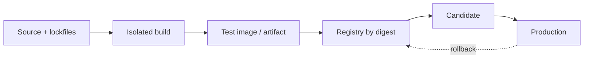

# Docker 与 Compose

Docker 提供进程、文件系统、网络和资源边界，Compose 描述一组容器如何连接。它们不能自动带来环境一致、数据安全或零停机：如果镜像使用漂移的依赖、Secret 烘进 Layer、数据库端口暴露公网、更新脚本删除 Volume，容器化只会让错误更容易复制。

## 镜像是不可变运行制品

源码提交不是可部署制品。构建阶段锁定语言运行时、依赖锁文件、系统包和构建工具，生成镜像并记录 Digest、源码版本与 SBOM。测试、候选和生产提升同一个 Digest，仅环境配置不同；生产机不重新编译，否则实际运行的是未经验证的新产物。



Tag 方便人识别，会被移动；部署和回滚记录 `image@sha256:...`。基础镜像也固定 Digest并通过自动化更新 PR 跟进补丁，不能永远冻结漏洞版本。

## 多阶段构建与缓存边界

```dockerfile
# syntax=docker/dockerfile:1.7
FROM node:22-bookworm-slim@sha256:REPLACE_WITH_VERIFIED_DIGEST AS build
WORKDIR /workspace
RUN corepack enable
COPY package.json pnpm-lock.yaml ./
RUN --mount=type=cache,id=pnpm,target=/pnpm/store \
    pnpm config set store-dir /pnpm/store && pnpm install --frozen-lockfile
COPY . .
RUN pnpm build

FROM nginxinc/nginx-unprivileged:stable-alpine@sha256:REPLACE_WITH_VERIFIED_DIGEST AS runtime
COPY --from=build --chown=101:101 /workspace/dist /usr/share/nginx/html
COPY deploy/nginx.conf /etc/nginx/conf.d/default.conf
USER 101:101
EXPOSE 8080
HEALTHCHECK --interval=10s --timeout=3s --start-period=5s --retries=3 \
  CMD wget -q -O /dev/null http://healthcheck:8080/health/live || exit 1
```

示例中的 Digest 必须由真实镜像解析并由更新工具维护，不能照抄占位值。依赖清单先复制，使源码变化不破坏依赖缓存；BuildKit cache mount 不进入最终 Layer。运行阶段只复制制品，不包含编译器、包管理缓存和源码。

Alpine 并非总是最优：musl 与原生扩展可能有兼容/性能差异，调试工具和 CA/时区数据也可能缺失。选择 distroless、slim 或 Alpine 要用镜像大小、漏洞、兼容和运维需求比较，不用“Alpine 一定安全”作为结论。

`.dockerignore` 排除 `.git`、本地依赖、测试输出、环境文件、日志和临时制品。构建上下文中出现 Secret 即有进入 Layer/缓存的风险。

## Secret 不进入 ARG、ENV 和 Layer

Dockerfile 的 `ARG`/`ENV`、命令历史和复制后删除的文件都可能在镜像历史或缓存中留下值。构建需要私有仓库凭证时使用 BuildKit Secret/SSH mount，只在单个 RUN 可见；运行 Secret 由平台注入文件/受控环境，并限制权限。

```dockerfile
RUN --mount=type=secret,id=npmrc,target=/root/.npmrc \
    pnpm fetch --frozen-lockfile
```

Compose 示例文件只声明变量名，不提交真实 `.env`。启动日志打印配置版本和非敏感摘要，不输出 DSN、Token、Cookie、私钥或完整 endpoint 凭证。

前端静态资源的环境变量通常在构建时被内联，运行时改变容器 ENV 不会自动改已经生成的 JavaScript。需要同一静态镜像跨环境时，通过受控 `/runtime-config.json` 或入口脚本生成非敏感配置，并设置正确缓存；Secret 永远不能放浏览器包。

## Compose 表达拓扑，不替应用处理依赖故障

```yaml
services:
  api:
    image: registry.example.invalid/example-api@sha256:verified-digest
    init: true
    read_only: true
    tmpfs:
      - /tmp:size=128m,mode=1777
    env_file:
      - ./runtime.env
    depends_on:
      postgres:
        condition: service_healthy
      redis:
        condition: service_healthy
    healthcheck:
      test: ["CMD", "curl", "--fail", "http://healthcheck:8000/health/live"]
      interval: 10s
      timeout: 3s
      retries: 3
      start_period: 20s
    networks: [application]
    restart: unless-stopped
    stop_grace_period: 30s

  postgres:
    image: postgres:17@sha256:verified-digest
    environment:
      POSTGRES_PASSWORD_FILE: /run/secrets/db_password
    secrets: [db_password]
    volumes:
      - postgres_data:/var/lib/postgresql/data
    networks: [application]
    healthcheck:
      test: ["CMD-SHELL", "pg_isready -U $$POSTGRES_USER -d $$POSTGRES_DB"]

networks:
  application:
    internal: true

volumes:
  postgres_data:

secrets:
  db_password:
    file: ./secrets/db_password
```

`depends_on` 可以改善启动顺序，不能保证运行期间依赖永远健康。应用仍要在连接失败时做有界重试、断路/降级和 readiness 更新。Compose 的本地文件 Secret 不等于集中 Secret 管理，生产根据平台使用加密存储与短期凭证。

不要在普通 Compose 上照抄 Swarm 的 `deploy.replicas/update_config` 并认为会生效。零停机需要独立候选、代理切流或真正编排器的滚动控制，并经过健康验证。

## 网络、端口与信任边界

Compose 网络内通过服务 DNS 名访问，不硬编码容器 IP。只有公网网关或明确的本机调试入口 publish 端口；数据库、Redis、Broker、对象存储控制端默认只在 internal 网络。

`expose` 是文档/容器间端口声明，不是安全控制；同网络服务仍可访问。安全来自最小网络成员、应用认证、TLS/凭证与防火墙。不能因为“在 Docker 网络里”就把内部请求当可信用户。

开发时发布端口优先绑定到本机回环接口，避免意外监听所有接口。生产代理链明确谁能设置 `X-Forwarded-*`，应用只信受控网关来源。

## 持久数据与备份边界

容器可替换，Volume/外部存储承载状态。先分类：

| 数据 | 位置 | 清理/恢复语义 |
| --- | --- | --- |
| 数据库 | 命名 Volume/托管盘 | 逻辑/物理备份和 PITR |
| 对象 | 对象存储 | 版本、生命周期、清单 |
| 缓存 | 可重建 Volume 或内存 | 允许丢失但防雪崩 |
| 日志 | stdout/采集或轮转挂载 | 有界保留，不填满磁盘 |
| 临时文件 | tmpfs/临时目录 | 任务结束精确清理 |

`docker compose down -v` 会删除 Compose 管理的 Volume，不属于日常更新命令。Bind mount 可能覆盖镜像内目录并受宿主权限影响，生产只在确有文件所有权需求时使用。备份的是应用一致数据，不是运行中随意复制 Volume 目录；数据库用其一致性工具并演练恢复。

## PID 1、信号与排空

容器主进程作为 PID 1，需要接收 SIGTERM、回收子进程并正确退出。避免 `sh -c "app"` 吞信号，使用 exec form `ENTRYPOINT ["..."]`，或 `init: true`/tini 处理子进程。应用收到终止信号后：readiness false、停止接新请求/任务、等待在途工作到期限、关闭连接池与遥测。

停止宽限必须大于正常排空时间，小于平台强杀上限。长任务通过持久任务表、租约和幂等重放恢复，不能以无限 `stop_grace_period` 维持幻觉。

## 健康检查的语义

liveness 判断进程是否陷入不可恢复状态，失败可能触发重启；readiness 判断能否接新流量。Compose 原生 healthcheck 只有一个容器健康状态，因此脚本/代理要明确它代表哪种语义，不能用一次昂贵全链路查询当 liveness，导致依赖波动时所有容器重启。

健康命令应在镜像内确实存在，执行快、有超时、不修改数据。`curl localhost` 200 只能证明接口响应，不证明迁移完成、关键配置正确或唯一后台角色安全；候选验证另跑业务冒烟。

## 资源限制与容量

容器资源限制不是性能配置的全部。内存上限触发 OOM Kill，应用看不到正常异常；CPU quota 可能放大事件循环/GC 延迟。设置后用压力测试校准，并监控 throttling、working set、OOM、文件描述符和磁盘水位。

每个实例的数据库连接池乘以实例数、Worker 数和滚动期间新旧副本总量。容器扩容但数据库连接上限不变，会把吞吐问题变成连接风暴。日志设置 Docker logging driver 轮转或统一采集，防止无界 json-file 填满宿主盘。

## 构建和运行安全

- 运行时使用非 root；需要绑定低端口可改 8080 或授予最小 capability。
- root filesystem 尽量只读，写入明确 tmpfs/Volume。
- `cap_drop: [ALL]` 后按需添加，不使用 privileged、宿主 Docker socket。
- 镜像扫描结合 SBOM、签名/来源证明；扫描通过不代表运行配置安全。
- 固定基础镜像和依赖，但建立及时更新机制。
- 不把开发调试器、Shell（若非运维必需）和包管理器留在最小运行镜像。

容器不是虚拟机级安全边界；共享宿主内核，敏感多租户工作还需更强隔离、内核加固和平台策略。

## 验证：镜像与拓扑都要测试

```bash
docker buildx build --pull --provenance=true --sbom=true -t example-api:test --load .
docker inspect example-api:test --format '{{json .Config.User}}'
docker compose -f compose.test.yml config --quiet
docker compose -f compose.test.yml up -d --wait
docker compose -f compose.test.yml ps
```

| 场景 | 通过条件 |
| --- | --- |
| 删除构建缓存重建 | 结果仍成功，依赖锁定 |
| Secret 扫描镜像层/历史 | 无凭证、`.env`、私钥 |
| 数据库晚启动/短暂重启 | API 有界恢复，不启动风暴 |
| API SIGTERM | 先摘流量、在途排空、退出码可解释 |
| 容器重建 | 持久数据仍在，临时状态可恢复 |
| 磁盘/内存限制 | 有告警和受控失败，不静默破坏数据 |
| 候选与旧版并存 | 总连接和唯一后台任务受控 |
| `down`/清理脚本审查 | 不隐式删除 Volume 和未知资源 |

测试之后用 `docker compose down` 精确清理任务容器和网络；是否删除测试 Volume 由隔离命名和数据归属决定，不能执行全局 prune 波及其他项目。

## 常见误区

- `latest` 作为唯一部署和回滚身份。
- 每个环境重新 build，生产得到未经测试的镜像。
- Secret 通过 ARG/ENV 写入 Layer，再在下一层删除。
- 默认认为 Alpine 必然更安全、更兼容。
- `depends_on` 被当成运行期依赖保证。
- 普通 Compose 配置 `deploy.update_config` 就声称零停机。
- 数据库、Redis 端口发布到所有宿主接口。
- 应用容器保存唯一业务状态，重建即丢失。
- 日常更新运行 `down -v` 或全局 Docker prune。
- PID 1 不转发信号，发布时只能强杀。

## 参考资料

- [Docker Compose](https://docs.docker.com/compose/)：多容器拓扑、生命周期和配置入口。
- [Compose Specification](https://compose-spec.io/)：services、networks、volumes、healthcheck 与依赖的规范语义。
- [Docker Build secrets](https://docs.docker.com/build/building/secrets/)：Secret mount 与避免凭证进入 Layer。
- [OCI Image Specification](https://github.com/opencontainers/image-spec)：镜像清单、配置、Layer 与 Digest。
- [OWASP Docker Security Cheat Sheet](https://cheatsheetseries.owasp.org/cheatsheets/Docker_Security_Cheat_Sheet.html)：最小权限、Rootless、资源和供应链边界。
