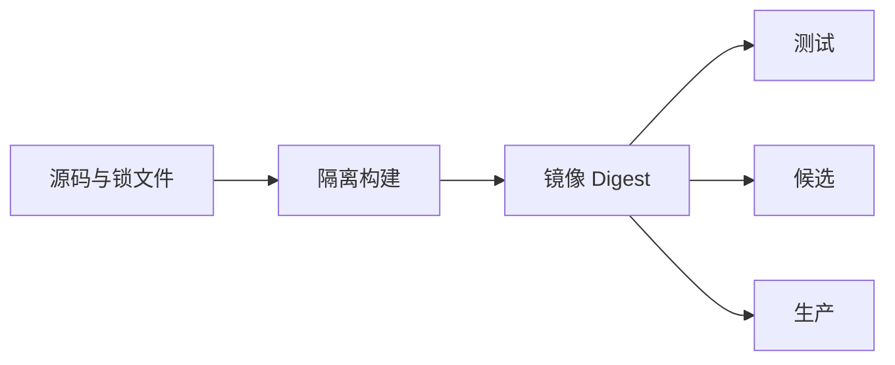

# Docker 与 Compose

本地要运行一个 API 和 PostgreSQL。直接在电脑安装所有依赖当然可以，但不同开发机的版本与配置很容易漂移。Docker 把程序与运行环境打成镜像，Compose 则声明多个容器怎样连接、启动和保存数据。

本篇先让两个服务跑起来，再解释镜像身份、内部网络、健康检查、Volume 和 SIGTERM。目标是 API 容器可以替换，数据库数据仍然保留，依赖临时故障也不会被错误理解成“重新启动一切”。

## 镜像和容器有什么区别

镜像是只读运行制品，容器是镜像的一次运行实例。源码提交本身不是部署制品；构建过程还包含运行时、锁定依赖和系统包。测试、候选和生产应提升同一个镜像 Digest，仅注入不同环境配置。

Tag 便于人识别，却可能移动；Digest 才指向确定内容。基础镜像固定版本并持续更新补丁。运行镜像只带运行所需文件，编译器、源码和包管理缓存留在构建阶段。



## 步骤一：声明两个服务

Compose 中 API 和数据库加入内部网络，通过服务名访问，不依赖会变化的容器 IP。只有需要从宿主机访问的网关或调试入口发布端口；数据库不必暴露到所有网卡。

下面是教学用最小配置。镜像地址、Digest、Secret 和数据库名都需要替换成实际环境的受控值，不能原样上线。输入是两个经过验证的镜像，输出是内部可通信的 API 与持久数据库。

```yaml
services:
  api:
    image: example-api@sha256:verified-digest
    init: true
    depends_on:
      postgres:
        condition: service_healthy
    networks: [app]
    healthcheck:
      test: ["CMD", "curl", "--fail", "http://api:8000/health/live"]
      interval: 10s
      timeout: 3s
      retries: 3
    stop_grace_period: 30s

  postgres:
    image: postgres:17
    volumes:
      - postgres_data:/var/lib/postgresql/data
    networks: [app]

networks:
  app:
    internal: true

volumes:
  postgres_data:
```

`depends_on` 改善启动顺序，却不保证数据库运行期间永远健康。API 仍要处理连接失败、有界重试并更新 readiness。普通 Compose 也不会因为写了编排器专属字段就自动拥有零停机滚动发布。

## 步骤二：区分配置、Secret 和浏览器变量

环境配置描述端口、功能开关和外部地址；Secret 包含密码、Token 与私钥。Secret 不写进 Dockerfile 的 `ARG/ENV`、镜像 Layer、Compose 示例或日志。构建访问私有依赖时使用 BuildKit Secret mount，运行时由部署平台注入受限文件或短期凭证。

前端静态包里的变量会在构建时进入 JavaScript，浏览器可读取，因此不能放 Secret。若同一静态镜像要跨环境使用，可以提供受控的非敏感运行配置文件，并设置合适缓存。

## 步骤三：确定哪些数据需要保存

容器应当可替换。数据库使用命名 Volume 或外部存储；缓存通常可以重建；日志进入 stdout 或有界采集；临时文件进入明确临时目录并在任务结束后清理。`docker compose down -v` 会删除 Compose Volume，不属于日常更新动作。

备份不能等同于复制运行中的 Volume 目录。数据库使用一致性备份工具，并在隔离环境实际恢复。Volume 解决容器重建后的本机持久化，不解决主机损坏、误删和灾难恢复。

## 步骤四：健康检查与停止流程

liveness 判断进程是否卡死，readiness 判断当前能否接流量。Compose 只有一个健康状态，所以要明确探针代表哪一种语义。昂贵的全链路检查不适合 liveness，否则数据库短暂波动会引发所有应用重启。

容器主进程作为 PID 1 要接收 SIGTERM。收到信号后先变为 not-ready，停止接收新请求或任务，在有限时间内排空，再关闭连接池和遥测。长任务依靠持久任务记录、租约与幂等恢复，而不是无限延长停止时间。

资源限制同样需要测量。内存上限可能触发 OOM Kill，CPU quota 会增加延迟；每实例连接池还要乘以实例数和滚动期间的新旧副本数。扩容应用却不核算数据库连接，会把性能问题变成连接风暴。

## 正常结果和失败结果

| 场景 | 预期 |
| --- | --- |
| 第一次启动 | 数据库健康后 API 就绪 |
| 数据库短暂重启 | API 暂时 not-ready，随后有界恢复 |
| 重建 API 容器 | 数据库数据仍在 |
| 删除临时容器 | 不影响命名 Volume |
| API 收到 SIGTERM | 先摘流量，再排空退出 |
| Secret 扫描镜像历史 | 不出现凭证或 `.env` |
| 内存达到上限 | 有 OOM/资源告警和恢复路径 |

验证包含 `docker compose config`、镜像用户与历史检查、真实启动、依赖重启和 SIGTERM。测试后只精确清理本次隔离容器和网络，不执行会影响其他项目的全局 prune。

## 下一步

容器已经在内部网络运行，用户仍需要一个稳定公网入口。下一篇用 Nginx 转发普通 API、静态站与 SSE，并解释为什么 VitePress 文章刷新时会出现 Nginx 404。

## 参考资料

- [Docker Compose](https://docs.docker.com/compose/)
- [Compose Specification](https://compose-spec.io/)
- [Docker Build secrets](https://docs.docker.com/build/building/secrets/)
- [OWASP Docker Security Cheat Sheet](https://cheatsheetseries.owasp.org/cheatsheets/Docker_Security_Cheat_Sheet.html)
