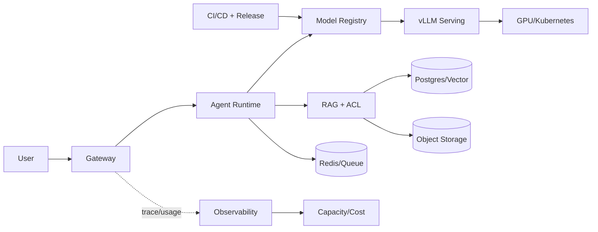

# 综合项目：设计 Enterprise AI Platform

现在把一个企业问答请求从头走一遍：用户带着租户身份进入 Gateway，Agent 决定是否检索，RAG 返回带版本和权限的证据，vLLM 负责生成，GPU 承担计算，观测记录 Trace 和成本，发布系统保证下一次切换可以回滚。综合设计的难点不是画出更多框，而是让每条边都有状态所有者。

## 完整请求链

Gateway 持有身份和预算，Agent Runtime 持有 Turn 与工具候选，RAG 持有 Evidence，Model Registry 持有 Revision，Serving 持有队列和 KV，GPU 只执行计算。任何模块都不能跨越边界直接改变别人的事实。

## 一次请求的输入、状态和输出

| 阶段 | 输入 | 状态所有者 | 输出 |
| --- | --- | --- | --- |
| 接入 | API Key、model、messages | Gateway | 规范化请求/拒绝 |
| 决策 | Turn、策略、历史 | Agent Runtime | 检索或工具候选 |
| 知识 | query、tenant、release | RAG/DB | Evidence IDs |
| 推理 | prompt、revision、deadline | Serving/GPU | Token 流和 usage |
| 收束 | 事件、引用、成本 | Runtime/审计 | 唯一终态 |

这张表是架构的核心。出现错误时，先找当前状态和证据，不要让模型重新解释已经发生的事实。

## 四条异常路径要提前写

| 异常 | 系统动作 | 读者应看到的结果 |
| --- | --- | --- |
| GPU/Serving 过载 | 准入拒绝或排队超时，不无限重试 | 429/503、Retry-After、request_id |
| RAG 无授权证据 | 拒答或请求补充范围 | 不返回越权片段 |
| Agent 被取消 | 停止模型和工具，保存 cancelled 终态 | 不会继续产生副作用 |
| 候选发布失败 | 保留旧路由，恢复入口和配置 | 旧版本继续可用 |

## 把架构变成可审查的交付物

为每个模块写接口契约、状态表、观测字段、权限边界和恢复动作。为代表请求准备一条 Trace，为知识发布准备一条版本记录，为模型切换准备一份 manifest，为回滚准备旧 digest 和数据库备份。没有这些证据，图只是愿望。

## 综合判断标准

::: tip
**完成标准**

你应能回答：一个 Token 为什么迟到，哪个租户为什么看不到文档，取消后哪个 Worker 还能继续，模型切换失败时旧版本在哪里，以及成本由哪一个 usage 事件计算。GPU、Kubernetes、NCCL 和 vLLM 的性能结论必须回到真实硬件与版本验证，不能用架构图冒充实验。
:::

## 用一个 Trace 复核整张架构图

挑选一条真实或模拟的代表请求，沿 request_id 列出网关认证、Turn 创建、RAG release、Evidence、model_revision、Serving queue、TTFT、usage、最终状态和审计事件。每一项都必须能在对应系统中查到，而不是在图上想象存在。

然后再走一条失败路径，例如用户取消或模型过载，确认取消是否到达 Serving、工具是否没有继续执行、计费是否符合契约、告警是否出现、旧版本是否能接管。这种端到端复核能暴露模块各自正确、组合后却丢状态的缺口。

## 平台不是把所有组件集中部署

可以从最小路径开始：一个 Gateway、一个模型路由、一个可取消 Turn、一条带 release 的 RAG 查询和一份 usage 事件。只有当状态和边界稳定后，再扩展多模型、更多工具、Kubernetes 或多卡。过早堆组件会让每个故障都跨越更多未知边界。

每次扩展都保留同一套问题：输入是什么，谁拥有状态，如何观测，失败如何停止，回滚点在哪里。能持续回答这些问题的系统，才称得上平台，而不是一组恰好能互相访问的服务。

这 37 篇文章最终要留下的不是一套固定组件，而是一种判断方式：沿着请求和状态走，找到证据，尊重边界，把失败设计成可以恢复的状态。
