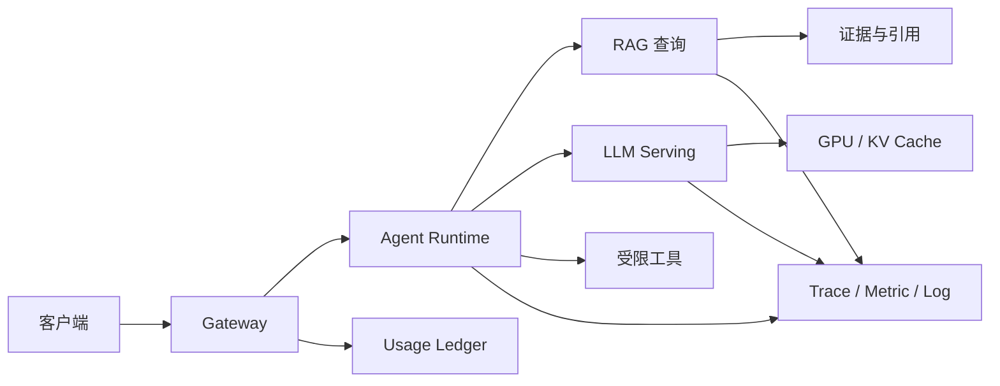

# 企业 AI 平台是什么？怎样把 Gateway、Agent、RAG、Serving 与 GPU 连成系统

一家团队准备建设企业 AI 平台，第一版架构图列出了 Gateway、Agent、向量库、vLLM、Kubernetes 和 Grafana，却回答不了一个用户问题失败后由谁恢复。另一个团队把所有能力放进一个 API 进程，早期开发很快，模型加载、文档导入和后台任务互相影响，发布一次小改动就要停掉全部功能。

平台设计要从具体旅程开始，而不是从产品名开始。用户带着身份提问，系统在允许的知识版本内检索，Agent 选择是否调用工具，Serving 生成 Token，Gateway 记录用量，取消信号释放资源，候选版本可以切回。每一次交接都需要状态所有者、输入合同、输出证据和失败动作。

本文把前面文章中的概念放进一个可演进的设计。它不是一份要求立刻部署多集群的采购清单，也没有在真实 GPU、Kubernetes 或供应商环境执行。图、配置和计算用于说明组件怎样连接，实际容量、费用和安全策略仍要用目标环境验证。

## 企业 AI 平台是什么，它需要统一哪些合同

企业 AI 平台是一组围绕 AI 请求、知识、模型、工具、资源和交付建立的运行边界。它把底层差异收成稳定的身份、版本、权限、流式协议、用量和恢复合同，让应用不必直接知道某个 GPU UUID、向量索引分片或供应商错误字符串。

平台解决的问题是跨组件状态容易失真。Gateway 可能认为请求已成功，Serving 仍在排队；RAG 可能返回相似文本，知识版本却已下线；Agent 可能被取消，工具进程仍在运行；模型实例可能 Ready，显存却不足以接收长上下文。平台通过显式状态和事件，让这些事实可以查询和对账。

它与一组独立 AI 工具的区别在于所有权和生命周期。工具能各自完成调用，平台还要处理租户、版本、配额、发布、观测、成本和恢复。它与 Kubernetes 的区别在于，Kubernetes 调谐容器和资源，平台还理解模型、知识和 AI 请求的业务语义。它与模型本身的区别则更明显，模型输出只是候选，不拥有权限和终态。

平台合同可以先收敛到几类稳定字段：`request_id` 关联一次入口请求，`tenant_id` 贯穿授权和账务，`model_revision` 与 `knowledge_revision` 固定输入，`trace_id` 连接观测，`finish_reason` 表示生成怎样结束，`state_version` 防止并发更新覆盖。字段不是装饰，缺少它们就无法解释一次结果来自哪里。

企业 AI 平台通常同时提供控制面和运行面。控制面让管理员登记模型、发布知识、配置策略、审批制品和查看成本，运行面承接实时请求、检索、工具和 Token 流。两者通过版本化合同连接，控制面短暂不可用时，运行面可以在已批准快照的有效期内继续服务；快照过期后则拒绝不确定的路由。这个机制避免每个请求都依赖管理数据库，也防止旧策略无限期生效。

一个具体例子是客服问答平台。业务应用只提交租户身份、逻辑模型名和问题，平台解析到已批准模型、知识快照与工具权限，完成检索和生成，再返回引用、用量和终态。业务应用不需要自己选择 GPU、管理向量索引或解释不同供应商错误。若团队只有单一模型和少量内部用户，先用同一进程实现这些合同即可，不必为了“平台化”立即拆出十几个服务。

平台的边界止于共性能力。订单审批、医疗诊断规则、客服工单状态等业务语义仍归业务系统所有，平台只提供受控工具和审计接口。把所有业务流程塞入平台，会让每个团队都等待中央改动；让每个应用自行实现鉴权、RAG、计费和模型发布，又会重复产生安全漏洞。划分时看能力是否跨团队复用、是否需要统一风险控制、是否拥有独立生命周期。

::: info 最小验收句

如果平台不能回答“这条回答使用了哪个模型和知识版本，经过了哪些工具，消耗了什么资源，取消后是否释放，失败时从哪个状态恢复”，它还只是组件集合。

:::

## 请求、知识、模型和工具分别由谁拥有

Gateway 拥有外部身份、逻辑模型名、路由快照、入口配额和请求接入状态。它把外部 API Key 映射为租户、项目和角色，不把用户提交的模型路径或 GPU 参数直接传给 Serving。路由快照要带生效时间和 revision，便于审计一次请求实际落到了哪里。

Agent Runtime 拥有 Turn、步骤、工具调用、取消、租约和终态。模型可以提出函数调用，Runtime 校验 Schema、权限、预算和并发后才执行。工具拥有自己的外部连接和副作用记录，但不能直接把一个“完成”写进用户任务。Worker 崩溃后，Runtime 根据 checkpoint 和 lease 决定重试、恢复或人工介入。

RAG 导入平面拥有原始对象、文档版本、Chunk、Embedding revision、索引构建和发布指针；查询平面拥有一次检索的租户范围、快照、候选和引用。向量数据库只保存索引和元数据，不是最终权限来源。权限过滤和知识版本应在检索阶段生效，模型不能通过文字覆盖 ACL。

Serving 拥有模型进程、设备、队列、Batch、KV Cache、生成状态和实例就绪。它不拥有用户余额、知识 ACL 或发布批准。GPU 和 Kubernetes 控制资源放置、设备注入和 Pod 生命周期，平台应用把模型加载、就绪、过载和取消转换成可观察状态。

下表把状态所有者和跨边界证据放在一起，避免同一个字段被多个组件随意写入。

| 状态 | 权威所有者 | 其他组件能做什么 | 必须留下的证据 |
| --- | --- | --- | --- |
| 请求是否准入 | Gateway | 读取策略快照 | request、tenant、policy revision |
| Turn 是否结束 | Agent Runtime | 提交事件或结果 | state version、terminal event |
| 知识版本是否发布 | RAG Control Plane | 读取 published 指针 | manifest、ACL、索引摘要 |
| 模型实例是否接流量 | Serving/Deployment | 报告 readiness | model revision、probe、Pod UID |
| 费用是否结算 | Usage Ledger | 提交幂等 usage | usage、billing key、对账状态 |

## 一次企业问答怎样穿过整个平台

一次请求从客户端进入 Gateway，经过身份、策略、模型和知识版本解析，再交给 Runtime。Runtime 先确定是否需要检索或工具，RAG 返回带位置的候选证据，Serving 执行 Prefill 和 Decode，输出通过 Gateway 以 JSON 或 SSE 返回。请求结束后，Ledger 和观测系统收集 usage、终态和时间。

下面的图只画正常路径，箭头表示状态交接，不表示所有组件必须独立部署。小系统可以把 Gateway、Runtime 和 RAG 查询放在同一进程，所有权仍应按合同分开。



图里的请求分成两条依赖：证据和生成都回到 Runtime，结算和观测贯穿入口到终态。RAG 没有已发布结果时，Runtime 可以拒答或按策略不调用模型；Serving 取消时，Runtime 仍要关闭工具和写终态。只有把箭头解释成状态变化，架构图才不会沦为产品 Logo 的排列。

## Gateway 和 Serving 怎样隔离供应商与设备差异

Gateway 对外提供稳定的逻辑模型名、消息结构、流式事件、错误类型和配额。Serving 只接收已授权的内部请求，使用自己的模型 revision、Tokenizer、并行和调度参数。供应商 A 的 429、供应商 B 的 context error 和自托管实例的 OOM，在 Gateway 可以转换成统一的重试或拒绝语义，但原始错误要保留在 attempt 证据中。

路由器不能只按模型名轮询。能力矩阵至少包含文本或多模态、工具调用、上下文上限、区域、数据边界、精度、吞吐和健康状态。高优先级租户可能需要专用部署，长上下文请求要在准入时预留 KV Cache。路由成功不代表 Serving 有容量，Serving readiness 也不代表 Gateway 的权限和预算已通过。

设备差异由部署层承接。Kubernetes 选择 Node 和 GPU 资源，Device Plugin 与 Runtime 注入设备，Serving 读取模型制品并完成加载。模型版本变化会改变显存和 Kernel 要求，发布候选需要记录设备型号、CUDA、驱动和量化格式。没有目标 GPU 时，只能静态检查兼容矩阵和启动参数。

取消是两层之间的合同。客户端断开后，Gateway 标记 cancel_requested，Runtime 停止新的工具调用，Serving 取消生成并释放 KV Cache，Ledger 记录已产生的 usage。任何一步没有证据，界面显示结束也可能仍在消费 GPU 或持有工具租约。

## RAG 和 Agent 怎样共享版本与权限边界

RAG 的查询输入应该包含租户、用户角色、知识库和 knowledge snapshot。导入任务完成后，只有通过 checksum、Chunk 数量、Embedding revision 和 ACL 检查的索引才能把指针切到 published。查询读取已发布快照，再返回 chunk ID、文档版本和位置，Runtime 把这些证据放进模型上下文。

Agent 不应把检索结果当作无条件事实。它可以请求更多检索、调用只读工具或根据证据生成回答，但每步都受预算、循环次数和工具权限约束。若检索为空、引用不足或知识版本过期，Runtime 应拒答、请求澄清或走有限修复路径，而不是让模型自行补全。

缓存键必须包含权限和版本范围。只用问题文本做缓存，会把一个租户的回答返回给另一个租户，也会在知识发布后继续返回旧引用。Agent checkpoint 也要带 model revision、knowledge revision 和 policy revision，恢复时若版本不兼容，应重新规划或明确失败。

一个可审查的查询结果至少能沿 `citation_id -> chunk_id -> document_version -> object_key` 回到原文位置，再通过 ACL 判断当前用户是否可见。相似度分数不是授权结果，模型语气流畅也不是证据完整。这个链路是企业平台与“向量搜索 Demo”的主要差异。

## 观测、成本和安全怎样成为平台合同

观测系统把 `request_id`、`trace_id`、`turn_id`、`attempt_id`、`model_revision` 和 `knowledge_revision` 串起来。Trace 解释一条请求的因果路径，Metric 记录 TTFT、TPOT、队列、GPU 和错误趋势，Log 保存结构化事件，质量事件记录引用覆盖和拒答原因。Prompt 和原始文档不应进入高基数标签或公开日志。

成本账本按 usage、GPU 时间、对象存储、数据库、工具和重试计算。流式请求中断时，要以服务端实际生成的 Token 和已完成工具为依据，不能按客户端收到的字节数估算。账务写入使用幂等键，重新投递或 Gateway 重试不会重复扣费。成本和质量要能回到同一请求及版本。

安全边界贯穿缓存、RAG、工具和发布。Gateway 验证身份，Runtime 限制工具，RAG 执行 ACL，Serving 不读取 Secret，CI 只提升已签名制品，Kubernetes 限制设备和网络。模型输出是不可信候选，渲染、SQL、Shell 和外部 API 都要做第二次校验。

```yaml
request_contract:
  required: [request_id, tenant_id, model_alias, messages]
  snapshot: [policy_revision, model_revision, knowledge_revision]
  terminal_states: [succeeded, failed, cancelled, timeout, unknown]
  evidence: [trace_id, usage_id, finish_reason]
resource_contract:
  limits: [queue_slots, kv_blocks, tool_concurrency, deadline]
  release_on: [cancelled, failed, timeout, terminal]
```

这份 YAML 是结构说明，不是某个框架的可直接部署文件。它把请求快照、终态、证据和资源释放写成可检查字段。API Schema、数据库状态表、事件和 Runbook 应围绕同一组语义实现，未知终态和未知字段要阻止发布。

## 控制面和数据面怎样协作又不互相拖住

控制面管理模型登记、知识发布、策略、配额、部署和版本指针，变化频率较低，适合通过数据库和事件审计。数据面承接在线请求、检索、工具和 Token 流，要求低延迟和有限依赖。数据面不应为每个 Token 都实时查询控制面，通常读取带版本和过期时间的快照。

快照不是永久事实。控制面发布新模型 revision 后，数据面先拉取并校验签名、能力和资源，再在安全边界内切换。控制面短暂不可用时，旧快照可以继续服务到 deadline；过期后拒绝不确定的路由。数据面遇到模型 OOM 时，应把失败事件回传控制面，触发候选隔离或容量调整。

控制面和数据面分别扩缩容。模型流量增加主要扩 Serving 和 GPU，模型登记或审批增加只扩控制面。把它们放在同一个进程里，控制面慢查询可能阻塞流式响应；完全分离而没有事件和版本合同，又会产生路由漂移。边界要以状态、资源和失败恢复来决定。

## 数据和事件合同怎样保持跨组件一致

请求事件、ToolCall、知识发布、模型切流、usage 和终态都应有版本化 Schema。事件包含唯一 ID、发生时间、主体、对象 ID、状态修订和来源 revision，消费者可以重复读取并按幂等键处理。删除字段先增加兼容版本，不能让旧 Worker 在生产队列里突然无法反序列化。

数据库表保存可查询的当前状态，事件流保存状态变化和审计。两者不必每个字段完全相同，但必须能用 request_id、turn_id、document_version 和 deployment_id 关联。Redis 只存短期缓存、租约和限流计数，不能成为模型发布或账务的唯一权威。

对象存储与数据库的交接也要有状态。原始文档、模型 shard 和索引快照先进入 staging，校验和 Manifest 通过后才发布指针。删除时先检查引用和回滚保留期，再执行生命周期规则。一个对象存在不说明业务可见，一个数据库指针也不说明对象能读取。

## 多租户和配额怎样进入平台骨架

租户身份从 Gateway 进入后，要贯穿 Cache、RAG、Agent、工具、模型路由、usage 和日志。缓存键包含 tenant 和 policy revision，向量查询在检索阶段做 ACL，工具调用限制租户可访问的外部资源，账务事件由可信服务生成。只在入口做一次鉴权，后续内部调用不带范围，会留下越权路径。

配额分成请求数、Token、并发、GPU、工具和存储等不同资源。Gateway 可以做入口限流，Serving 还要按 KV Block 和 Batch 准入，Runtime 要限制循环和工具并发，导入 Worker 需要按租户限制队列。一个租户的长 Prompt 不应因为入口 RPS 很低就耗尽所有 GPU Cache。

配额耗尽时写清拒绝和恢复条件。429 说明可以稍后重试，权限拒绝不能重试，模型容量不足可能进入排队或降级，预算结算不确定则进入对账。错误码和事件带 policy revision，管理员可以解释当时使用的规则。

## 部署拓扑怎样连接 GPU、数据库和对象存储

在线 Gateway 和 Runtime 可以运行在普通 CPU Node，RAG 查询需要数据库与向量索引，Serving Pod 运行在带 GPU 的 Node，导入 Worker 适合按 CPU、内存和网络容量调度。模型制品从对象存储下载到本地缓存或卷，数据库保存 Manifest、版本、ACL 和状态，三者的恢复和扩容路径不同。

GPU Pod 的 Node 选择不仅看数量，还要看型号、显存、互联、驱动和 MIG 或整卡模式。Kubernetes 只保证扩展资源满足，Serving 仍要检查模型格式、CUDA、Tokenizer 和显存峰值。GPU 失败时，控制面把实例从路由中摘除，旧实例或其他故障域承接有限流量。

PostgreSQL 连接池、Redis、对象存储和模型服务都有自己的上限。请求进入 Gateway 后，任何一个下游池耗尽都应形成有界队列和可观测拒绝，而不是让 API 无限持有连接。部署图要把网络、Secret、备份和恢复顺序画出来，不能只画业务箭头。

## 平台应当怎样从单体逐步演进

最小起点可以是一个 API 进程、一个模型后端、PostgreSQL、对象存储和受限 Redis。先把请求 ID、模型与知识版本、取消、用量和健康状态做对，再把文档导入移到 Worker，把 Serving 与 API 解耦。组件拆分要跟着状态和资源边界走，不是为了看起来像大平台。

当模型加载时间、GPU 共享或多模型路由成为主要风险，再引入独立 Serving、Gateway 和 Kubernetes。长任务需要 Runtime checkpoint，知识规模需要独立索引发布，跨区域或租户隔离出现后再设计故障域。每次演进都保留一个单体或上一版本回滚点，先证明新边界，再删除旧路径。

扩展前先问四个问题：新的组件是否拥有独立状态，是否需要不同扩缩容，失败时是否要独立恢复，是否能用现有证据验证它。如果答案都是否，拆分只会增加网络和运维成本。反过来，如果 GPU OOM、队列堆积和文档导入互相影响，保持一个进程才是更大的风险。

## 平台目录怎样让业务团队找到并正确使用能力

平台目录不是一张组件清单，而是业务团队可以申请和调用的稳定能力集合。每个能力写明入口、身份范围、输入 Schema、输出事件、配额、SLO、数据边界、版本策略和支持所有者。模型推理、知识库、Agent Runtime、工具连接、离线评测和发布流水线可以各自成为目录项，底层部署细节由平台维护。

以模型服务为例，目录展示逻辑模型名、支持的消息类型、上下文上限、工具调用能力、数据区域和费用单位，不直接暴露某个 Pod IP 或 GPU 编号。业务团队按项目申请访问，Gateway 在运行时把逻辑名解析成可用 revision。模型下线时先发布替代版本和截止日期，调用方可以在测试环境验证，而不是某天突然收到未知错误。

知识库目录则记录数据所有者、允许的租户和角色、更新频率、published revision、引用格式和删除策略。上传文档只是导入动作，只有完成解析、切片、Embedding、ACL 和质量检查后，revision 才能进入查询。业务方能看到当前请求使用哪个知识版本，也能在文档撤销后确认缓存和索引已经失效。

自助不等于无审批。低风险的开发模型、只读知识库和测试工具可以按策略自动开通，高成本 GPU、敏感数据和有外部写入的工具需要额外审批。审批结果绑定项目、环境、版本和期限，过期自动收回。平台团队提供的是可重复的申请路径，不是把管理员权限分给所有调用方。

目录的适用边界是共性产品化。只有一个团队使用、接口仍频繁变化的实验能力，可以先保留在沙箱，不必立即承诺长期 SLO。进入目录前至少证明身份、版本、观测、费用、失败处理和停用方式，避免把无法维护的 Demo 包装成稳定平台服务。

## 容量与故障域怎样决定平台部署形态

部署形态从工作负载和故障影响计算。Gateway 的瓶颈可能是连接和鉴权，RAG 查询受数据库与向量索引限制，Agent Runtime 受步骤数和工具并发限制，Serving 受 Prefill、Decode、显存和 KV Cache 限制。把它们统一按 CPU 百分比扩缩容，会让 GPU 已经排队时 API 副本仍显示健康。

容量计划至少区分短请求、长上下文、流式连接、工具调用和离线导入。短请求看每秒完成量，长上下文看 Prefill 与 KV Cache，流式请求看连接持有时间，工具调用看外部并发，导入任务看对象大小和队列。入口配额把请求变成有界工作，Serving 再按可用 Block 和 deadline 决定接收、排队或拒绝。

故障域决定一次失败会影响多少请求。GPU Node、可用区、数据库主实例、对象存储区域和供应商账户都可能成为故障域。关键模型可以跨两个独立实例或区域部署，路由器只在能力、数据边界和成本允许时切换。跨区副本不能自动解决数据驻留和知识版本一致，备用路径必须经过同样的权限与发布检查。

过载时优先保护已经接受的工作。Gateway 停止接收超出配额的新请求，Runtime 不再开始新的工具步骤，Serving 为已分配请求保留有限执行时间，后台导入降低优先级。无限排队会把短暂峰值变成长时间故障，盲目降级到更小模型也可能违反质量或数据策略。每种降级要在路由合同中提前声明。

小团队不必一开始跨区部署。可以先建立单区容量基线、模型加载时间、备份恢复和明确拒绝，再根据 SLO 与故障成本增加冗余。没有运行数据时，复杂拓扑只会增加更多未知状态，容量数字也不能从别家平台直接照搬。

## 平台团队怎样验证一项新能力可以交给业务

新能力先从一条具体用户旅程验收。输入包括租户、权限、模型或知识版本和代表性请求，执行过程覆盖正常、过载、取消、超时和依赖失败，输出必须带终态、引用、用量和 Trace。只有组件自己的健康检查通过，不能证明跨组件合同已经成立。

模型能力要验证启动、Tokenizer、上下文边界、流式结束、工具调用、取消和目标硬件资源；RAG 能力要验证导入、发布、ACL、引用和删除；Agent 能力要验证循环预算、工具 Schema、幂等副作用、checkpoint 与恢复。每个结论标明实际运行、静态检查还是解释性推演，没有 GPU 或真实供应商时不能写成性能实测。

平台还要提供故障证据。比如 Serving OOM 时，调用方收到稳定错误类型，Trace 能关联模型 revision、Prompt Token、实例和显存峰值，路由器不会无限重试；知识越权时，RAG 在检索阶段拒绝并记录 ACL revision，模型看不到被过滤文本。业务团队据此判断重试、提示用户或停止任务，不需要解析各组件私有日志。

发布前用候选环境绑定代码、模型、配置和策略摘要，运行最小业务请求，再演练回切。能力上线后观察真实请求分布、质量、成本和失败，达到约定窗口才删除旧制品。出现未知终态、账务不平或权限证据缺失时，停止扩流并保留旧路径，而不是用平均成功率掩盖不可解释请求。

验收通过也有范围。一次版本验证只覆盖当时的硬件、模型、数据和流量分布，升级 Driver、修改 Tokenizer、切换知识索引或增加工具后都要重新评估相关合同。平台目录应显示最近验证时间和证据版本，让调用方知道哪些能力可以依赖，哪些仍处于试验阶段。

## 一条异常请求怎样从输入走到恢复

输入是一条带租户身份的知识问答请求，逻辑模型为 `chat-default`，知识快照为 revision 12，允许调用只读订单工具。Gateway 验证 Key、配额和模型别名，生成 request ID 与路由快照；Runtime 创建 Turn，读取 checkpoint，向 RAG 查询带 tenant 和 ACL 的候选。

状态先进入 `accepted`，检索完成后变为 `context_ready`，Serving 分配队列和 KV Block，生成第一段 SSE 后进入 `streaming`。每次工具调用都写 ToolCall 事件，结果回到 Runtime 上下文；Ledger 记录输入和输出 Token，Trace 关联 Gateway、RAG、Serving 和工具 Span。

现在客户端在第三个 Token 后断开连接。Gateway 写 `cancel_requested`，Runtime 停止尚未开始的工具，Serving 收到取消并释放该请求的 KV Block，工具 Worker 根据租约停止或完成补偿，最后 Runtime 写 `cancelled`，Ledger 结算实际已生成 usage。输出是一个明确的终态和可查询事件链，不是简单的 socket close。

如果 RAG 返回了无权限的 Chunk，失败证据是 ACL 过滤计数和 knowledge snapshot，不是模型说“找不到”。Runtime 拒绝把该 Chunk 放入上下文，按策略返回无证据结果或请求更窄的范围。如果 Serving 在长 Prompt 上 OOM，Gateway 停止重试，Serving 记录显存峰值和模型 revision，控制面可以把请求路由到支持更小上下文的候选。

恢复验证读取同一 Turn 的事件和 checkpoint，确认终态只写一次，工具租约没有悬挂，KV Block 已归还，usage 与服务端事件相符。若 Worker 在写 `cancelled` 前崩溃，恢复器用 lease 判断是否重放最后一步；不确定的外部副作用进入 `unknown` 和人工处理，不能假设工具执行了或没执行。

## 平台验收清单和适用边界

验收按正常、过载、取消、发布和恢复五条路径进行。正常路径检查版本、引用、usage 和终态；过载路径检查队列、拒绝和 GPU 余量；取消路径检查 Runtime、Serving、工具和账务；发布路径检查候选、签名、迁移和回滚；恢复路径在隔离环境加载备份、索引和模型制品。

每项能力都要有所有者和证据。只有组件健康没有证明跨组件合同成立，只有模型回答没有证明知识有权限，只有备份文件没有证明恢复达到 RTO。将检查结果写成带版本和时间的记录，下一次发布才能比较差异。

本文没有提供具体企业规模、GPU 型号、供应商价格或性能数字。真实设计应以请求分布、模型制品、租户政策和目标 SLO 计算容量，再用候选环境压测和故障演练验证。平台通过的标准不是组件越多越好，而是一次请求能被解释、失败能被停止、状态能被恢复、制品能被回滚。
