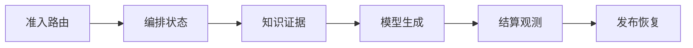

# 综合项目：设计 Enterprise AI Platform

一家团队准备建设“企业 AI 平台”，架构图第一版列出了 Gateway、LangGraph、向量库、vLLM、Kubernetes 和 Grafana，却回答不了一个用户问题失败后由谁恢复。综合设计应从具体旅程开始：用户带身份提问，检索已发布知识，Agent 可选调用工具，Serving 输出 Token，用量结算，取消能传播，候选版本可以切回。组件只是这条旅程的实现。


<InfraFigure src="/images/ai-infra/enterprise-ai-platform-capstone/hero.png" alt="企业 AI 平台中 Gateway、Agent、RAG、Serving、GPU、存储与观测串联的全景插画"
  icon="platform" caption="平台的核心不是组件数量，而是每条状态链都有所有者、证据、权限和恢复动作。" />


## 怎样把平台拆成可演进而不是互相绑死的边界

先把术语放回系统位置。只记名字，遇到故障时仍然不知道应该去哪个进程或存储找证据。

| 概念 | 在这条链路中的含义 |
| --- | --- |
| Control Plane | 管理模型、知识、策略、版本和发布状态，变化频率较低，通过版本快照影响数据面。 |
| Data Plane | 承接在线请求、检索、工具与 Token 流，对延迟和可用性敏感，不应依赖控制面每次实时查询。 |
| State Owner | 对某个状态的唯一权威组件，例如 Turn 终态属于 Runtime，模型路由快照属于 Gateway。 |
| Evidence Contract | 每个边界约定 request_id、版本、终态、错误和指标，使跨组件判断有共同语言。 |
| Evolution Path | 按已出现的风险加入能力，从单体到队列、Serving、GPU 集群和多区域，而非预先部署所有组件。 |

::: tip 判断原则
定义一个组件时，同时说清它不负责什么。能回答输入从哪里来、状态存在哪里、输出交给谁，才算理解。
:::

## 一次企业问答怎样穿过整个平台



箭头表示状态的先后依赖，不表示所有步骤都在同一进程或同一台机器完成。下面沿链路逐段展开。

### 1. 准入路由：Gateway 持有当前状态

认证租户、限流预算并把逻辑模型解析为已发布 deployment。

可以从这些位置确认结果：request_id、policy/snapshot version。若完全没有证据，先判断请求是否到达本阶段；若记录冲突，则对齐 request_id、实例和时间窗口。

### 编排状态发生时，先看 Agent Runtime

创建 Turn，读取 checkpoint，决定是否检索或调用受限工具。

这里不靠猜测，优先读取 turn_id、node、lease、deadline。

### 从 知识证据 留下的证据回到 RAG Plane

在已发布知识版本和 ACL 内检索、重排并返回可定位证据。

决定下一步前需要看到 knowledge_version、citations。

### 4. Serving/GPU 怎样完成模型生成

排队、Prefill、Decode 与流式发送，取消后释放 KV Cache。

这一动作的可观察结果是 TTFT、TPOT、finish_reason。处理动作应晚于取证，否则重启或重试可能覆盖最早的失败现场。

### 5. 结算观测：Ledger/Telemetry 持有当前状态

保存 usage、成本、终态和跨组件 Trace，更新 SLI。

可以从这些位置确认结果：usage state、trace_id、SLO。若完全没有证据，先判断请求是否到达本阶段；若记录冲突，则对齐 request_id、实例和时间窗口。

### 发布恢复发生时，先看 Release Platform

用不可变制品启动候选，旁路验证后切流，保留旧版本和数据恢复点。

这里不靠猜测，优先读取 candidate_id、rollback digest、backup。

## 用五类不变量审查平台设计

清单用于架构评审。输入是一条正常、过载、取消或发布路径；输出不是打勾数量，而是可指向具体状态、证据和恢复动作。

```text
identity: tenant scope survives gateway, cache, RAG, tools and logs
version: request records model, knowledge, policy and artifact versions
terminal state: succeeded/failed/cancelled/timeout/unknown are distinct
resource: queue, connection, KV block, GPU and tool lease are released
recovery: retry, resume, rollback and restore have different conditions
```

例如用户取消时，Gateway 停止客户端流只是第一步；Runtime 写 cancel_requested，Serving 终止生成并释放 KV，工具停止或完成补偿，Ledger 记录实际 usage，最终 Turn 才能变为 cancelled。任何一段没有所有者，就会出现界面已结束但资源仍消费的悬挂状态。

## 看起来相似，故障边界却不同

| 表面现象 | 实际可能发生的事 | 下一步证据 |
| --- | --- | --- |
| 组件都健康 | 跨组件契约、版本或队列仍可能让用户请求失败 | 用端到端 trace 和业务终态判断 |
| 先建设多集群 | 团队可能尚未建立单实例状态所有权和发布恢复 | 按实际 SLO 与容量演进 |
| 统一平台 | 过度统一会让模型、知识和工具故障相互放大 | 保留故障域、配额和数据面快照 |
| 有完整架构图 | 没有 Runbook、证据和演练仍不可运营 | 为过载、取消、切流和恢复逐条演练 |

::: warning 容易误判
一条成功命令只能证明它覆盖的那一层。重启后的短暂恢复也不是根因已经消失，改变状态前先保存最早证据。
:::


## 这套判断方法的边界

最小起点可以是一个 API、托管模型、PostgreSQL 和对象存储；当可靠任务、私有 Serving、GPU 调度或多租户风险真实出现时再拆分。平台成熟度不是组件数量，而是问题能被定位、状态能被恢复、边界能被审计。

走完整条路线后，你应能从用户现象回到具体状态所有者：请求在哪里等待、哪份版本生效、哪项资源未释放、哪个证据足以决定下一步。这才是 AI Infra 工程的主线。
