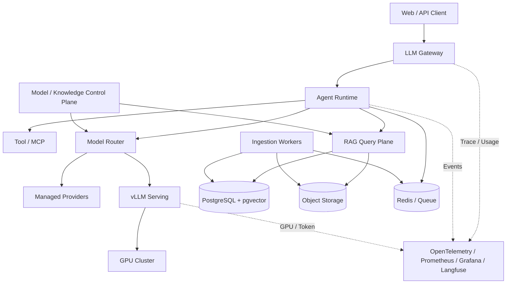

# Enterprise AI Platform：把 36 个主题收敛成一套系统

平台已经接入五个模型、两个向量库和三个 Agent，任何变更仍要逐个业务修改；出现超时时也没人知道请求停在网关、检索、模型还是流式入口。组件数量增加了，平台能力没有形成。

综合项目的目标不是再加组件，而是给每项能力稳定边界：业务通过统一 Gateway 使用公开模型，Agent Runtime 拥有长任务状态，RAG 按 Release 提供 Evidence，Serving 管理推理资源，控制面管理模型与发布，数据与观测支持恢复和审计。

## 目标架构

图中在线路径与导入路径分开，控制面与数据面分开，托管和自托管模型共享稳定路由但保留不同故障域。任何箭头都要有协议、超时、身份、版本与错误终态。

## 模块职责

| 模块 | 拥有状态 | 输出 |
| --- | --- | --- |
| Gateway | Key、配额、路由 Attempt、用量 | 稳定模型 API、SSE、错误 |
| Agent Runtime | Turn、Checkpoint、Lease、Event | 可恢复终态与过程事件 |
| RAG | Knowledge Release、Chunk、Evidence | 受 Scope 约束的证据 |
| Model Control Plane | Public Model、Artifact、Deployment | 可路由能力和候选版本 |
| Serving | Queue、Sequence、KV Cache、Worker | Completion、Usage、运行指标 |
| Data Plane | 业务、对象、缓存、消息 | 事务状态与可重建制品 |
| Observability | Trace、Metric、Log、Eval | SLO、告警、诊断和发布证据 |

领域状态只有一个真相源。Redis 不替代 PostgreSQL，Trace 不替代 Turn，向量分数不替代 Evidence，模型健康不替代 Eval，Kubernetes Ready 不替代业务准入。

## 一次正常请求

1. Gateway 验证 Key，解析租户 Scope、公开模型、预算与 Deadline。
2. API 使用幂等键创建或读取 Turn，固定模型策略与知识 Release。
3. Worker 获得 Lease，Runtime 执行图；RAG 在 Scope 内检索并返回 Evidence。
4. Runtime 选择工具或模型，Gateway 解析具体 Deployment，记录 Attempt。
5. Serving 准入、排队、Prefill、Decode 并流式返回；断开向下传播取消。
6. Runtime 验证 Claim 与引用，提交唯一终态和 Event；Gateway 结算最终 Usage。
7. Trace 使用稳定 ID 连接阶段，日志和指标不保存不必要敏感正文。

每一步写明输入、状态变化、输出和失败。只有这样，504 才能定位到具体 Deadline 与阶段。

## 过载路径

流量超过能力时，Gateway 先按租户、模型和 Token 预算限流；资源槽不足时进入有上限队列；队列年龄超过 Deadline 则在执行前拒绝。Serving 不接受无法容纳的序列，Kubernetes 根据队列与就绪容量扩容。

扩容未完成前不能让请求无限积累。客户端重试使用退避和幂等 Request ID，未知结果不盲目重试。降级到小模型或托管模型只有在能力、数据、成本和质量策略允许时发生。

## 取消与恢复路径

用户取消写入 Turn 状态并发事件，Worker 检查取消，Agent 停止新节点，模型流与工具收到信号，Serving 释放 Sequence/KV，最终用量仍对账。迟到结果不能覆盖 cancelled。

Worker 崩溃时 Lease 到期，恢复器读取最近 Checkpoint。只读步骤可以重放，外部副作用先按幂等键查询结果。Deadline 仍使用原绝对时间，不因恢复重新获得完整预算。

## 知识发布路径

文件通过准入写对象存储，任务平面完成解析、Chunk 与 Embedding，写入 Candidate Release。系统对账对象、Chunk、向量、权限和抽样质量，通过后原子改变 Active 指针。在线 Turn 在开始时固定 Release，不会读到半成品。

失败 Candidate 保留错误与可重跑范围，不影响当前 Active。退役版本在没有在途 Turn、审计和回滚引用后再按生命周期清理。

## 模型发布路径

模型 Artifact 固定仓库、Revision、Tokenizer、模板、精度和校验；Deployment 固定引擎、镜像、硬件和参数。候选先完成制品、契约、容量、安全和 Eval，再加入少量路由。

切流只改变 Public Model 的 Deployment 规则，旧版本保持 Drain 与回滚。托管供应商升级也作为候选 Deployment 处理，不让业务代码直接跟随供应商默认模型变化。

## 数据与权限

PostgreSQL 保存用户、Key、Turn、任务、知识 Release、模型目录和用量账本；Redis 保存有 TTL 的缓存、限流、短期协调或 Broker；对象存储保存文件和模型制品；向量索引始终绑定租户与 Release。

权限在 Gateway 建立，在数据库与检索下推，在 Cache Key、队列、工具和审计中保持。模型输出、外部文档与工具结果都是不可信数据，不能改变 Scope 和 Secret。

## SLO 与验收

运行 SLO 分可用性、TTFT、TPOT、队列与恢复；质量门禁分结构化输出、工具、Recall、Evidence、引用、安全和业务 Eval；成本分 Request/Attempt Usage、供应商价格版本与自托管资源。

验收矩阵至少覆盖正常普通/流式、未知模型、权限拒绝、空证据、长上下文、工具失败、模型超时、客户端取消、Worker 丢 Lease、知识发布、候选模型、过载、数据库迁移、切流与恢复。每个场景检查终态、资源释放、用量、审计和回滚。

## 建设顺序

第一阶段先统一 Gateway 契约、身份、Deadline、Usage 和观测；第二阶段建立 Turn、队列、取消与幂等；第三阶段建立知识 Release 与 Evidence；第四阶段引入模型 Registry 和候选发布；第五阶段才扩展自托管 GPU、Kubernetes 与多集群；最后用 SLO、Eval、容量和安全策略持续治理。

不要一开始就建设最复杂控制面。每一步都必须替代一个真实手工流程，并有可量化验收和退出条件。平台能力只有被多个业务通过稳定契约复用，才值得抽象。

## 设计包清单

最终交付包括系统上下文图、模块职责、请求/取消/恢复时序、数据模型、模型与知识状态机、权限矩阵、SLO/Eval、容量模板、Release Manifest、发布与恢复 Runbook，以及未实现能力和风险。

完成综合项目后，你应该能从任一请求回答：谁授权、用了哪个知识与模型版本、在哪个资源上执行、为什么结束、消耗多少、证据在哪里、失败怎样恢复。这就是 AI Infra 从组件运维走向企业平台工程的分界线。
