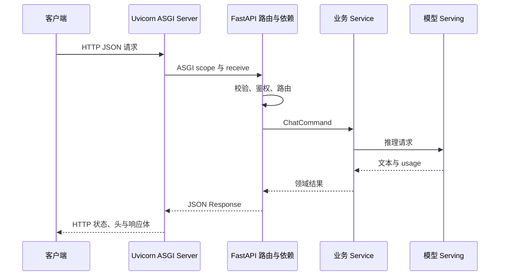

# FastAPI 是什么？怎样实现一个兼容 OpenAI 的接口

模型已经能通过 Python 函数返回文本，不等于其他程序可以稳定调用它。网络接口还要解析 HTTP、校验 JSON、鉴权、限制并发、处理取消，并把错误变成不会误导客户端的状态。流式生成时，服务要在一个长响应中持续发送事件，客户端断开后还要停止下游工作。

FastAPI 可以处理这些 API 层工作。它是 Python Web 框架，不是 HTTP 服务器进程，也不是模型推理引擎。通常由 Uvicorn 等 ASGI Server 监听端口，FastAPI 根据路由调用 Python 函数，业务函数再访问 Gateway、RAG 或 Serving。把三层分开，启动、并发和错误才有明确归属。

::: info FastAPI 的准确含义

FastAPI 是基于 ASGI、Starlette 和 Pydantic 构建的 Python API 框架。它用类型声明路由输入与输出，完成数据解析、校验、依赖调用和 OpenAPI 文档生成。

FastAPI 不负责绑定生产端口和管理 Worker，Uvicorn 等 ASGI Server 承担这部分；它也不会因为接口是 async 就自动把同步模型推理变成非阻塞。

:::

## 从 socket 到路由函数，一条请求经过哪几层

操作系统先把到达监听端口的 TCP 数据交给 Server 进程。Uvicorn 解析 HTTP，请求头与请求体被转换成 ASGI 事件。FastAPI 应用接收这些事件，执行中间件、匹配路由、解析参数和依赖，最后调用路径操作函数。函数返回对象或 Response 后，框架再通过 ASGI send 事件交给 Server 写回 socket。

这条链上每层看到的状态不同。Nginx 知道入口域名和客户端连接，Uvicorn 持有 socket 与事件循环，FastAPI 持有路由与依赖上下文，业务 Service 持有请求用例，Serving 持有模型调度和 KV Cache。接口超时时，必须说明是哪一层停止等待以及取消有没有继续传下去。

FastAPI 的路径操作函数不是每次请求创建的新进程。普通 `async def` 在 Server Worker 的事件循环中以 Task 运行，普通 `def` 路由通常会由 Starlette 放到线程池执行，具体行为应以当前版本为准。线程池能避免同步函数直接卡住循环，却仍有容量和取消边界。

中间件包在路由外层，可以记录请求 ID、耗时或处理 CORS。中间件顺序会影响异常和响应头，不适合把所有业务都塞进去。鉴权依赖若需要路由参数与细粒度权限，FastAPI Dependency 往往更清楚；计费和事务则应在业务服务中保持一致性。

下面的图显示一次非流式请求。每个箭头都有可观察证据，Server 收到请求不代表业务已经调用模型。



图中业务 Service 不依赖 FastAPI Request 对象，便于单元测试和迁移协议。路由只做协议适配，把 HTTP 输入转换成业务命令，再把领域结果转换成兼容响应。数据库事务、计费和调用模型的顺序不能只隐藏在中间件里。

FastAPI 是 Python Web 框架，提供路由声明、请求校验、依赖注入和 OpenAPI 生成；它不是 HTTP socket 的实现，也不是模型推理引擎。Uvicorn 或其他 ASGI Server 负责监听和调度协议事件，FastAPI 把这些事件映射到 Python 函数，业务 Service 决定一次请求怎样改变状态。把三层分开后，换 Server、做 ASGI 测试和排查流式取消都会容易一些。

例如请求体缺少 `messages` 时，Pydantic 可以在路由入口返回 422，模型不会被调用；模型服务返回上游超时时，业务层应转换成有原因和 request ID 的 5xx，不能把所有错误都伪装成 200。这个边界说明“接口能解析 JSON”只是协议的一小部分，兼容还包括状态码、错误结构、流结束和取消语义。
## ASGI 是什么，为什么它能表达流式与取消

ASGI 是 Asynchronous Server Gateway Interface。它规定 Python 异步 Server 怎样调用应用，不是一个需要单独启动的产品。Server 传入连接 scope，以及接收和发送事件的可调用对象。HTTP scope 包含方法、路径、请求头和客户端信息，WebSocket 使用另一类 scope 与事件。

WSGI 主要围绕同步请求与响应调用设计，ASGI 能在同一接口中表达异步接收、分块响应、WebSocket 和 lifespan。FastAPI 应用因此可以在事件循环里等待数据库与模型网络 I/O，并逐块发送 SSE。ASGI 本身不让 CPU 计算并行，上一章的线程或进程边界仍然存在。

HTTP 请求体可能分多个 `http.request` 事件到达，响应也可以先发 `http.response.start`，再发多个 `http.response.body`。StreamingResponse 会把迭代器产生的数据逐块发送。块边界属于 ASGI 与 HTTP 传输，SSE 客户端仍按空行解析事件，不能假设一个 yield 一定对应一个 TCP 包。

客户端断开时，Server 可以把 `http.disconnect` 事件暴露给应用，向响应流写数据也可能失败。框架和生成器怎样传播取消受版本与实现影响。流式函数应处理取消，在 finally 中释放下游连接，并给 Serving 发送取消请求。只捕获所有 `Exception` 后继续循环会吞掉结束信号。

ASGI lifespan 表达应用启动与关闭。连接池、HTTP Client 和轻量共享资源适合在 startup 创建，在 shutdown 关闭。若模型加载需要几分钟，Server 进程监听后还不能立即标记 ready；就绪接口要读取初始化状态，编排探针给 startup 留足时间。
## 路由是什么，方法、路径和状态码怎样组成合同

路由把 HTTP 方法与路径映射到处理函数。`POST /v1/chat/completions` 表示创建一次聊天生成，`GET /health/live` 只读取本进程存活能力。路径相同但方法不同是不同路由。接口设计要让调用方知道请求是否安全重试、响应会不会流式以及错误采用什么结构。

路径参数适合资源身份，查询参数适合筛选、分页和可选控制，JSON 请求体承载结构化命令。把整个 Prompt 放进 URL 会进入代理日志、浏览器历史和长度限制。API Key 放在 Authorization 请求头，仍要在日志中脱敏。传输位置和权限语义都属于合同。

状态码描述 HTTP 结果类别。请求 JSON 不符合 schema 可返回 422，未提供有效凭证用 401，凭证有效但没有目标权限用 403，请求超过租户速率用 429，上游临时不可用可用 503。所有异常都返回 500 会让客户端无法选择修正输入、刷新凭证还是稍后重试。

路由命名与版本影响兼容。OpenAI SDK 常以 `base_url` 加 `/v1/...` 访问，服务端不能同时在代理和应用重复添加 `/v1`。升级字段语义时，尽量新增可选字段或明确版本，不让同一路径在无提示下改变 usage 单位、完成标记和错误格式。

静态路由顺序与动态路径也可能冲突。`/models/current` 和 `/models/{model_id}` 若处理不当，`current` 会被当成普通 ID。FastAPI 能在启动时生成 OpenAPI，但文档可生成不等于路由语义合理，仍要用合同测试覆盖固定路径和边界输入。
## 请求校验是什么，Pydantic 模型能保证到哪一步

请求校验把外部 JSON 转成有类型约束的 Python 数据。Pydantic 检查字段是否存在、类型是否可解析、字符串长度和数值范围，FastAPI 把错误组成结构化响应。业务函数拿到的模型已满足这些语法约束，少写许多手工 `if key in body`。

类型转换需要谨慎。宽松校验可能把字符串数字转成整数，调用方错误被悄悄接受；严格模式会拒绝不符合类型的值。API 合同应选择并测试期望行为。`extra="forbid"` 可以拒绝未知字段，防止拼错字段名仍返回 200，却也会降低向前兼容，需要结合版本策略。

Pydantic 只能保证数据形状与声明规则，不能证明模型名存在、用户有权限或账户余额足够。`model` 是非空字符串后，还要查询模型目录和租户策略。消息角色符合枚举后，内容仍可能超过模型上下文或含不允许的数据。语法校验与业务校验要返回不同、可追踪的错误。

响应模型能限制输出字段，减少意外把内部对象、Secret 或调试信息序列化出去。流式响应是逐块生成，通常不能由普通 response_model 一次性校验完整流，需要为每个 chunk 建立模型并做测试。高频路径可以权衡校验开销，但不能因此取消协议测试。

校验错误内容也属于隐私边界。错误可以指出 `messages.2.content` 类型错误，不应把完整 Prompt、Authorization 或数据库对象回显。日志保存错误类别、字段路径和请求 ID，一般不保存原始敏感值。
## “兼容 OpenAI”具体要兼容哪些内容

兼容不是只创建一个同名 URL。客户端依赖请求字段、响应字段、SSE 事件、错误对象、认证头和结束行为。聊天接口至少要决定 `model`、`messages`、`stream`、温度、最大 Token 和停止条件怎样处理。不支持的字段应明确拒绝或记录为忽略，不能表面接收却产生不同语义。

非流式聊天响应常含 `id`、`object`、`created`、`model`、`choices` 和 `usage`。`choices[0].message` 保存最终 assistant 消息，`finish_reason` 说明停止原因。usage 的 prompt、completion 与 total token 必须来自实际 tokenizer 或可信 Serving 结果，不能用字符串长度伪造后参与计费。

流式响应发送一系列 chat completion chunk。每个 chunk 的 choice 通常使用 `delta`，而不是完整 `message`。第一块可能给出角色，中间块给文本或工具调用增量，结束块给 finish_reason，最后再按协议发送 `[DONE]`。客户端会把 delta 合并成最终消息。

模型列表、错误结构和工具调用也是兼容面。只实现聊天文本时，应在文档和模型能力中说明范围。SDK 更新后可能发送新字段，如果服务设置严格拒绝，客户端升级会暴露差异；如果无条件忽略，用户会误以为功能生效。合同测试应固定一组真实 SDK 请求。

上游也许本身兼容 OpenAI，但 API 层仍需管理外部 ID 与内部 ID、租户权限、超时和错误映射。把上游原始 500、内部主机名和堆栈直接透传，会泄露实现。映射后保留内部 cause 与 request ID，客户端只看到稳定错误合同。

下面的表列出最小文本聊天实现的兼容面。它用于确定测试项，不表示完整 OpenAI API 只有这些字段。

| 协议面 | 非流式要求 | 流式要求 | 常见偏差 |
| --- | --- | --- | --- |
| 请求 | model、messages、stream 与支持参数 | `stream=true` 触发事件响应 | 接收参数却静默忽略 |
| 成功响应 | completion 对象、choice、usage | chunk、delta、finish_reason、完成标记 | 把完整 message 重复放进每块 |
| 错误 | 稳定状态码与错误对象 | 响应头发出前可返回普通错误 | 已发 200 后无法改成 500 |
| 认证 | Bearer Token 与权限检查 | 长连接期间仍属于同一身份 | 只检查 Key 存在，不校验模型权限 |
| 取消 | Deadline 与 request ID | 断开后停止下游生成 | 客户端关闭，GPU 仍继续计算 |

流式错误最难处理。响应头 200 已经发出后，上游才失败，HTTP 状态不能改成 500。服务可以发送协议约定的错误事件后结束，也可以直接断开，客户端必须把缺少完成标记视为不完整。具体选择要写进合同并用 SDK 验证。
## 依赖注入怎样承载鉴权和请求级资源

FastAPI Dependency 是由框架按参数声明解析的可调用对象。它可以读取 Header、查询参数和路径参数，建立当前用户、数据库 Session 或授权上下文，再把结果传给路由。依赖之间也能组合，比如先验证 API Key，再加载租户，最后检查目标模型权限。

依赖不是全局 Service Locator。路由参数明确写出 `principal` 和 `service`，测试可以覆盖或替换依赖。业务 Service 本身最好由普通构造函数组织，不把所有函数都绑定到 FastAPI 的 Depends，这样后台 Worker 和命令行也能复用相同逻辑。

生成器依赖可以在 `yield` 前创建请求级资源，在请求结束后关闭。数据库事务何时提交要小心：若依赖在响应结束后才提交，StreamingResponse 可能已经向客户端发送成功内容，最后提交却失败。计费、日志与流式输出的事务顺序需要显式设计，不能把 commit 隐藏在无法观察的清理阶段。

鉴权只判断 Key 是否存在远远不够。Key 要映射到主体与租户，检查状态、过期、范围和模型权限。Header 原文不能写日志，哈希或前缀也要评估可识别风险。请求上下文只保存必要身份 ID，在调用下游时使用服务间凭证或受控租户声明。

依赖失败会在进入路由前返回响应。Trace 应仍然包含鉴权阶段 span，访问日志记录拒绝类别但不记录 Secret。没有进入模型服务的 401 不应该计入模型错误率或 Token 成本，指标标签需要分清阶段。
## 非流式实现怎样保持协议层与业务层分离

下面代码建立请求模型、业务结果和聊天路由。`generate_text` 只是可替换的异步模型客户端桩，它不执行真实推理。示例用确定文本让接口能够本地运行，正式实现应注入 Serving Client，并从结果读取真实模型名、停止原因与 usage。

```python
import time
import uuid
from typing import Literal

from fastapi import Depends, FastAPI, Header, HTTPException
from pydantic import BaseModel, ConfigDict, Field

app = FastAPI(title="Compatible Chat API")

class Message(BaseModel):
    model_config = ConfigDict(extra="forbid")
    role: Literal["system", "user", "assistant"]
    content: str = Field(min_length=1, max_length=20_000)

class ChatRequest(BaseModel):
    model_config = ConfigDict(extra="forbid")
    model: str = Field(min_length=1)
    messages: list[Message] = Field(min_length=1)
    stream: bool = False

async def require_key(authorization: str = Header()) -> str:
    if authorization != "Bearer local-test-key":
        raise HTTPException(status_code=401, detail="invalid_api_key")
    return "local-user"

async def generate_text(request: ChatRequest) -> tuple[str, dict[str, int]]:
    text = f"收到：{request.messages[-1].content}"
    usage = {"prompt_tokens": 8, "completion_tokens": 4, "total_tokens": 12}
    return text, usage

@app.post("/v1/chat/completions")
async def create_chat(request: ChatRequest, principal: str = Depends(require_key)):
    if request.stream:
        raise HTTPException(status_code=400, detail="use_streaming_handler")
    text, usage = await generate_text(request)
    return {
        "id": f"chatcmpl-{uuid.uuid4().hex}",
        "object": "chat.completion",
        "created": int(time.time()),
        "model": request.model,
        "choices": [{
            "index": 0,
            "message": {"role": "assistant", "content": text},
            "finish_reason": "stop",
        }],
        "usage": usage,
    }
```

代码把 API Key 检查放在依赖中，把输入 schema 放在 Pydantic 模型中。路由仍然很薄，只处理协议映射。教学 usage 是固定占位，绝不能放进真实计费；真实值要由与模型一致的 tokenizer 或 Serving 返回，并在响应与账本之间使用同一计量来源。

这个版本故意拒绝 stream，因为同一个路径要根据请求字段返回两种 Response。下一段会把路由改为分派到 StreamingResponse。生产代码还要给错误统一结构、校验模型权限，并把 `principal` 传给业务 Service，而不是定义后不用。
## SSE StreamingResponse 怎样发送增量和完成标记

StreamingResponse 接受同步或异步迭代器。异步生成器每次 yield 一段 bytes 或字符串，ASGI Server 逐块发送。响应媒体类型设为 `text/event-stream`，代理关闭缓冲，客户端按 SSE 事件读取。生成器结束后响应体结束，应用仍应发送协议约定完成标记。

```python
import asyncio
import json
from collections.abc import AsyncIterator

from fastapi.responses import JSONResponse, StreamingResponse

async def chat_events(request: ChatRequest) -> AsyncIterator[str]:
    response_id = f"chatcmpl-{uuid.uuid4().hex}"
    try:
        for piece in ["收到", "：", request.messages[-1].content]:
            chunk = {
                "id": response_id,
                "object": "chat.completion.chunk",
                "created": int(time.time()),
                "model": request.model,
                "choices": [{"index": 0, "delta": {"content": piece}, "finish_reason": None}],
            }
            yield f"data: {json.dumps(chunk, ensure_ascii=False)}\n\n"
            await asyncio.sleep(0.05)
        done = {
            "id": response_id,
            "object": "chat.completion.chunk",
            "created": int(time.time()),
            "model": request.model,
            "choices": [{"index": 0, "delta": {}, "finish_reason": "stop"}],
        }
        yield f"data: {json.dumps(done, ensure_ascii=False)}\n\n"
        yield "data: [DONE]\n\n"
    except asyncio.CancelledError:
        # 这里应继续通知真实 Serving 取消对应 request_id
        raise

@app.post("/v1/chat/completions/stream-example")
async def stream_example(request: ChatRequest, principal: str = Depends(require_key)):
    if not request.stream:
        return JSONResponse({"error": {"message": "stream must be true"}}, status_code=400)
    return StreamingResponse(
        chat_events(request),
        media_type="text/event-stream",
        headers={"Cache-Control": "no-cache", "X-Accel-Buffering": "no"},
    )
```

示例为便于阅读使用另一条路径，完整兼容实现应在同一个 `/v1/chat/completions` 路由根据 `stream` 返回普通或流式 Response。每个数据块有空行结尾，最后先发 finish_reason，再发 `[DONE]`。`X-Accel-Buffering` 请求 Nginx 不缓冲，入口配置仍需实际核对。

发生异常的时机决定错误形式。生成器第一次 yield 前可以返回普通 JSON 错误；一旦 200 响应头发出，后续失败只能以事件或断开表达。真实模型 Client 应先完成权限、模型存在性和基本准入，再创建 StreamingResponse，减少刚发 200 就失败的情况。

取消处理不能只写日志。真实 Serving 请求需要唯一 ID，生成器 finally 或 CancelledError 分支调用取消接口，并等待有限确认。若 Serving 不支持取消，就要把孤立计算计入指标与成本，不能宣称客户端断开已经释放 GPU。
## lifespan、健康接口与就绪接口有什么不同

Liveness 回答进程是否还能执行基本事件循环，readiness 回答当前实例是否应该接收业务流量。数据库短暂不可用时，是否让 API 全部 not ready 要看系统能否提供降级能力。把所有下游都串进 liveness，会让一个依赖故障触发所有 API 重启，增加恢复压力。

FastAPI 推荐用 lifespan 上下文管理应用级资源。启动时创建异步 HTTP Client 和数据库连接池，成功后设置 ready；关闭时先停止准入，再关闭客户端。资源放在 `app.state` 可以工作，但更易测试的方式是显式容器或依赖，避免任意模块访问全局可变状态。

模型若在独立 Serving 中，API readiness 可以做有限的模型目录与上游健康检查，不要每秒发真实高成本推理。缓存上一次检查结果并设置过期边界。实例 ready 也不保证每个模型都可用，模型级状态应该由模型目录或 Gateway 返回。

健康响应不要泄露数据库地址、Secret、完整版本提交和内部异常。公开 liveness 可只返回状态，受控诊断端点再显示依赖摘要。编排探针、负载均衡器和人工诊断使用哪个端点要写清楚。

关闭时，Server 先停止接收新请求并等待在途任务。lifespan shutdown 的时间要小于容器停止宽限，Serving 流式请求还要支持取消或排空。强制结束前未提交的计费与任务状态必须有恢复机制，不能把内存 finally 当成唯一保障。
## OpenAPI 文档能描述什么，为什么它不是全部兼容合同

FastAPI 根据路由、参数与 Pydantic 模型生成 OpenAPI schema，默认还能提供 Swagger UI 和 ReDoc。调用方可以看到方法、路径、请求字段、响应模型和部分状态码，也能用 schema 生成客户端。它很适合发现字段漏写、类型漂移和路由没有登记。

生成文档依赖代码声明。路由实际返回任意字典而没有 response model，OpenAPI 只能给出宽泛结构；代码在某个分支返回 503，却没有登记 responses，文档也不会自动推导完整错误对象。动态权限、速率限制和模型能力更不会因为写了注解就出现在合同里，需要显式说明和测试。

SSE 在 OpenAPI 中通常只能描述 `text/event-stream` 媒体类型，无法完整表达每个事件顺序、结束标记、心跳和中途错误。为 chunk 定义 JSON schema 仍然有用，但还要另写事件协议测试。工具调用 delta 如何累积、usage 在哪一块出现，都属于超出普通响应 schema 的时序合同。

文档端点也有暴露边界。内部接口、管理路径和模型名称可能不适合公开，正式环境可以限制 docs 访问或发布经过筛选的 schema。关闭 Swagger UI 不等于接口安全，真实路由仍须鉴权；公开文档也不能包含真实 API Key、内部主机和用户样本。

Schema 变化要进入 CI。保存一份经过审查的 OpenAPI 基线，构建时比较删除字段、改必填项和改变类型等破坏性变化。新增可选字段通常更容易兼容，仍需验证旧 SDK 是否忽略未知响应字段。最终判断来自真实客户端合同测试，不只看 JSON diff。
## 错误对象、重试与幂等键怎样避免重复执行

稳定错误对象至少要有机器可判断的类型、给人看的消息和用于关联内部日志的 request ID。可以再提供参数名或错误码，不能把 Python traceback、SQL、上游地址和完整输入原样返回。HTTP 状态与错误类型共同决定客户端动作，二者不能互相矛盾。

客户端遇到连接中断或 503 时常会重试。GET 模型列表通常可以安全重试，一次 POST 生成可能已经开始占 GPU、扣额度或写日志。请求没收到响应不代表服务端没执行。接口若允许重试，应接受 Idempotency-Key 或业务 request ID，并在持久状态中识别重复请求。

幂等记录不能只放当前 FastAPI 进程内存，换 Worker 或重启就会丢失。数据库表可以保存租户、幂等键、请求摘要、状态和结果引用，并用唯一约束处理并发到达。相同 Key 配不同请求体要拒绝，仍在执行的重复请求可以返回当前状态或等待已有结果。

流式重试更复杂。客户端已经收到部分 Token 后断开，重新从头生成可能得到另一答案，也可能重复计费。协议可以选择不支持断点续传，把前一请求标记为中断；也可以保存事件序号和已生成结果，允许按 ID 恢复。无论哪种，不能让通用 HTTP Client 在代理层无感重发 POST。

错误与计费状态需要同一业务顺序。预扣后上游准入失败要退款，流式中途失败按产品规则结算已用 Token 或回退。FastAPI 异常处理器只负责映射响应，补偿事务应由业务 Service 执行并留审计记录。否则一个漂亮的 503 可能掩盖余额已经错误变化。

::: warning 不要对所有 5xx 自动重试

自动重试前要确认请求是否到达上游、是否有副作用、幂等记录能否命中，以及旧计算是否已经取消。网络层看不到这些业务事实，重试策略不能只按状态码配置。

:::
## Request ID、Trace 和日志怎样跟随一次调用

入口可以生成不可预测的 request ID，并通过受控请求头传给 FastAPI。应用把它放入 ContextVar，日志、数据库操作和下游 HTTP Client 都带同一标识。客户端自带 ID 可以另存为 client_request_id，避免直接信任外部值覆盖内部关联键。

Trace 比单个 ID 多出父子调用关系。FastAPI Server span 包住鉴权、业务处理与响应，上游模型调用、数据库查询和工具调用各有 child span。流式请求的 span 结束时间是连接完成或取消，首 Token 则作为事件或独立指标，不能只用总时长代表体验。

日志记录离散事件，Metric 聚合数量与分布。请求日志可包含路由模板、状态码、模型逻辑名、租户匿名 ID、等待时间和结束原因，不能记录 Authorization、完整 Prompt 或生成内容。路由模板用 `/models/{id}`，不把高基数实际 ID 当作指标标签。

异常处理器应保留 Python 异常链给内部日志，对外映射稳定错误。预期的业务拒绝使用明确异常类型，不把 401 当 ERROR 打满告警；未预期异常记录堆栈并返回通用 500。日志写成功本身也不能阻塞事件循环，批量异步输出时要处理进程退出前 flush。

一次 Trace 能回答请求走到哪里，却不保证结果质量正确。AI 接口还要记录经过脱敏和采样的质量反馈、usage 与成本，并用同一 request ID 关联。数据保留期限、访问权限和删除请求必须覆盖观测系统，不能把 Trace 当成不受治理的旁路数据仓库。
## 单元测试、ASGI 测试和真实网络测试分别覆盖什么

业务 Service 单元测试不启动 FastAPI，直接传 ChatCommand 和假的 Serving Client，验证权限、状态、补偿和取消。它运行快，也能构造难以通过 HTTP 稳定触发的异常。单元测试通过不能证明路由字段和状态码正确，因为协议适配层尚未执行。

ASGI 级测试用 HTTPX ASGITransport 或框架测试客户端在进程内调用应用。它覆盖路由匹配、依赖、Pydantic 校验和 JSON 序列化，不经过真实 TCP、Uvicorn 与 Nginx。某些 lifespan 和流式行为需要显式配置，测试工具版本变化也可能影响事件读取。

真实网络测试启动 Uvicorn，使用 HTTP Client 连本机端口。它能暴露 Server 配置、响应分块、连接取消和优雅停止。再把 Nginx 放在前面，可验证 Host、路径改写、缓冲与超时。测试层越高越接近部署，定位失败所需证据也越多，三层应保留各自职责。

合同测试用目标 SDK 版本调用 `base_url`。成功断言不止 `choices[0].message.content`，还包括 ID 格式、model、finish_reason、usage 与错误类型；流式逐块合并 delta，并确认缺少 `[DONE]` 时判为失败。客户端升级进入依赖更新审查，防止新默认字段让严格 schema 突然拒绝。

安全测试要覆盖重复 Authorization、超长 Header、未知 JSON 字段、超大 messages、无权限模型和 Prompt 中的控制字符。速率限制测试使用隔离 Key 与小请求，不向真实模型制造高成本流量。测试结束清理幂等记录、临时用户和日志样本，并确认没有 Secret 出现在失败快照。
## 怎样启动、调用并证明接口合同成立

将两段示例合并到 `app.py` 后，可以用 Uvicorn 启动单 Worker。`--reload` 适合本地开发，会额外启动监控进程，不用于生产。下面命令的输入是本机教学 Key 与一条消息，输出应是 JSON completion。

```bash
uvicorn app:app --host 127.0.0.1 --port 8000

curl -sS http://127.0.0.1:8000/v1/chat/completions \
  -H 'Authorization: Bearer local-test-key' \
  -H 'Content-Type: application/json' \
  --data '{"model":"demo","messages":[{"role":"user","content":"你好"}],"stream":false}'
```

验证不能只发成功请求。缺失 Authorization 应返回 401，空 messages 或超长 content 应返回校验错误，未知字段要按 `extra="forbid"` 拒绝。流式请求用 `curl -N` 查看事件逐条到达，并确认最后既有 finish_reason 又有 `[DONE]`。

使用 FastAPI 的 TestClient 或 HTTPX ASGITransport 可以在测试进程调用应用，合同测试则应再启动真实 Uvicorn，覆盖网络、SSE 分块和客户端取消。代理前后各跑一次，能区分框架输出与 Nginx 缓冲。SDK 兼容测试用指定版本的真实 SDK 发最小请求，核对对象字段而不只看文本。

一次完整失败推演可以从上游超时开始。输入请求通过校验和鉴权，业务 Service 调用 Serving 后超过内部 Deadline，状态从 accepted 进入 model_timeout。非流式路由返回稳定 503 错误对象，日志记录 request ID 与上游结束原因；流式若尚未发头也返回 503，已经发头则发送约定错误事件并结束。

修复后重新验证成功、无权限、校验失败、上游超时和客户端取消。输出文本正确只是其中一项，模型 ID、usage、finish_reason、状态码、完成标记和资源释放同样属于兼容合同。FastAPI 提供了清晰的协议适配层，稳定性来自每一层都对自己的状态负责。
